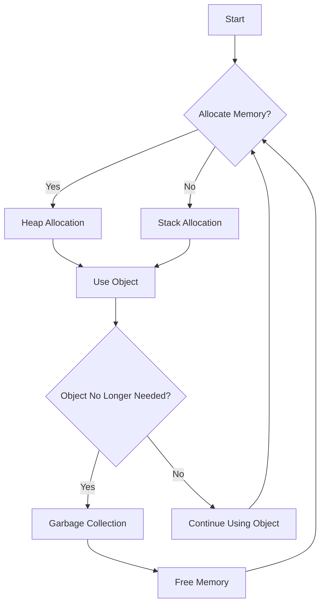

## 8.10 Memory Management and Garbage Collection Strategies

Memory management is a critical aspect of software development, especially in high-performance computing environments. Julia, known for its speed and efficiency, provides robust memory management capabilities that can be leveraged to optimize performance. In this section, we will explore memory management and garbage collection strategies in Julia, focusing on heap vs. stack allocation, optimization techniques, and tools for high-performance computing.

### Understanding Memory Allocation

Memory allocation in Julia involves understanding how data is stored and accessed. This understanding is crucial for optimizing performance and ensuring efficient use of resources.

#### Heap vs. Stack Allocation

Memory in Julia is allocated either on the heap or the stack. Understanding the differences between these two types of allocation is essential for writing efficient Julia code.

- **Heap Allocation**: 
  - The heap is a region of memory used for dynamic memory allocation. Objects that are created at runtime are typically stored on the heap. Heap allocation is more flexible but comes with a performance cost due to the overhead of managing dynamic memory.
  - **Example**: When you create an array or a complex data structure, it is usually allocated on the heap.

- **Stack Allocation**: 
  - The stack is used for static memory allocation, where memory is allocated and deallocated in a last-in, first-out manner. Stack allocation is faster than heap allocation because it does not require dynamic memory management.
  - **Example**: Local variables within a function are typically allocated on the stack.

```julia
function example()
    x = 10  # Stack allocation
    y = [1, 2, 3]  # Heap allocation
    return x + sum(y)
end
```

In the above code, `x` is allocated on the stack, while `y`, being an array, is allocated on the heap.

### Optimization Techniques

Optimizing memory usage in Julia involves minimizing allocations and avoiding practices that lead to inefficient memory use.

#### Minimizing Allocations

To minimize memory allocations, consider the following strategies:

- **Use In-Place Operations**: 
  - In-place operations modify existing data structures rather than creating new ones, reducing the need for additional memory allocation.
  - **Example**: Use `mul!` instead of `*` for matrix multiplication to perform the operation in-place.

```julia
A = rand(3, 3)
B = rand(3, 3)
C = similar(A)
mul!(C, A, B)  # In-place multiplication
```

- **Preallocate Buffers**: 
  - Preallocating memory for data structures that will be reused can significantly reduce the overhead of repeated allocations.
  - **Example**: Preallocate arrays for storing results of iterative computations.

```julia
function compute!(results, data)
    for i in 1:length(data)
        results[i] = data[i] * 2  # Modify in-place
    end
end

data = rand(1000)
results = similar(data)
compute!(results, data)
```

#### Avoiding Global Variables

Global variables can lead to type instability, which hinders performance. Instead, use local variables within functions to ensure type stability and efficient memory use.

```julia
global x = 10  # Avoid global variables

function compute(y)
    return x + y  # Use local variables
end
```

### Tools for Memory Management

Julia provides several tools for benchmarking and profiling to help identify memory bottlenecks and optimize performance.

#### Benchmarking and Profiling

- **BenchmarkTools.jl**: 
  - This package provides macros for benchmarking code, allowing you to measure execution time and memory allocations.
  - **Example**: Use `@btime` to benchmark a function.

```julia
using BenchmarkTools

function sum_array(arr)
    return sum(arr)
end

arr = rand(1000)
@btime sum_array($arr)
```

- **Profiling Tools**: 
  - Julia's built-in profiler can be used to identify performance bottlenecks in your code.
  - **Example**: Use `@profile` to profile a function and `ProfileView.jl` to visualize the results.

```julia
using Profile
using ProfileView

function compute_heavy(arr)
    for i in 1:1000
        arr .= arr .+ rand(length(arr))
    end
end

arr = rand(1000)
@profile compute_heavy(arr)
ProfileView.view()
```

### High-Performance Computing

In high-performance computing applications, fine-tuning memory usage is crucial for achieving optimal performance. Here are some strategies to consider:

- **Use Static Arrays**: 
  - For small, fixed-size arrays, use `StaticArrays.jl` to avoid heap allocation and improve performance.
  - **Example**: Use `SVector` for small vectors.

```julia
using StaticArrays

v = SVector(1.0, 2.0, 3.0)
```

- **Leverage Julia's Type System**: 
  - Ensure type stability by using concrete types and avoiding type ambiguities.
  - **Example**: Use specific types in function signatures.

```julia
function add(x::Int, y::Int)
    return x + y
end
```

- **Optimize Data Structures**: 
  - Choose data structures that minimize memory usage and improve access times.
  - **Example**: Use `Dict` for fast key-value lookups.

```julia
d = Dict("a" => 1, "b" => 2)
```

### Garbage Collection Strategies

Garbage collection (GC) is the process of automatically reclaiming memory that is no longer in use. Julia's garbage collector is designed to manage memory efficiently, but understanding its behavior can help you write more efficient code.

#### Understanding Julia's Garbage Collector

Julia uses a generational garbage collector, which categorizes objects based on their lifespan. This approach optimizes memory management by focusing on short-lived objects, which are more likely to be garbage.

- **Generational Collection**: 
  - Objects are divided into generations based on their age. Young objects are collected more frequently, while older objects are collected less often.
  - **Example**: Short-lived temporary variables are collected quickly, reducing memory overhead.

#### Strategies for Efficient Garbage Collection

- **Minimize Temporary Allocations**: 
  - Reduce the creation of temporary objects that contribute to garbage collection overhead.
  - **Example**: Use in-place operations to avoid creating temporary arrays.

- **Control GC Frequency**: 
  - Use `gc_enable` and `gc_disable` to control garbage collection frequency in performance-critical sections of code.
  - **Example**: Disable GC during a computation-intensive loop and enable it afterward.

```julia
gc_disable()
gc_enable()
```

- **Monitor GC Activity**: 
  - Use `GC.gc()` to manually trigger garbage collection and monitor its impact on performance.
  - **Example**: Call `GC.gc()` after a memory-intensive operation to free up resources.

```julia
GC.gc()  # Trigger garbage collection
```

### Try It Yourself

Experiment with the code examples provided in this section. Try modifying the array sizes, data types, and operations to observe how they affect memory allocation and garbage collection. Use `BenchmarkTools.jl` to measure the impact of your changes on performance.

### Visualizing Memory Management

To better understand memory management in Julia, let's visualize the process of heap and stack allocation, as well as garbage collection.



**Diagram Description**: This flowchart illustrates the process of memory allocation in Julia. Memory is allocated either on the heap or the stack, depending on the type of object. When an object is no longer needed, garbage collection is triggered to free up memory.

### Key Takeaways

- **Heap vs. Stack Allocation**: Understand the differences between heap and stack allocation to optimize memory usage.
- **Optimization Techniques**: Use in-place operations, preallocate buffers, and avoid global variables to minimize memory allocations.
- **Tools**: Leverage `BenchmarkTools.jl` and profiling tools to identify and address memory bottlenecks.
- **Garbage Collection**: Understand Julia's generational garbage collector and use strategies to manage garbage collection efficiently.

### Embrace the Journey

Remember, mastering memory management and garbage collection in Julia is a journey. As you continue to explore and experiment with these concepts, you'll gain a deeper understanding of how to write efficient, high-performance Julia code. Keep experimenting, stay curious, and enjoy the journey!

## Quiz Time!



### What is the primary difference between heap and stack allocation?

- [x] Heap allocation is for dynamic memory, while stack allocation is for static memory.
- [ ] Stack allocation is for dynamic memory, while heap allocation is for static memory.
- [ ] Both heap and stack allocation are for dynamic memory.
- [ ] Both heap and stack allocation are for static memory.

> **Explanation:** Heap allocation is used for dynamic memory, allowing objects to be created at runtime, while stack allocation is used for static memory, where memory is allocated and deallocated in a last-in, first-out manner.

### Which of the following is a strategy to minimize memory allocations in Julia?

- [x] Use in-place operations.
- [ ] Use global variables.
- [ ] Avoid preallocating buffers.
- [ ] Increase the frequency of garbage collection.

> **Explanation:** In-place operations modify existing data structures rather than creating new ones, reducing the need for additional memory allocation.

### What is the purpose of Julia's generational garbage collector?

- [x] To optimize memory management by focusing on short-lived objects.
- [ ] To allocate memory for long-lived objects.
- [ ] To increase the frequency of garbage collection.
- [ ] To disable garbage collection during performance-critical sections.

> **Explanation:** Julia's generational garbage collector categorizes objects based on their lifespan, optimizing memory management by focusing on short-lived objects.

### How can you control garbage collection frequency in Julia?

- [x] Use `gc_enable` and `gc_disable`.
- [ ] Use `@btime` from BenchmarkTools.jl.
- [ ] Use `ProfileView.jl` to visualize garbage collection.
- [ ] Use `StaticArrays.jl` for small arrays.

> **Explanation:** `gc_enable` and `gc_disable` can be used to control garbage collection frequency in performance-critical sections of code.

### Which tool can be used to benchmark code and measure memory allocations in Julia?

- [x] BenchmarkTools.jl
- [ ] ProfileView.jl
- [ ] StaticArrays.jl
- [ ] GC.gc()

> **Explanation:** BenchmarkTools.jl provides macros for benchmarking code, allowing you to measure execution time and memory allocations.

### What is a benefit of using static arrays in Julia?

- [x] Avoid heap allocation and improve performance for small, fixed-size arrays.
- [ ] Increase the frequency of garbage collection.
- [ ] Reduce the need for in-place operations.
- [ ] Allow dynamic memory allocation for large arrays.

> **Explanation:** Static arrays avoid heap allocation and improve performance for small, fixed-size arrays by using stack allocation.

### Why should global variables be avoided in Julia?

- [x] They can lead to type instability and hinder performance.
- [ ] They increase the frequency of garbage collection.
- [ ] They require in-place operations.
- [ ] They are automatically collected by the garbage collector.

> **Explanation:** Global variables can lead to type instability, which hinders performance. It's better to use local variables within functions.

### What is the role of `GC.gc()` in Julia?

- [x] To manually trigger garbage collection.
- [ ] To allocate memory for static arrays.
- [ ] To benchmark code and measure memory allocations.
- [ ] To control garbage collection frequency.

> **Explanation:** `GC.gc()` is used to manually trigger garbage collection and monitor its impact on performance.

### Which of the following is a strategy for efficient garbage collection?

- [x] Minimize temporary allocations.
- [ ] Increase the frequency of garbage collection.
- [ ] Use global variables.
- [ ] Avoid preallocating buffers.

> **Explanation:** Minimizing temporary allocations reduces the creation of temporary objects that contribute to garbage collection overhead.

### True or False: Julia's garbage collector focuses on long-lived objects.

- [ ] True
- [x] False

> **Explanation:** Julia's garbage collector focuses on short-lived objects, which are more likely to be garbage, optimizing memory management.


