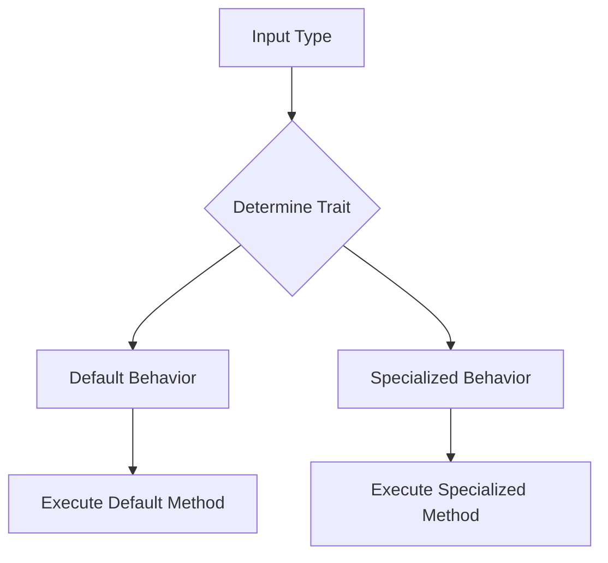

## 8.11 Using Traits for Ad-hoc Polymorphism

In the world of software design, polymorphism is a key concept that allows objects to be treated as instances of their parent class. However, traditional polymorphism often relies on a rigid type hierarchy. Julia, with its dynamic and flexible type system, offers a different approach known as ad-hoc polymorphism using traits. This method allows us to determine behavior based on properties rather than a strict type hierarchy, providing a more flexible and extensible design pattern.

### Concept of Traits

Traits in Julia are a powerful tool for achieving ad-hoc polymorphism. They allow us to define behavior based on the capabilities or properties of types rather than their position in a type hierarchy. This is particularly useful in a language like Julia, where multiple dispatch is a core feature.

#### Ad-hoc Polymorphism

Ad-hoc polymorphism refers to the ability to define functions that can operate on different types based on their properties or capabilities. Unlike subtype polymorphism, which relies on a class hierarchy, ad-hoc polymorphism allows for more flexible and dynamic behavior.

**Key Characteristics:**

- **Behavior Determination**: Traits enable behavior determination based on properties rather than type hierarchy.
- **Dynamic Flexibility**: They provide a way to extend functionality to types without modifying their definitions.
- **Capability-Based**: Traits focus on what a type can do rather than what it is.

### Implementing Traits

Implementing traits in Julia involves defining trait functions and using them in method dispatch. This allows us to specialize methods based on the traits of the types involved.

#### Trait Functions

Trait functions are used to associate a type with a particular trait. These functions typically return a symbol or a type that represents the trait.

```julia
trait(::Type{T}) where {T} = :default_trait

trait(::Type{Int}) = :integer_trait
trait(::Type{Float64}) = :float_trait
```

In this example, the `trait` function returns different symbols based on the type of the argument. This allows us to categorize types into different traits.

#### Dispatch Based on Traits

Once we have defined trait functions, we can use them in method dispatch to specialize behavior based on traits.

```julia
function process(x)
    process(x, trait(typeof(x)))
end

function process(x, ::Symbol)
    println("Processing with default method")
end

function process(x, ::Val{:integer_trait})
    println("Processing integer: $x")
end

function process(x, ::Val{:float_trait})
    println("Processing float: $x")
end

process(42)        # Output: Processing integer: 42
process(3.14)      # Output: Processing float: 3.14
process("Hello")   # Output: Processing with default method
```

In this example, the `process` function dispatches to different methods based on the trait of the input type. This allows us to define behavior specific to each trait.

### Advantages of Using Traits

Traits offer several advantages over traditional polymorphism, particularly in a language like Julia.

#### Flexibility

Traits provide a flexible way to extend functionality to types without modifying their definitions. This is particularly useful in Julia, where types are often defined in external packages.

- **Non-Intrusive**: Traits allow us to add behavior to types without altering their original definitions.
- **Extensible**: New traits can be added as needed, providing a scalable way to manage behavior.

#### Use Cases and Examples

Traits are particularly useful in scenarios where behavior needs to be determined based on the capabilities of types.

##### Algorithm Optimization

Traits can be used to select algorithms based on the capabilities of types. For example, we might choose different algorithms for types that support certain operations.

```julia
trait(::Type{T}) where {T<:Number} = :supports_addition

function add(x, y)
    add(x, y, trait(typeof(x)))
end

function add(x, y, ::Symbol)
    error("Addition not supported for this type")
end

function add(x, y, ::Val{:supports_addition})
    return x + y
end

println(add(1, 2))  # Output: 3
println(add("a", "b"))  # Error: Addition not supported for this type
```

In this example, the `add` function selects an algorithm based on whether the type supports addition.

##### Interface Definition

Traits can also be used to define expected behaviors without enforcing type inheritance. This allows for more flexible interface definitions.

```julia
trait(::Type{T}) where {T<:AbstractArray} = :array_interface

function interface_method(x)
    interface_method(x, trait(typeof(x)))
end

function interface_method(x, ::Symbol)
    error("Interface not implemented for this type")
end

function interface_method(x, ::Val{:array_interface})
    println("Array interface method for: $x")
end

interface_method([1, 2, 3])  # Output: Array interface method for: [1, 2, 3]
interface_method(42)         # Error: Interface not implemented for this type
```

Here, the `interface_method` function checks if a type implements a specific interface using traits.

### Visualizing Traits and Ad-hoc Polymorphism

To better understand how traits facilitate ad-hoc polymorphism, let's visualize the process using a Mermaid.js diagram.



**Diagram Description**: This flowchart illustrates how an input type is processed to determine its trait, which then dictates whether a default or specialized method is executed.

### Design Considerations

When using traits for ad-hoc polymorphism, consider the following:

- **Trait Definition**: Ensure that trait functions are well-defined and cover all necessary cases.
- **Method Specialization**: Use method specialization judiciously to avoid excessive complexity.
- **Performance**: Be mindful of performance implications, especially when using traits in performance-critical code.

### Differences and Similarities

Traits are often compared to interfaces in object-oriented languages. While both allow for defining expected behaviors, traits in Julia are more flexible and do not require a strict type hierarchy. This makes them more suitable for dynamic and extensible designs.

### Try It Yourself

Experiment with the provided code examples by modifying the trait functions and adding new specialized methods. Try defining new traits and see how they affect method dispatch. This hands-on approach will help solidify your understanding of traits and ad-hoc polymorphism in Julia.

### Knowledge Check

- **What is ad-hoc polymorphism, and how does it differ from subtype polymorphism?**
- **How can traits be used to extend functionality to types without modifying their definitions?**
- **What are some use cases where traits are particularly useful?**

### Embrace the Journey

Remember, mastering traits and ad-hoc polymorphism in Julia is just the beginning. As you continue to explore these concepts, you'll discover new ways to design flexible and efficient software. Keep experimenting, stay curious, and enjoy the journey!

## Quiz Time!



### What is the primary purpose of using traits in Julia?

- [x] To determine behavior based on properties rather than type hierarchy
- [ ] To enforce strict type inheritance
- [ ] To simplify the type system
- [ ] To replace multiple dispatch

> **Explanation:** Traits in Julia are used to determine behavior based on properties, allowing for more flexible and dynamic designs.

### How do trait functions typically return values?

- [x] As symbols or types representing traits
- [ ] As integers
- [ ] As strings
- [ ] As booleans

> **Explanation:** Trait functions usually return symbols or types that represent the traits associated with a type.

### What is a key advantage of using traits for ad-hoc polymorphism?

- [x] Flexibility in extending functionality without modifying type definitions
- [ ] Simplifying the codebase
- [ ] Enforcing strict type hierarchies
- [ ] Reducing the number of functions

> **Explanation:** Traits allow for extending functionality to types without altering their definitions, providing flexibility.

### In the provided code examples, what does the `process` function demonstrate?

- [x] Dispatching methods based on traits
- [ ] Calculating mathematical operations
- [ ] Creating new types
- [ ] Enforcing type safety

> **Explanation:** The `process` function demonstrates how to dispatch methods based on the traits of the input type.

### What is a common use case for traits in Julia?

- [x] Algorithm optimization based on type capabilities
- [ ] Simplifying syntax
- [ ] Enforcing type inheritance
- [ ] Reducing code size

> **Explanation:** Traits can be used to select algorithms based on the capabilities of types, optimizing performance.

### How can traits be used in interface definition?

- [x] By defining expected behaviors without enforcing type inheritance
- [ ] By creating new types
- [ ] By simplifying syntax
- [ ] By reducing code complexity

> **Explanation:** Traits allow for defining expected behaviors without the need for a strict type hierarchy.

### What should be considered when using traits for ad-hoc polymorphism?

- [x] Trait definition and method specialization
- [ ] Code size
- [ ] Syntax simplicity
- [ ] Type inheritance

> **Explanation:** Proper trait definition and method specialization are crucial for effective use of traits.

### How do traits differ from interfaces in object-oriented languages?

- [x] Traits do not require a strict type hierarchy
- [ ] Traits enforce type inheritance
- [ ] Traits simplify the type system
- [ ] Traits replace multiple dispatch

> **Explanation:** Unlike interfaces, traits do not require a strict type hierarchy, offering more flexibility.

### What is the role of the `trait` function in the examples?

- [x] To associate a type with a particular trait
- [ ] To create new types
- [ ] To enforce type safety
- [ ] To simplify syntax

> **Explanation:** The `trait` function is used to associate a type with a specific trait, guiding method dispatch.

### True or False: Traits can be used to enforce strict type inheritance in Julia.

- [ ] True
- [x] False

> **Explanation:** Traits are used for ad-hoc polymorphism and do not enforce strict type inheritance.


