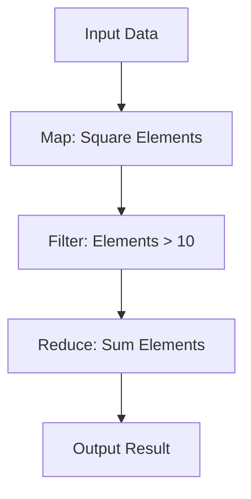

## 8.2 Functional Programming Techniques

Functional programming is a paradigm that treats computation as the evaluation of mathematical functions and avoids changing state or mutable data. Julia, while being a multi-paradigm language, offers robust support for functional programming techniques. In this section, we will delve into the core concepts of functional programming in Julia, including immutability, pure functions, higher-order functions, and their practical applications.

### Immutability and Pure Functions

#### Immutable Data Structures

Immutability is a cornerstone of functional programming. In Julia, you can define immutable data structures using the `struct` keyword without the `mutable` modifier. Immutable data structures ensure that once an instance is created, it cannot be altered, which leads to safer and more predictable code.

```julia
struct Point
    x::Float64
    y::Float64
end

p = Point(3.0, 4.0)

# p.x = 5.0  # Uncommenting this line will cause an error
```

**Key Benefits of Immutability:**
- **Thread Safety**: Immutable objects can be shared across threads without synchronization.
- **Predictability**: Functions that operate on immutable data are easier to reason about.
- **Ease of Testing**: Pure functions with immutable data are straightforward to test.

#### Side-Effect-Free Functions

Pure functions are functions that depend only on their input arguments and produce no side effects. They do not modify any external state or rely on external variables. This makes them predictable and easy to test.

```julia
function distance(p1::Point, p2::Point)
    return sqrt((p2.x - p1.x)^2 + (p2.y - p1.y)^2)
end

p1 = Point(0.0, 0.0)
p2 = Point(3.0, 4.0)
println(distance(p1, p2))  # Output: 5.0
```

**Advantages of Pure Functions:**
- **Referential Transparency**: The same input will always produce the same output.
- **Simplified Debugging**: Since pure functions do not rely on external state, they are easier to debug.
- **Enhanced Reusability**: Pure functions can be reused across different parts of a program without unintended side effects.

### Higher-Order Functions

Higher-order functions are functions that can take other functions as arguments or return them as results. Julia provides several built-in higher-order functions, such as `map`, `filter`, and `reduce`, which are essential for functional programming.

#### Passing Functions as Arguments

Julia allows you to pass functions as arguments to other functions, enabling powerful abstractions and code reuse.

```julia
function apply_function(arr::Vector{T}, func::Function) where T
    return [func(x) for x in arr]
end

arr = [1, 2, 3, 4, 5]
println(apply_function(arr, sqrt))  # Output: [1.0, 1.4142135623730951, 1.7320508075688772, 2.0, 2.23606797749979]

println(apply_function(arr, x -> x^2))  # Output: [1, 4, 9, 16, 25]
```

#### Built-in Higher-Order Functions

- **`map`**: Applies a function to each element of a collection and returns a new collection.
  
  ```julia
  # Using map to square each element in an array
  squared = map(x -> x^2, arr)
  println(squared)  # Output: [1, 4, 9, 16, 25]
  ```

- **`filter`**: Selects elements from a collection that satisfy a predicate function.

  ```julia
  # Using filter to select even numbers
  evens = filter(x -> x % 2 == 0, arr)
  println(evens)  # Output: [2, 4]
  ```

- **`reduce`**: Reduces a collection to a single value using a binary function.

  ```julia
  # Using reduce to sum all elements in an array
  total = reduce(+, arr)
  println(total)  # Output: 15
  ```

### Anonymous Functions

Anonymous functions, also known as lambda expressions, are functions defined without a name. They are useful for short, throwaway functions that are used only once or twice.

```julia
double = x -> 2 * x

println(double(5))  # Output: 10

doubled = map(x -> 2 * x, arr)
println(doubled)  # Output: [2, 4, 6, 8, 10]
```

### Use Cases and Examples

#### Data Transformation Pipelines

Functional programming techniques are particularly powerful for creating data transformation pipelines. By chaining functions together, you can process data in stages, each stage transforming the data in some way.

```julia
function process_data(arr::Vector{Int})
    return arr |> 
           x -> map(y -> y^2, x) |>  # Square each element
           x -> filter(y -> y > 10, x) |>  # Filter elements greater than 10
           x -> reduce(+, x)  # Sum all elements
end

data = [1, 2, 3, 4, 5]
result = process_data(data)
println(result)  # Output: 41
```

**Diagram: Data Transformation Pipeline**



This diagram illustrates the flow of data through a transformation pipeline, where each stage applies a specific function to the data.

### Try It Yourself

To deepen your understanding, try modifying the code examples above. For instance, change the transformation functions in the data pipeline or experiment with different higher-order functions. Observe how these changes affect the output and consider how you might apply these techniques to your own projects.

### References and Links

- [Julia Documentation on Functions](https://docs.julialang.org/en/v1/manual/functions/)
- [Functional Programming in Julia](https://julialang.org/blog/2017/01/functional-programming/)
- [Higher-Order Functions in Julia](https://docs.julialang.org/en/v1/manual/functions/#Higher-Order-Functions)

### Knowledge Check

- What are the benefits of using immutable data structures in Julia?
- How do pure functions contribute to code predictability and testability?
- Can you explain the difference between `map`, `filter`, and `reduce`?
- How would you use an anonymous function in a data transformation pipeline?

### Embrace the Journey

Remember, mastering functional programming in Julia is a journey. As you explore these techniques, you'll discover new ways to write clean, efficient, and maintainable code. Keep experimenting, stay curious, and enjoy the process of learning and applying these powerful concepts.

## Quiz Time!



### What is a key benefit of using immutable data structures in Julia?

- [x] Thread safety
- [ ] Increased memory usage
- [ ] Slower performance
- [ ] Complexity in code

> **Explanation:** Immutable data structures ensure that data cannot be changed, which makes them safe to use across multiple threads without synchronization issues.

### Which of the following is a characteristic of pure functions?

- [x] No side effects
- [ ] Dependence on global variables
- [ ] Modifies external state
- [ ] Unpredictable output

> **Explanation:** Pure functions do not produce side effects and rely solely on their input arguments, making them predictable and easy to test.

### What does the `map` function do in Julia?

- [x] Applies a function to each element of a collection
- [ ] Filters elements based on a condition
- [ ] Reduces a collection to a single value
- [ ] Sorts elements in a collection

> **Explanation:** The `map` function applies a given function to each element of a collection and returns a new collection with the results.

### How can you define an anonymous function in Julia?

- [x] Using the syntax `x -> x^2`
- [ ] Using the `function` keyword
- [ ] By declaring a `struct`
- [ ] Using the `mutable` keyword

> **Explanation:** Anonymous functions in Julia can be defined using the `->` syntax, such as `x -> x^2`.

### Which higher-order function would you use to sum all elements in an array?

- [ ] map
- [ ] filter
- [x] reduce
- [ ] sort

> **Explanation:** The `reduce` function is used to combine elements of a collection using a binary function, such as summing all elements.

### What is the purpose of a data transformation pipeline?

- [x] To process data in stages using chained functions
- [ ] To store data in a database
- [ ] To visualize data
- [ ] To encrypt data

> **Explanation:** A data transformation pipeline processes data in stages, with each stage applying a specific transformation function.

### Which of the following is NOT a benefit of pure functions?

- [ ] Referential transparency
- [ ] Simplified debugging
- [x] Increased complexity
- [ ] Enhanced reusability

> **Explanation:** Pure functions simplify debugging and enhance reusability, but they do not inherently increase complexity.

### What is a common use case for higher-order functions in Julia?

- [x] Data manipulation and transformation
- [ ] Memory management
- [ ] Network communication
- [ ] File I/O operations

> **Explanation:** Higher-order functions are commonly used for data manipulation and transformation tasks in Julia.

### True or False: Immutability in Julia means that once a data structure is created, it cannot be changed.

- [x] True
- [ ] False

> **Explanation:** Immutability ensures that once a data structure is created, it cannot be altered, leading to safer and more predictable code.

### What is the syntax for defining a lambda expression in Julia?

- [x] `x -> x^2`
- [ ] `function(x) x^2 end`
- [ ] `lambda x: x^2`
- [ ] `def x(x): return x^2`

> **Explanation:** In Julia, a lambda expression is defined using the `->` syntax, such as `x -> x^2`.


