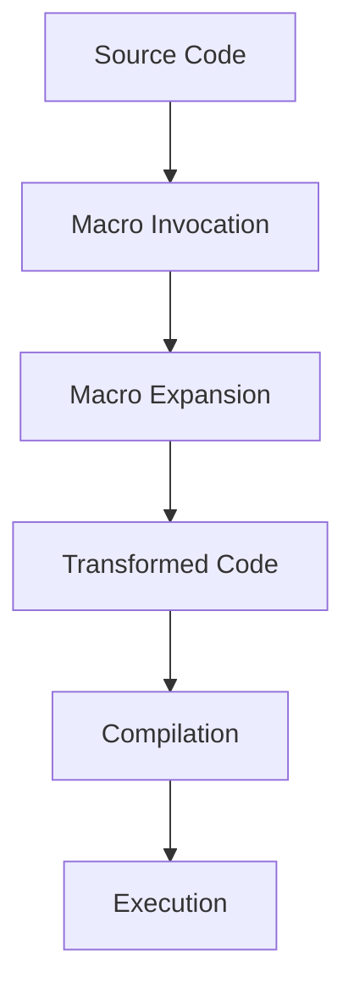

## 8.3 Macro Patterns and Advanced Metaprogramming

In the world of Julia programming, macros and metaprogramming offer powerful tools for transforming and generating code. This section delves into the purpose of macros, common macro patterns, best practices, and practical examples to help you harness the full potential of metaprogramming in Julia.

### Purpose of Macros

Macros in Julia are a form of metaprogramming that allows you to transform code at parse time. They enable you to write code that writes code, providing a way to automate repetitive tasks, enforce coding standards, and create domain-specific languages (DSLs). Macros are executed during the parsing phase, meaning they operate on the abstract syntax tree (AST) before the code is compiled.

#### Key Benefits of Using Macros

- **Code Transformation**: Macros can transform code before it is executed, allowing for optimizations and custom syntax.
- **Code Generation**: Automate the creation of boilerplate code, reducing errors and improving maintainability.
- **Domain-Specific Languages**: Create specialized mini-languages within Julia for specific tasks, enhancing expressiveness and readability.

### Common Macro Patterns

Let's explore some common macro patterns that are widely used in Julia programming.

#### Domain-Specific Languages (DSLs)

DSLs are specialized mini-languages designed for specific tasks. In Julia, macros can be used to create DSLs that simplify complex operations by providing a more intuitive syntax.

**Example: Creating a Simple DSL for Mathematical Expressions**

```julia
macro math(expr)
    return :(println("Evaluating: ", $expr, " = ", $(eval(expr))))
end

@math 3 + 4 * 2
```

In this example, the `@math` macro evaluates a mathematical expression and prints the result. This simple DSL allows users to write mathematical expressions in a more readable format.

#### Code Generation

Code generation is a powerful use case for macros, enabling the automation of repetitive coding tasks. This can lead to more concise and maintainable code.

**Example: Generating Getter and Setter Methods**

```julia
macro generate_accessors(name)
    quote
        function get_$(name)(obj)
            return obj.$name
        end

        function set_$(name)(obj, value)
            obj.$name = value
        end
    end
end

struct Person
    name::String
    age::Int
end

@generate_accessors name
@generate_accessors age

p = Person("Alice", 30)
println(get_name(p))  # Output: Alice
set_age(p, 31)
println(get_age(p))   # Output: 31
```

Here, the `@generate_accessors` macro creates getter and setter methods for struct fields, reducing boilerplate code.

### Best Practices

When writing macros, it's essential to follow best practices to ensure they are efficient, maintainable, and free from common pitfalls.

#### Hygiene

Macro hygiene refers to the practice of avoiding variable name conflicts between the macro's internal variables and those in the surrounding code. Julia provides tools to write hygienic macros that prevent such conflicts.

**Example: Using `esc` to Ensure Hygiene**

```julia
macro hygienic_example(expr)
    quote
        local x = 10
        $expr + x
    end
end

x = 5
println(@hygienic_example(x))  # Output: 15
```

In this example, the macro uses `local` to ensure that the variable `x` inside the macro does not conflict with any `x` in the surrounding code.

#### Debugging Macros

Debugging macros can be challenging due to their complexity. Julia provides tools like `@macroexpand` to help inspect the generated code and understand how the macro transforms the input.

**Example: Using `@macroexpand`**

```julia
macro simple_macro(expr)
    return :(println("Expression: ", $expr))
end

@macroexpand @simple_macro(1 + 2)
```

The `@macroexpand` tool reveals the transformed code, making it easier to debug and refine macros.

### Examples

Let's explore some practical examples of macros in Julia.

#### `@defer` Macro

The `@defer` macro is a common pattern used to execute code at the end of a function scope, similar to the `defer` statement in Go.

**Example: Implementing `@defer`**

```julia
macro defer(expr)
    return quote
        try
            nothing
        finally
            $expr
        end
    end
end

function example()
    println("Start")
    @defer println("End")
    println("Middle")
end

example()
```

In this example, the `@defer` macro ensures that the "End" message is printed at the end of the function, regardless of how the function exits.

### Visualizing Macro Execution

To better understand how macros work, let's visualize the process of macro execution in Julia.



**Diagram Description**: This flowchart illustrates the process of macro execution in Julia. The source code is transformed by the macro invocation, resulting in expanded code. This transformed code is then compiled and executed.

### References and Links

For further reading on macros and metaprogramming in Julia, consider exploring the following resources:

- [Julia Documentation on Metaprogramming](https://docs.julialang.org/en/v1/manual/metaprogramming/)
- [Metaprogramming in Julia: A Comprehensive Guide](https://julialang.org/blog/2017/04/metaprogramming/)
- [Domain-Specific Languages in Julia](https://julialang.org/blog/2019/07/dsl/)

### Knowledge Check

To reinforce your understanding of macro patterns and advanced metaprogramming in Julia, consider the following questions:

1. What is the primary purpose of macros in Julia?
2. How can macros be used to create domain-specific languages?
3. What is macro hygiene, and why is it important?
4. How can you debug a macro in Julia?
5. What is the `@defer` macro pattern used for?

### Embrace the Journey

Remember, mastering macros and metaprogramming in Julia is a journey. As you explore these powerful tools, you'll discover new ways to optimize your code and create more expressive programs. Keep experimenting, stay curious, and enjoy the journey!

## Quiz Time!



### What is the primary purpose of macros in Julia?

- [x] Transform code at parse time for metaprogramming capabilities.
- [ ] Execute code faster by compiling it ahead of time.
- [ ] Simplify syntax for writing loops.
- [ ] Provide a graphical interface for coding.

> **Explanation:** Macros in Julia are used to transform code at parse time, allowing for metaprogramming capabilities such as code generation and creating domain-specific languages.

### Which of the following is a common macro pattern in Julia?

- [x] Domain-Specific Languages (DSLs)
- [ ] Object-Oriented Programming
- [ ] Garbage Collection
- [ ] Memory Management

> **Explanation:** Domain-Specific Languages (DSLs) are a common macro pattern in Julia, allowing for the creation of specialized mini-languages for specific tasks.

### What is macro hygiene?

- [x] Avoiding variable name conflicts in macros.
- [ ] Cleaning up memory after macro execution.
- [ ] Ensuring macros run in a separate thread.
- [ ] Writing macros in a separate file.

> **Explanation:** Macro hygiene refers to avoiding variable name conflicts between the macro's internal variables and those in the surrounding code.

### How can you debug a macro in Julia?

- [x] Use `@macroexpand` to inspect the generated code.
- [ ] Use `@debug` to print debug information.
- [ ] Use `@trace` to follow macro execution.
- [ ] Use `@inspect` to view variable states.

> **Explanation:** `@macroexpand` is a tool in Julia that allows you to inspect the generated code from a macro, aiding in debugging.

### What is the `@defer` macro pattern used for?

- [x] Execute code at the end of a function scope.
- [ ] Delay code execution until a condition is met.
- [ ] Run code in a separate thread.
- [ ] Optimize code for faster execution.

> **Explanation:** The `@defer` macro pattern is used to execute code at the end of a function scope, similar to the `defer` statement in Go.

### Which tool helps ensure macro hygiene in Julia?

- [x] `esc`
- [ ] `@protect`
- [ ] `@sanitize`
- [ ] `@clean`

> **Explanation:** The `esc` function in Julia helps ensure macro hygiene by escaping variables to prevent name conflicts.

### What is a benefit of using macros for code generation?

- [x] Automate repetitive coding tasks.
- [ ] Increase the size of the compiled code.
- [ ] Slow down the execution of the program.
- [ ] Make code harder to read.

> **Explanation:** Macros can automate repetitive coding tasks, reducing errors and improving maintainability.

### How does the `@macroexpand` tool assist developers?

- [x] It shows the expanded code generated by a macro.
- [ ] It compiles macros into machine code.
- [ ] It visualizes the execution flow of macros.
- [ ] It optimizes macros for better performance.

> **Explanation:** `@macroexpand` shows the expanded code generated by a macro, helping developers understand and debug the macro's transformation.

### What is the role of `quote` in macros?

- [x] It captures expressions for transformation.
- [ ] It executes code immediately.
- [ ] It comments out code within macros.
- [ ] It imports external libraries.

> **Explanation:** `quote` captures expressions for transformation within macros, allowing for code manipulation.

### True or False: Macros in Julia are executed at runtime.

- [ ] True
- [x] False

> **Explanation:** Macros in Julia are executed at parse time, not runtime, allowing them to transform code before it is compiled.


