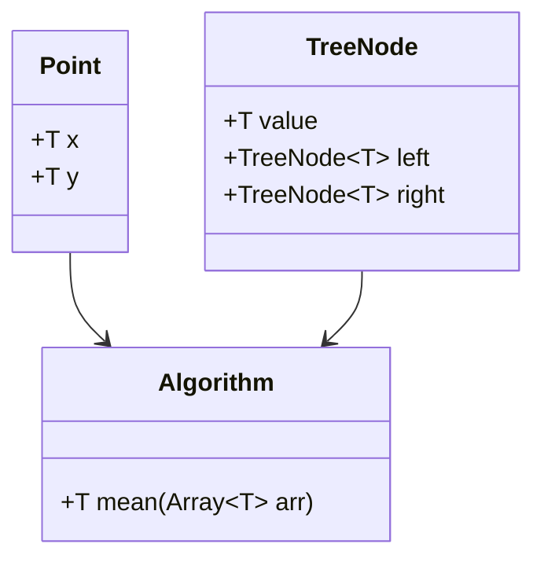

## 8.4 Leveraging Parametric Types and Generics

In the world of programming, the ability to write flexible and reusable code is a hallmark of efficient software development. Julia, with its powerful type system, offers a robust mechanism for achieving this through parametric types and generics. This section will delve into the concepts of generic programming in Julia, illustrating how to harness these features to create versatile and efficient code.

### Understanding Generic Programming

Generic programming is a paradigm that enables the creation of algorithms and data structures that can operate on any data type. This is achieved by parameterizing types, allowing functions and structures to be defined in a way that is agnostic to the specific types they operate on.

#### Parameterizing Types

In Julia, parametric types allow you to define types that can be used with any data type. This is akin to templates in C++ or generics in Java. Let's explore how to define and use parametric types in Julia.

```julia
struct Point{T}
    x::T
    y::T
end

point1 = Point(1.0, 2.0)  # Point with Float64
point2 = Point(1, 2)      # Point with Int
```

In this example, `Point{T}` is a parametric type where `T` can be any type. This allows `Point` to be instantiated with different types, such as `Float64` or `Int`, providing flexibility and reusability.

#### Type Constraints

While parametric types offer flexibility, there are scenarios where you need to enforce certain constraints on the types. Julia provides `where` clauses to specify these constraints, ensuring that the types used meet specific criteria.

```julia
function add_points{T<:Number}(p1::Point{T}, p2::Point{T})::Point{T}
    return Point(p1.x + p2.x, p1.y + p2.y)
end

result = add_points(Point(1.0, 2.0), Point(3.0, 4.0))  # Works with Float64
```

In this function, `T<:Number` specifies that `T` must be a subtype of `Number`, ensuring that the `add_points` function can only be used with numeric types.

### Advantages of Parametric Types and Generics

The use of parametric types and generics in Julia brings several advantages, particularly in terms of code reusability and flexibility.

#### Code Reusability

By writing functions and data structures that are agnostic to specific types, you can create code that is reusable across different contexts. This reduces duplication and enhances maintainability.

```julia
function distance{T<:Number}(p1::Point{T}, p2::Point{T})::T
    return sqrt((p2.x - p1.x)^2 + (p2.y - p1.y)^2)
end

dist1 = distance(Point(1.0, 2.0), Point(4.0, 6.0))
dist2 = distance(Point(1, 2), Point(4, 6))
```

Here, the `distance` function can be used with any numeric type, demonstrating the power of generics in promoting code reuse.

### Use Cases and Examples

Parametric types and generics are particularly useful in scenarios where flexibility and type-agnostic operations are required. Let's explore some common use cases.

#### Custom Collections

Implementing custom collections, such as trees and graphs, is a common use case for parametric types. These data structures often need to store and manipulate elements of various types.

```julia
struct TreeNode{T}
    value::T
    left::Union{TreeNode{T}, Nothing}
    right::Union{TreeNode{T}, Nothing}
end

node1 = TreeNode(1, nothing, nothing)
node2 = TreeNode(2, node1, nothing)
```

In this example, `TreeNode{T}` is a parametric type that can hold values of any type, allowing the tree to be used with different data types.

#### Algorithms

Developing algorithms that work with any numeric type is another area where generics shine. This is particularly useful in mathematical and scientific computing.

```julia
function mean{T<:Number}(arr::Array{T})::T
    return sum(arr) / length(arr)
end

mean1 = mean([1.0, 2.0, 3.0])
mean2 = mean([1, 2, 3])
```

The `mean` function can operate on arrays of any numeric type, showcasing the versatility of generic programming.

### Visualizing Parametric Types and Generics

To better understand the relationships and flow of parametric types and generics, let's visualize these concepts using a class diagram.



**Diagram Description:** This class diagram illustrates the relationships between parametric types `Point` and `TreeNode`, and the generic `Algorithm` class. The arrows indicate that `Algorithm` can operate on instances of `Point` and `TreeNode`, highlighting the flexibility and reusability of generics.

### Try It Yourself

Now that we've explored the concepts and examples, it's time to experiment with parametric types and generics in Julia. Try modifying the code examples to:

- Create a `Point3D` struct that extends `Point` to three dimensions.
- Implement a generic `max_value` function that returns the maximum value from an array of any numeric type.
- Develop a custom collection, such as a stack, using parametric types.

### Knowledge Check

Before we conclude, let's reinforce what we've learned with a few questions:

- What are the benefits of using parametric types in Julia?
- How do `where` clauses enhance the flexibility of generic programming?
- Can you think of a scenario where generics might not be the best choice?

### Embrace the Journey

Remember, mastering parametric types and generics is a journey. As you continue to explore these concepts, you'll discover new ways to write efficient and reusable code. Keep experimenting, stay curious, and enjoy the process!

## Quiz Time!



### What is the primary advantage of using parametric types in Julia?

- [x] Code reusability and flexibility
- [ ] Improved performance
- [ ] Simplified syntax
- [ ] Enhanced security

> **Explanation:** Parametric types allow for code reusability and flexibility by enabling functions and data structures to operate on any data type.

### How do you define a parametric type in Julia?

- [x] Using curly braces `{}` to parameterize the type
- [ ] Using square brackets `[]`
- [ ] Using parentheses `()`
- [ ] Using angle brackets `<>`

> **Explanation:** In Julia, parametric types are defined using curly braces `{}` to specify the type parameter.

### What is the purpose of the `where` clause in Julia?

- [x] To specify type constraints
- [ ] To define default values
- [ ] To create anonymous functions
- [ ] To handle exceptions

> **Explanation:** The `where` clause is used to specify type constraints, ensuring that the types used meet specific criteria.

### Which of the following is a use case for parametric types?

- [x] Custom collections
- [ ] String manipulation
- [ ] File I/O operations
- [ ] Network communication

> **Explanation:** Parametric types are particularly useful for implementing custom collections, such as trees and graphs.

### Can parametric types be used with non-numeric types?

- [x] Yes
- [ ] No

> **Explanation:** Parametric types can be used with any data type, not just numeric types.

### What is a key benefit of generic programming?

- [x] Writing functions that work with any compatible type
- [ ] Reducing code readability
- [ ] Increasing code complexity
- [ ] Limiting code functionality

> **Explanation:** Generic programming allows for writing functions that work with any compatible type, enhancing code reusability.

### How can you enforce that a type parameter is a subtype of `Number`?

- [x] Using `T<:Number` in the type definition
- [ ] Using `T>Number`
- [ ] Using `T==Number`
- [ ] Using `T!=Number`

> **Explanation:** The syntax `T<:Number` is used to enforce that a type parameter is a subtype of `Number`.

### What is the result of using parametric types in custom collections?

- [x] Increased flexibility and reusability
- [ ] Decreased performance
- [ ] Simplified debugging
- [ ] Enhanced security

> **Explanation:** Parametric types increase the flexibility and reusability of custom collections by allowing them to store and manipulate elements of various types.

### Which of the following is NOT a benefit of using generics?

- [ ] Code reusability
- [ ] Flexibility
- [x] Increased memory usage
- [ ] Type safety

> **Explanation:** Generics provide code reusability, flexibility, and type safety, but they do not inherently increase memory usage.

### True or False: Parametric types can only be used with built-in Julia types.

- [ ] True
- [x] False

> **Explanation:** Parametric types can be used with both built-in and user-defined types in Julia.



By mastering parametric types and generics, you are well on your way to writing more efficient and versatile Julia code. Keep exploring and applying these concepts to your projects, and you'll continue to grow as a Julia developer.
