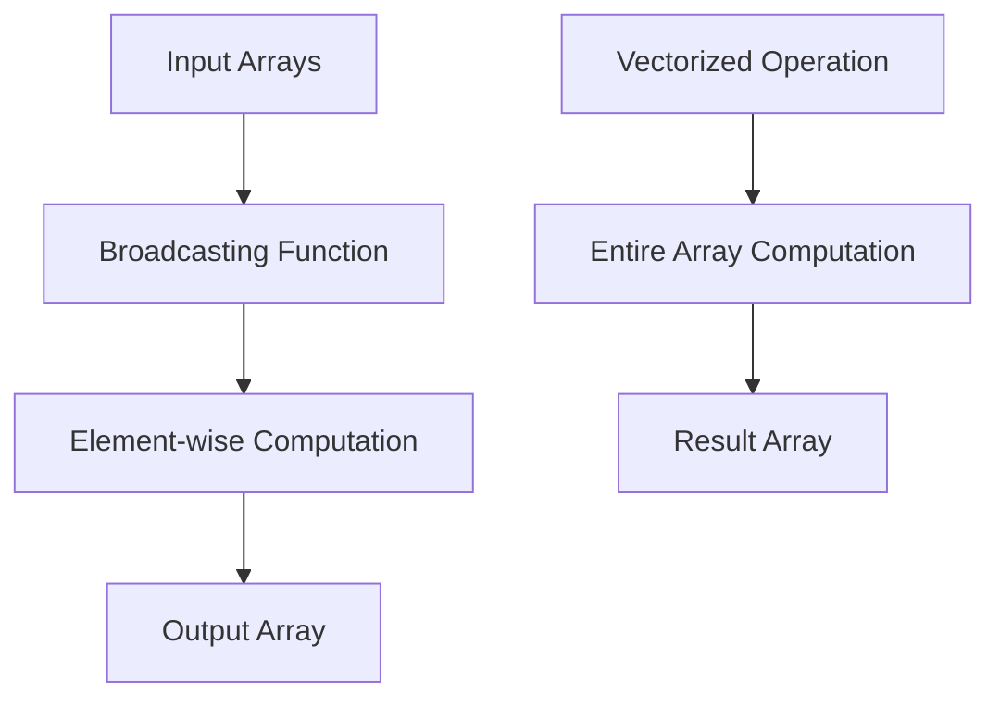

## 8.5 Broadcasting and Vectorized Operations

Broadcasting and vectorized operations are powerful features in Julia that allow developers to perform efficient, element-wise computations on arrays and matrices. These operations are essential for handling large datasets and performing complex mathematical computations with ease. In this section, we'll explore the concepts of broadcasting and vectorized operations, demonstrate how to use Julia's dot syntax, and provide practical examples to illustrate these concepts.

### Understanding Broadcasting in Julia

Broadcasting is a technique that allows you to apply a function to each element of an array or a collection of arrays. In Julia, broadcasting is achieved using the dot syntax (`.`), which makes it easy to perform element-wise operations without writing explicit loops.

#### Dot Syntax (`.`)

The dot syntax is a concise way to apply functions element-wise to arrays. By appending a dot (`.`) to a function call, you instruct Julia to broadcast the function over the elements of the input arrays. This syntax is not only convenient but also enhances code readability and performance.

**Example: Element-wise Operations**

```julia
angles = [0, π/4, π/2, 3π/4, π]

sine_values = sin.(angles)

println(sine_values)
```

In this example, the `sin.` function is broadcasted over the `angles` array, computing the sine of each element.

#### Writing Broadcastable Functions

To fully leverage broadcasting, it's important to write functions that are compatible with broadcasting. This involves ensuring that your functions can operate on scalars as well as arrays.

**Supporting Broadcasting**

When defining custom functions, you can make them broadcastable by using the `@.` macro or by explicitly using the dot syntax within the function body.

**Example: Custom Broadcastable Function**

```julia
function square(x)
    return x * x
end

numbers = [1, 2, 3, 4, 5]

squared_numbers = square.(numbers)

println(squared_numbers)
```

In this example, the `square` function is broadcasted over the `numbers` array, computing the square of each element.

### Vectorized Operations

Vectorized operations are another powerful feature in Julia that allows you to perform operations on entire arrays or matrices without writing explicit loops. These operations are optimized for performance and can significantly reduce the complexity of your code.

#### Mathematical Computations

Vectorized operations are particularly useful for performing mathematical computations on large datasets. By leveraging Julia's built-in functions and libraries, you can efficiently perform complex calculations with minimal code.

**Example: Efficient Mathematical Computations**

```julia
array1 = [1, 2, 3, 4, 5]
array2 = [5, 4, 3, 2, 1]

sum_array = array1 .+ array2

println(sum_array)
```

In this example, the `.+` operator is used to perform element-wise addition of `array1` and `array2`, resulting in a new array where each element is the sum of the corresponding elements from the input arrays.

### Visualizing Broadcasting and Vectorized Operations

To better understand how broadcasting and vectorized operations work, let's visualize these concepts using a flowchart.



**Caption:** This flowchart illustrates the process of broadcasting and vectorized operations in Julia. Input arrays are processed through broadcasting functions or vectorized operations, resulting in output arrays with computed values.

### Practical Applications

Broadcasting and vectorized operations are widely used in various domains, including data science, machine learning, and scientific computing. Let's explore some practical applications of these concepts.

#### Data Processing

In data processing, broadcasting and vectorized operations can be used to efficiently manipulate and analyze large datasets. For example, you can apply transformations to entire columns of a DataFrame or perform statistical calculations on large arrays.

**Example: Data Transformation**

```julia
using DataFrames

df = DataFrame(A = [1, 2, 3], B = [4, 5, 6])

df.A = df.A .^ 2

println(df)
```

In this example, the `.^` operator is used to square each element in column A of the DataFrame, demonstrating the power of broadcasting for data transformation.

#### Machine Learning

In machine learning, broadcasting and vectorized operations are essential for efficiently training models and processing large datasets. These operations enable you to perform matrix multiplications, apply activation functions, and compute gradients with ease.

**Example: Matrix Multiplication**

```julia
matrix1 = [1 2; 3 4]
matrix2 = [5 6; 7 8]

result_matrix = matrix1 * matrix2

println(result_matrix)
```

In this example, the `*` operator is used to perform matrix multiplication, showcasing the efficiency of vectorized operations in machine learning tasks.

### Best Practices for Broadcasting and Vectorized Operations

To make the most of broadcasting and vectorized operations in Julia, consider the following best practices:

- **Use Dot Syntax:** Always use the dot syntax for element-wise operations to ensure efficient broadcasting.
- **Write Broadcastable Functions:** Design custom functions to be compatible with broadcasting by using the `@.` macro or dot syntax.
- **Leverage Built-in Functions:** Utilize Julia's built-in functions and libraries for optimized vectorized operations.
- **Avoid Explicit Loops:** Minimize the use of explicit loops for element-wise computations to improve code readability and performance.

### Try It Yourself

Experiment with the code examples provided in this section by modifying the input arrays or functions. Try creating your own custom functions and apply them using broadcasting to see the results. Remember, practice is key to mastering broadcasting and vectorized operations in Julia!

### References and Further Reading

For more information on broadcasting and vectorized operations in Julia, consider exploring the following resources:

- [Julia Documentation: Broadcasting](https://docs.julialang.org/en/v1/manual/arrays/#Broadcasting)
- [JuliaLang: Performance Tips](https://docs.julialang.org/en/v1/manual/performance-tips/)
- [JuliaLang: DataFrames.jl](https://dataframes.juliadata.org/stable/)

### Knowledge Check

Before we conclude, let's reinforce your understanding of broadcasting and vectorized operations with a few questions:

1. What is the purpose of broadcasting in Julia?
2. How does the dot syntax enhance code readability and performance?
3. What are some practical applications of broadcasting and vectorized operations?
4. How can you make a custom function compatible with broadcasting?
5. Why is it important to avoid explicit loops for element-wise computations?

### Embrace the Journey

Remember, mastering broadcasting and vectorized operations is just the beginning of your journey with Julia. As you continue to explore and experiment, you'll discover new ways to optimize your code and tackle complex computational challenges. Stay curious, keep learning, and enjoy the process!

## Quiz Time!



### What is the primary purpose of broadcasting in Julia?

- [x] To apply functions element-wise to arrays
- [ ] To perform matrix multiplication
- [ ] To sort arrays
- [ ] To concatenate strings

> **Explanation:** Broadcasting in Julia is used to apply functions element-wise to arrays, allowing for efficient computations without explicit loops.

### How does the dot syntax improve code performance in Julia?

- [x] By enabling element-wise operations
- [ ] By reducing memory usage
- [ ] By simplifying syntax for loops
- [ ] By increasing array size

> **Explanation:** The dot syntax allows for element-wise operations, which are optimized for performance and reduce the need for explicit loops.

### Which of the following is a vectorized operation in Julia?

- [x] Element-wise addition of two arrays
- [ ] Sorting an array
- [ ] Finding the maximum value in an array
- [ ] Concatenating two strings

> **Explanation:** Vectorized operations involve performing computations on entire arrays, such as element-wise addition.

### How can you make a custom function broadcastable in Julia?

- [x] Use the `@.` macro or dot syntax within the function
- [ ] Define the function with a `for` loop
- [ ] Use the `map` function
- [ ] Write the function in C

> **Explanation:** To make a custom function broadcastable, use the `@.` macro or dot syntax to ensure it can operate on arrays.

### What is a practical application of broadcasting in data processing?

- [x] Transforming columns in a DataFrame
- [ ] Sorting a list of strings
- [ ] Reading data from a file
- [ ] Writing data to a database

> **Explanation:** Broadcasting is useful for transforming columns in a DataFrame, allowing for efficient data manipulation.

### Why should you avoid explicit loops for element-wise computations in Julia?

- [x] To improve code readability and performance
- [ ] To reduce memory usage
- [ ] To increase array size
- [ ] To simplify syntax for loops

> **Explanation:** Avoiding explicit loops for element-wise computations improves code readability and performance by leveraging broadcasting.

### Which operator is used for element-wise addition in Julia?

- [x] `.+`
- [ ] `*`
- [ ] `-`
- [ ] `/`

> **Explanation:** The `.+` operator is used for element-wise addition in Julia, allowing for efficient computations.

### What is the benefit of using built-in functions for vectorized operations?

- [x] They are optimized for performance
- [ ] They reduce memory usage
- [ ] They simplify syntax for loops
- [ ] They increase array size

> **Explanation:** Built-in functions for vectorized operations are optimized for performance, making them efficient for large datasets.

### True or False: Broadcasting can only be used with numerical arrays.

- [ ] True
- [x] False

> **Explanation:** Broadcasting can be used with various data types, not just numerical arrays, allowing for flexible computations.

### Which of the following is a best practice for broadcasting in Julia?

- [x] Use dot syntax for element-wise operations
- [ ] Write explicit loops for all computations
- [ ] Avoid using built-in functions
- [ ] Use global variables for data storage

> **Explanation:** Using dot syntax for element-wise operations is a best practice for efficient broadcasting in Julia.


