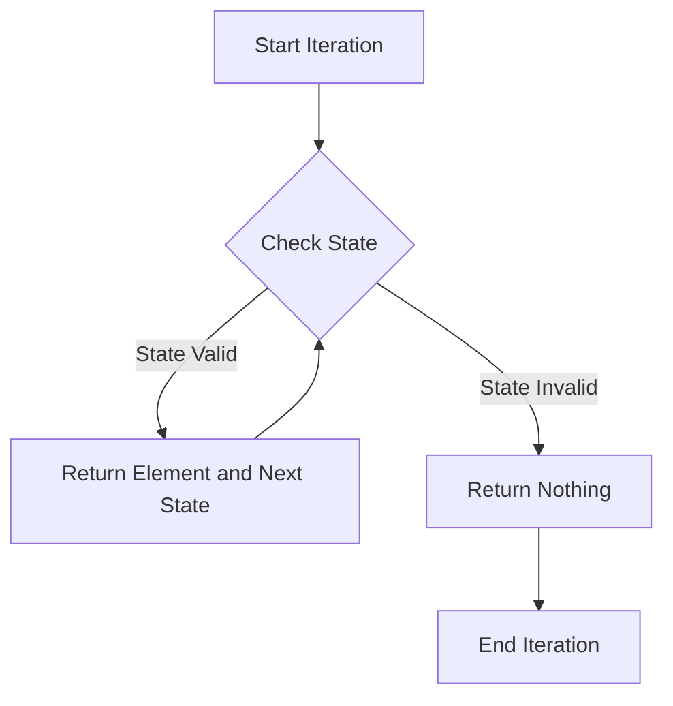

## 8.6 Working with Iterators and Generators

In the world of programming, efficient data processing is crucial, especially when dealing with large datasets or infinite sequences. Julia, with its powerful language features, provides robust support for iterators and generators, enabling developers to handle data in a memory-efficient manner. In this section, we will delve into the concepts of iterators and generators in Julia, exploring how they can be used to create lazy sequences and process data streams effectively.

### Understanding Iterators in Julia

Iterators are objects that allow us to traverse through a collection of elements one at a time. In Julia, the iterator protocol is a fundamental concept that enables the creation of custom iterators for any data structure. Let's explore how to implement iterators in Julia.

#### Iterators Protocol

The iterator protocol in Julia revolves around the `iterate` function. To create a custom iterator, you need to define the `iterate` function for your type. Here's how you can implement it:

- **Implementing `iterate`**:

  To define an iterator for a custom type, you need to implement the `iterate` function. This function should return a tuple containing the current element and the next state. If the iteration is complete, it should return `nothing`.

  ```julia
  struct MyRange
      start::Int
      stop::Int
  end

  function Base.iterate(r::MyRange, state=0)
      state += 1
      if state <= r.stop - r.start + 1
          return (r.start + state - 1, state)
      else
          return nothing
      end
  end
  ```

  In this example, `MyRange` is a custom type that represents a range of integers. The `iterate` function is implemented to traverse through the range, returning each element and the next state.

#### Visualizing the Iterator Protocol

To better understand the iterator protocol, let's visualize the process using a flowchart:



**Caption:** This flowchart illustrates the process of iterating over a custom type in Julia using the `iterate` function.

### Generators in Julia

Generators in Julia provide a way to create lazy sequences, where elements are computed on-the-fly as needed. This is particularly useful for handling large datasets or infinite sequences without consuming excessive memory.

#### Lazy Sequences with `Base.Generator`

The `Base.Generator` type in Julia allows you to create lazy sequences by applying a function to each element of an iterable. This is achieved without creating an intermediate collection, making it memory-efficient.

- **Creating a Lazy Sequence**:

  ```julia
  squares = (x^2 for x in 1:10)
  ```

  In this example, `squares` is a generator that computes the square of each number in the range `1:10` lazily. The computation is performed only when the elements are accessed.

#### Use Cases and Examples

Let's explore some practical use cases of iterators and generators in Julia.

##### Infinite Sequences

One of the powerful applications of generators is representing infinite sequences. For instance, you can create a generator for the Fibonacci sequence:

```julia
function fibonacci()
    a, b = 0, 1
    return Base.Generator(_ -> (a, (a, b) = (b, a + b)), 1:Inf)
end

fib_gen = fibonacci()
for i in fib_gen
    println(i)
    if i > 100
        break
    end
end
```

In this example, the `fibonacci` function returns a generator that produces Fibonacci numbers. The sequence is infinite, but we can control the iteration using a loop.

##### Data Streaming

Generators are also useful for processing data streams without loading the entire dataset into memory. Consider the following example:

```julia
function process_data_stream(data_stream)
    for data in data_stream
        # Process each data element
        println(data)
    end
end

data_stream = (rand() for _ in 1:1000000)
process_data_stream(data_stream)
```

Here, `data_stream` is a generator that produces random numbers. The `process_data_stream` function processes each element without loading the entire stream into memory.

### Try It Yourself

Now that we've explored iterators and generators in Julia, it's time to experiment with the concepts. Try modifying the code examples to create your own custom iterators and generators. For instance, you can create a generator for prime numbers or implement a custom iterator for a complex data structure.

### Knowledge Check

Before we conclude, let's reinforce our understanding with a few questions:

- What is the purpose of the `iterate` function in Julia?
- How can generators help in handling large datasets?
- What are some practical applications of iterators and generators?

### Summary

In this section, we've explored the power of iterators and generators in Julia. By implementing the iterator protocol, we can create custom iterators for any data structure. Generators, on the other hand, allow us to create lazy sequences and process data streams efficiently. Remember, mastering these concepts will enable you to handle data in a memory-efficient manner, making your Julia applications more robust and scalable.

## Quiz Time!



### What is the primary purpose of the `iterate` function in Julia?

- [x] To define how to traverse a custom data structure
- [ ] To initialize variables
- [ ] To perform mathematical operations
- [ ] To handle exceptions

> **Explanation:** The `iterate` function is used to define how to traverse a custom data structure, returning the current element and the next state.

### How do generators in Julia help with memory efficiency?

- [x] By computing elements on-the-fly
- [ ] By storing all elements in an array
- [ ] By using more memory
- [ ] By duplicating data

> **Explanation:** Generators compute elements on-the-fly, which helps in reducing memory usage as they do not store all elements in memory.

### Which of the following is a use case for generators?

- [x] Infinite sequences
- [ ] Sorting algorithms
- [ ] Static arrays
- [ ] Memory allocation

> **Explanation:** Generators are particularly useful for representing infinite sequences as they compute elements lazily.

### What is the advantage of using `Base.Generator` in Julia?

- [x] It creates lazy sequences without intermediate collections
- [ ] It speeds up computation by using more memory
- [ ] It simplifies syntax for loops
- [ ] It automatically parallelizes computations

> **Explanation:** `Base.Generator` creates lazy sequences without creating intermediate collections, making it memory-efficient.

### How can you control iteration over an infinite sequence in Julia?

- [x] By using a loop with a break condition
- [ ] By using a fixed-size array
- [ ] By pre-computing all elements
- [ ] By using a recursive function

> **Explanation:** You can control iteration over an infinite sequence by using a loop with a break condition to stop when needed.

### What is a practical application of iterators in Julia?

- [x] Traversing custom data structures
- [ ] Compiling code
- [ ] Managing memory
- [ ] Encrypting data

> **Explanation:** Iterators are used to traverse custom data structures, allowing for flexible data access.

### How do you create a generator for a sequence in Julia?

- [x] By using a comprehension with parentheses
- [ ] By using a comprehension with brackets
- [ ] By defining a function
- [ ] By using a loop

> **Explanation:** You create a generator by using a comprehension with parentheses, which defines a lazy sequence.

### What is the role of the `Base.iterate` function?

- [x] To define the iteration protocol for a type
- [ ] To perform arithmetic operations
- [ ] To manage memory allocation
- [ ] To handle exceptions

> **Explanation:** `Base.iterate` defines the iteration protocol for a type, specifying how to traverse its elements.

### What is the benefit of lazy evaluation in data processing?

- [x] It reduces memory usage by computing elements as needed
- [ ] It speeds up computation by using more memory
- [ ] It simplifies syntax for loops
- [ ] It automatically parallelizes computations

> **Explanation:** Lazy evaluation reduces memory usage by computing elements only when they are needed, avoiding unnecessary data storage.

### True or False: Generators in Julia can be used to process data streams without loading the entire dataset into memory.

- [x] True
- [ ] False

> **Explanation:** True. Generators allow processing of data streams by computing elements on-the-fly, thus avoiding the need to load the entire dataset into memory.



Remember, this is just the beginning. As you progress, you'll build more complex and interactive applications using iterators and generators. Keep experimenting, stay curious, and enjoy the journey!
