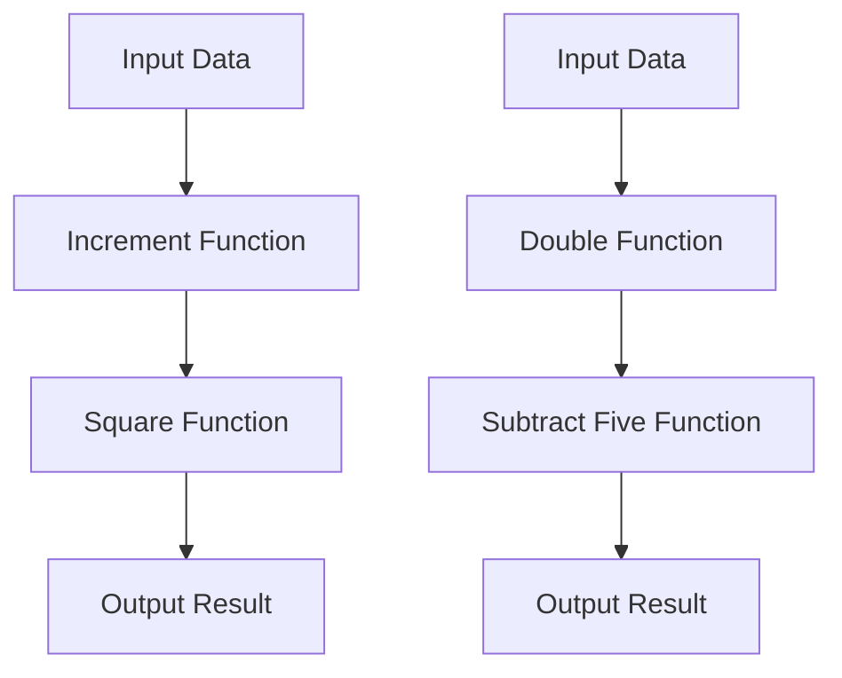

## 8.7 Composable Algorithms and Function Chains

In the world of software development, the ability to create modular, reusable, and maintainable code is paramount. Julia, with its powerful features, offers developers the tools to achieve this through composable algorithms and function chains. This section delves into the concepts of function composition and pipelines, demonstrating how they can be effectively utilized in Julia to streamline data processing and enhance code readability.

### Function Composition

Function composition is a fundamental concept in functional programming that allows developers to combine multiple functions into a single operation. In Julia, this is achieved using the composition operator `∘`. This operator enables the creation of new functions by chaining existing ones, allowing for more concise and expressive code.

#### Compose Functions

To compose functions in Julia, use the `∘` operator. This operator takes two or more functions and returns a new function that is the composition of the original functions. The resulting function applies the rightmost function first and then applies the remaining functions in order from right to left.

**Example:**

```julia
square(x) = x^2
increment(x) = x + 1

composed_function = square ∘ increment

result = composed_function(3)  # Output: 16
```

In this example, the `increment` function is applied first, followed by the `square` function. The result is `(3 + 1)^2 = 16`.

#### Benefits of Function Composition

- **Modularity**: Functions can be developed independently and then composed to create more complex operations.
- **Reusability**: Composed functions can be reused across different parts of the application.
- **Readability**: Code becomes more readable and expressive, as the intent of the operations is clear.

### Pipelines

Pipelines provide another mechanism for chaining functions in Julia. The pipeline operator `|>` allows for the sequential application of functions, where the output of one function becomes the input to the next. This approach is particularly useful for processing data through a series of transformations.

#### Chaining with `|>`

The pipeline operator `|>` is used to pass the result of one function to the next. This operator is left-associative, meaning that it evaluates from left to right.

**Example:**

```julia
double(x) = 2 * x
subtract_five(x) = x - 5

result = 3 |> double |> subtract_five  # Output: 1
```

In this example, the `double` function is applied to `3`, resulting in `6`, which is then passed to the `subtract_five` function, yielding `1`.

#### Use Cases and Examples

Pipelines are particularly useful in scenarios where data needs to be processed through multiple stages. This is common in data analysis, machine learning, and ETL (Extract, Transform, Load) processes.

**Data Processing Pipelines**

Consider a scenario where we need to process a dataset by normalizing values, filtering outliers, and computing statistics. Pipelines can simplify this process:

```julia
data = [1, 2, 3, 100, 5, 6, 7]

normalize(x) = x / maximum(data)
filter_outliers(x) = x < 10 ? x : missing
compute_mean(data) = mean(skipmissing(data))

result = data |> normalize |> filter_outliers |> compute_mean  # Output: 0.42857142857142855
```

In this example, the data is first normalized, then outliers are filtered out, and finally, the mean is computed.

### Visualizing Function Composition and Pipelines

To better understand how function composition and pipelines work, let's visualize the process using a flowchart.



**Caption:** The flowchart illustrates the sequence of operations in function composition and pipelines. The top path represents function composition, while the bottom path represents a pipeline.

### Design Considerations

When using function composition and pipelines in Julia, consider the following:

- **Function Purity**: Ensure that functions are pure, meaning they do not have side effects. This makes them easier to compose and reason about.
- **Error Handling**: Consider how errors are propagated through composed functions and pipelines. Use error handling mechanisms to manage exceptions.
- **Performance**: While composition and pipelines improve readability, they may introduce overhead. Profile your code to ensure performance is acceptable.

### Differences and Similarities

Function composition and pipelines are similar in that they both allow for chaining operations. However, they differ in their syntax and evaluation order. Function composition evaluates from right to left, while pipelines evaluate from left to right. Choose the approach that best fits your use case and coding style.

### Try It Yourself

Experiment with function composition and pipelines by modifying the code examples provided. Try creating your own functions and chaining them together. Consider how these techniques can be applied to your projects to improve code modularity and readability.

### References and Links

- [Julia Documentation on Function Composition](https://docs.julialang.org/en/v1/manual/functions/#Function-composition)
- [JuliaLang: Piping and Function Composition](https://julialang.org/blog/2018/07/iterators-and-generators/)
- [MDN Web Docs: Functional Programming](https://developer.mozilla.org/en-US/docs/Glossary/Functional_programming)

### Knowledge Check

- What is the primary difference between function composition and pipelines?
- How does the `∘` operator work in Julia?
- Why is function purity important in composition and pipelines?

### Embrace the Journey

Remember, mastering composable algorithms and function chains is just the beginning. As you continue to explore Julia, you'll discover more ways to write efficient and expressive code. Keep experimenting, stay curious, and enjoy the journey!

## Quiz Time!



### What is the primary operator used for function composition in Julia?

- [x] `∘`
- [ ] `|`
- [ ] `&`
- [ ] `->`

> **Explanation:** The `∘` operator is used for function composition in Julia, allowing you to combine multiple functions into a single operation.

### How does the pipeline operator `|>` evaluate functions?

- [x] Left to right
- [ ] Right to left
- [ ] Top to bottom
- [ ] Bottom to top

> **Explanation:** The pipeline operator `|>` evaluates functions from left to right, passing the result of one function as the input to the next.

### Which of the following is a benefit of function composition?

- [x] Modularity
- [ ] Increased complexity
- [ ] Reduced readability
- [ ] Side effects

> **Explanation:** Function composition enhances modularity by allowing functions to be developed independently and then combined to create more complex operations.

### What is a key consideration when using pipelines in Julia?

- [x] Function purity
- [ ] Function complexity
- [ ] Function size
- [ ] Function color

> **Explanation:** Ensuring function purity is important when using pipelines, as pure functions do not have side effects and are easier to reason about.

### Which operator is left-associative in Julia?

- [x] `|>`
- [ ] `∘`
- [ ] `|`
- [ ] `&`

> **Explanation:** The pipeline operator `|>` is left-associative, meaning it evaluates from left to right.

### What is the output of the following composed function: `(square ∘ increment)(2)`?

- [x] 9
- [ ] 4
- [ ] 5
- [ ] 8

> **Explanation:** The `increment` function is applied first, resulting in `3`, and then the `square` function is applied, yielding `9`.

### In a data processing pipeline, what is the role of the `filter_outliers` function?

- [x] Remove or mark outliers
- [ ] Normalize data
- [ ] Compute statistics
- [ ] Double the values

> **Explanation:** The `filter_outliers` function is used to remove or mark outliers in the data, ensuring that only relevant data is processed further.

### What is the result of the following pipeline: `5 |> double |> subtract_five`?

- [x] 5
- [ ] 10
- [ ] 0
- [ ] -5

> **Explanation:** The `double` function is applied to `5`, resulting in `10`, and then `subtract_five` is applied, yielding `5`.

### Why is error handling important in function composition?

- [x] To manage exceptions and ensure robust code
- [ ] To increase complexity
- [ ] To reduce performance
- [ ] To add side effects

> **Explanation:** Error handling is important to manage exceptions and ensure that the composed functions operate robustly, even in the presence of errors.

### True or False: Function composition evaluates functions from left to right.

- [ ] True
- [x] False

> **Explanation:** Function composition evaluates functions from right to left, applying the rightmost function first.


