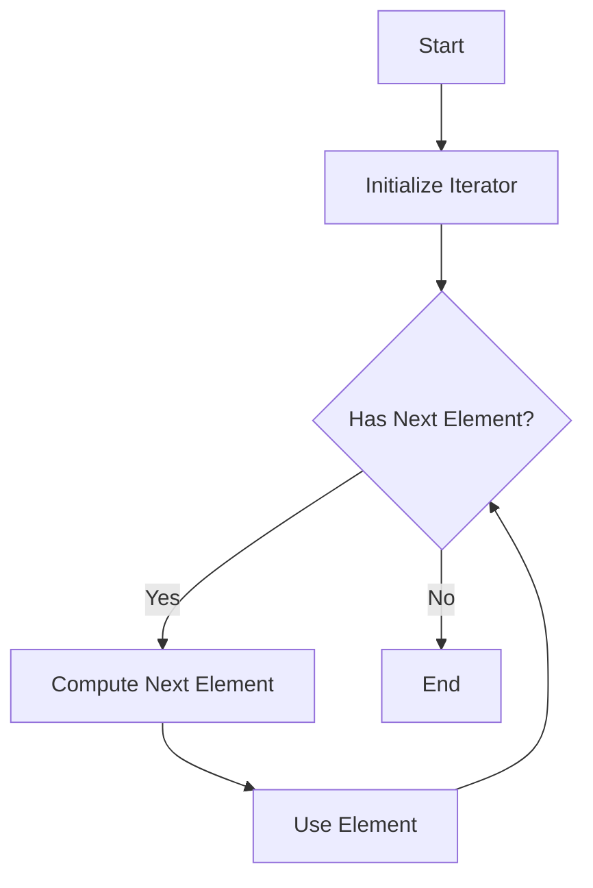

## 8.8 The Power of Lazy Evaluation with Iterators

In the realm of software development, efficiency and resource management are paramount. As developers, we strive to write code that is not only correct but also performant and scalable. One powerful technique to achieve this is **lazy evaluation**, particularly when combined with iterators in Julia. This approach allows us to defer computations until they are absolutely necessary, thereby optimizing both time and space complexity.

### Understanding Lazy Evaluation

**Lazy evaluation** is a strategy that delays the evaluation of an expression until its value is needed. This can lead to significant performance improvements, especially when dealing with large datasets or complex computations. By avoiding unnecessary calculations, we can reduce the computational overhead and memory usage of our programs.

#### Benefits of Lazy Evaluation

- **Efficiency**: By computing values only when needed, we avoid unnecessary operations, which can lead to faster execution times.
- **Memory Optimization**: Lazy evaluation allows us to work with large datasets without loading everything into memory at once.
- **Improved Performance**: In scenarios where only a subset of data is required, lazy evaluation can significantly reduce the workload.

### Implementing Lazy Patterns in Julia

Julia provides robust support for lazy evaluation through its iterator interface. Iterators in Julia are objects that allow us to traverse through a collection without the need to load the entire collection into memory. This is particularly useful for handling large datasets or streams of data.

#### Lazy Collections with Iterators

**Iterators** in Julia are a cornerstone of lazy evaluation. They enable us to represent potentially infinite sequences or large datasets in a memory-efficient manner. Let's explore how we can implement lazy patterns using iterators.

##### Example: Lazy Range

Consider a simple example of a lazy range. Instead of creating an array with all elements, we can use an iterator to generate elements on-the-fly.

```julia
struct LazyRange
    start::Int
    stop::Int
end

Base.iterate(r::LazyRange, state=0) = state < r.stop ? (state + r.start, state + 1) : nothing

for i in LazyRange(1, 10)
    println(i)
end
```

In this example, `LazyRange` is a custom iterator that generates numbers from `start` to `stop` without creating an array. The `iterate` function is used to define how the iteration progresses.

#### Large Dataset Processing

When dealing with large datasets, loading everything into memory can be impractical. Lazy evaluation allows us to process data incrementally, which is crucial for handling data that cannot fit into memory.

##### Example: Processing a Large File

Suppose we have a large text file, and we want to process it line by line without loading the entire file into memory.

```julia
file = open("large_file.txt", "r")

struct FileLineIterator
    file::IO
end

Base.iterate(iter::FileLineIterator, state=nothing) = eof(iter.file) ? nothing : (readline(iter.file), nothing)

for line in FileLineIterator(file)
    println(line)
end

close(file)
```

In this example, `FileLineIterator` is a custom iterator that reads lines from a file one at a time. This approach is memory-efficient and allows us to handle files of arbitrary size.

### Visualizing Lazy Evaluation with Iterators

To better understand how lazy evaluation works with iterators, let's visualize the process using a flowchart.



**Figure 1**: Flowchart illustrating the lazy evaluation process with iterators. The iterator computes the next element only when needed, optimizing both time and space.

### Key Participants in Lazy Evaluation

- **Iterators**: Objects that define how to traverse a collection lazily.
- **Consumers**: Functions or loops that consume elements from the iterator.
- **Producers**: Functions or objects that generate elements on-the-fly.

### Applicability of Lazy Evaluation

Lazy evaluation is particularly useful in scenarios where:

- The dataset is too large to fit into memory.
- Only a subset of the data is needed.
- The computation is expensive, and not all results are required.

### Sample Code Snippet: Lazy Filtering

Let's consider a scenario where we want to filter a large dataset lazily.

```julia
struct LazyFilter{T}
    data::T
    predicate::Function
end

Base.iterate(lf::LazyFilter, state=nothing) = begin
    for item in lf.data
        if lf.predicate(item)
            return (item, nothing)
        end
    end
    return nothing
end

data = 1:1000000
lazy_filtered = LazyFilter(data, x -> x % 2 == 0)

for item in lazy_filtered
    println(item)
end
```

In this example, `LazyFilter` is an iterator that filters elements based on a predicate function. The filtering is done lazily, meaning elements are only evaluated when needed.

### Design Considerations

When implementing lazy evaluation patterns, consider the following:

- **Performance**: Ensure that the lazy evaluation does not introduce significant overhead.
- **Complexity**: Keep the implementation simple and maintainable.
- **Compatibility**: Ensure that the lazy iterator integrates well with existing code.

### Differences and Similarities with Eager Evaluation

Lazy evaluation differs from eager evaluation in that computations are deferred until necessary. This can lead to performance improvements but may also introduce complexity. It's important to balance the benefits of lazy evaluation with the simplicity of eager evaluation.

### Try It Yourself

Experiment with the provided code examples by modifying the range, predicates, or data sources. Observe how lazy evaluation impacts performance and memory usage.

### References and Further Reading

- [Julia Documentation on Iterators](https://docs.julialang.org/en/v1/manual/interfaces/#man-interface-iteration)
- [Lazy.jl: A Julia Package for Lazy Evaluation](https://github.com/MikeInnes/Lazy.jl)

### Knowledge Check

- What are the benefits of lazy evaluation?
- How does lazy evaluation differ from eager evaluation?
- Implement a lazy map function using iterators.

### Embrace the Journey

Remember, mastering lazy evaluation with iterators is just the beginning. As you progress, you'll discover more ways to optimize your code and handle large datasets efficiently. Keep experimenting, stay curious, and enjoy the journey!

## Quiz Time!



### What is lazy evaluation?

- [x] A strategy that delays the evaluation of an expression until its value is needed
- [ ] A method of evaluating expressions as soon as they are defined
- [ ] A technique for optimizing memory usage by preloading data
- [ ] A way to execute code in parallel

> **Explanation:** Lazy evaluation defers computation until the result is required, optimizing performance and memory usage.

### Which of the following is a benefit of lazy evaluation?

- [x] Efficiency
- [x] Memory Optimization
- [ ] Increased Code Complexity
- [ ] Immediate Results

> **Explanation:** Lazy evaluation improves efficiency and memory usage by avoiding unnecessary computations.

### How does lazy evaluation handle large datasets?

- [x] By processing data incrementally
- [ ] By loading the entire dataset into memory
- [ ] By ignoring unused data
- [ ] By compressing data

> **Explanation:** Lazy evaluation processes data incrementally, allowing handling of large datasets without loading them entirely into memory.

### What is an iterator in Julia?

- [x] An object that allows traversal through a collection
- [ ] A function that computes values eagerly
- [ ] A data structure for storing elements
- [ ] A method for parallel computation

> **Explanation:** An iterator is an object that enables traversal through a collection, often used in lazy evaluation.

### What does the `iterate` function do in Julia?

- [x] Defines how iteration progresses for an iterator
- [ ] Computes the sum of elements in a collection
- [ ] Initializes a collection
- [ ] Sorts elements in a collection

> **Explanation:** The `iterate` function defines how iteration progresses, crucial for implementing custom iterators.

### In lazy evaluation, when are computations performed?

- [x] Only when the result is needed
- [ ] As soon as the program starts
- [ ] After all data is loaded
- [ ] At regular intervals

> **Explanation:** Computations in lazy evaluation are deferred until the result is explicitly required.

### What is a key consideration when implementing lazy evaluation?

- [x] Performance overhead
- [ ] Immediate execution
- [ ] Data duplication
- [ ] Code obfuscation

> **Explanation:** It's important to ensure that lazy evaluation does not introduce significant performance overhead.

### How can lazy evaluation improve performance?

- [x] By avoiding unnecessary computations
- [ ] By executing all code in parallel
- [ ] By preloading all data
- [ ] By simplifying code structure

> **Explanation:** Lazy evaluation improves performance by deferring unnecessary computations until needed.

### Which of the following is a common use case for lazy evaluation?

- [x] Processing large files line by line
- [ ] Sorting small arrays
- [ ] Immediate computation of mathematical expressions
- [ ] Preloading web pages

> **Explanation:** Lazy evaluation is ideal for processing large files incrementally, avoiding memory overload.

### True or False: Lazy evaluation always improves code readability.

- [ ] True
- [x] False

> **Explanation:** While lazy evaluation optimizes performance, it can sometimes introduce complexity, affecting readability.


