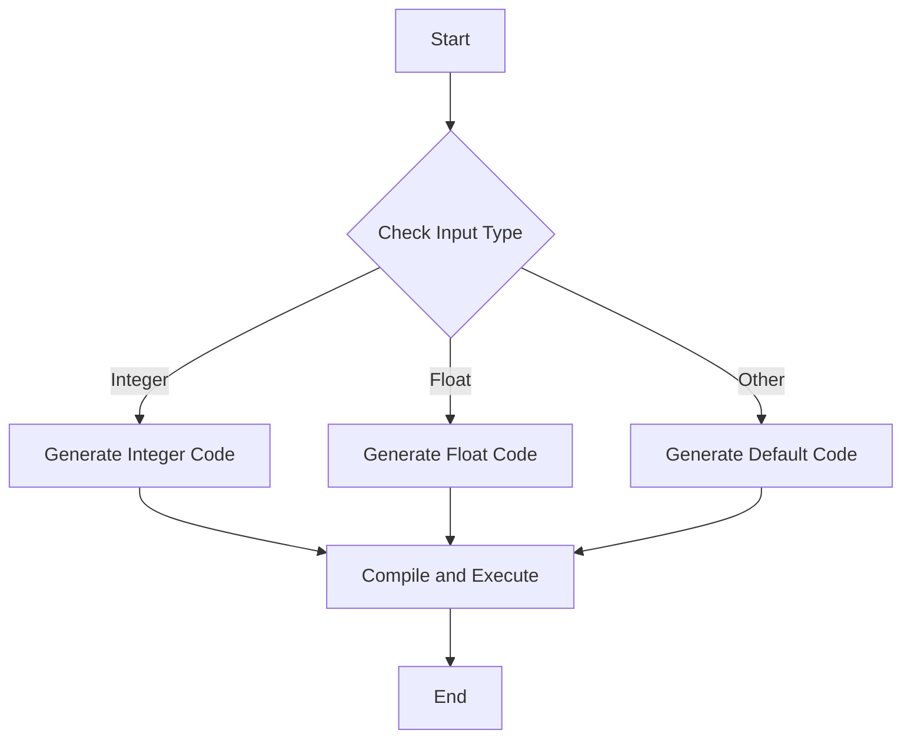

## 8.9 Generated Functions for Performance Optimization

In the realm of high-performance computing, the ability to tailor code execution to specific data types can lead to significant performance gains. Julia, with its unique approach to multiple dispatch and type specialization, offers a powerful feature known as **generated functions**. These functions allow developers to generate specialized code during compilation based on the types of the inputs, enabling highly efficient and optimized execution paths.

### What are Generated Functions?

Generated functions in Julia are a special kind of function that can produce different implementations depending on the types of their arguments. Unlike regular functions, which have a fixed implementation, generated functions can inspect the types of their inputs and generate specialized code accordingly. This capability is particularly useful for performance optimization, as it allows for the creation of highly efficient, type-specific code paths.

#### Key Characteristics of Generated Functions:

- **Type-Driven Code Generation**: Generated functions can produce different code based on the types of the arguments they receive.
- **Compile-Time Execution**: The code generation occurs at compile time, ensuring that the generated code is optimized before execution.
- **Flexibility and Power**: They provide the flexibility to implement complex logic that can adapt to various type combinations, enhancing performance.

### Syntax and Usage

To define a generated function in Julia, you use the `@generated` macro. This macro indicates that the function will generate its implementation based on the types of its arguments.

#### Defining a Generated Function

Here's a basic example of how to define a generated function:

```julia
@generated function my_function(x::T) where T
    if T <: Integer
        return :(x + 1)  # Specialized code for integers
    else
        return :(x * 2)  # General code for other types
    end
end
```

In this example, `my_function` generates different code depending on whether the input `x` is an integer or not. If `x` is an integer, the function returns `x + 1`; otherwise, it returns `x * 2`.

### Use Cases for Generated Functions

Generated functions are particularly useful in scenarios where performance is critical and where operations can be optimized based on the types of the inputs. Some common use cases include:

#### Type-Specific Optimizations

Generated functions allow you to tailor implementations for different type combinations, ensuring that each type gets the most efficient code path. This is especially useful in numerical computing and data processing, where operations on different data types can have vastly different performance characteristics.

#### Array Operations

When dealing with arrays of varying dimensions or types, generated functions can optimize operations by generating code that is specific to the array's structure. This can lead to significant performance improvements, especially in high-dimensional data processing.

### Best Practices for Using Generated Functions

While generated functions are powerful, they should be used judiciously. Here are some best practices to keep in mind:

#### Avoid Complexity

Generated functions can become difficult to read and maintain if they are overly complex. Keep the logic simple and focused on the specific optimizations you need. Avoid embedding too much logic within the generated function itself.

#### Ensure Type Stability

Type stability is crucial for performance in Julia. Ensure that the generated code paths are type-stable to avoid unnecessary type inference and dynamic dispatch overhead.

#### Test Thoroughly

Since generated functions can produce different code paths, it's important to test them thoroughly with a variety of input types to ensure correctness and performance.

### Examples of Generated Functions

Let's explore some examples to illustrate the power and flexibility of generated functions in Julia.

#### Example 1: Optimizing Mathematical Operations

Consider a scenario where we want to optimize a mathematical operation based on the type of the input:

```julia
@generated function optimized_operation(x::T) where T
    if T <: Float64
        return :(x * x)  # Use multiplication for floats
    elseif T <: Int
        return :(x << 1)  # Use bit shift for integers
    else
        return :(x + x)  # Default operation
    end
end

println(optimized_operation(3.0))  # Outputs 9.0
println(optimized_operation(3))    # Outputs 6
```

In this example, `optimized_operation` generates different code for `Float64` and `Int` types, using multiplication for floats and bit shifting for integers.

#### Example 2: Array Dimension Optimization

Generated functions can also optimize operations on arrays with varying dimensions:

```julia
@generated function sum_elements(arr::Array{T, N}) where {T, N}
    if N == 1
        return :(sum(arr))  # Use built-in sum for 1D arrays
    else
        return :(reduce(+, arr))  # Use reduce for multi-dimensional arrays
    end
end

println(sum_elements([1, 2, 3]))  # Outputs 6
println(sum_elements([[1, 2], [3, 4]]))  # Outputs 10
```

Here, `sum_elements` generates code that uses the built-in `sum` function for 1D arrays and `reduce` for multi-dimensional arrays, optimizing the operation based on the array's dimensionality.

### Visualizing Generated Functions

To better understand how generated functions work, let's visualize the process of code generation and execution using a flowchart.



**Figure 1: Code Generation Flow for Generated Functions**

This flowchart illustrates the decision-making process within a generated function, where different code paths are generated based on the input type.

### References and Further Reading

For more information on generated functions and performance optimization in Julia, consider exploring the following resources:

- [Julia Documentation on Generated Functions](https://docs.julialang.org/en/v1/manual/metaprogramming/#Generated-functions)
- [Performance Tips in Julia](https://docs.julialang.org/en/v1/manual/performance-tips/)
- [Metaprogramming in Julia](https://docs.julialang.org/en/v1/manual/metaprogramming/)

### Knowledge Check

To reinforce your understanding of generated functions, consider the following questions:

1. What is the primary advantage of using generated functions in Julia?
2. How do generated functions differ from regular functions in terms of code generation?
3. What are some common use cases for generated functions?
4. Why is it important to ensure type stability in generated functions?
5. How can generated functions optimize operations on arrays with varying dimensions?

### Try It Yourself

Experiment with the examples provided by modifying the input types and observing how the generated code changes. Try creating your own generated functions for different scenarios and see how they can improve performance.

### Embrace the Journey

Remember, mastering generated functions is just one step in your journey to becoming a proficient Julia developer. Keep exploring, experimenting, and learning. The possibilities are endless, and the performance gains can be substantial. Enjoy the process and continue to push the boundaries of what's possible with Julia!

## Quiz Time!



### What is a generated function in Julia?

- [x] A function that generates specialized code during compilation based on input types.
- [ ] A function that runs faster than regular functions.
- [ ] A function that is automatically generated by the compiler.
- [ ] A function that can only be used with arrays.

> **Explanation:** Generated functions in Julia generate specialized code during compilation based on the types of their inputs, allowing for optimized execution paths.

### How do you define a generated function in Julia?

- [x] Using the `@generated` macro.
- [ ] Using the `@optimize` macro.
- [ ] Using the `@specialize` macro.
- [ ] Using the `@compile` macro.

> **Explanation:** The `@generated` macro is used to define generated functions in Julia, indicating that the function will generate its implementation based on input types.

### What is a common use case for generated functions?

- [x] Type-specific optimizations.
- [ ] Debugging code.
- [ ] Writing documentation.
- [ ] Creating user interfaces.

> **Explanation:** Generated functions are commonly used for type-specific optimizations, allowing for efficient code paths tailored to different input types.

### Why should generated functions be kept simple?

- [x] To maintain readability and ease of maintenance.
- [ ] To make them run faster.
- [ ] To ensure they work with all data types.
- [ ] To avoid compiler errors.

> **Explanation:** Keeping generated functions simple helps maintain readability and ease of maintenance, as complex logic can make them difficult to understand and manage.

### What is the benefit of ensuring type stability in generated functions?

- [x] It avoids unnecessary type inference and dynamic dispatch overhead.
- [ ] It makes the code easier to read.
- [ ] It allows the function to work with more data types.
- [ ] It reduces the size of the compiled code.

> **Explanation:** Ensuring type stability in generated functions avoids unnecessary type inference and dynamic dispatch overhead, leading to better performance.

### How can generated functions optimize array operations?

- [x] By generating code specific to the array's structure.
- [ ] By using built-in functions only.
- [ ] By avoiding loops.
- [ ] By using global variables.

> **Explanation:** Generated functions can optimize array operations by generating code that is specific to the array's structure, such as its dimensions and types.

### What happens during the compile-time execution of a generated function?

- [x] The code generation occurs, ensuring optimized code before execution.
- [ ] The function is executed immediately.
- [ ] The function is converted to a regular function.
- [ ] The function is discarded if not used.

> **Explanation:** During compile-time execution, the code generation occurs, ensuring that the generated code is optimized before execution.

### What should you do to ensure correctness in generated functions?

- [x] Test them thoroughly with a variety of input types.
- [ ] Use only integer inputs.
- [ ] Avoid using them in production code.
- [ ] Write extensive documentation.

> **Explanation:** To ensure correctness, generated functions should be tested thoroughly with a variety of input types to verify their behavior and performance.

### Can generated functions be used for operations other than mathematical calculations?

- [x] True
- [ ] False

> **Explanation:** Generated functions can be used for a wide range of operations, not just mathematical calculations, as they allow for type-specific optimizations in various contexts.

### What is the primary goal of using generated functions in Julia?

- [x] To achieve performance optimization through type-specific code generation.
- [ ] To simplify code writing.
- [ ] To make code more readable.
- [ ] To reduce the number of functions in a program.

> **Explanation:** The primary goal of using generated functions in Julia is to achieve performance optimization through type-specific code generation, allowing for efficient execution paths.


