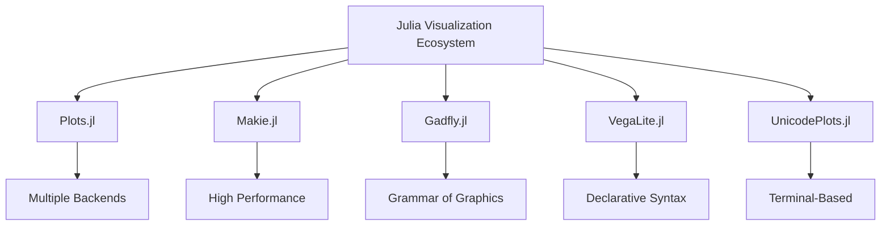

## 9.1 Overview of Visualization Ecosystem in Julia

Data visualization is a crucial aspect of data analysis and interpretation, allowing us to understand complex datasets through graphical representations. Julia, known for its high performance and ease of use, offers a rich ecosystem of visualization libraries that cater to various needs, from simple plots to complex interactive visualizations. In this section, we will explore the key visualization libraries in Julia, discuss their features, and provide guidance on choosing the right tool for your specific requirements.

### Key Visualization Libraries

#### Plots.jl

**Plots.jl** is one of the most versatile and widely used plotting libraries in Julia. It acts as a meta-package, providing a unified interface to various plotting backends, such as GR, PyPlot, Plotly, and more. This flexibility allows users to switch between backends without changing their code, making it an excellent choice for both beginners and advanced users.

**Features:**

- **Backend Flexibility:** Easily switch between different backends to leverage their unique features.
- **Customization:** Extensive options for customizing plots, including colors, labels, and annotations.
- **Interactivity:** Support for interactive plots with backends like Plotly.
- **Ease of Use:** Simple syntax that is easy to learn and use.

**Sample Code:**

```julia
using Plots

gr()

x = 1:10
y = rand(10)
plot(x, y, title="Random Line Plot", xlabel="X-axis", ylabel="Y-axis", legend=false)
```

#### Makie.jl

**Makie.jl** is a high-performance plotting library designed for creating complex and interactive visualizations. It is particularly well-suited for handling large datasets and 3D visualizations, making it a favorite among users who require high-quality graphics and performance.

**Features:**

- **High Performance:** Optimized for speed and efficiency, capable of handling large datasets.
- **3D Visualizations:** Support for 3D plots and animations.
- **Interactivity:** Interactive plots with real-time updates.
- **Customization:** Highly customizable with a focus on aesthetics.

**Sample Code:**

```julia
using Makie

x = rand(100)
y = rand(100)
z = rand(100)
scatter(x, y, z, color=:blue, markersize=8, title="3D Scatter Plot")
```

#### Gadfly.jl

**Gadfly.jl** is inspired by the Grammar of Graphics, providing a declarative approach to creating statistical plots. It is ideal for users who prefer a structured and expressive way to define visualizations.

**Features:**

- **Grammar of Graphics:** Build plots using a layered grammar, similar to ggplot2 in R.
- **Statistical Plotting:** Built-in support for statistical plots and transformations.
- **Custom Themes:** Ability to create and apply custom themes for consistent styling.

**Sample Code:**

```julia
using Gadfly

plot(x=1:5, y=[3, 5, 2, 8, 7], Geom.bar, Theme(default_color="orange"))
```

#### VegaLite.jl

**VegaLite.jl** is a Julia wrapper for the Vega-Lite visualization grammar, offering a declarative approach to creating interactive and web-based visualizations. It is well-suited for users who need to create complex visualizations with minimal code.

**Features:**

- **Declarative Syntax:** Define visualizations using a concise and expressive syntax.
- **Interactivity:** Built-in support for interactive plots and web-based visualizations.
- **Integration:** Seamless integration with web technologies and other Julia packages.

**Sample Code:**

```julia
using VegaLite

@vlplot(:point, x=1:10, y=rand(10), color=:red)
```

#### UnicodePlots.jl

**UnicodePlots.jl** is a unique library that allows users to create plots directly in the terminal using Unicode characters. It is perfect for quick visualizations and when working in environments without graphical support.

**Features:**

- **Terminal-Based:** Create plots directly in the terminal without the need for a graphical interface.
- **Lightweight:** Minimal dependencies and fast rendering.
- **Quick Visualizations:** Ideal for quick data exploration and debugging.

**Sample Code:**

```julia
using UnicodePlots

x = 1:10
y = rand(10)
lineplot(x, y, title="Terminal Line Plot", xlabel="X", ylabel="Y")
```

### Choosing the Right Tool

Selecting the appropriate visualization tool in Julia depends on several factors, including performance, interactivity, ease of use, and aesthetics. Here are some considerations to help you make an informed decision:

- **Performance:** If you are working with large datasets or require high-performance graphics, consider using Makie.jl for its optimized rendering capabilities.
- **Interactivity:** For interactive and web-based visualizations, VegaLite.jl and Plots.jl (with Plotly backend) are excellent choices.
- **Ease of Use:** If you prefer a simple and intuitive interface, Plots.jl offers a straightforward syntax with extensive customization options.
- **Aesthetics:** For visually appealing and customizable plots, Gadfly.jl and Makie.jl provide a wide range of styling options.
- **Environment:** If you are working in a terminal or require quick visualizations, UnicodePlots.jl is a lightweight and efficient option.

### Interoperability

One of the strengths of Julia's visualization ecosystem is its ability to integrate seamlessly with other Julia packages and workflows. This interoperability allows users to leverage the power of Julia's data manipulation and analysis capabilities alongside their visualization needs.

- **DataFrames.jl:** Most visualization libraries in Julia can work directly with DataFrames, making it easy to visualize tabular data.
- **Integration with Jupyter Notebooks:** Libraries like Plots.jl and VegaLite.jl are well-suited for use in Jupyter Notebooks, providing an interactive environment for data exploration.
- **Compatibility with Web Technologies:** VegaLite.jl and Makie.jl offer integration with web technologies, enabling the creation of interactive and web-based visualizations.

### Try It Yourself

To get hands-on experience with Julia's visualization libraries, try modifying the sample code provided above. Experiment with different backends in Plots.jl, create 3D visualizations with Makie.jl, or explore the declarative syntax of VegaLite.jl. By doing so, you'll gain a deeper understanding of each library's capabilities and how they can be applied to your specific use cases.

### Visualizing the Ecosystem

To better understand the relationships and features of the key visualization libraries in Julia, let's visualize the ecosystem using a diagram:



This diagram illustrates the key libraries and their unique features, helping you to quickly identify which tool might be best suited for your needs.

### Conclusion

Julia's visualization ecosystem is diverse and powerful, offering a range of tools to meet different visualization needs. Whether you're creating simple plots or complex interactive visualizations, there's a library in Julia that can help you achieve your goals. By understanding the strengths and features of each library, you can make informed decisions and create effective visualizations that enhance your data analysis and storytelling.

## Quiz Time!



### Which Julia library provides a unified interface to multiple plotting backends?

- [x] Plots.jl
- [ ] Makie.jl
- [ ] Gadfly.jl
- [ ] VegaLite.jl

> **Explanation:** Plots.jl acts as a meta-package, allowing users to switch between different plotting backends without changing their code.

### What is a key feature of Makie.jl?

- [x] High-performance 3D visualizations
- [ ] Terminal-based plotting
- [ ] Grammar of Graphics
- [ ] Declarative syntax

> **Explanation:** Makie.jl is known for its high-performance graphics and support for 3D visualizations.

### Which library is inspired by the Grammar of Graphics?

- [ ] Plots.jl
- [ ] Makie.jl
- [x] Gadfly.jl
- [ ] UnicodePlots.jl

> **Explanation:** Gadfly.jl is inspired by the Grammar of Graphics, similar to ggplot2 in R.

### Which library is best suited for terminal-based plotting?

- [ ] Plots.jl
- [ ] Makie.jl
- [ ] Gadfly.jl
- [x] UnicodePlots.jl

> **Explanation:** UnicodePlots.jl allows users to create plots directly in the terminal using Unicode characters.

### What is a key advantage of VegaLite.jl?

- [ ] High-performance 3D visualizations
- [ ] Terminal-based plotting
- [ ] Grammar of Graphics
- [x] Declarative syntax for interactive plots

> **Explanation:** VegaLite.jl offers a declarative syntax for creating interactive and web-based visualizations.

### Which library is known for its flexibility in switching between different backends?

- [x] Plots.jl
- [ ] Makie.jl
- [ ] Gadfly.jl
- [ ] VegaLite.jl

> **Explanation:** Plots.jl provides flexibility by allowing users to switch between various plotting backends.

### Which library is particularly well-suited for handling large datasets?

- [ ] Plots.jl
- [x] Makie.jl
- [ ] Gadfly.jl
- [ ] VegaLite.jl

> **Explanation:** Makie.jl is optimized for speed and efficiency, making it suitable for large datasets.

### What is a common use case for UnicodePlots.jl?

- [ ] High-performance 3D visualizations
- [x] Quick visualizations in the terminal
- [ ] Grammar of Graphics
- [ ] Declarative syntax

> **Explanation:** UnicodePlots.jl is ideal for quick visualizations and when working in environments without graphical support.

### Which library offers integration with web technologies?

- [ ] Plots.jl
- [ ] Makie.jl
- [ ] Gadfly.jl
- [x] VegaLite.jl

> **Explanation:** VegaLite.jl provides integration with web technologies, enabling interactive and web-based visualizations.

### True or False: Gadfly.jl provides a declarative approach to creating statistical plots.

- [x] True
- [ ] False

> **Explanation:** Gadfly.jl uses a declarative approach inspired by the Grammar of Graphics, allowing users to define statistical plots expressively.



Remember, this is just the beginning. As you progress, you'll build more complex and interactive visualizations. Keep experimenting, stay curious, and enjoy the journey!
