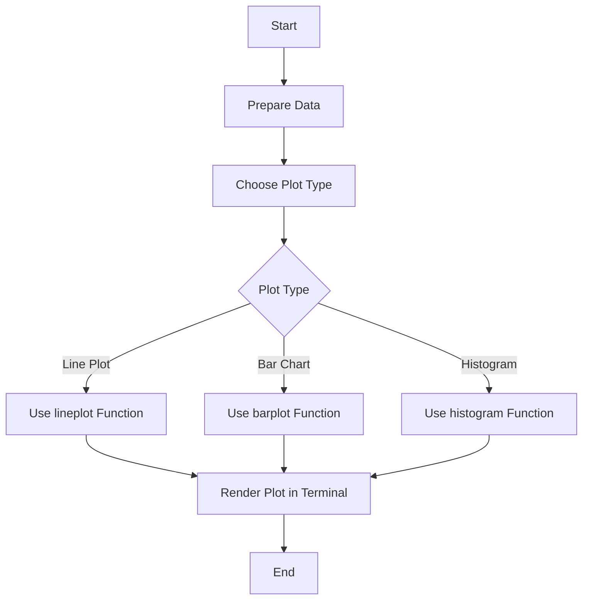

## 9.11 Using UnicodePlots.jl for Terminal Visualizations

In the world of data visualization, the ability to quickly and efficiently generate plots directly in the terminal can be a game-changer, especially when working on remote systems or environments where graphical user interfaces (GUIs) are not available. **UnicodePlots.jl** is a Julia package that allows you to create simple yet effective visualizations right in your terminal. This section will guide you through the process of using UnicodePlots.jl to create line plots, bar charts, and histograms, highlighting its advantages and practical use cases.

### Terminal-Based Plotting

**UnicodePlots.jl** is designed to provide quick visualizations without the need for heavy graphical libraries. This makes it an excellent choice for scenarios where you need to visualize data on the fly, such as during data analysis sessions in a terminal or when working on remote servers.

#### Quick Visualizations

The primary advantage of using UnicodePlots.jl is its ability to generate plots directly in the terminal. This means you can visualize your data without leaving the command line, making it a convenient tool for developers and data scientists who prefer working in a terminal environment.

### Supported Plot Types

UnicodePlots.jl supports a variety of plot types, including line plots, bar charts, and histograms. These plot types cover a wide range of data visualization needs, from displaying trends over time to comparing categorical data.

#### Line Plots

Line plots are ideal for visualizing trends over time or continuous data. Let's see how to create a simple line plot using UnicodePlots.jl.

```julia
using UnicodePlots

x = 1:10
y = [2, 3, 5, 7, 11, 13, 17, 19, 23, 29]

lineplot(x, y, title="Prime Numbers", xlabel="Index", ylabel="Value")
```

In this example, we plot the first ten prime numbers. The `lineplot` function is straightforward, requiring only the x and y data points, along with optional parameters for the title and axis labels.

#### Bar Charts

Bar charts are useful for comparing categorical data. Here's how you can create a bar chart with UnicodePlots.jl.

```julia
using UnicodePlots

categories = ["Apples", "Bananas", "Cherries"]
values = [10, 15, 7]

barplot(categories, values, title="Fruit Count", xlabel="Fruit", ylabel="Count")
```

This example demonstrates a simple bar chart comparing the count of different fruits. The `barplot` function takes the categories and their corresponding values as input.

#### Histograms

Histograms are perfect for displaying the distribution of numerical data. Let's create a histogram using UnicodePlots.jl.

```julia
using UnicodePlots

data = randn(1000)  # Generate 1000 random numbers from a normal distribution

histogram(data, title="Random Data Distribution", xlabel="Value", ylabel="Frequency")
```

In this example, we generate 1000 random numbers from a normal distribution and plot their distribution using a histogram. The `histogram` function automatically bins the data and displays the frequency of each bin.

### Advantages of UnicodePlots.jl

UnicodePlots.jl offers several advantages that make it a valuable tool for terminal-based visualizations.

#### Lightweight and Fast

One of the key benefits of UnicodePlots.jl is its lightweight nature. It has minimal dependencies, which means it can be installed and used quickly without the overhead of large graphical libraries. This makes it particularly useful for environments with limited resources or when you need to visualize data quickly.

#### Minimal Dependencies

UnicodePlots.jl does not rely on external graphical libraries, making it easy to install and use. This is especially beneficial when working on systems where installing additional software is not feasible.

#### Quick Rendering

The plots generated by UnicodePlots.jl render quickly in the terminal, allowing you to visualize data in real-time without delays. This is crucial when working with large datasets or when you need to iterate quickly during data analysis.

### Use Cases and Examples

UnicodePlots.jl is particularly useful in scenarios where traditional graphical plotting libraries are not available or practical. Here are some common use cases:

#### Remote Systems

When working on remote systems, especially those accessed via SSH, graphical interfaces may not be available. UnicodePlots.jl allows you to visualize data directly in the terminal, making it an ideal solution for remote data analysis.

#### Lightweight Environments

In environments where resources are limited, such as embedded systems or lightweight virtual machines, UnicodePlots.jl provides a way to visualize data without the need for resource-intensive graphical libraries.

#### Quick Data Exploration

During exploratory data analysis, you often need to visualize data quickly to gain insights. UnicodePlots.jl allows you to generate plots on the fly, facilitating rapid data exploration and hypothesis testing.

### Try It Yourself

To get started with UnicodePlots.jl, try modifying the examples provided above. Experiment with different datasets, plot types, and customization options to see how UnicodePlots.jl can fit into your workflow. Here are a few ideas to get you started:

- Change the data in the line plot example to visualize a different sequence of numbers.
- Modify the bar chart to include more categories and values.
- Experiment with different bin sizes in the histogram example to see how it affects the visualization.

### Visualizing with UnicodePlots.jl

To better understand how UnicodePlots.jl fits into the broader context of data visualization, let's visualize the process of creating a plot using a flowchart.



**Figure 1:** This flowchart illustrates the process of creating a plot with UnicodePlots.jl. You start by preparing your data, choose the appropriate plot type, use the corresponding function, and render the plot in the terminal.

### References and Links

For further reading and to explore more about UnicodePlots.jl, consider the following resources:

- [UnicodePlots.jl Documentation](https://github.com/Evizero/UnicodePlots.jl): The official documentation provides detailed information on all available plot types and customization options.
- [JuliaLang](https://julialang.org/): The official Julia website offers resources and tutorials for getting started with Julia programming.
- [Data Visualization in Julia](https://juliaplots.org/): A comprehensive guide to data visualization in Julia, covering various plotting packages.

### Knowledge Check

To reinforce your understanding of UnicodePlots.jl, consider the following questions:

1. What are the primary advantages of using UnicodePlots.jl for terminal-based visualizations?
2. How does UnicodePlots.jl handle different plot types, such as line plots and histograms?
3. In what scenarios is UnicodePlots.jl particularly useful?
4. How can you customize the appearance of plots generated by UnicodePlots.jl?

### Embrace the Journey

Remember, mastering data visualization is a journey. As you explore UnicodePlots.jl and other visualization tools, you'll gain valuable skills that will enhance your data analysis capabilities. Keep experimenting, stay curious, and enjoy the process of turning data into insights!

## Quiz Time!



### What is a primary advantage of using UnicodePlots.jl?

- [x] It allows for quick visualizations directly in the terminal.
- [ ] It requires a graphical user interface.
- [ ] It has high resource requirements.
- [ ] It is only suitable for large datasets.

> **Explanation:** UnicodePlots.jl is designed for quick visualizations directly in the terminal, making it lightweight and efficient.

### Which plot types are supported by UnicodePlots.jl?

- [x] Line plots
- [x] Bar charts
- [x] Histograms
- [ ] 3D plots

> **Explanation:** UnicodePlots.jl supports line plots, bar charts, and histograms, but not 3D plots.

### Why is UnicodePlots.jl particularly useful on remote systems?

- [x] It allows visualization without a GUI.
- [ ] It requires extensive graphical libraries.
- [ ] It is slow to render.
- [ ] It only works with local data.

> **Explanation:** UnicodePlots.jl can be used directly in the terminal, making it ideal for remote systems without GUI support.

### How does UnicodePlots.jl handle data visualization?

- [x] By rendering plots directly in the terminal.
- [ ] By exporting plots to image files.
- [ ] By requiring a web browser.
- [ ] By using external graphical libraries.

> **Explanation:** UnicodePlots.jl renders plots directly in the terminal, without the need for external graphical libraries.

### What is a key feature of UnicodePlots.jl?

- [x] Minimal dependencies
- [ ] High memory usage
- [ ] Complex installation
- [ ] Requires a GUI

> **Explanation:** UnicodePlots.jl has minimal dependencies, making it easy to install and use.

### In which environment is UnicodePlots.jl NOT ideal?

- [ ] Remote systems
- [ ] Lightweight environments
- [x] High-resolution graphical displays
- [ ] Terminal-based data exploration

> **Explanation:** UnicodePlots.jl is not ideal for high-resolution graphical displays, as it is designed for terminal-based visualizations.

### What function is used to create a line plot in UnicodePlots.jl?

- [x] lineplot
- [ ] plotline
- [ ] plot
- [ ] drawline

> **Explanation:** The `lineplot` function is used to create line plots in UnicodePlots.jl.

### What is the purpose of a histogram in data visualization?

- [x] To display the distribution of numerical data
- [ ] To compare categorical data
- [ ] To show trends over time
- [ ] To visualize relationships between variables

> **Explanation:** Histograms are used to display the distribution of numerical data.

### How can you customize a plot in UnicodePlots.jl?

- [x] By setting titles and axis labels
- [ ] By using external styling libraries
- [ ] By exporting to a graphical editor
- [ ] By modifying the source code

> **Explanation:** You can customize plots in UnicodePlots.jl by setting titles and axis labels.

### UnicodePlots.jl is best suited for which type of data visualization?

- [x] Terminal-based
- [ ] Web-based
- [ ] Desktop-based
- [ ] Mobile-based

> **Explanation:** UnicodePlots.jl is best suited for terminal-based data visualization.


