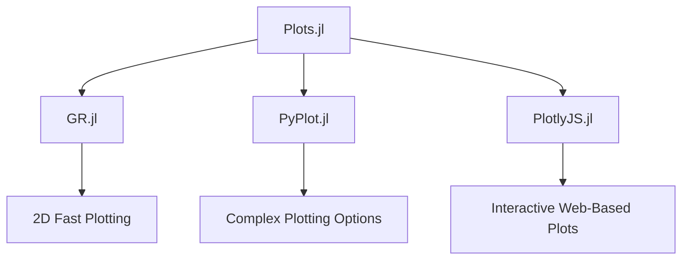

## 9.2 Plotting with Plots.jl and Various Backends

Data visualization is a crucial aspect of data analysis and interpretation, allowing us to see patterns, trends, and outliers in our data. In Julia, Plots.jl provides a powerful and flexible framework for creating a wide range of visualizations. This section will guide you through using Plots.jl, exploring its unified interface, various backends, and customization options to create compelling visualizations.

### Introduction to Plots.jl

Plots.jl is a high-level plotting package for Julia that provides a unified interface to multiple plotting backends. This means you can write your plotting code once and easily switch between different backends to take advantage of their unique features. Let's delve into the key components of Plots.jl.

#### Unified Interface

The unified interface of Plots.jl is one of its most compelling features. It allows you to write code that is backend-agnostic, meaning you can switch between different plotting libraries without changing your code. This flexibility is particularly useful when you need to leverage the strengths of different backends for specific tasks.

```julia
using Plots

gr()

x = 1:10
y = rand(10)
plot(x, y, title="Line Plot", xlabel="X-axis", ylabel="Y-axis")
```

In the example above, we use the `gr()` function to set the backend to GR. The same code can be used with other backends by simply changing the backend function, such as `pyplot()` for PyPlot or `plotlyjs()` for PlotlyJS.

### Common Backends

Plots.jl supports several backends, each with its own strengths and use cases. Here, we will explore some of the most commonly used backends.

#### GR.jl

GR.jl is the default backend for Plots.jl and is known for its speed and efficiency in rendering 2D plots. It is particularly suitable for creating simple plots quickly.

```julia
using Plots
gr()

scatter(rand(10), rand(10), title="Scatter Plot", xlabel="X-axis", ylabel="Y-axis", legend=false)
```

#### PyPlot.jl

PyPlot.jl provides an interface to Matplotlib, a popular plotting library in Python. It offers extensive plotting options and is ideal for creating complex plots.

```julia
using Plots
pyplot()

histogram(randn(1000), bins=30, title="Histogram", xlabel="Value", ylabel="Frequency")
```

#### PlotlyJS.jl

PlotlyJS.jl is used for creating interactive web-based plots. It is particularly useful for creating plots that need to be embedded in web applications or shared online.

```julia
using Plots
plotlyjs()

plot(rand(10), rand(10), title="Interactive Plot", xlabel="X-axis", ylabel="Y-axis")
```

### Creating Basic Plots

Plots.jl makes it easy to create a variety of basic plots, such as line plots, scatter plots, and histograms. Let's explore how to create these plots using simple functions.

#### Line Plots

Line plots are used to display data points connected by straight lines. They are useful for visualizing trends over time.

```julia
using Plots
gr()

x = 1:10
y = cumsum(randn(10))
plot(x, y, title="Line Plot", xlabel="Time", ylabel="Value", label="Random Walk")
```

#### Scatter Plots

Scatter plots display individual data points and are useful for identifying relationships between variables.

```julia
using Plots
gr()

x = rand(100)
y = rand(100)
scatter(x, y, title="Scatter Plot", xlabel="X-axis", ylabel="Y-axis", label="Data Points")
```

#### Histograms

Histograms are used to visualize the distribution of a dataset by dividing it into bins and counting the number of data points in each bin.

```julia
using Plots
gr()

data = randn(1000)
histogram(data, bins=30, title="Histogram", xlabel="Value", ylabel="Frequency", label="Data Distribution")
```

### Customization

Customization is a key aspect of creating effective visualizations. Plots.jl provides a wide range of options for customizing your plots, including labels, legends, titles, and styling.

#### Labels, Legends, and Titles

Adding labels, legends, and titles to your plots helps provide context and make them more informative.

```julia
using Plots
gr()

x = 1:10
y1 = rand(10)
y2 = rand(10)
plot(x, y1, label="Series 1", xlabel="X-axis", ylabel="Y-axis", title="Customized Plot")
plot!(x, y2, label="Series 2")
```

#### Styling

Styling options allow you to change the appearance of your plots, such as colors, markers, and line styles.

```julia
using Plots
gr()

x = 1:10
y = rand(10)
plot(x, y, title="Styled Plot", xlabel="X-axis", ylabel="Y-axis", color=:red, linewidth=2, linestyle=:dash, marker=:circle)
```

### Use Cases and Examples

Plots.jl is versatile and can be used for a wide range of applications, from simple data exploration to complex data analysis.

#### Data Exploration

Data exploration involves quickly visualizing data to identify trends and patterns. Plots.jl makes it easy to create plots that help you understand your data.

```julia
using Plots
gr()

x = 1:100
y = cumsum(randn(100))
plot(x, y, title="Data Exploration", xlabel="Index", ylabel="Cumulative Sum", label="Random Walk")
```

### Try It Yourself

Now that we've covered the basics, it's time to experiment with Plots.jl. Try modifying the examples above to create your own plots. Change the data, customize the appearance, and switch between different backends to see how they affect your plots.

### Visualizing Julia's Plotting Ecosystem

To better understand how Plots.jl interacts with various backends, let's visualize the ecosystem using a Mermaid.js diagram:



This diagram illustrates the relationship between Plots.jl and its supported backends, highlighting the unique features of each backend.

### References and Links

For further reading and exploration, consider the following resources:

- [Plots.jl Documentation](http://docs.juliaplots.org/latest/)
- [GR.jl Documentation](https://gr-framework.org/)
- [PyPlot.jl Documentation](https://github.com/JuliaPy/PyPlot.jl)
- [PlotlyJS.jl Documentation](https://github.com/JuliaPlots/PlotlyJS.jl)

### Knowledge Check

To reinforce your understanding, consider the following questions:

- What are the advantages of using a unified interface like Plots.jl?
- How can you switch between different backends in Plots.jl?
- What are some common use cases for each backend?

### Embrace the Journey

Remember, mastering data visualization is a journey. As you continue to explore Plots.jl and its various backends, you'll discover new ways to visualize and interpret your data. Keep experimenting, stay curious, and enjoy the process!

## Quiz Time!



### Which of the following is the default backend for Plots.jl?

- [x] GR.jl
- [ ] PyPlot.jl
- [ ] PlotlyJS.jl
- [ ] None of the above

> **Explanation:** GR.jl is the default backend for Plots.jl, known for its speed and efficiency in rendering 2D plots.

### What is the primary advantage of using Plots.jl's unified interface?

- [x] Ability to switch backends without changing code
- [ ] Faster plotting performance
- [ ] More customization options
- [ ] Better integration with Python

> **Explanation:** The unified interface allows you to write backend-agnostic code, enabling easy switching between different plotting libraries.

### Which backend is best suited for creating interactive web-based plots?

- [ ] GR.jl
- [ ] PyPlot.jl
- [x] PlotlyJS.jl
- [ ] None of the above

> **Explanation:** PlotlyJS.jl is used for creating interactive web-based plots, ideal for embedding in web applications.

### How can you add a title to a plot in Plots.jl?

- [x] Use the `title` argument in the `plot` function
- [ ] Use the `add_title` function
- [ ] Use the `set_title` method
- [ ] None of the above

> **Explanation:** The `title` argument in the `plot` function is used to add a title to the plot.

### Which function is used to create a scatter plot in Plots.jl?

- [ ] plot()
- [x] scatter()
- [ ] histogram()
- [ ] None of the above

> **Explanation:** The `scatter` function is used to create scatter plots in Plots.jl.

### What is the purpose of the `xlabel` and `ylabel` arguments in Plots.jl?

- [x] To label the x-axis and y-axis of the plot
- [ ] To set the plot's title
- [ ] To change the plot's color
- [ ] None of the above

> **Explanation:** The `xlabel` and `ylabel` arguments are used to label the x-axis and y-axis, respectively.

### Which backend provides an interface to Matplotlib for extensive plotting options?

- [ ] GR.jl
- [x] PyPlot.jl
- [ ] PlotlyJS.jl
- [ ] None of the above

> **Explanation:** PyPlot.jl provides an interface to Matplotlib, offering extensive plotting options.

### How can you switch to the PyPlot backend in Plots.jl?

- [x] Use the `pyplot()` function
- [ ] Use the `set_backend("PyPlot")` function
- [ ] Use the `switch_backend("PyPlot")` function
- [ ] None of the above

> **Explanation:** The `pyplot()` function is used to switch to the PyPlot backend in Plots.jl.

### What is the primary use case for histograms in data visualization?

- [ ] Displaying trends over time
- [ ] Identifying relationships between variables
- [x] Visualizing the distribution of a dataset
- [ ] None of the above

> **Explanation:** Histograms are used to visualize the distribution of a dataset by dividing it into bins.

### True or False: You can only use one backend at a time with Plots.jl.

- [x] True
- [ ] False

> **Explanation:** Plots.jl allows you to switch between backends, but only one backend can be active at a time.




