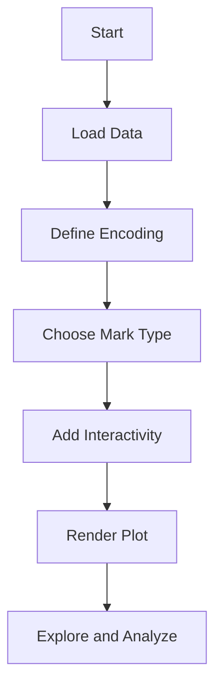

## 9.4 Interactive Graphics Using VegaLite.jl

In the realm of data visualization, the ability to create interactive and dynamic graphics is crucial for effective data analysis and presentation. VegaLite.jl, a Julia package, provides a powerful and flexible framework for creating such visualizations. In this section, we will delve into the core concepts of VegaLite.jl, explore its syntax, and demonstrate how to build interactive plots that can be used in exploratory data analysis.

### Declarative Visualization

#### Vega-Lite Grammar

Vega-Lite is a high-level grammar of interactive graphics. It allows users to describe visualizations in terms of data and encoding, rather than focusing on the low-level details of rendering. This declarative approach simplifies the process of creating complex visualizations.

- **Data**: The data to be visualized, which can be in various formats such as CSV, JSON, or directly from Julia data structures.
- **Encoding**: The mapping of data fields to visual properties like position, color, size, and shape.
- **Mark**: The geometric shape used to represent data points, such as bars, lines, or points.

By combining these elements, VegaLite.jl enables the creation of expressive and interactive visualizations with minimal code.

### Creating Plots

#### Simplified Syntax

VegaLite.jl's syntax is designed to be intuitive and concise. Let's start by creating a simple scatter plot to illustrate how data can be mapped to visual properties.

```julia
using VegaLite, DataFrames

data = DataFrame(x = rand(10), y = rand(10))

data |> @vlplot(
    :point,
    x = :x,
    y = :y
)
```

In this example, we use the `@vlplot` macro to define a scatter plot. The `:point` mark indicates that each data point should be represented as a point on the plot. The `x` and `y` arguments map the data fields to the respective axes.

#### Enhancing with Interactivity

Interactivity is a key feature of VegaLite.jl, allowing users to engage with the data in meaningful ways. Let's add tooltips and selection to our scatter plot to enhance its interactivity.

```julia
data |> @vlplot(
    :point,
    x = :x,
    y = :y,
    tooltip = [:x, :y],
    selection = {brush = {type = "interval"}}
)
```

- **Tooltips**: By specifying `tooltip = [:x, :y]`, we enable tooltips that display the `x` and `y` values when hovering over a point.
- **Selection**: The `selection` parameter allows users to select a range of data points by dragging a brush over the plot.

### Interactivity

#### Tooltips and Selection

Tooltips and selection are just the beginning of what VegaLite.jl can offer in terms of interactivity. You can also incorporate zooming, panning, and filtering to create a more dynamic user experience.

- **Zooming and Panning**: Enable users to zoom in and out or pan across the plot to explore data in greater detail.
- **Filtering**: Allow users to filter data points based on specific criteria, making it easier to focus on relevant information.

### Use Cases and Examples

#### Exploratory Data Analysis

Interactive graphics are particularly useful in exploratory data analysis (EDA), where the goal is to uncover patterns, trends, and insights from data. VegaLite.jl can be used to create interactive dashboards and reports that facilitate this process.

Consider a scenario where you have a dataset containing information about various car models, including their horsepower, weight, and fuel efficiency. You can use VegaLite.jl to create an interactive dashboard that allows users to explore relationships between these variables.

```julia
using VegaLite, DataFrames

cars = DataFrame(
    horsepower = rand(100) * 300,
    weight = rand(100) * 5000,
    mpg = rand(100) * 50
)

cars |> @vlplot(
    :point,
    x = :horsepower,
    y = :mpg,
    color = :weight,
    tooltip = [:horsepower, :weight, :mpg],
    selection = {brush = {type = "interval"}}
)
```

In this example, we map `horsepower` to the x-axis, `mpg` to the y-axis, and use `weight` to determine the color of each point. This visualization allows users to explore how horsepower and weight affect fuel efficiency.

### Try It Yourself

To gain a deeper understanding of VegaLite.jl, try modifying the code examples provided. Experiment with different types of marks, such as `:bar` or `:line`, and explore additional encoding options like `size` or `shape`. You can also try loading your own datasets and creating custom visualizations.

### Visualizing the VegaLite.jl Workflow

To better understand how VegaLite.jl processes data and creates visualizations, let's look at a flowchart that represents the typical workflow.



**Figure 1**: This flowchart illustrates the steps involved in creating a visualization with VegaLite.jl, from loading data to rendering the final plot.

### References and Links

For further reading and to explore more advanced features of VegaLite.jl, consider the following resources:

- [Vega-Lite Documentation](https://vega.github.io/vega-lite/docs/)
- [JuliaLang VegaLite.jl GitHub Repository](https://github.com/queryverse/VegaLite.jl)
- [Data Visualization with Julia](https://juliadatascience.io/)

### Knowledge Check

Before moving on, let's review some key concepts:

- **What is the primary advantage of using a declarative visualization approach?**
- **How can you add interactivity to a VegaLite.jl plot?**
- **What are some common use cases for interactive graphics in data analysis?**

### Embrace the Journey

Remember, this is just the beginning. As you progress, you'll build more complex and interactive visualizations. Keep experimenting, stay curious, and enjoy the journey!

## Quiz Time!



### What is the primary advantage of using a declarative visualization approach?

- [x] Simplifies the creation of complex visualizations
- [ ] Requires more code to achieve the same result
- [ ] Limits customization options
- [ ] Only supports static plots

> **Explanation:** A declarative approach allows users to focus on what they want to visualize rather than how to render it, simplifying the creation of complex visualizations.

### How can you add tooltips to a VegaLite.jl plot?

- [x] By specifying the `tooltip` parameter in the plot definition
- [ ] By using a separate function to enable tooltips
- [ ] Tooltips are not supported in VegaLite.jl
- [ ] By modifying the data source directly

> **Explanation:** Tooltips can be added by specifying the `tooltip` parameter in the plot definition, allowing users to see data values on hover.

### Which parameter is used to enable selection in a VegaLite.jl plot?

- [x] `selection`
- [ ] `highlight`
- [ ] `focus`
- [ ] `filter`

> **Explanation:** The `selection` parameter is used to enable interactive selection of data points in a plot.

### What type of mark would you use to create a line chart in VegaLite.jl?

- [x] `:line`
- [ ] `:bar`
- [ ] `:point`
- [ ] `:area`

> **Explanation:** The `:line` mark is used to create line charts, connecting data points with lines.

### What is a common use case for interactive graphics in data analysis?

- [x] Exploratory Data Analysis (EDA)
- [ ] Static reporting
- [ ] Data entry
- [ ] Text processing

> **Explanation:** Interactive graphics are commonly used in Exploratory Data Analysis (EDA) to uncover patterns and insights.

### How can you map data fields to visual properties in VegaLite.jl?

- [x] By using the `encoding` parameter
- [ ] By writing custom rendering code
- [ ] By using a separate library
- [ ] By modifying the data source

> **Explanation:** Data fields are mapped to visual properties using the `encoding` parameter in VegaLite.jl.

### What is the role of the `mark` in a VegaLite.jl plot?

- [x] It defines the geometric shape used to represent data points
- [ ] It specifies the data source
- [ ] It controls the plot's color scheme
- [ ] It sets the plot's dimensions

> **Explanation:** The `mark` defines the geometric shape used to represent data points, such as bars, lines, or points.

### Which of the following is NOT a feature of VegaLite.jl?

- [ ] Declarative visualization
- [ ] Interactive graphics
- [ ] Data manipulation
- [x] Machine learning

> **Explanation:** VegaLite.jl is focused on visualization and does not provide machine learning capabilities.

### What is the purpose of the `@vlplot` macro in VegaLite.jl?

- [x] To define and render plots
- [ ] To load data from external sources
- [ ] To perform statistical analysis
- [ ] To create animations

> **Explanation:** The `@vlplot` macro is used to define and render plots in VegaLite.jl.

### True or False: VegaLite.jl can only be used with CSV data.

- [ ] True
- [x] False

> **Explanation:** False. VegaLite.jl can work with various data formats, including CSV, JSON, and Julia data structures.




