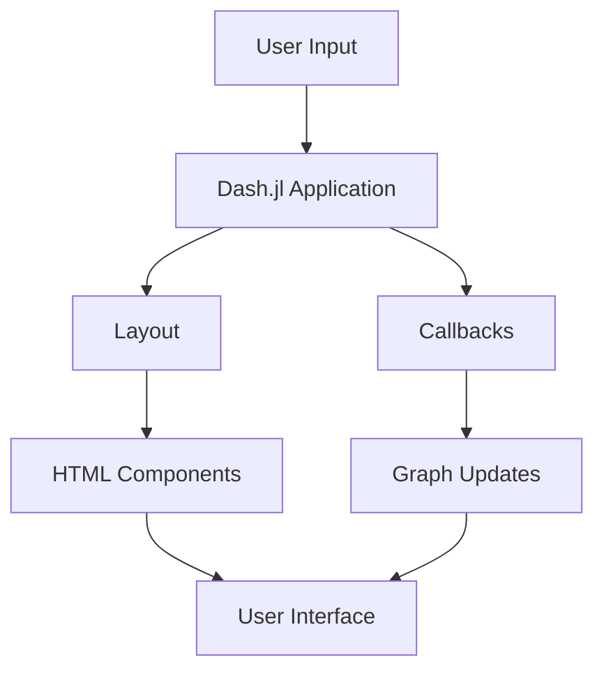

## 9.5 Creating Dashboards with Dash.jl

Creating interactive dashboards is a powerful way to visualize data and provide insights in a user-friendly manner. Dash.jl, a Julia interface to the Dash framework, allows developers to build analytical web applications without writing JavaScript. This section will guide you through the process of creating dashboards using Dash.jl, covering everything from basic components to deployment strategies.

### Introduction to Dash.jl

Dash.jl is a Julia package that leverages the Dash framework, originally developed for Python, to create web-based dashboards. It combines the power of Julia's data processing capabilities with the interactivity of web applications. With Dash.jl, you can create complex, interactive dashboards that are easy to deploy and share.

#### Key Features of Dash.jl

- **No JavaScript Required**: Build interactive web applications using only Julia.
- **Rich Component Library**: Access a wide range of pre-built components for graphs, controls, and layouts.
- **Reactive Updates**: Automatically update dashboard components in response to user interactions.
- **Easy Deployment**: Deploy dashboards locally or on servers with minimal configuration.

### Setting Up Dash.jl

Before we dive into building dashboards, let's set up Dash.jl in your Julia environment.

1. **Install Dash.jl**: Use Julia's package manager to install Dash.jl.

   ```julia
   using Pkg
   Pkg.add("Dash")
   ```

2. **Import Dash.jl**: Once installed, import Dash.jl and other necessary packages.

   ```julia
   using Dash
   using DashCoreComponents
   using DashHtmlComponents
   ```

3. **Verify Installation**: Run a simple Dash application to verify that everything is set up correctly.

   ```julia
   app = dash()

   app.layout = html_div() do
       html_h1("Hello, Dash.jl!")
   end

   run_server(app, "127.0.0.1", 8050)
   ```

   Open your web browser and navigate to `http://127.0.0.1:8050` to see your first Dash.jl application in action.

### Building Your First Dashboard

Let's build a simple dashboard to understand the basic structure and components of a Dash.jl application.

#### Dashboard Structure

A Dash.jl application consists of two main parts:

- **Layout**: Defines the visual structure of the dashboard using HTML components.
- **Callbacks**: Define the interactivity by linking user inputs to outputs.

#### Creating the Layout

The layout of a Dash.jl application is defined using HTML components. These components are provided by the `DashHtmlComponents` package.

```julia
app.layout = html_div() do
    html_h1("Sample Dashboard"),
    dcc_graph(
        id="example-graph",
        figure=Dict(
            :data => [Dict(:x => [1, 2, 3], :y => [4, 1, 2], :type => "bar", :name => "SF")],
            :layout => Dict(:title => "Sample Bar Chart")
        )
    )
end
```

In this example, we create a simple bar chart using the `dcc_graph` component.

#### Adding Interactivity with Callbacks

Callbacks in Dash.jl allow you to create interactive applications by linking inputs and outputs.

```julia
callback!(app, Output("example-graph", "figure"), Input("dropdown", "value")) do selected_value
    # Update the graph based on the selected value
    return Dict(
        :data => [Dict(:x => [1, 2, 3], :y => [4, 1, 2], :type => "bar", :name => selected_value)],
        :layout => Dict(:title => "Updated Bar Chart")
    )
end
```

In this example, the graph updates based on the value selected from a dropdown menu.

### Components of Dash.jl

Dash.jl provides a rich set of components that you can use to build complex dashboards. Let's explore some of the most commonly used components.

#### Graphs

Graphs are a central part of any dashboard. Dash.jl uses Plotly.js to render interactive graphs.

```julia
dcc_graph(
    id="line-graph",
    figure=Dict(
        :data => [Dict(:x => [1, 2, 3], :y => [2, 6, 3], :type => "line", :name => "Line Plot")],
        :layout => Dict(:title => "Line Graph Example")
    )
)
```

#### Controls

Controls such as sliders, dropdowns, and buttons allow users to interact with the dashboard.

```julia
dcc_slider(
    id="slider",
    min=0,
    max=10,
    value=5,
    marks=Dict(i => string(i) for i in 0:10)
)
```

#### Layouts

Layouts help organize components on the dashboard. Use `html_div`, `html_h1`, `html_p`, and other HTML components to structure your dashboard.

```julia
html_div() do
    html_h1("Dashboard Title"),
    html_p("This is a sample paragraph."),
    dcc_graph(id="example-graph")
end
```

### Deploying Dashboards

Once your dashboard is ready, you can deploy it locally or on a server for wider access.

#### Local Deployment

To run your dashboard locally, use the `run_server` function.

```julia
run_server(app, "127.0.0.1", 8050)
```

#### Server Deployment

For server deployment, consider using platforms like Heroku, AWS, or DigitalOcean. Ensure your server environment has Julia and Dash.jl installed.

### Use Cases and Examples

Dash.jl is versatile and can be used in various scenarios. Here are some common use cases:

#### Data Monitoring

Create dashboards to monitor real-time data, such as stock prices, weather updates, or IoT sensor data.

#### Business Analytics

Build dashboards for business analytics, allowing stakeholders to explore sales data, customer trends, and financial metrics.

#### Scientific Research

Visualize complex scientific data, such as genomic sequences or climate models, in an interactive manner.

### Try It Yourself

Experiment with the following modifications to enhance your understanding of Dash.jl:

- **Add a Dropdown**: Create a dropdown menu to filter data displayed in a graph.
- **Include a Slider**: Use a slider to dynamically adjust parameters in a plot.
- **Deploy on a Server**: Try deploying your dashboard on a cloud platform.

### Visualizing Dash.jl Architecture

Below is a diagram illustrating the architecture of a Dash.jl application, highlighting the flow of data and interactions between components.



**Diagram Description**: This flowchart represents the architecture of a Dash.jl application. User inputs are processed by the Dash.jl application, which consists of a layout and callbacks. The layout defines the HTML components, while callbacks handle graph updates. The user interface is dynamically updated based on these interactions.

### References and Further Reading

- [Dash.jl Documentation](https://dash-julia.plotly.com/)
- [Plotly.js Documentation](https://plotly.com/javascript/)
- [JuliaLang](https://julialang.org/)

### Knowledge Check

- What are the two main parts of a Dash.jl application?
- How do you install Dash.jl in a Julia environment?
- Describe the role of callbacks in a Dash.jl application.
- What are some common use cases for Dash.jl dashboards?

### Embrace the Journey

Creating dashboards with Dash.jl is an exciting journey that combines data visualization with web development. Remember, this is just the beginning. As you progress, you'll build more complex and interactive dashboards. Keep experimenting, stay curious, and enjoy the journey!

## Quiz Time!



### What is Dash.jl primarily used for?

- [x] Creating interactive web-based dashboards
- [ ] Building desktop applications
- [ ] Developing mobile apps
- [ ] Writing backend services

> **Explanation:** Dash.jl is used for creating interactive web-based dashboards using Julia.

### Which package provides HTML components for Dash.jl?

- [x] DashHtmlComponents
- [ ] DashCoreComponents
- [ ] Plotly.jl
- [ ] WebIO.jl

> **Explanation:** DashHtmlComponents provides HTML components for building layouts in Dash.jl applications.

### How do you run a Dash.jl application locally?

- [x] Use the `run_server` function
- [ ] Use the `start_app` function
- [ ] Use the `launch_dashboard` function
- [ ] Use the `deploy_app` function

> **Explanation:** The `run_server` function is used to run a Dash.jl application locally.

### What is the purpose of callbacks in Dash.jl?

- [x] To link user inputs to outputs and create interactivity
- [ ] To define the layout of the dashboard
- [ ] To deploy the application to a server
- [ ] To manage user authentication

> **Explanation:** Callbacks in Dash.jl link user inputs to outputs, enabling interactivity in the application.

### Which component is used to create interactive graphs in Dash.jl?

- [x] dcc_graph
- [ ] html_div
- [ ] dcc_slider
- [ ] html_h1

> **Explanation:** The `dcc_graph` component is used to create interactive graphs in Dash.jl.

### What is a common use case for Dash.jl dashboards?

- [x] Data Monitoring
- [ ] Video Editing
- [ ] Text Processing
- [ ] Image Rendering

> **Explanation:** Dash.jl dashboards are commonly used for data monitoring and visualization.

### Which function is used to add interactivity to a Dash.jl application?

- [x] callback!
- [ ] interact!
- [ ] update!
- [ ] modify!

> **Explanation:** The `callback!` function is used to add interactivity to a Dash.jl application.

### What is the primary advantage of using Dash.jl?

- [x] Building web applications without writing JavaScript
- [ ] Creating desktop applications
- [ ] Developing mobile apps
- [ ] Writing backend services

> **Explanation:** Dash.jl allows developers to build web applications without writing JavaScript, leveraging Julia instead.

### How can you deploy a Dash.jl application on a server?

- [x] Use cloud platforms like Heroku or AWS
- [ ] Use the `deploy_server` function
- [ ] Use the `publish_app` function
- [ ] Use the `server_deploy` function

> **Explanation:** Dash.jl applications can be deployed on servers using cloud platforms like Heroku or AWS.

### Dash.jl is based on which original framework?

- [x] Dash for Python
- [ ] Flask
- [ ] Django
- [ ] React

> **Explanation:** Dash.jl is based on the Dash framework originally developed for Python.


