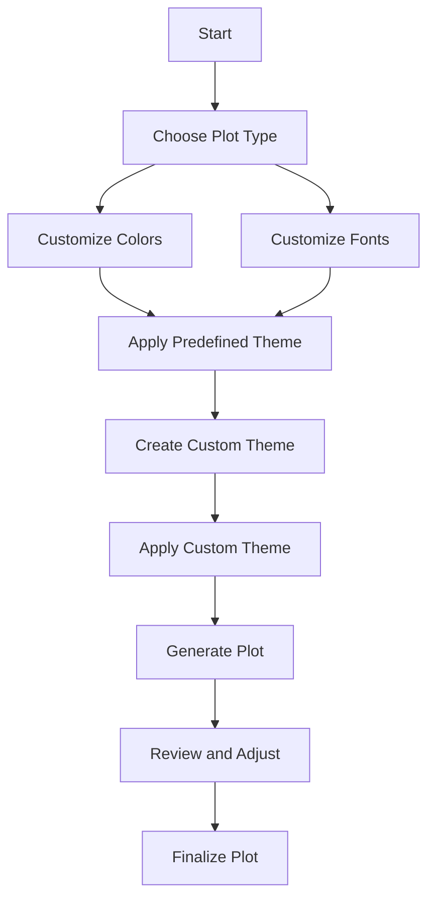

## 9.6 Customizing Plots and Themes

Creating visually appealing and consistent plots is crucial for effective data visualization. In Julia, the `Plots.jl` package provides a powerful and flexible framework for customizing plot aesthetics, including colors, fonts, and themes. This section will guide you through the process of customizing plots and themes in Julia, ensuring your visualizations are both informative and aesthetically pleasing.

### Plot Aesthetics

Plot aesthetics play a significant role in how data is perceived and interpreted. By customizing colors, fonts, and other visual elements, you can enhance the readability and impact of your plots.

#### Colors and Fonts

**Colors**: Colors are a fundamental aspect of plot aesthetics. They can be used to highlight important data points, differentiate between categories, and convey additional information. In `Plots.jl`, you can customize colors using a variety of methods:

- **Color Palettes**: Use predefined color palettes or create your own to ensure consistency across plots.
- **Hex Codes**: Specify colors using hex codes for precise control.
- **Named Colors**: Use named colors for convenience.

**Fonts**: Fonts contribute to the overall readability and style of your plots. You can customize font size, style, and family to match your preferences or branding.

Here's an example of how to customize colors and fonts in a plot using `Plots.jl`:

```julia
using Plots

x = 1:10
y = rand(10)

plot(x, y, 
     title = "Customized Plot",
     xlabel = "X-axis",
     ylabel = "Y-axis",
     color = :blue, # Use a named color
     linewidth = 2,
     legend = false,
     titlefont = font(14, "Arial"), # Customize title font
     guidefont = font(12, "Times New Roman")) # Customize axis label font
```

In this example, we use the `color` attribute to set the line color to blue and customize the fonts for the title and axis labels.

### Themes

Themes allow you to apply consistent styles across multiple plots, ensuring a cohesive look and feel. `Plots.jl` offers both predefined and custom themes.

#### Predefined Themes

Predefined themes provide a quick and easy way to apply a consistent style to your plots. `Plots.jl` includes several built-in themes, such as `:default`, `:gruvbox`, and `:dark`. You can apply a predefined theme using the `theme` function:

```julia
using Plots

theme(:gruvbox)

plot(x, y, title = "Plot with Gruvbox Theme")
```

#### Custom Themes

Creating custom themes allows you to define personalized styles that can be reused across different plots. A custom theme is essentially a collection of plot attributes that you can save and apply as needed.

Here's how to create and apply a custom theme:

```julia
using Plots

my_theme = Theme(
    background_color = :lightgray,
    foreground_color = :black,
    grid = false,
    titlefont = font(16, "Verdana"),
    guidefont = font(12, "Courier New"),
    legendfont = font(10, "Helvetica")
)

theme(my_theme)

plot(x, y, title = "Plot with Custom Theme")
```

In this example, we define a custom theme with specific colors and fonts, and then apply it to a plot.

### Best Practices

When customizing plots and themes, it's important to follow best practices to ensure clarity and accessibility.

#### Clarity and Accessibility

- **Contrast**: Ensure sufficient contrast between text and background colors for readability.
- **Font Size**: Use appropriate font sizes for titles, labels, and legends to ensure they are legible.
- **Color Blindness**: Consider color blindness by using color palettes that are distinguishable for all viewers.
- **Consistency**: Maintain consistency in colors, fonts, and styles across plots to create a cohesive visual experience.

### Try It Yourself

Experiment with the code examples provided by modifying colors, fonts, and themes. Try creating your own custom theme and apply it to different plots. Consider how changes in aesthetics affect the readability and impact of your visualizations.

### Visualizing Plot Customization

To better understand the customization process, let's visualize the workflow of applying themes and customizing plot aesthetics using a Mermaid.js flowchart:



**Figure 1**: Workflow for customizing plots and themes in Julia.

### References and Links

For further reading on data visualization and plotting in Julia, consider the following resources:

- [Plots.jl Documentation](https://docs.juliaplots.org/latest/)
- [Color Schemes in Julia](https://juliagraphics.github.io/Colors.jl/stable/colorschemes/)
- [Data Visualization Best Practices](https://www.data-to-viz.com/)

### Knowledge Check

To reinforce your understanding of customizing plots and themes in Julia, consider the following questions:

- What are the benefits of using custom themes in data visualization?
- How can you ensure your plots are accessible to viewers with color blindness?
- Why is consistency important in plot aesthetics?

### Embrace the Journey

Remember, customizing plots and themes is just the beginning of creating impactful data visualizations. As you continue to explore Julia's plotting capabilities, you'll discover new ways to convey information effectively. Keep experimenting, stay curious, and enjoy the journey!

## Quiz Time!



### What is the primary purpose of customizing plot aesthetics?

- [x] To enhance readability and impact
- [ ] To increase data complexity
- [ ] To reduce plot size
- [ ] To obscure data points

> **Explanation:** Customizing plot aesthetics enhances readability and impact, making data easier to interpret.

### Which attribute is used to set the line color in a plot?

- [x] `color`
- [ ] `font`
- [ ] `theme`
- [ ] `background`

> **Explanation:** The `color` attribute is used to set the line color in a plot.

### How can you apply a predefined theme in `Plots.jl`?

- [x] Using the `theme` function
- [ ] Using the `color` attribute
- [ ] Using the `font` attribute
- [ ] Using the `plot` function

> **Explanation:** The `theme` function is used to apply predefined themes in `Plots.jl`.

### What is a key consideration for accessibility in plot design?

- [x] Sufficient contrast between text and background colors
- [ ] Using complex color schemes
- [ ] Minimizing font size
- [ ] Reducing plot dimensions

> **Explanation:** Sufficient contrast between text and background colors is crucial for accessibility.

### Which of the following is a benefit of using custom themes?

- [x] Consistency across plots
- [ ] Increased plot complexity
- [ ] Reduced customization options
- [ ] Obscured data points

> **Explanation:** Custom themes provide consistency across plots, enhancing the visual experience.

### What is the role of fonts in plot aesthetics?

- [x] To contribute to readability and style
- [ ] To increase data complexity
- [ ] To obscure data points
- [ ] To reduce plot size

> **Explanation:** Fonts contribute to readability and style, enhancing the overall presentation of plots.

### How can you ensure your plots are accessible to viewers with color blindness?

- [x] Use color palettes distinguishable for all viewers
- [ ] Use complex color schemes
- [ ] Minimize font size
- [ ] Reduce plot dimensions

> **Explanation:** Using color palettes distinguishable for all viewers ensures accessibility for those with color blindness.

### What is a common method for specifying colors in `Plots.jl`?

- [x] Hex codes
- [ ] Font attributes
- [ ] Plot dimensions
- [ ] Data complexity

> **Explanation:** Hex codes are a common method for specifying colors in `Plots.jl`.

### True or False: Consistency in plot aesthetics is important for creating a cohesive visual experience.

- [x] True
- [ ] False

> **Explanation:** Consistency in plot aesthetics is important for creating a cohesive visual experience.

### Which function is used to define a custom theme in `Plots.jl`?

- [x] `Theme`
- [ ] `Plot`
- [ ] `Color`
- [ ] `Font`

> **Explanation:** The `Theme` function is used to define a custom theme in `Plots.jl`.


