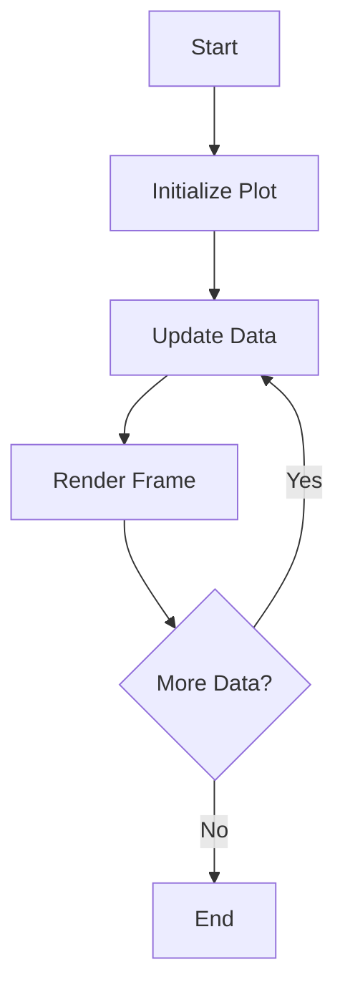

## 9.7 Animations and Real-Time Data Visualization

In the world of data visualization, animations and real-time data updates play a crucial role in understanding dynamic systems and processes. Julia, with its robust ecosystem, offers powerful tools for creating animations and handling real-time data visualization. In this section, we will explore how to leverage Julia's capabilities to animate data changes, manage live data streams, and utilize libraries like Makie.jl and Plots.jl for interactive and animated plots.

### Creating Animations

Animations are a powerful way to visualize changes in data over time. They can help in understanding complex systems, observing trends, and presenting data in an engaging manner. In Julia, creating animations involves updating plots over a sequence of frames to depict changes.

#### Animating Data Changes

To animate data changes, we need to create a sequence of frames where each frame represents a snapshot of the data at a particular time. This can be achieved using libraries like Makie.jl and Plots.jl, which provide built-in support for animations.

**Example: Animating a Sine Wave**

Let's start by animating a simple sine wave using Plots.jl. This example will demonstrate how to create an animation by updating the plot in a loop.

```julia
using Plots

function animate_sine_wave()
    anim = @animate for phase in 0:0.1:2π
        plot(sin.(0:0.1:2π .+ phase), ylim=(-1, 1), title="Sine Wave Animation")
    end
    gif(anim, "sine_wave.gif", fps=15)
end

animate_sine_wave()
```

In this example, we use the `@animate` macro to create an animation. The `for` loop iterates over different phases of the sine wave, updating the plot for each frame. Finally, we save the animation as a GIF using the `gif` function.

### Real-Time Updates

Real-time data visualization involves updating plots with incoming data streams. This is particularly useful in scenarios where data is continuously generated, such as monitoring systems, financial markets, or sensor networks.

#### Live Data Streams

Handling live data streams requires efficient updating of plots without significant delays. Julia's performance and the capabilities of libraries like Makie.jl make it well-suited for real-time visualization.

**Example: Real-Time Plotting with Makie.jl**

Makie.jl is a powerful visualization library in Julia that supports real-time updates. Let's create a real-time plot that updates with random data points.

```julia
using Makie

function real_time_plot()
    scene = scatter(rand(10), rand(10), markersize=10)
    for _ in 1:100
        sleep(0.1)  # Simulate data arrival delay
        push!(scene.plots[1].x, rand())
        push!(scene.plots[1].y, rand())
        notify!(scene)
    end
end

real_time_plot()
```

In this example, we create a scatter plot using Makie.jl and update it with new random data points in a loop. The `notify!` function is used to refresh the plot with the new data.

### Tools and Libraries

Julia offers several libraries for creating animations and handling real-time data visualization. Two of the most popular libraries are Makie.jl and Plots.jl.

#### Makie.jl

Makie.jl is a high-performance, extensible visualization library for Julia. It supports a wide range of plot types, including 2D and 3D plots, and provides excellent support for animations and real-time updates.

**Key Features of Makie.jl:**

- **High Performance:** Makie.jl is designed for speed, making it suitable for real-time applications.
- **Interactivity:** Supports interactive plots with zooming, panning, and rotating.
- **3D Visualization:** Offers robust 3D plotting capabilities.
- **Customization:** Highly customizable with a flexible API.

#### Plots.jl

Plots.jl is another versatile plotting library in Julia that supports multiple backends, including GR, PyPlot, and Plotly. It provides a simple interface for creating static and animated plots.

**Key Features of Plots.jl:**

- **Multiple Backends:** Choose from various backends for different visualization needs.
- **Ease of Use:** Simple syntax for creating a wide range of plots.
- **Animation Support:** Built-in support for creating animations with the `@animate` macro.

### Use Cases and Examples

Animations and real-time data visualization have numerous applications across different domains. Let's explore some practical use cases.

#### Simulation Visualization

In scientific computing and engineering, simulations are often used to model complex systems. Animations can help visualize the behavior of these models as they evolve over time.

**Example: Visualizing a Particle Simulation**

Consider a simulation of particles moving in a 2D space. We can use Makie.jl to animate the movement of particles.

```julia
using Makie

function particle_simulation()
    n_particles = 100
    positions = rand(Point2f0, n_particles)
    velocities = rand(Point2f0, n_particles) .* 0.01

    scene = scatter(positions, markersize=5, color=:blue)
    for _ in 1:200
        sleep(0.05)
        positions .+= velocities
        notify!(scene)
    end
end

particle_simulation()
```

In this example, we simulate particles moving in a 2D space by updating their positions in each frame. The `notify!` function is used to refresh the plot with the updated positions.

### Try It Yourself

Experiment with the examples provided by modifying parameters such as the number of particles, the speed of the sine wave animation, or the delay between updates. This will help you gain a deeper understanding of how animations and real-time updates work in Julia.

### Visualizing Animations and Real-Time Data Flow

To better understand the flow of data and the process of creating animations, let's visualize the steps involved in animating a sine wave and handling real-time data streams.



**Diagram Description:** This flowchart illustrates the process of creating an animation or handling real-time data. It starts with initializing the plot, followed by updating the data and rendering each frame. The loop continues until there is no more data to process.

### References and Links

For further reading and exploration, consider the following resources:

- [Makie.jl Documentation](https://makie.juliaplots.org/stable/)
- [Plots.jl Documentation](https://docs.juliaplots.org/stable/)
- [JuliaLang Visualization](https://julialang.org/learning/visualization/)

### Knowledge Check

To reinforce your understanding of animations and real-time data visualization in Julia, consider the following questions and exercises:

1. What are the key differences between Makie.jl and Plots.jl in terms of animation support?
2. How can you optimize real-time data visualization for large datasets?
3. Create an animation of a bouncing ball using Makie.jl.
4. Implement a real-time plot that updates with live sensor data.

### Embrace the Journey

Remember, mastering animations and real-time data visualization in Julia is a journey. As you progress, you'll be able to create more complex and interactive visualizations. Keep experimenting, stay curious, and enjoy the process!

## Quiz Time!



### What is the primary purpose of animations in data visualization?

- [x] To visualize changes in data over time
- [ ] To create static images
- [ ] To replace real-time data streams
- [ ] To simplify data analysis

> **Explanation:** Animations are used to visualize changes in data over time, helping to understand dynamic systems and processes.

### Which Julia library is known for high-performance real-time visualization?

- [x] Makie.jl
- [ ] Plots.jl
- [ ] DataFrames.jl
- [ ] Flux.jl

> **Explanation:** Makie.jl is known for its high-performance capabilities, making it suitable for real-time visualization.

### How can you create an animation in Plots.jl?

- [x] Using the `@animate` macro
- [ ] Using the `@plot` macro
- [ ] Using the `@visualize` macro
- [ ] Using the `@render` macro

> **Explanation:** The `@animate` macro in Plots.jl is used to create animations by iterating over frames.

### What function is used in Makie.jl to refresh a plot with new data?

- [x] `notify!`
- [ ] `refresh!`
- [ ] `update!`
- [ ] `redraw!`

> **Explanation:** The `notify!` function in Makie.jl is used to refresh a plot with new data.

### Which of the following is a use case for real-time data visualization?

- [x] Monitoring financial markets
- [ ] Creating static reports
- [ ] Generating PDF documents
- [ ] Designing logos

> **Explanation:** Real-time data visualization is useful for monitoring systems like financial markets where data is continuously updated.

### What is the advantage of using Makie.jl for 3D visualization?

- [x] Robust 3D plotting capabilities
- [ ] Limited customization options
- [ ] Only supports 2D plots
- [ ] Requires external plugins

> **Explanation:** Makie.jl offers robust 3D plotting capabilities, making it suitable for complex visualizations.

### How can you handle live data streams in Julia?

- [x] By efficiently updating plots with incoming data
- [ ] By creating static images
- [ ] By using only CSV files
- [ ] By ignoring new data

> **Explanation:** Handling live data streams involves efficiently updating plots with incoming data to reflect real-time changes.

### What is the role of the `sleep` function in real-time plotting examples?

- [x] To simulate data arrival delay
- [ ] To stop the animation
- [ ] To increase plot resolution
- [ ] To reduce memory usage

> **Explanation:** The `sleep` function is used to simulate data arrival delay in real-time plotting examples.

### True or False: Plots.jl supports multiple backends for different visualization needs.

- [x] True
- [ ] False

> **Explanation:** Plots.jl supports multiple backends, allowing users to choose the best one for their visualization needs.

### What is a common application of animations in scientific computing?

- [x] Visualizing simulation behavior over time
- [ ] Creating static charts
- [ ] Designing user interfaces
- [ ] Writing documentation

> **Explanation:** Animations are commonly used in scientific computing to visualize the behavior of simulations over time.


