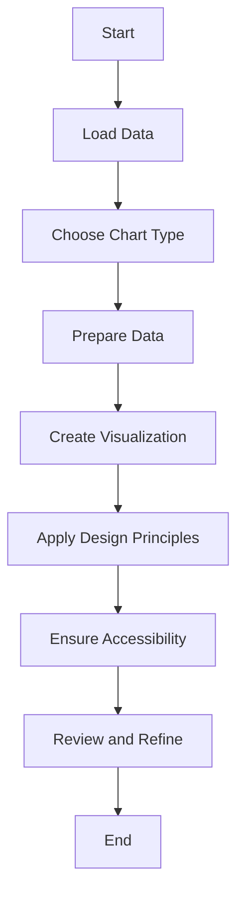

## 9.8 Best Practices in Data Visualization

Data visualization is a powerful tool for communicating complex information clearly and effectively. In Julia, a language renowned for its performance in data science and numerical computing, mastering data visualization is essential for developers aiming to convey insights effectively. This section will guide you through best practices in data visualization, focusing on effective communication, avoiding misrepresentation, adhering to design principles, and ensuring accessibility.

### Effective Communication

Effective communication through data visualization involves selecting the appropriate chart types and ensuring that the visual representation aligns with the data's message.

#### Choosing the Right Chart Type

Choosing the right chart type is crucial for accurately conveying your data's story. Different chart types serve different purposes, and selecting the wrong one can lead to confusion or misinterpretation.

- **Bar Charts**: Ideal for comparing quantities across different categories. Use them when you want to highlight differences in magnitude.
  
- **Line Charts**: Best for showing trends over time. They are effective in illustrating changes and patterns in data.

- **Scatter Plots**: Useful for showing relationships between two variables. They help in identifying correlations and outliers.

- **Pie Charts**: Suitable for showing proportions and percentages. However, they can be misleading if not used carefully, especially with too many slices.

- **Histograms**: Great for displaying the distribution of a dataset. They help in understanding the frequency of data points within certain ranges.

**Code Example: Creating a Bar Chart in Julia**

```julia
using Plots

categories = ["A", "B", "C", "D"]
values = [23, 45, 12, 67]

bar(categories, values, title="Category Comparison", xlabel="Categories", ylabel="Values", legend=false)
```

### Avoiding Misrepresentation

Misrepresentation in data visualization can lead to incorrect conclusions. It's essential to use appropriate scales and axes to ensure that the data is accurately represented.

#### Scaling and Axes

- **Consistent Scales**: Ensure that the scales on your axes are consistent and appropriate for the data. Avoid truncating axes, as this can exaggerate differences.

- **Logarithmic Scales**: Use logarithmic scales for data that spans several orders of magnitude. This can help in visualizing exponential growth or decay.

- **Axis Labels**: Clearly label your axes and include units of measurement where applicable. This helps in understanding the context of the data.

**Code Example: Using Logarithmic Scales**

```julia
using Plots

x = 1:10
y = [10^i for i in x]

plot(x, y, yscale=:log10, title="Exponential Growth", xlabel="X", ylabel="Y (log scale)", legend=false)
```

### Design Principles

Adhering to design principles can significantly enhance the clarity and effectiveness of your visualizations.

#### Simplicity

Simplicity is key in data visualization. Removing unnecessary elements helps focus the viewer's attention on the data itself.

- **Minimalism**: Avoid clutter by removing gridlines, excessive labels, and decorative elements that do not add value.

- **Focus on Data**: Highlight the data points and trends that are most important to the message you want to convey.

- **Consistent Style**: Use a consistent style throughout your visualizations to maintain a professional and cohesive look.

**Code Example: Simplifying a Plot**

```julia
using Plots

x = 1:10
y = rand(10)

plot(x, y, title="Simple Plot", xlabel="X", ylabel="Y", legend=false, grid=false)
```

### Accessibility

Ensuring accessibility in data visualization means making your visualizations understandable and usable by everyone, including those with disabilities.

#### Color Choices

Color is a powerful tool in data visualization, but it must be used thoughtfully to ensure accessibility.

- **Colorblind-Friendly Palettes**: Use color palettes that are distinguishable by individuals with color vision deficiencies. Tools like ColorBrewer can help in selecting appropriate palettes.

- **Contrast**: Ensure sufficient contrast between colors to make your visualizations readable in various lighting conditions.

- **Avoid Overreliance on Color**: Use shapes, patterns, or labels in addition to color to convey information.

**Code Example: Using a Colorblind-Friendly Palette**

```julia
using Plots

categories = ["A", "B", "C", "D"]
values = [23, 45, 12, 67]

bar(categories, values, title="Category Comparison", xlabel="Categories", ylabel="Values", legend=false, color=:colorblind)
```

### Visualizing Data Flow

To further enhance understanding, let's visualize the process of creating a data visualization in Julia using a flowchart. This flowchart will outline the steps from data preparation to final visualization.



**Description**: This flowchart represents the process of creating a data visualization in Julia. It begins with loading the data, choosing the appropriate chart type, preparing the data, creating the visualization, applying design principles, ensuring accessibility, and finally reviewing and refining the visualization.

### Try It Yourself

Now that we've covered the best practices in data visualization, it's time to put them into practice. Try modifying the code examples provided:

- Change the chart types and observe how the data representation changes.
- Experiment with different scales and axes to see their impact on the visualization.
- Simplify a complex plot by removing unnecessary elements.
- Apply a colorblind-friendly palette to an existing visualization.

### Knowledge Check

To reinforce your understanding, consider the following questions:

- What chart type would you use to show the relationship between two variables?
- Why is it important to use consistent scales in data visualization?
- How can you ensure that your visualizations are accessible to individuals with color vision deficiencies?

### Embrace the Journey

Remember, mastering data visualization is a journey. As you progress, you'll develop the skills to create more complex and impactful visualizations. Keep experimenting, stay curious, and enjoy the process!

## Quiz Time!



### What is the primary purpose of a bar chart?

- [x] Comparing quantities across different categories
- [ ] Showing trends over time
- [ ] Displaying relationships between two variables
- [ ] Illustrating proportions and percentages

> **Explanation:** Bar charts are ideal for comparing quantities across different categories, making them effective for highlighting differences in magnitude.

### Why is it important to use consistent scales in data visualization?

- [x] To prevent misleading interpretations
- [ ] To make the chart look more colorful
- [ ] To add more data points
- [ ] To increase the complexity of the visualization

> **Explanation:** Consistent scales ensure that the data is accurately represented, preventing misleading interpretations and exaggerations.

### Which chart type is best for showing trends over time?

- [ ] Bar Chart
- [x] Line Chart
- [ ] Pie Chart
- [ ] Histogram

> **Explanation:** Line charts are best for showing trends over time, as they effectively illustrate changes and patterns in data.

### What is a key design principle in data visualization?

- [x] Simplicity
- [ ] Complexity
- [ ] Overloading
- [ ] Decoration

> **Explanation:** Simplicity is a key design principle, as it helps focus the viewer's attention on the data itself by removing unnecessary elements.

### How can you make your visualizations accessible to individuals with color vision deficiencies?

- [x] Use colorblind-friendly palettes
- [ ] Use only red and green colors
- [ ] Avoid using any colors
- [ ] Use very light colors

> **Explanation:** Using colorblind-friendly palettes ensures that individuals with color vision deficiencies can distinguish between different elements in the visualization.

### What is the benefit of using logarithmic scales?

- [x] Visualizing data that spans several orders of magnitude
- [ ] Making the chart more colorful
- [ ] Adding more data points
- [ ] Increasing the complexity of the visualization

> **Explanation:** Logarithmic scales are beneficial for visualizing data that spans several orders of magnitude, such as exponential growth or decay.

### What should you avoid to maintain simplicity in your visualizations?

- [x] Clutter and excessive labels
- [ ] Consistent style
- [ ] Minimalism
- [ ] Highlighting important data points

> **Explanation:** To maintain simplicity, avoid clutter and excessive labels that do not add value to the visualization.

### Which tool can help in selecting colorblind-friendly palettes?

- [x] ColorBrewer
- [ ] Excel
- [ ] PowerPoint
- [ ] Photoshop

> **Explanation:** ColorBrewer is a tool that helps in selecting colorblind-friendly palettes for data visualization.

### What is the purpose of axis labels in a chart?

- [x] To provide context and understanding of the data
- [ ] To make the chart more colorful
- [ ] To add more data points
- [ ] To increase the complexity of the visualization

> **Explanation:** Axis labels provide context and understanding of the data by clearly labeling the axes and including units of measurement where applicable.

### True or False: Pie charts are always the best choice for showing proportions.

- [ ] True
- [x] False

> **Explanation:** Pie charts can be misleading if not used carefully, especially with too many slices. They are suitable for showing proportions but are not always the best choice.




