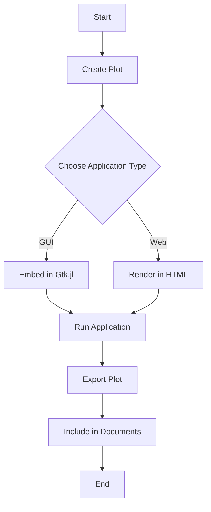

## 9.9 Integrating Visualizations into Applications

In the world of data-driven applications, visualizations play a crucial role in interpreting and presenting data effectively. Julia, with its rich ecosystem of visualization libraries, provides powerful tools to integrate visualizations into both GUI and web applications. This section will guide you through the process of embedding plots in desktop and web applications, as well as exporting them in various formats for broader use.

### Embedding Plots in GUI Applications

#### Using Gtk.jl for Desktop Applications

**Gtk.jl** is a Julia package that provides a comprehensive set of tools for building graphical user interfaces (GUIs). It allows you to embed plots directly into desktop applications, creating interactive and visually appealing user experiences.

**Steps to Embed Plots in a GUI Application:**

1. **Install Gtk.jl and Plots.jl**: Ensure you have the necessary packages installed.
   ```julia
   using Pkg
   Pkg.add("Gtk")
   Pkg.add("Plots")
   ```

2. **Create a Basic GUI Window**: Use Gtk.jl to create a window that will host your plot.
   ```julia
   using Gtk

   win = GtkWindow("Plot Example", 400, 300)
   ```

3. **Generate a Plot**: Use Plots.jl to create a plot that you want to display.
   ```julia
   using Plots

   plot_data = plot(rand(10), title="Random Data")
   ```

4. **Embed the Plot in the GUI**: Convert the plot to an image and display it in the Gtk window.
   ```julia
   using Gtk.ShortNames

   img = GtkImage(plot_data)
   push!(win, img)
   showall(win)
   ```

5. **Run the Application**: Execute your script to see the plot embedded in the GUI window.

**Try It Yourself**: Modify the plot by changing the data or adding more features like labels and legends to see how it affects the GUI display.

### Integrating Visualizations into Web Applications

#### HTML and JavaScript Integration

For web applications, integrating visualizations involves rendering plots within web pages. Julia provides several tools to facilitate this process, allowing you to create dynamic and interactive visualizations.

**Steps to Render Plots in Web Pages:**

1. **Use PlotlyJS.jl for Interactive Plots**: PlotlyJS.jl is a Julia wrapper for the Plotly.js library, which is known for its interactive plots.
   ```julia
   using Pkg
   Pkg.add("PlotlyJS")
   ```

2. **Create a Plotly Plot**: Generate a plot using PlotlyJS.jl.
   ```julia
   using PlotlyJS

   plot_data = plot(scatter(x=1:10, y=rand(10)))
   ```

3. **Render the Plot in HTML**: Use the `savefig` function to save the plot as an HTML file.
   ```julia
   savefig(plot_data, "plot.html")
   ```

4. **Embed in a Web Page**: Include the HTML file in your web application to display the plot.

**Try It Yourself**: Experiment with different plot types and styles in PlotlyJS.jl to see how they render in a web browser.

### Exporting Plots for Inclusion in Documents

#### Vector and Raster Formats

Exporting plots in various formats is essential for including them in documents, presentations, or reports. Julia's plotting libraries support multiple export formats, including PNG, SVG, and PDF.

**Steps to Export Plots:**

1. **Generate a Plot**: Use Plots.jl or any other Julia plotting library to create a plot.
   ```julia
   using Plots

   plot_data = plot(rand(10), title="Export Example")
   ```

2. **Export the Plot**: Use the `savefig` function to export the plot in the desired format.
   ```julia
   savefig(plot_data, "plot.png")  # Export as PNG
   savefig(plot_data, "plot.svg")  # Export as SVG
   savefig(plot_data, "plot.pdf")  # Export as PDF
   ```

3. **Include in Documents**: Use the exported files in your documents or presentations.

**Try It Yourself**: Export the same plot in different formats and compare the quality and file size.

### Visualizing the Integration Process

To better understand the process of integrating visualizations into applications, let's visualize the workflow using a flowchart.



**Diagram Description**: This flowchart illustrates the steps involved in integrating visualizations into applications, starting from plot creation to embedding in GUI or web applications, and finally exporting for document inclusion.

### Best Practices for Integrating Visualizations

1. **Choose the Right Tool**: Select the appropriate visualization library based on the application type and requirements.
2. **Optimize Performance**: Ensure that plots are optimized for performance, especially in web applications where loading times are critical.
3. **Maintain Interactivity**: Leverage interactive features in plots to enhance user engagement.
4. **Ensure Compatibility**: Test visualizations across different platforms and devices to ensure compatibility.
5. **Document the Process**: Keep detailed documentation of the visualization integration process for future reference and maintenance.

### Knowledge Check

- **What are the key steps to embed plots in a GUI application using Gtk.jl?**
- **How can you render interactive plots in a web application using PlotlyJS.jl?**
- **What are the benefits of exporting plots in vector formats like SVG?**

### Embrace the Journey

Remember, integrating visualizations into applications is a powerful way to enhance data interpretation and user experience. As you continue to explore and experiment with different visualization tools and techniques, you'll gain deeper insights and create more impactful applications. Keep pushing the boundaries of what's possible with Julia's visualization capabilities!

## Quiz Time!



### What package is used to create GUI applications in Julia?

- [x] Gtk.jl
- [ ] Plots.jl
- [ ] PlotlyJS.jl
- [ ] DataFrames.jl

> **Explanation:** Gtk.jl is used for creating GUI applications in Julia.

### How can you save a plot as an HTML file using PlotlyJS.jl?

- [x] savefig(plot_data, "plot.html")
- [ ] save(plot_data, "plot.html")
- [ ] export(plot_data, "plot.html")
- [ ] render(plot_data, "plot.html")

> **Explanation:** The `savefig` function is used to save a plot as an HTML file in PlotlyJS.jl.

### Which format is NOT mentioned for exporting plots?

- [ ] PNG
- [ ] SVG
- [ ] PDF
- [x] JPEG

> **Explanation:** PNG, SVG, and PDF are mentioned as export formats, but JPEG is not.

### What is the benefit of using vector formats like SVG for exporting plots?

- [x] Scalability without loss of quality
- [ ] Smaller file size
- [ ] Faster rendering
- [ ] Better color accuracy

> **Explanation:** Vector formats like SVG allow for scalability without loss of quality.

### Which library is a Julia wrapper for the Plotly.js library?

- [x] PlotlyJS.jl
- [ ] Plots.jl
- [ ] VegaLite.jl
- [ ] Makie.jl

> **Explanation:** PlotlyJS.jl is a Julia wrapper for the Plotly.js library.

### What is the primary use of the `GtkImage` function in Gtk.jl?

- [x] To display images in a GUI window
- [ ] To create plots
- [ ] To save plots
- [ ] To render HTML content

> **Explanation:** `GtkImage` is used to display images in a GUI window in Gtk.jl.

### What is a key consideration when integrating visualizations into web applications?

- [x] Optimizing performance for loading times
- [ ] Ensuring plots are static
- [ ] Using only raster formats
- [ ] Avoiding interactivity

> **Explanation:** Optimizing performance for loading times is crucial in web applications.

### What does the flowchart in the article represent?

- [x] The process of integrating visualizations into applications
- [ ] The structure of a GUI application
- [ ] The steps to create a plot
- [ ] The export formats for plots

> **Explanation:** The flowchart represents the process of integrating visualizations into applications.

### Which package is used for interactive plots in web applications?

- [x] PlotlyJS.jl
- [ ] Gtk.jl
- [ ] DataFrames.jl
- [ ] CSV.jl

> **Explanation:** PlotlyJS.jl is used for interactive plots in web applications.

### True or False: Exporting plots in raster formats like PNG allows for scalability without loss of quality.

- [ ] True
- [x] False

> **Explanation:** Raster formats like PNG do not allow for scalability without loss of quality; vector formats like SVG do.


