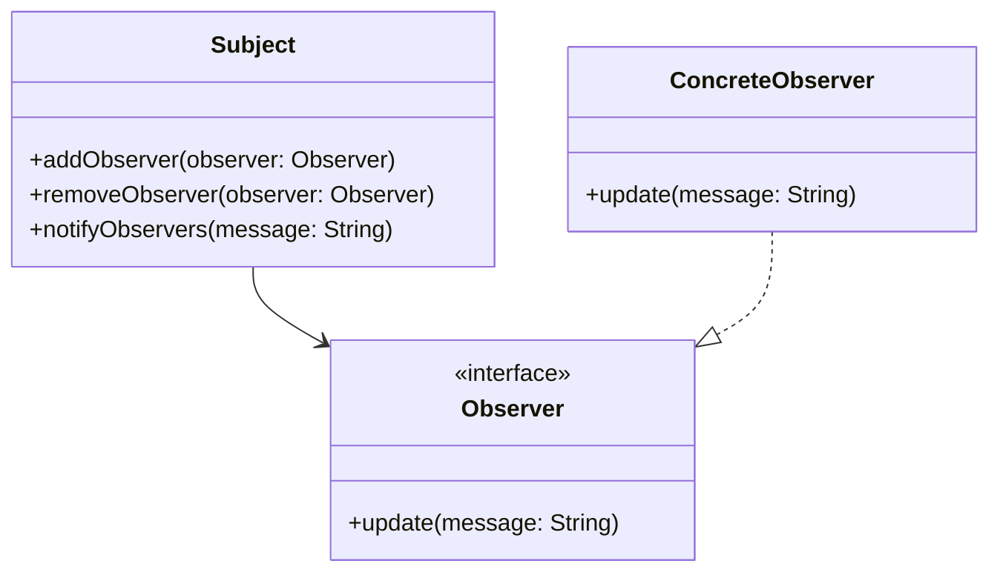

## 1.1 What Are Design Patterns?

In the realm of software engineering, design patterns are a crucial concept that provides reusable solutions to common problems encountered during software design. They are not finished designs that can be directly converted into code but are templates that describe how to solve a problem in a way that can be reused in many different situations. This section delves into the intricacies of design patterns, their importance, and how they can be effectively applied in Kotlin programming.

### Understanding Design Patterns

Design patterns are essentially best practices that the software development community has refined over time. They encapsulate solutions to recurring design problems, allowing developers to build more robust and maintainable systems. By leveraging design patterns, developers can avoid reinventing the wheel, thus saving time and reducing errors.

#### Key Characteristics of Design Patterns

- **Reusability**: Design patterns provide a standard solution that can be reused across different projects and contexts.
- **Scalability**: They help in building scalable systems by providing a solid foundation for software architecture.
- **Maintainability**: Patterns promote cleaner code, making it easier to maintain and extend.
- **Efficiency**: By using tried and tested solutions, developers can focus on solving new problems rather than re-solving existing ones.

### Categories of Design Patterns

Design patterns are generally categorized into three main types:

1. **Creational Patterns**: These patterns deal with object creation mechanisms, trying to create objects in a manner suitable to the situation. Examples include Singleton, Factory, and Builder patterns.

2. **Structural Patterns**: These patterns focus on the composition of classes or objects. They help ensure that if one part of a system changes, the entire system doesn’t need to do so. Examples include Adapter, Composite, and Decorator patterns.

3. **Behavioral Patterns**: These patterns are concerned with algorithms and the assignment of responsibilities between objects. Examples include Observer, Strategy, and Command patterns.

### The Role of Design Patterns in Modern Software Development

Design patterns play a pivotal role in modern software development by providing a shared language and understanding among developers. They facilitate communication, improve code readability, and enhance the overall quality of the software.

#### Benefits of Using Design Patterns

- **Improved Communication**: Patterns provide a common vocabulary for developers, making it easier to communicate complex ideas succinctly.
- **Code Reusability**: By using patterns, developers can reuse proven solutions, reducing the need for redundant code.
- **Enhanced Flexibility**: Patterns allow systems to be more adaptable to change, as they often encapsulate behavior that can be easily modified or extended.
- **Reduced Complexity**: Patterns help manage the complexity of software systems by breaking down complex problems into manageable parts.

### Design Patterns in Kotlin

Kotlin, with its modern language features, provides an excellent platform for implementing design patterns. Its concise syntax, powerful type system, and support for functional programming paradigms make it well-suited for applying design patterns effectively.

#### Kotlin-Specific Features that Enhance Design Patterns

- **Null Safety**: Kotlin’s null safety features help prevent common null pointer exceptions, making patterns like Singleton more robust.
- **Data Classes**: These provide a concise way to create classes that are primarily used to hold data, which is useful in patterns like Builder and Prototype.
- **Extension Functions**: These allow developers to add new functionality to existing classes without modifying their source code, enhancing patterns like Decorator.
- **Coroutines**: Kotlin’s support for coroutines simplifies asynchronous programming, which is beneficial in patterns like Observer and Command.

### Implementing Design Patterns in Kotlin

Let's explore how some common design patterns can be implemented in Kotlin, highlighting the language-specific features that enhance their application.

#### Singleton Pattern

The Singleton pattern ensures that a class has only one instance and provides a global point of access to it. In Kotlin, this can be elegantly implemented using the `object` declaration.

```kotlin
object DatabaseConnection {
    init {
        // Initialization code
        println("Database connection established.")
    }

    fun query(sql: String) {
        // Execute SQL query
        println("Executing query: $sql")
    }
}

fun main() {
    DatabaseConnection.query("SELECT * FROM users")
}
```

**Key Points**:
- The `object` keyword in Kotlin creates a singleton instance.
- Initialization is thread-safe and occurs the first time the object is accessed.

#### Factory Pattern

The Factory pattern provides an interface for creating objects in a superclass but allows subclasses to alter the type of objects that will be created.

```kotlin
interface Shape {
    fun draw()
}

class Circle : Shape {
    override fun draw() {
        println("Drawing a Circle")
    }
}

class Square : Shape {
    override fun draw() {
        println("Drawing a Square")
    }
}

class ShapeFactory {
    fun getShape(shapeType: String): Shape? {
        return when (shapeType.toLowerCase()) {
            "circle" -> Circle()
            "square" -> Square()
            else -> null
        }
    }
}

fun main() {
    val factory = ShapeFactory()
    val shape1 = factory.getShape("circle")
    shape1?.draw()

    val shape2 = factory.getShape("square")
    shape2?.draw()
}
```

**Key Points**:
- The Factory pattern encapsulates object creation, promoting loose coupling.
- Kotlin’s `when` expression is used for decision-making, enhancing readability.

#### Observer Pattern

The Observer pattern defines a one-to-many dependency between objects so that when one object changes state, all its dependents are notified and updated automatically.

```kotlin
interface Observer {
    fun update(message: String)
}

class ConcreteObserver(private val name: String) : Observer {
    override fun update(message: String) {
        println("$name received: $message")
    }
}

class Subject {
    private val observers = mutableListOf<Observer>()

    fun addObserver(observer: Observer) {
        observers.add(observer)
    }

    fun removeObserver(observer: Observer) {
        observers.remove(observer)
    }

    fun notifyObservers(message: String) {
        observers.forEach { it.update(message) }
    }
}

fun main() {
    val subject = Subject()
    val observer1 = ConcreteObserver("Observer 1")
    val observer2 = ConcreteObserver("Observer 2")

    subject.addObserver(observer1)
    subject.addObserver(observer2)

    subject.notifyObservers("Hello Observers!")
}
```

**Key Points**:
- The Observer pattern is useful for implementing event-driven systems.
- Kotlin’s collections and lambda expressions simplify the implementation.

### Visualizing Design Patterns

To better understand how design patterns work, let's visualize the Observer pattern using a class diagram.



**Diagram Explanation**:
- The `Subject` class maintains a list of `Observer` objects and notifies them of any state changes.
- `ConcreteObserver` implements the `Observer` interface to receive updates.

### Try It Yourself

Experiment with the provided code examples by modifying them to suit different scenarios. For instance, try adding a new shape in the Factory pattern or a new observer in the Observer pattern. Observe how the design pattern facilitates these changes with minimal impact on existing code.

### Knowledge Check

- **Question**: What are the three main categories of design patterns?
- **Challenge**: Implement a simple Decorator pattern in Kotlin to add functionality to a basic class without altering its structure.

### Embrace the Journey

Remember, understanding design patterns is just the beginning. As you continue to explore and apply these patterns, you'll discover more efficient ways to solve complex software design problems. Keep experimenting, stay curious, and enjoy the journey of mastering design patterns in Kotlin!

## Quiz Time!



### What is a design pattern in software engineering?

- [x] A reusable solution to a common problem in software design.
- [ ] A specific implementation of a software feature.
- [ ] A programming language syntax rule.
- [ ] A type of software testing method.

> **Explanation:** Design patterns provide reusable solutions to common problems in software design, helping developers create more efficient and maintainable code.

### Which of the following is NOT a category of design patterns?

- [ ] Creational
- [ ] Structural
- [ ] Behavioral
- [x] Functional

> **Explanation:** The three main categories of design patterns are Creational, Structural, and Behavioral. Functional is not a standard category of design patterns.

### How does the Singleton pattern ensure a class has only one instance?

- [x] By using a private constructor and a static method or property.
- [ ] By creating multiple instances and choosing one randomly.
- [ ] By using a public constructor.
- [ ] By implementing multiple interfaces.

> **Explanation:** The Singleton pattern uses a private constructor and a static method or property to ensure only one instance of the class is created.

### What is the primary benefit of using the Factory pattern?

- [x] It encapsulates object creation, promoting loose coupling.
- [ ] It ensures a class has only one instance.
- [ ] It defines a one-to-many dependency between objects.
- [ ] It allows for the dynamic addition of responsibilities to objects.

> **Explanation:** The Factory pattern encapsulates object creation, allowing for loose coupling between the client and the created objects.

### In the Observer pattern, what is the role of the Subject?

- [x] To maintain a list of observers and notify them of state changes.
- [ ] To implement the update method.
- [ ] To define a one-to-many dependency between objects.
- [ ] To encapsulate object creation.

> **Explanation:** In the Observer pattern, the Subject maintains a list of observers and notifies them of any state changes.

### Which Kotlin feature enhances the implementation of the Decorator pattern?

- [x] Extension Functions
- [ ] Data Classes
- [ ] Coroutines
- [ ] Sealed Classes

> **Explanation:** Extension functions in Kotlin allow developers to add new functionality to existing classes, enhancing the implementation of the Decorator pattern.

### What is a key characteristic of design patterns?

- [x] Reusability
- [ ] Complexity
- [ ] Language specificity
- [ ] Inflexibility

> **Explanation:** Design patterns are characterized by their reusability, providing standard solutions that can be applied across different projects.

### How do design patterns improve communication among developers?

- [x] By providing a common vocabulary for discussing design solutions.
- [ ] By enforcing strict coding standards.
- [ ] By eliminating the need for documentation.
- [ ] By reducing the number of meetings required.

> **Explanation:** Design patterns provide a common vocabulary that helps developers communicate complex ideas more effectively.

### What is the primary focus of Structural design patterns?

- [x] The composition of classes or objects.
- [ ] Object creation mechanisms.
- [ ] Algorithms and responsibilities between objects.
- [ ] User interface design.

> **Explanation:** Structural design patterns focus on the composition of classes or objects, ensuring that changes in one part of the system do not necessitate changes in the entire system.

### True or False: Design patterns are specific to a programming language.

- [ ] True
- [x] False

> **Explanation:** Design patterns are not specific to any programming language. They are abstract solutions that can be implemented in various languages, including Kotlin.


