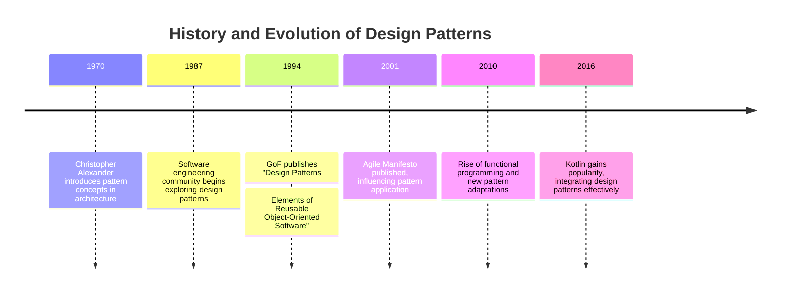

## 1.2 History and Evolution of Design Patterns

Design patterns have become an integral part of software engineering, providing reusable solutions to common problems that arise during software development. Understanding their history and evolution is crucial for expert software engineers and architects, especially when applying these patterns in modern languages like Kotlin. In this section, we will explore the origins of design patterns, their development over time, and their significance in contemporary software design.

### The Origins of Design Patterns

The concept of design patterns in software engineering can be traced back to the work of architect Christopher Alexander in the 1970s. Alexander introduced the idea of patterns in the context of architecture and urban design, describing them as recurring solutions to common problems in building design. His seminal works, "A Pattern Language" and "The Timeless Way of Building," laid the foundation for the pattern-based approach in various fields, including software engineering.

In the late 1980s and early 1990s, the software engineering community began to recognize the potential of applying Alexander's pattern concepts to software design. This led to the formation of the "Gang of Four" (GoF), consisting of Erich Gamma, Richard Helm, Ralph Johnson, and John Vlissides. Their groundbreaking book, "Design Patterns: Elements of Reusable Object-Oriented Software," published in 1994, introduced 23 classic design patterns that have since become the cornerstone of object-oriented design.

### The Rise of Design Patterns in Software Engineering

The publication of the GoF book marked a turning point in software engineering. It provided a common vocabulary for designers and developers to communicate complex design ideas effectively. The patterns described in the book addressed various design challenges, such as object creation, structural organization, and behavioral interactions.

#### Key Participants in the GoF Patterns

- **Creational Patterns**: Focus on object creation mechanisms, optimizing the instantiation process.
- **Structural Patterns**: Deal with object composition, simplifying the structure of complex systems.
- **Behavioral Patterns**: Address object interaction and responsibility distribution.

The GoF patterns quickly gained popularity, becoming a staple in software engineering education and practice. They offered a way to encapsulate best practices, making it easier for developers to create flexible, maintainable, and scalable software systems.

### Evolution of Design Patterns

As software development methodologies evolved, so did the application and understanding of design patterns. The Agile movement, which emerged in the late 1990s and early 2000s, emphasized iterative development and flexibility, influencing how design patterns were used. Agile practices encouraged developers to apply patterns more dynamically, adapting them to changing requirements and contexts.

#### Influence of Agile and Extreme Programming

Agile methodologies, such as Extreme Programming (XP), promoted the use of design patterns as a means to achieve simplicity and adaptability. Patterns like the Strategy and Observer patterns were particularly suited to Agile environments, where requirements could change rapidly. This adaptability made design patterns a valuable tool for Agile teams, enabling them to build robust systems that could evolve over time.

### The Role of Design Patterns in Modern Programming

In contemporary software development, design patterns continue to play a vital role. They provide a proven framework for solving common design problems, allowing developers to focus on higher-level architectural concerns. With the advent of new programming paradigms and languages, design patterns have been adapted and extended to fit different contexts.

#### Design Patterns in Functional Programming

The rise of functional programming languages, such as Haskell and Scala, introduced new challenges and opportunities for design patterns. Functional programming emphasizes immutability and first-class functions, leading to the development of functional design patterns. These patterns, such as Monads and Functors, offer solutions to problems unique to functional programming, complementing traditional object-oriented patterns.

#### Design Patterns in Kotlin

Kotlin, a modern programming language that combines object-oriented and functional programming paradigms, provides a unique platform for applying design patterns. Kotlin's concise syntax and powerful features, such as extension functions and coroutines, enable developers to implement patterns more efficiently. For example, the Singleton pattern can be easily implemented using Kotlin's `object` declaration, ensuring thread safety and lazy initialization.

```kotlin
// Singleton pattern using Kotlin's object declaration
object DatabaseConnection {
    init {
        println("Initializing Database Connection")
    }

    fun connect() {
        println("Connecting to the database...")
    }
}
```

### Visualizing the Evolution of Design Patterns

To better understand the evolution of design patterns, let's visualize their development over time using a timeline diagram.



### Design Patterns in the Context of Software Architecture

Design patterns are not just limited to code-level solutions; they also play a crucial role in software architecture. Architectural patterns, such as Model-View-Controller (MVC) and Microservices, provide high-level solutions to structural and organizational challenges in software systems.

#### Architectural Patterns and Their Impact

- **Model-View-Controller (MVC)**: Separates concerns in user interface design, promoting modularity and testability.
- **Microservices Architecture**: Decomposes applications into loosely coupled services, enhancing scalability and resilience.

These architectural patterns often incorporate design patterns at the component level, demonstrating the versatility and applicability of patterns across different layers of software design.

### The Future of Design Patterns

As technology continues to evolve, so too will design patterns. Emerging trends, such as cloud computing, machine learning, and the Internet of Things (IoT), present new challenges and opportunities for pattern development. The software engineering community will continue to adapt and extend existing patterns, as well as create new ones, to address these challenges.

#### Embracing Change and Innovation

The key to the continued relevance of design patterns lies in their ability to adapt to changing technologies and methodologies. By embracing innovation and collaboration, the software engineering community can ensure that design patterns remain a valuable tool for building robust and adaptable software systems.

### Conclusion

The history and evolution of design patterns highlight their enduring significance in software engineering. From their origins in architecture to their application in modern programming languages like Kotlin, design patterns have proven to be an invaluable resource for developers and architects. By understanding their history and evolution, we can better appreciate their role in shaping the future of software design.

### Quiz Time!



### When did the concept of design patterns first emerge in architecture?

- [x] 1970s
- [ ] 1980s
- [ ] 1990s
- [ ] 2000s

> **Explanation:** Christopher Alexander introduced the concept of design patterns in architecture during the 1970s.

### Who are the members of the "Gang of Four"?

- [x] Erich Gamma
- [x] Richard Helm
- [x] Ralph Johnson
- [x] John Vlissides

> **Explanation:** The "Gang of Four" consists of Erich Gamma, Richard Helm, Ralph Johnson, and John Vlissides, who authored the influential book on design patterns.

### What is the primary focus of creational patterns?

- [x] Object creation mechanisms
- [ ] Object composition
- [ ] Object interaction
- [ ] Object destruction

> **Explanation:** Creational patterns focus on object creation mechanisms, optimizing the instantiation process.

### How did Agile methodologies influence the use of design patterns?

- [x] Encouraged dynamic application of patterns
- [ ] Discouraged the use of patterns
- [ ] Made patterns obsolete
- [ ] Limited pattern usage to specific scenarios

> **Explanation:** Agile methodologies encouraged the dynamic application of design patterns, adapting them to changing requirements and contexts.

### Which programming paradigm introduced new challenges for design patterns?

- [x] Functional programming
- [ ] Object-oriented programming
- [ ] Procedural programming
- [ ] Imperative programming

> **Explanation:** The rise of functional programming introduced new challenges and opportunities for design patterns.

### How does Kotlin's `object` declaration facilitate the Singleton pattern?

- [x] Ensures thread safety and lazy initialization
- [ ] Requires additional synchronization
- [ ] Complicates the implementation
- [ ] Limits flexibility

> **Explanation:** Kotlin's `object` declaration ensures thread safety and lazy initialization, facilitating the Singleton pattern.

### What is the role of architectural patterns in software design?

- [x] Provide high-level solutions to structural challenges
- [ ] Focus solely on code-level solutions
- [ ] Limit design flexibility
- [ ] Discourage modularity

> **Explanation:** Architectural patterns provide high-level solutions to structural and organizational challenges in software systems.

### Which architectural pattern decomposes applications into loosely coupled services?

- [x] Microservices Architecture
- [ ] Model-View-Controller (MVC)
- [ ] Layered Architecture
- [ ] Client-Server Architecture

> **Explanation:** Microservices Architecture decomposes applications into loosely coupled services, enhancing scalability and resilience.

### What is essential for the continued relevance of design patterns?

- [x] Adaptation to changing technologies and methodologies
- [ ] Strict adherence to traditional patterns
- [ ] Limiting innovation
- [ ] Avoiding collaboration

> **Explanation:** The continued relevance of design patterns relies on their adaptation to changing technologies and methodologies.

### True or False: Design patterns are only applicable to object-oriented programming.

- [ ] True
- [x] False

> **Explanation:** Design patterns are applicable to various programming paradigms, including functional programming.



Remember, this is just the beginning. As you progress, you'll build more complex and interactive software systems using design patterns. Keep experimenting, stay curious, and enjoy the journey!
