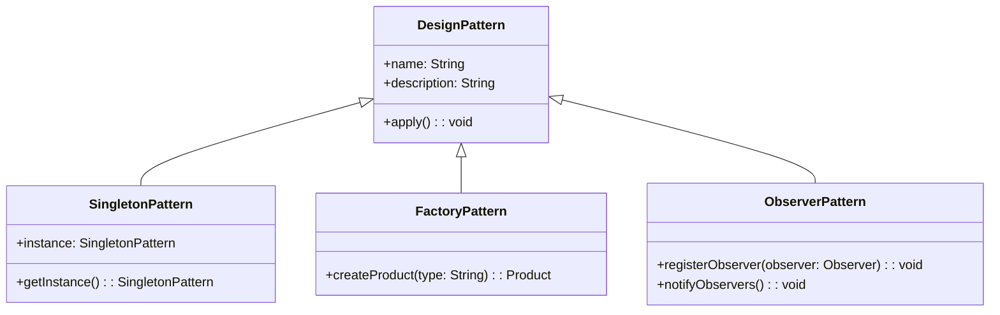

## 1.3 Importance of Design Patterns in Modern Programming

Design patterns have long been a cornerstone of effective software development, providing reusable solutions to common problems. In the context of modern programming languages like Kotlin, design patterns continue to play a crucial role in ensuring code quality, maintainability, and scalability. This section delves into the significance of design patterns in contemporary programming, highlighting their adaptation and application in modern languages.

### Understanding Design Patterns

Design patterns are established solutions to recurring design problems in software development. They encapsulate best practices and provide a template for solving issues in a structured and efficient manner. The concept of design patterns was popularized by the "Gang of Four" (GoF) in their seminal book, "Design Patterns: Elements of Reusable Object-Oriented Software," which categorized patterns into creational, structural, and behavioral types.

### The Evolution of Design Patterns

Design patterns have evolved alongside programming languages, adapting to new paradigms and technologies. Initially developed for object-oriented languages like C++ and Java, patterns have been reinterpreted for functional and concurrent programming paradigms. Modern languages like Kotlin, with their unique features and capabilities, offer new opportunities and challenges for implementing design patterns.

### The Role of Design Patterns in Modern Programming

Design patterns serve several key roles in modern programming:

1. **Facilitating Communication**: Design patterns provide a common vocabulary for developers, making it easier to communicate complex ideas succinctly. When a developer mentions the "Observer pattern," others immediately understand the concept and its implications.

2. **Improving Code Reusability**: Patterns promote code reuse by offering proven solutions that can be adapted to different contexts. This reduces the need to reinvent the wheel and allows developers to focus on solving new problems.

3. **Enhancing Maintainability**: By structuring code in a consistent and predictable manner, design patterns make it easier to understand and modify. This is particularly important in large projects where multiple developers are involved.

4. **Encouraging Best Practices**: Patterns encapsulate best practices and design principles, guiding developers towards writing clean, efficient, and robust code.

5. **Supporting Scalability**: Well-designed patterns can help systems scale more effectively by providing a solid architectural foundation.

### Adapting Design Patterns to Kotlin

Kotlin, with its expressive syntax and powerful features, offers unique opportunities for implementing design patterns. Let's explore how some common patterns are adapted to Kotlin's capabilities.

#### Singleton Pattern

The Singleton pattern ensures that a class has only one instance and provides a global point of access to it. In Kotlin, this pattern is elegantly implemented using the `object` keyword, which creates a thread-safe singleton by default.

```kotlin
object DatabaseConnection {
    fun connect() {
        println("Connected to the database")
    }
}
```

#### Factory Pattern

The Factory pattern provides a way to create objects without specifying the exact class of object that will be created. Kotlin's sealed classes and companion objects can be used to implement this pattern effectively.

```kotlin
sealed class Vehicle {
    object Car : Vehicle()
    object Bike : Vehicle()
}

class VehicleFactory {
    companion object {
        fun create(type: String): Vehicle {
            return when (type) {
                "Car" -> Vehicle.Car
                "Bike" -> Vehicle.Bike
                else -> throw IllegalArgumentException("Unknown vehicle type")
            }
        }
    }
}
```

#### Observer Pattern

The Observer pattern defines a one-to-many dependency between objects so that when one object changes state, all its dependents are notified. Kotlin's coroutines and Flow API can be used to implement this pattern in a reactive manner.

```kotlin
import kotlinx.coroutines.flow.MutableSharedFlow
import kotlinx.coroutines.flow.asSharedFlow

class NewsPublisher {
    private val _newsFlow = MutableSharedFlow<String>()
    val newsFlow = _newsFlow.asSharedFlow()

    suspend fun publish(news: String) {
        _newsFlow.emit(news)
    }
}

suspend fun main() {
    val publisher = NewsPublisher()

    publisher.newsFlow.collect { news ->
        println("Received news: $news")
    }

    publisher.publish("Kotlin 1.5 Released!")
}
```

### Visualizing Design Patterns in Modern Programming

To better understand the role of design patterns in modern programming, let's visualize how they fit into the development process using a class diagram.



**Figure 1: Class Diagram of Common Design Patterns**

This diagram illustrates the relationship between different design patterns and their common superclass, `DesignPattern`. Each pattern has its unique methods and properties, demonstrating how they can be adapted to specific use cases.

### Key Participants in Design Patterns

Design patterns typically involve several key participants:

- **Client**: The entity that uses the design pattern.
- **Creator**: The component responsible for creating instances of a class (e.g., Factory).
- **Product**: The object being created or manipulated by the pattern.
- **Observer**: In the Observer pattern, this is the entity that receives updates.

Understanding these participants helps developers implement patterns effectively and recognize their roles in the overall architecture.

### Applicability of Design Patterns

Design patterns are applicable in various scenarios, including:

- **Complex Systems**: Patterns help manage complexity by providing a structured approach to design.
- **Reusable Components**: When building libraries or frameworks, patterns ensure that components are reusable and adaptable.
- **Scalable Architectures**: Patterns support scalability by promoting loose coupling and modular design.

### Sample Code Snippet: Strategy Pattern

The Strategy pattern defines a family of algorithms, encapsulates each one, and makes them interchangeable. This pattern is particularly useful in Kotlin due to its support for higher-order functions.

```kotlin
interface PaymentStrategy {
    fun pay(amount: Double)
}

class CreditCardPayment : PaymentStrategy {
    override fun pay(amount: Double) {
        println("Paid $$amount using Credit Card")
    }
}

class PayPalPayment : PaymentStrategy {
    override fun pay(amount: Double) {
        println("Paid $$amount using PayPal")
    }
}

fun main() {
    val paymentMethod: PaymentStrategy = CreditCardPayment()
    paymentMethod.pay(100.0)
}
```

### Design Considerations

When implementing design patterns in Kotlin, consider the following:

- **Leverage Kotlin's Features**: Utilize Kotlin's features like extension functions, data classes, and coroutines to enhance pattern implementation.
- **Thread Safety**: Ensure thread safety in concurrent environments, especially for patterns like Singleton.
- **Performance**: Evaluate the performance implications of patterns, particularly in resource-intensive applications.

### Differences and Similarities

Design patterns can sometimes be confused with one another. For example, the Factory and Abstract Factory patterns both deal with object creation but differ in complexity and use cases. Understanding these nuances is crucial for selecting the right pattern for a given problem.

### Try It Yourself

Experiment with the code examples provided by modifying them to suit different scenarios. For instance, try implementing a new payment method in the Strategy pattern or adding a new vehicle type in the Factory pattern. This hands-on approach will deepen your understanding of design patterns in Kotlin.

### References and Links

For further reading on design patterns, consider the following resources:

- [Design Patterns: Elements of Reusable Object-Oriented Software](https://en.wikipedia.org/wiki/Design_Patterns)
- [Kotlin Documentation](https://kotlinlang.org/docs/home.html)
- [Refactoring.Guru: Design Patterns](https://refactoring.guru/design-patterns)

### Knowledge Check

To reinforce your understanding, consider the following questions:

- What are the key benefits of using design patterns in modern programming?
- How does Kotlin's `object` keyword simplify the implementation of the Singleton pattern?
- In what scenarios would you apply the Factory pattern?

### Embrace the Journey

Remember, mastering design patterns is a journey. As you continue to explore and apply these patterns in your projects, you'll gain a deeper understanding of their power and versatility. Keep experimenting, stay curious, and enjoy the journey!

### Quiz Time!



### What is a primary benefit of using design patterns in software development?

- [x] They provide reusable solutions to common problems.
- [ ] They eliminate the need for testing.
- [ ] They guarantee performance improvements.
- [ ] They replace the need for documentation.

> **Explanation:** Design patterns offer reusable solutions to common design problems, facilitating communication and improving code maintainability.

### How does the Singleton pattern ensure a class has only one instance in Kotlin?

- [x] By using the `object` keyword.
- [ ] By using a private constructor.
- [ ] By using a static method.
- [ ] By using a global variable.

> **Explanation:** In Kotlin, the `object` keyword creates a singleton instance by default, ensuring thread safety and a single instance.

### Which Kotlin feature is particularly useful for implementing the Strategy pattern?

- [x] Higher-order functions.
- [ ] Sealed classes.
- [ ] Data classes.
- [ ] Extension functions.

> **Explanation:** Higher-order functions allow for flexible implementation of the Strategy pattern by passing algorithms as parameters.

### What is a key participant in the Observer pattern?

- [x] Observer.
- [ ] Singleton.
- [ ] Factory.
- [ ] Strategy.

> **Explanation:** The Observer pattern involves an Observer entity that receives updates from the subject.

### Which design pattern is best suited for creating families of related objects without specifying their concrete classes?

- [x] Abstract Factory.
- [ ] Singleton.
- [ ] Builder.
- [ ] Prototype.

> **Explanation:** The Abstract Factory pattern is used to create families of related objects without specifying their concrete classes.

### What is a common use case for the Factory pattern?

- [x] Object creation without specifying the exact class.
- [ ] Managing object state changes.
- [ ] Defining a family of algorithms.
- [ ] Adding behavior to objects dynamically.

> **Explanation:** The Factory pattern is used for object creation without specifying the exact class, encapsulating the creation logic.

### How can Kotlin's coroutines enhance the implementation of the Observer pattern?

- [x] By providing a reactive approach with Flows.
- [ ] By simplifying object creation.
- [ ] By ensuring a single instance.
- [ ] By encapsulating algorithms.

> **Explanation:** Kotlin's coroutines and Flow API provide a reactive approach to implementing the Observer pattern, allowing for asynchronous data streams.

### What is a design consideration when implementing patterns in Kotlin?

- [x] Leveraging Kotlin's features like extension functions.
- [ ] Avoiding the use of data classes.
- [ ] Ensuring global variables are used.
- [ ] Ignoring thread safety.

> **Explanation:** Leveraging Kotlin's features, such as extension functions, enhances pattern implementation and code expressiveness.

### Which pattern involves encapsulating each algorithm and making them interchangeable?

- [x] Strategy.
- [ ] Singleton.
- [ ] Observer.
- [ ] Factory.

> **Explanation:** The Strategy pattern involves encapsulating algorithms and making them interchangeable, allowing for flexible behavior changes.

### True or False: Design patterns eliminate the need for testing.

- [ ] True
- [x] False

> **Explanation:** Design patterns do not eliminate the need for testing; they provide a structured approach to solving design problems, but testing remains essential to ensure code quality.



By understanding and applying design patterns in Kotlin, you can enhance your software development skills and create robust, maintainable, and scalable applications. Keep exploring and experimenting with these patterns to unlock their full potential in your projects.
