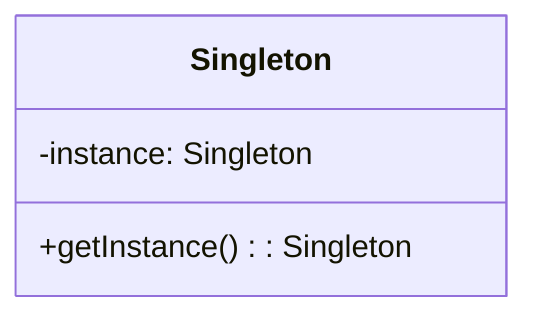
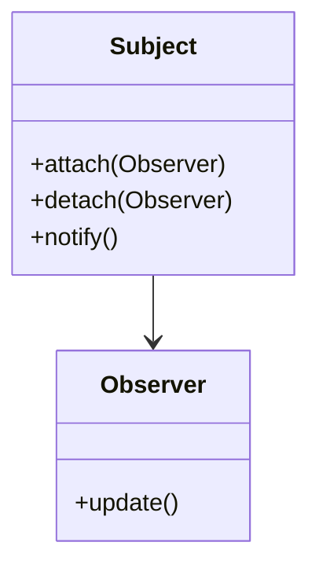
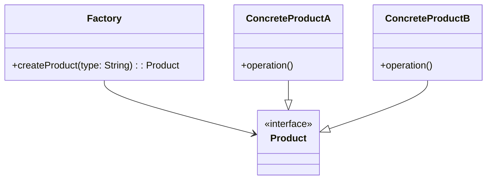

## 1.4 Benefits of Using Design Patterns in Kotlin

Design patterns are a crucial aspect of software engineering, providing reusable solutions to common problems. In Kotlin, these patterns take on an even more significant role due to the language's unique features and capabilities. This section will explore the benefits of using design patterns in Kotlin, focusing on enhancing code clarity, maintainability, and scalability. We will delve into how Kotlin's features such as null safety, extension functions, and coroutines can be leveraged to implement design patterns effectively, providing practical examples and visual aids to solidify understanding.

### Enhancing Code Clarity

#### Simplifying Complex Logic

Design patterns help simplify complex logic by providing a clear structure and separation of concerns. In Kotlin, this is further enhanced by features like data classes and sealed classes, which allow for concise and expressive code.

```kotlin
// Example of using a data class in a design pattern
data class User(val id: Int, val name: String)

fun main() {
    val user = User(1, "Alice")
    println(user)
}
```

In this example, the `User` data class provides a clear and concise way to represent user data, reducing boilerplate code and enhancing readability.

#### Leveraging Kotlin's Type System

Kotlin's strong type system and null safety features contribute to code clarity by reducing the risk of null pointer exceptions and making the code more predictable.

```kotlin
fun greetUser(user: User?) {
    user?.let {
        println("Hello, ${it.name}")
    } ?: println("User not found")
}
```

Here, the use of safe calls (`?.`) and the Elvis operator (`?:`) ensures that the code handles null values gracefully, making the logic clear and robust.

#### Visualizing Code Structure

Using design patterns in Kotlin can also aid in visualizing the code structure. For example, the use of sealed classes in the State pattern can clearly define the possible states of an object.

```kotlin
sealed class ConnectionState {
    object Connected : ConnectionState()
    object Disconnected : ConnectionState()
    data class Connecting(val progress: Int) : ConnectionState()
}

fun printState(state: ConnectionState) {
    when (state) {
        is ConnectionState.Connected -> println("Connected")
        is ConnectionState.Disconnected -> println("Disconnected")
        is ConnectionState.Connecting -> println("Connecting: ${state.progress}%")
    }
}
```

The sealed class `ConnectionState` clearly defines all possible states, making the code easy to understand and maintain.

### Improving Maintainability

#### Encouraging Reusability

Design patterns promote reusability, allowing developers to apply proven solutions to new problems. Kotlin's support for higher-order functions and extension functions further enhances this aspect.

```kotlin
// Example of using an extension function for reusability
fun String.isValidEmail(): Boolean {
    return this.contains("@") && this.contains(".")
}

fun main() {
    val email = "test@example.com"
    println("Is valid email: ${email.isValidEmail()}")
}
```

The extension function `isValidEmail` can be reused across different parts of the application, promoting maintainability.

#### Facilitating Refactoring

Design patterns provide a solid foundation for refactoring, making it easier to adapt to changing requirements. Kotlin's features like data classes and immutability support this process.

```kotlin
// Refactoring example using a data class
data class Product(val id: Int, val name: String, val price: Double)

fun applyDiscount(product: Product, discount: Double): Product {
    return product.copy(price = product.price * (1 - discount))
}

fun main() {
    val product = Product(1, "Laptop", 1000.0)
    val discountedProduct = applyDiscount(product, 0.1)
    println(discountedProduct)
}
```

In this example, the `copy` function of the data class allows for easy refactoring and modification of the `Product` object.

#### Supporting Testability

Design patterns enhance testability by providing clear interfaces and separation of concerns. Kotlin's support for coroutines and testing libraries like Kotest further aids in this process.

```kotlin
// Example of testing a coroutine function
import kotlinx.coroutines.runBlocking
import org.junit.Test
import kotlin.test.assertEquals

class CoroutineTest {
    suspend fun fetchData(): String {
        // Simulate fetching data
        return "Data"
    }

    @Test
    fun testFetchData() = runBlocking {
        val result = fetchData()
        assertEquals("Data", result)
    }
}
```

The use of coroutines and the `runBlocking` function in this test example demonstrates how Kotlin can support testing asynchronous code effectively.

### Enhancing Scalability

#### Supporting Concurrent Programming

Kotlin's coroutines provide a powerful tool for implementing concurrent programming patterns, enhancing scalability by allowing efficient use of resources.

```kotlin
// Example of using coroutines for concurrency
import kotlinx.coroutines.*

fun main() = runBlocking {
    val jobs = List(100_000) {
        launch {
            delay(1000L)
            print(".")
        }
    }
    jobs.forEach { it.join() }
}
```

In this example, coroutines allow the creation of a large number of concurrent tasks without blocking the main thread, demonstrating scalability.

#### Facilitating Modular Design

Design patterns promote modular design, allowing applications to scale by adding new modules or components. Kotlin's support for packages and imports aids in organizing code effectively.

```kotlin
// Example of organizing code into packages
package com.example.utils

fun printMessage(message: String) {
    println(message)
}

package com.example.main

import com.example.utils.printMessage

fun main() {
    printMessage("Hello, Kotlin!")
}
```

By organizing code into packages, developers can create modular applications that are easier to scale and maintain.

#### Enabling Distributed Systems

Design patterns like Microservices and Event-Driven Architecture support the development of distributed systems. Kotlin's compatibility with frameworks like Ktor and Spring Boot facilitates the implementation of these patterns.

```kotlin
// Example of a simple Ktor server
import io.ktor.application.*
import io.ktor.http.*
import io.ktor.response.*
import io.ktor.routing.*
import io.ktor.server.engine.*
import io.ktor.server.netty.*

fun main() {
    embeddedServer(Netty, port = 8080) {
        routing {
            get("/") {
                call.respondText("Hello, World!", ContentType.Text.Plain)
            }
        }
    }.start(wait = true)
}
```

This Ktor server example demonstrates how Kotlin can be used to build scalable, distributed systems.

### Visualizing Design Patterns in Kotlin

To better understand the application of design patterns in Kotlin, let's visualize some common patterns using Mermaid.js diagrams.

#### Singleton Pattern



In this diagram, the Singleton pattern is represented with a single instance that can be accessed globally.

#### Observer Pattern



The Observer pattern is visualized here, showing the relationship between the Subject and its Observers.

#### Factory Pattern



This diagram illustrates the Factory pattern, where a Factory class creates different types of Products.

### References and Further Reading

- [Kotlin Documentation](https://kotlinlang.org/docs/reference/)
- [Design Patterns: Elements of Reusable Object-Oriented Software](https://en.wikipedia.org/wiki/Design_Patterns)
- [Kotlin Coroutines Guide](https://kotlinlang.org/docs/coroutines-guide.html)

### Knowledge Check

To reinforce your understanding of the benefits of using design patterns in Kotlin, consider the following questions:

1. How do design patterns enhance code clarity in Kotlin?
2. What role does Kotlin's type system play in improving maintainability?
3. How can coroutines contribute to the scalability of an application?
4. What are some ways to visualize design patterns in Kotlin?
5. How do design patterns support testability in Kotlin applications?

### Embrace the Journey

Remember, this is just the beginning. As you continue to explore design patterns in Kotlin, you'll discover more ways to enhance your code's clarity, maintainability, and scalability. Keep experimenting, stay curious, and enjoy the journey!

## Quiz Time!



### How do design patterns enhance code clarity in Kotlin?

- [x] By providing a clear structure and separation of concerns
- [ ] By increasing the complexity of the code
- [ ] By making the code less readable
- [ ] By introducing more boilerplate code

> **Explanation:** Design patterns enhance code clarity by providing a clear structure and separation of concerns, making the code easier to understand and maintain.

### What role does Kotlin's type system play in improving maintainability?

- [x] It reduces the risk of null pointer exceptions
- [ ] It makes the code more complex
- [ ] It decreases code readability
- [ ] It increases the amount of boilerplate code

> **Explanation:** Kotlin's type system improves maintainability by reducing the risk of null pointer exceptions, making the code more predictable and robust.

### How can coroutines contribute to the scalability of an application?

- [x] By allowing efficient use of resources through concurrent programming
- [ ] By making the code more complex
- [ ] By decreasing the application's performance
- [ ] By increasing the application's memory usage

> **Explanation:** Coroutines contribute to scalability by allowing efficient use of resources through concurrent programming, enabling the application to handle more tasks simultaneously.

### What are some ways to visualize design patterns in Kotlin?

- [x] Using Mermaid.js diagrams
- [ ] Using complex mathematical equations
- [ ] Using unrelated images
- [ ] Using random shapes

> **Explanation:** Design patterns in Kotlin can be visualized using Mermaid.js diagrams, which provide a clear representation of the relationships and structures within the patterns.

### How do design patterns support testability in Kotlin applications?

- [x] By providing clear interfaces and separation of concerns
- [ ] By making the code more complex
- [ ] By decreasing the code's readability
- [ ] By introducing more boilerplate code

> **Explanation:** Design patterns support testability by providing clear interfaces and separation of concerns, making it easier to test individual components of the application.

### What is the benefit of using extension functions in Kotlin?

- [x] They allow adding functionality to existing classes without modifying them
- [ ] They increase the complexity of the code
- [ ] They decrease code readability
- [ ] They introduce more boilerplate code

> **Explanation:** Extension functions allow adding functionality to existing classes without modifying them, enhancing code reusability and maintainability.

### How does the use of sealed classes enhance code clarity?

- [x] By clearly defining all possible states of an object
- [ ] By making the code more complex
- [ ] By decreasing the code's readability
- [ ] By introducing more boilerplate code

> **Explanation:** Sealed classes enhance code clarity by clearly defining all possible states of an object, making the code easier to understand and maintain.

### What is the advantage of using data classes in Kotlin?

- [x] They provide a concise way to represent data
- [ ] They increase the complexity of the code
- [ ] They decrease code readability
- [ ] They introduce more boilerplate code

> **Explanation:** Data classes provide a concise way to represent data, reducing boilerplate code and enhancing readability.

### How do design patterns facilitate refactoring?

- [x] By providing a solid foundation for adapting to changing requirements
- [ ] By making the code more complex
- [ ] By decreasing the code's readability
- [ ] By introducing more boilerplate code

> **Explanation:** Design patterns facilitate refactoring by providing a solid foundation for adapting to changing requirements, making it easier to modify and maintain the code.

### True or False: Design patterns in Kotlin can only be used in Android development.

- [ ] True
- [x] False

> **Explanation:** Design patterns in Kotlin can be used in various domains, not just Android development, including backend development, web applications, and more.


