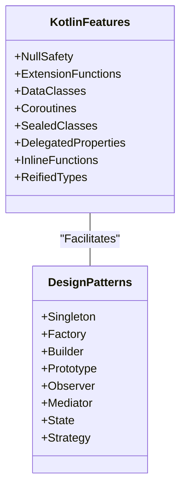

## 1.5 Overview of Kotlin Features Relevant to Design Patterns

Kotlin, a modern programming language that runs on the Java Virtual Machine (JVM), offers a range of features that make it particularly well-suited for implementing design patterns. In this section, we will explore these features and how they facilitate the use of design patterns, enhancing code clarity, maintainability, and scalability.

### Null Safety

One of Kotlin's standout features is its approach to null safety. In many programming languages, null references can lead to runtime exceptions, which are often difficult to debug. Kotlin addresses this issue by incorporating null safety directly into its type system.

#### Nullable and Non-Nullable Types

In Kotlin, types are non-nullable by default. This means that a variable cannot hold a null value unless explicitly declared as nullable using the `?` symbol.

```kotlin
var nonNullable: String = "Hello"
// nonNullable = null // This will cause a compilation error

var nullable: String? = "World"
nullable = null // This is allowed
```

This feature is particularly useful when implementing design patterns that require strict type contracts, such as the Factory Method or Builder patterns, where ensuring non-null values can prevent errors.

#### Safe Calls and the Elvis Operator

Kotlin provides safe call operators (`?.`) and the Elvis operator (`?:`) to handle nullable types gracefully.

```kotlin
val length: Int? = nullable?.length // Safe call
val lengthOrZero: Int = nullable?.length ?: 0 // Elvis operator
```

These operators simplify code and reduce the need for explicit null checks, making patterns like the Null Object pattern easier to implement.

### Extension Functions and Properties

Kotlin allows developers to extend existing classes with new functionality without modifying their source code. This is achieved through extension functions and properties.

#### Extension Functions

Extension functions enable adding new functions to existing classes, which can be particularly useful in implementing the Decorator pattern.

```kotlin
fun String.addExclamation(): String {
    return this + "!"
}

val excited = "Hello".addExclamation() // "Hello!"
```

#### Extension Properties

Similarly, extension properties allow adding new properties to existing classes.

```kotlin
val String.wordCount: Int
    get() = this.split(" ").size

val count = "Hello World".wordCount // 2
```

These features promote cleaner and more modular code, allowing for the seamless integration of additional functionalities.

### Data Classes

Data classes in Kotlin are designed to hold data and provide a concise syntax for creating classes with minimal boilerplate. They automatically generate useful methods like `equals()`, `hashCode()`, and `toString()`, which are essential for many design patterns.

#### Usage in Patterns

Data classes are particularly useful in patterns such as the Prototype pattern, where object cloning is required.

```kotlin
data class Point(val x: Int, val y: Int)

val point1 = Point(1, 2)
val point2 = point1.copy(y = 3) // Cloning with modification
```

The `copy()` function simplifies the creation of new instances based on existing ones, enhancing the implementation of creational patterns.

### Coroutines for Asynchronous Programming

Kotlin's coroutines provide a powerful way to handle asynchronous programming, offering a more straightforward alternative to traditional threading models.

#### Structured Concurrency

Coroutines support structured concurrency, which helps manage the lifecycle of asynchronous operations, making it easier to implement patterns like the Observer or Mediator patterns in concurrent environments.

```kotlin
import kotlinx.coroutines.*

fun main() = runBlocking {
    launch {
        delay(1000L)
        println("World!")
    }
    println("Hello,")
}
```

#### Channels and Flows

Kotlin's channels and flows offer advanced constructs for handling streams of data, which are useful in implementing reactive patterns.

```kotlin
import kotlinx.coroutines.*
import kotlinx.coroutines.flow.*

fun main() = runBlocking {
    flowOf(1, 2, 3)
        .map { it * it }
        .collect { println(it) }
}
```

These features facilitate the implementation of reactive and event-driven design patterns, promoting responsive and scalable applications.

### Sealed Classes

Sealed classes in Kotlin allow defining restricted class hierarchies, which are particularly useful for implementing patterns that require a fixed set of subclasses, such as the State or Strategy patterns.

```kotlin
sealed class Shape {
    data class Circle(val radius: Double) : Shape()
    data class Rectangle(val width: Double, val height: Double) : Shape()
}

fun describeShape(shape: Shape): String = when (shape) {
    is Shape.Circle -> "Circle with radius ${shape.radius}"
    is Shape.Rectangle -> "Rectangle with width ${shape.width} and height ${shape.height}"
}
```

Sealed classes ensure that all possible subclasses are known at compile time, enabling exhaustive `when` expressions and enhancing type safety.

### Delegated Properties

Kotlin's delegated properties provide a way to delegate the implementation of a property to another object, which can be leveraged in various design patterns.

#### Lazy Initialization

The `lazy` delegate is a common use case, allowing for lazy initialization of properties, which is a key aspect of the Singleton pattern.

```kotlin
val lazyValue: String by lazy {
    println("Computed!")
    "Hello"
}

fun main() {
    println(lazyValue) // Computed! Hello
    println(lazyValue) // Hello
}
```

Delegated properties simplify the implementation of patterns that require deferred initialization or complex property management.

### Inline Functions and Reified Types

Kotlin's inline functions and reified types provide performance optimizations and enhanced type safety for generic programming.

#### Inline Functions

Inline functions reduce the overhead of function calls, which can be beneficial in performance-critical design patterns.

```kotlin
inline fun <T> measureTime(block: () -> T): T {
    val start = System.nanoTime()
    val result = block()
    val end = System.nanoTime()
    println("Time taken: ${end - start} ns")
    return result
}
```

#### Reified Types

Reified types allow accessing type information at runtime, which is useful in patterns that require type introspection.

```kotlin
inline fun <reified T> isInstance(value: Any): Boolean {
    return value is T
}

val result = isInstance<String>("Hello") // true
```

These features enhance the flexibility and efficiency of design pattern implementations in Kotlin.

### Try It Yourself

To deepen your understanding of these Kotlin features, try modifying the code examples provided. For instance, experiment with creating your own extension functions or using coroutines to handle asynchronous tasks in different design patterns. This hands-on approach will solidify your grasp of how Kotlin's unique features can be leveraged to implement design patterns effectively.

### Visualizing Kotlin Features in Design Patterns

To better understand how Kotlin's features integrate with design patterns, let's visualize some of these concepts.



This diagram illustrates the relationship between Kotlin features and design patterns, highlighting how these features facilitate the implementation of various patterns.

### References and Further Reading

- [Kotlin Official Documentation](https://kotlinlang.org/docs/home.html)
- [Effective Kotlin: Best Practices](https://www.manning.com/books/effective-kotlin)
- [Design Patterns: Elements of Reusable Object-Oriented Software](https://www.amazon.com/Design-Patterns-Elements-Reusable-Object-Oriented/dp/0201633612)

### Knowledge Check

1. How does Kotlin's null safety feature enhance the implementation of design patterns?
2. What are the benefits of using extension functions in design patterns?
3. How can data classes simplify the implementation of the Prototype pattern?
4. Explain how coroutines can be used to implement the Observer pattern.
5. Describe the role of sealed classes in the State pattern.

### Embrace the Journey

Remember, mastering Kotlin's features and their application in design patterns is a journey. As you progress, you'll discover more ways to leverage these features to write clean, efficient, and maintainable code. Keep experimenting, stay curious, and enjoy the process of becoming a more proficient Kotlin developer!

## Quiz Time!



### How does Kotlin's null safety feature enhance the implementation of design patterns?

- [x] It prevents runtime null pointer exceptions.
- [ ] It allows variables to hold null values by default.
- [ ] It simplifies the use of nullable types without checks.
- [ ] It removes the need for type declarations.

> **Explanation:** Kotlin's null safety feature prevents runtime null pointer exceptions by making types non-nullable by default, thus enhancing the reliability of design patterns.

### What is the primary advantage of using extension functions in design patterns?

- [x] They allow adding functionality to existing classes without modifying their source code.
- [ ] They increase the runtime performance of the application.
- [ ] They simplify the creation of new classes.
- [ ] They automatically generate boilerplate code.

> **Explanation:** Extension functions allow developers to add functionality to existing classes without altering their source code, which is useful in implementing patterns like Decorator.

### How do data classes simplify the implementation of the Prototype pattern?

- [x] They provide a `copy()` method for cloning objects.
- [ ] They automatically manage memory allocation.
- [ ] They enforce immutability by default.
- [ ] They eliminate the need for constructors.

> **Explanation:** Data classes in Kotlin come with a `copy()` method that facilitates object cloning, making them ideal for implementing the Prototype pattern.

### In what way can coroutines be used to implement the Observer pattern?

- [x] By managing asynchronous updates and notifications.
- [ ] By enforcing synchronous execution.
- [ ] By simplifying the creation of observers.
- [ ] By eliminating the need for event handling.

> **Explanation:** Coroutines manage asynchronous operations efficiently, making them suitable for implementing the Observer pattern where updates and notifications are handled asynchronously.

### What role do sealed classes play in the State pattern?

- [x] They define a fixed set of subclasses representing states.
- [ ] They allow dynamic creation of states at runtime.
- [ ] They enforce immutability of state objects.
- [ ] They simplify the transition between states.

> **Explanation:** Sealed classes define a fixed set of subclasses, ensuring that all possible states are known at compile time, which is crucial for implementing the State pattern.

### Which Kotlin feature allows for deferred initialization of properties?

- [x] Delegated properties with `lazy`
- [ ] Extension functions
- [ ] Data classes
- [ ] Sealed classes

> **Explanation:** Delegated properties with `lazy` allow for deferred initialization, which is useful in implementing patterns like Singleton.

### How do inline functions improve performance in design patterns?

- [x] By reducing the overhead of function calls.
- [ ] By automatically optimizing memory usage.
- [ ] By simplifying code readability.
- [ ] By enforcing compile-time checks.

> **Explanation:** Inline functions reduce the overhead associated with function calls, improving performance in patterns that require frequent function invocations.

### What is the benefit of using reified types in design patterns?

- [x] They allow accessing type information at runtime.
- [ ] They enforce strict compile-time type checks.
- [ ] They simplify the creation of generic classes.
- [ ] They automatically handle nullability.

> **Explanation:** Reified types enable runtime access to type information, which is beneficial in patterns that require type introspection.

### How do channels and flows facilitate reactive patterns in Kotlin?

- [x] By providing constructs for handling streams of data.
- [ ] By enforcing synchronous data processing.
- [ ] By simplifying the creation of reactive classes.
- [ ] By eliminating the need for event listeners.

> **Explanation:** Channels and flows offer advanced constructs for handling streams of data, making them suitable for implementing reactive patterns.

### True or False: Sealed classes ensure that all possible subclasses are known at compile time.

- [x] True
- [ ] False

> **Explanation:** True. Sealed classes in Kotlin ensure that all possible subclasses are known at compile time, enhancing type safety and pattern implementation.


