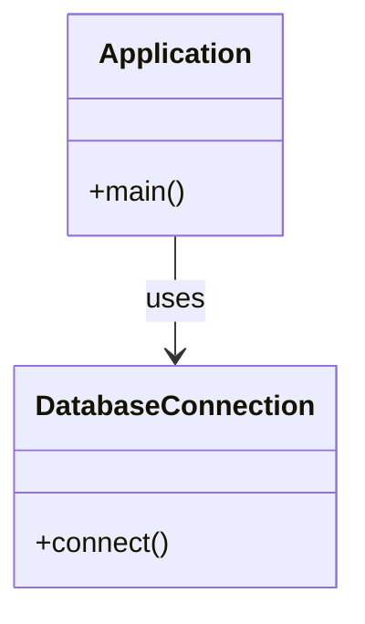

## 1.6 How to Use This Guide

Welcome to the **Kotlin Design Patterns For Expert Software Engineers and Architects** guide. This comprehensive resource is crafted to enhance your understanding and application of design patterns in Kotlin, a modern, expressive, and powerful programming language. This section will provide you with a roadmap to navigate the guide effectively, ensuring you maximize its utility in your software engineering and architectural endeavors.

### Understanding the Structure

The guide is meticulously organized into distinct sections, each focusing on specific aspects of Kotlin and design patterns. Here's a brief overview of how the content is structured:

- **Introduction to Design Patterns in Kotlin**: This section lays the foundation by explaining what design patterns are, their historical evolution, and their importance in modern programming. It also highlights the unique advantages of using design patterns in Kotlin.

- **Principles of Kotlin Programming**: Delve into Kotlin's core principles, such as null safety, immutability, and functional programming. These principles are crucial for implementing design patterns effectively.

- **Kotlin Language Features and Best Practices**: Explore Kotlin-specific features like extension functions, coroutines, and DSL construction. This section also covers best practices for writing idiomatic Kotlin code.

- **Creational, Structural, Behavioral, and Functional Patterns**: These sections provide in-depth coverage of various design patterns, complete with examples and explanations tailored to Kotlin.

- **Concurrency and Asynchronous Patterns**: Learn about Kotlin's approach to concurrency using coroutines, flows, and reactive programming.

- **Microservices and Architectural Patterns**: Understand how Kotlin can be leveraged in microservices architecture and other architectural patterns.

- **Integration with Java and JVM Ecosystem**: Discover how Kotlin seamlessly integrates with Java, making it a versatile choice for JVM-based projects.

- **Android Development Patterns**: Focus on patterns specific to Android development, utilizing Kotlin's strengths in mobile app development.

- **Testing, Security, and Performance Optimization**: These sections cover strategies for testing, securing, and optimizing Kotlin applications.

- **Case Studies and Conclusion**: Real-world examples and a recap of key concepts to solidify your understanding.

### Navigating the Guide

To effectively navigate this guide, consider the following strategies:

1. **Start with the Basics**: If you're new to Kotlin or design patterns, begin with the introductory sections. They provide the necessary background and context for more advanced topics.

2. **Focus on Your Interests**: Depending on your current projects or areas of interest, you may want to dive into specific sections, such as concurrency patterns or Android development.

3. **Use the Table of Contents**: The detailed table of contents allows you to quickly locate specific topics or patterns you're interested in.

4. **Leverage Code Examples**: Each pattern and concept is accompanied by code examples. Study these examples closely, as they demonstrate practical applications of the patterns.

5. **Experiment with Code**: Use the "Try It Yourself" sections to modify and experiment with the code examples. This hands-on approach will deepen your understanding.

6. **Refer to Diagrams**: Visual aids like diagrams and charts are included to clarify complex concepts. Use these to reinforce your understanding.

7. **Engage with Knowledge Checks**: Throughout the guide, you'll find questions and challenges designed to test your comprehension. Use these as a self-assessment tool.

8. **Explore External Resources**: Hyperlinks to reputable external resources are provided for further reading. Use these to expand your knowledge beyond the guide.

9. **Review Case Studies**: The case studies offer insights into real-world applications of design patterns. Analyze these to see how patterns are used in practice.

10. **Summarize Key Takeaways**: At the end of each section, review the key takeaways to reinforce your learning.

### Maximizing the Utility

To get the most out of this guide, consider the following tips:

- **Set Clear Goals**: Determine what you want to achieve with this guide. Whether it's mastering a specific pattern or improving your overall Kotlin skills, having clear goals will keep you focused.

- **Create a Study Plan**: Allocate time to study the guide regularly. Consistent study sessions will help you retain information better.

- **Join the Community**: Engage with the Kotlin community through forums and user groups. Sharing knowledge and experiences with peers can enhance your learning.

- **Apply What You Learn**: Implement the patterns and concepts in your projects. Practical application is the best way to solidify your understanding.

- **Stay Updated**: Kotlin is an evolving language. Keep an eye on updates and new features that may impact design patterns.

- **Seek Feedback**: Share your work with colleagues or mentors and seek feedback. Constructive criticism can provide valuable insights and help you improve.

### Code Examples and Experimentation

Throughout the guide, you'll encounter numerous code examples. These examples are designed to illustrate the concepts and patterns discussed. Here's how to make the most of them:

- **Read the Comments**: Each code example is well-commented to explain the purpose and functionality of key lines.

- **Run the Code**: Execute the code examples in your development environment to see them in action.

- **Modify the Code**: Experiment by making changes to the code. Try different approaches and observe the outcomes.

- **Focus on Key Lines**: Pay attention to highlighted lines or sections that demonstrate important points.

- **Use Proper Formatting**: Ensure your code is properly formatted and indented for readability.

#### Example Code Snippet

Here's a simple example of a Singleton pattern in Kotlin:

```kotlin
object DatabaseConnection {
    init {
        println("Database Connection Initialized")
    }

    fun connect() {
        println("Connected to Database")
    }
}

fun main() {
    DatabaseConnection.connect()
    DatabaseConnection.connect()
}
```

**Explanation**: This example demonstrates the Singleton pattern using Kotlin's `object` declaration. The `DatabaseConnection` object is initialized only once, and subsequent calls to `connect()` use the same instance.

**Try It Yourself**: Modify the example to include a counter that tracks how many times `connect()` is called.

### Visualizing Concepts

Diagrams and visual aids are integral to understanding complex concepts. This guide uses Hugo-compatible Mermaid.js diagrams to represent various patterns and architectures. Here's an example of how a diagram can enhance understanding:



**Description**: This class diagram illustrates the relationship between the `Application` and `DatabaseConnection` classes, showing that the application uses the database connection.

### References and Further Reading

To deepen your understanding, explore these external resources:

- [Kotlin Documentation](https://kotlinlang.org/docs/home.html)
- [Design Patterns in Kotlin](https://refactoring.guru/design-patterns/kotlin)
- [Kotlin Coroutines Guide](https://kotlinlang.org/docs/coroutines-guide.html)

### Knowledge Check

Engage with the material by answering questions and solving challenges. Here are a few examples:

- **Question**: What is the primary advantage of using the Singleton pattern in Kotlin?
- **Challenge**: Implement a simple Factory pattern to create different types of shapes (e.g., Circle, Square).

### Embrace the Journey

Remember, mastering design patterns in Kotlin is a journey. As you progress through this guide, you'll build a solid foundation in both Kotlin and design patterns. Stay curious, keep experimenting, and enjoy the learning process.

### Formatting and Structure

The guide is organized with clear headings and subheadings to facilitate easy navigation. Bullet points are used to break down complex information, and important terms are highlighted for emphasis.

### Writing Style

The guide uses a first-person plural perspective to create a collaborative feel. It avoids gender-specific pronouns and defines acronyms upon first use to ensure inclusivity and clarity.

## Quiz Time!



### What is the primary purpose of this guide?

- [x] To enhance understanding and application of design patterns in Kotlin
- [ ] To teach basic Kotlin syntax
- [ ] To provide a history of programming languages
- [ ] To focus solely on Android development

> **Explanation:** The guide is designed to enhance understanding and application of design patterns in Kotlin, as stated in the introduction.

### Which section should you start with if you're new to Kotlin?

- [x] Introduction to Design Patterns in Kotlin
- [ ] Concurrency and Asynchronous Patterns
- [ ] Microservices and Architectural Patterns
- [ ] Testing, Security, and Performance Optimization

> **Explanation:** The introductory section provides the necessary background and context for more advanced topics.

### How can you maximize the utility of this guide?

- [x] Set clear goals and create a study plan
- [ ] Only read the code examples
- [ ] Skip the diagrams and visual aids
- [ ] Ignore external resources

> **Explanation:** Setting clear goals and creating a study plan are effective strategies for maximizing the utility of the guide.

### What is the benefit of using the "Try It Yourself" sections?

- [x] To experiment with code and deepen understanding
- [ ] To memorize code examples
- [ ] To avoid reading the explanations
- [ ] To skip practical application

> **Explanation:** The "Try It Yourself" sections encourage experimentation, which deepens understanding.

### What is the role of diagrams in this guide?

- [x] To clarify complex concepts
- [ ] To replace code examples
- [ ] To provide decoration
- [ ] To confuse readers

> **Explanation:** Diagrams are used to clarify complex concepts and enhance understanding.

### Why is it important to engage with the Kotlin community?

- [x] To share knowledge and enhance learning
- [ ] To avoid using the guide
- [ ] To compete with other developers
- [ ] To ignore feedback

> **Explanation:** Engaging with the community allows for knowledge sharing and enhances learning.

### What should you focus on when studying code examples?

- [x] Read comments and modify the code
- [ ] Memorize every line
- [ ] Ignore comments
- [ ] Only run the code without changes

> **Explanation:** Reading comments and modifying the code helps in understanding the examples better.

### Why is it important to stay updated with Kotlin?

- [x] Kotlin is an evolving language with new features
- [ ] Kotlin never changes
- [ ] Updates are irrelevant to design patterns
- [ ] Only beginners need to stay updated

> **Explanation:** Staying updated is important because Kotlin is an evolving language with new features that may impact design patterns.

### How can you apply what you learn from this guide?

- [x] Implement patterns in your projects
- [ ] Only read the guide without application
- [ ] Avoid using patterns in real projects
- [ ] Memorize patterns without understanding

> **Explanation:** Applying patterns in projects helps solidify understanding and practical skills.

### True or False: The guide uses gender-specific pronouns.

- [ ] True
- [x] False

> **Explanation:** The guide avoids gender-specific pronouns to ensure inclusivity.


