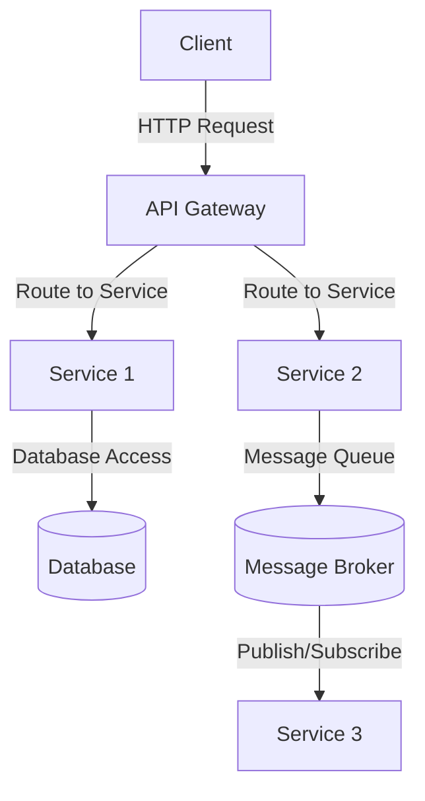

## 10.1 Introduction to Microservices Architecture

Microservices architecture has emerged as a popular approach for building scalable, resilient, and flexible software systems. This architectural style breaks down a monolithic application into smaller, independent services that can be developed, deployed, and scaled independently. Let's delve into the core principles, benefits, and challenges of microservices architecture, and understand how Kotlin can be effectively utilized in this context.

### Understanding Microservices Principles

Microservices architecture is grounded in several key principles that guide its implementation and operation. Understanding these principles is crucial for designing systems that are both efficient and maintainable.

#### 1. **Single Responsibility Principle**

Each microservice is designed to perform a specific business function or domain. This aligns with the Single Responsibility Principle (SRP), which states that a class or module should have one, and only one, reason to change. By adhering to SRP, microservices are easier to understand, develop, and maintain.

#### 2. **Decentralized Data Management**

In a microservices architecture, each service manages its own data. This decentralization allows services to choose the most appropriate data storage technology for their needs, whether it's a relational database, NoSQL store, or an in-memory cache. This autonomy enhances scalability and performance.

#### 3. **Inter-Service Communication**

Microservices communicate with each other using lightweight protocols such as HTTP/REST, gRPC, or message brokers like Kafka or RabbitMQ. These communication mechanisms ensure that services remain loosely coupled, facilitating independent development and deployment.

#### 4. **Continuous Delivery and Deployment**

Microservices architecture supports continuous delivery and deployment, enabling teams to release new features and updates rapidly. This is achieved through automation of the build, test, and deployment processes, reducing the time to market and increasing agility.

#### 5. **Resilience and Fault Tolerance**

Microservices are designed to be resilient and fault-tolerant. Techniques such as circuit breakers, retries, and bulkheads are employed to handle failures gracefully and ensure that the system remains operational even when individual services fail.

#### 6. **Scalability and Flexibility**

Microservices can be scaled independently, allowing organizations to allocate resources where they are most needed. This flexibility is particularly beneficial in handling varying loads and optimizing resource utilization.

#### 7. **Polyglot Programming**

Microservices architecture supports polyglot programming, meaning different services can be written in different programming languages. This allows teams to choose the best language and technology stack for each service, enhancing productivity and innovation.

### Benefits of Microservices Architecture

Adopting a microservices architecture offers several advantages that can significantly impact the development and operation of software systems.

#### 1. **Improved Scalability**

Microservices can be scaled independently, allowing organizations to allocate resources to the most critical services. This granular scalability ensures efficient use of resources and better performance under load.

#### 2. **Enhanced Flexibility**

The modular nature of microservices allows teams to develop, deploy, and update services independently. This flexibility accelerates the development process and enables faster time to market for new features.

#### 3. **Increased Resilience**

Microservices are designed to be resilient to failures. By isolating failures to individual services, the overall system remains operational even when some services experience issues. This enhances the reliability and availability of the system.

#### 4. **Technology Diversity**

Microservices architecture supports the use of different technologies and languages for different services. This polyglot approach allows teams to leverage the best tools for each task, fostering innovation and efficiency.

#### 5. **Faster Time to Market**

The ability to deploy services independently enables rapid iteration and continuous delivery. This accelerates the release of new features and updates, providing a competitive advantage in fast-paced markets.

#### 6. **Better Resource Utilization**

By scaling services independently, organizations can optimize resource allocation and reduce costs. This efficient use of resources is particularly beneficial in cloud environments where costs are tied to resource consumption.

### Challenges of Microservices Architecture

While microservices architecture offers numerous benefits, it also introduces several challenges that must be addressed to ensure successful implementation.

#### 1. **Increased Complexity**

The distributed nature of microservices can lead to increased complexity in managing and orchestrating services. This requires robust tools and practices for monitoring, logging, and managing service dependencies.

#### 2. **Data Consistency**

Ensuring data consistency across distributed services can be challenging. Techniques such as eventual consistency and distributed transactions must be employed to manage data integrity.

#### 3. **Inter-Service Communication**

The reliance on network communication between services introduces latency and potential points of failure. Designing efficient communication patterns and handling failures gracefully is crucial for maintaining performance and reliability.

#### 4. **Security Concerns**

The increased number of services and communication channels can expand the attack surface, making security a critical concern. Implementing robust authentication, authorization, and encryption mechanisms is essential to protect sensitive data and services.

#### 5. **Operational Overhead**

Managing a large number of services can lead to operational overhead. This requires effective tools and practices for deployment, monitoring, and scaling to ensure smooth operation and maintenance.

#### 6. **Cultural Shift**

Adopting microservices architecture often requires a cultural shift within the organization. Teams must embrace DevOps practices, continuous delivery, and cross-functional collaboration to fully realize the benefits of microservices.

### Leveraging Kotlin in Microservices Architecture

Kotlin, with its modern language features and seamless interoperability with Java, is well-suited for building microservices. Let's explore how Kotlin can be leveraged in this architectural style.

#### 1. **Concise and Expressive Syntax**

Kotlin's concise and expressive syntax reduces boilerplate code, making it easier to write and maintain microservices. This enhances developer productivity and reduces the likelihood of errors.

#### 2. **Null Safety**

Kotlin's null safety features help prevent null pointer exceptions, a common source of runtime errors in Java applications. This enhances the reliability and robustness of microservices.

#### 3. **Coroutines for Asynchronous Programming**

Kotlin's coroutines provide a powerful and efficient way to handle asynchronous programming, which is essential in microservices architecture. Coroutines enable developers to write non-blocking code that is easy to read and maintain.

#### 4. **Interoperability with Java**

Kotlin's seamless interoperability with Java allows organizations to leverage existing Java libraries and frameworks in their microservices. This facilitates a smooth transition to Kotlin and maximizes the reuse of existing code.

#### 5. **Support for Functional Programming**

Kotlin's support for functional programming paradigms, such as higher-order functions and lambdas, enables developers to write clean, modular, and testable code. This aligns well with the microservices philosophy of building small, independent services.

#### 6. **Rich Ecosystem and Tooling**

Kotlin has a rich ecosystem of libraries and tools that support microservices development. Frameworks like Ktor and Spring Boot provide robust support for building and deploying microservices with Kotlin.

### Code Example: Building a Simple Microservice with Ktor

Let's build a simple microservice using Ktor, a lightweight framework for building asynchronous servers and clients in Kotlin.

```kotlin
import io.ktor.application.*
import io.ktor.features.ContentNegotiation
import io.ktor.features.DefaultHeaders
import io.ktor.features.StatusPages
import io.ktor.gson.gson
import io.ktor.http.HttpStatusCode
import io.ktor.response.respond
import io.ktor.routing.*
import io.ktor.server.engine.embeddedServer
import io.ktor.server.netty.Netty

fun main() {
    // Start an embedded server with Netty
    embeddedServer(Netty, port = 8080) {
        // Configure application features
        install(DefaultHeaders) // Add default headers to responses
        install(ContentNegotiation) {
            gson { // Use Gson for JSON serialization
                setPrettyPrinting()
            }
        }
        install(StatusPages) {
            exception<Throwable> { cause ->
                call.respond(HttpStatusCode.InternalServerError, cause.localizedMessage)
            }
        }

        // Define routing
        routing {
            get("/") {
                call.respond(mapOf("message" to "Hello, Microservices!"))
            }
            get("/health") {
                call.respond(HttpStatusCode.OK, mapOf("status" to "UP"))
            }
        }
    }.start(wait = true)
}
```

This simple Ktor application demonstrates how to set up a basic microservice with a health check endpoint. The use of `ContentNegotiation` with Gson enables JSON serialization, while `StatusPages` handles exceptions gracefully.

### Try It Yourself

To experiment with this example, try the following modifications:

- **Add a new endpoint**: Create a new route that returns a list of items or a specific item based on a query parameter.
- **Implement error handling**: Customize the error handling logic to return different status codes for different types of exceptions.
- **Integrate a database**: Connect the microservice to a database and implement CRUD operations for a specific resource.

### Visualizing Microservices Architecture

To better understand the structure and flow of a microservices architecture, let's visualize a typical setup using Mermaid.js.



**Diagram Description:** This diagram illustrates a basic microservices architecture with an API Gateway routing requests to different services. Service 1 interacts with a database, while Service 2 communicates with Service 3 through a message broker.

### References and Further Reading

- [Martin Fowler's Microservices Resource Guide](https://martinfowler.com/microservices/)
- [Building Microservices by Sam Newman](https://www.oreilly.com/library/view/building-microservices/9781491950340/)
- [Ktor Documentation](https://ktor.io/docs/welcome.html)

### Knowledge Check

1. **What is the primary benefit of using microservices architecture?**
   - Improved scalability and flexibility.

2. **How do microservices communicate with each other?**
   - Using lightweight protocols such as HTTP/REST or message brokers.

3. **What is a common challenge when implementing microservices?**
   - Managing data consistency across distributed services.

4. **How does Kotlin's null safety feature benefit microservices development?**
   - It prevents null pointer exceptions, enhancing reliability.

5. **What is the role of an API Gateway in microservices architecture?**
   - It routes client requests to the appropriate services.

### Embrace the Journey

Remember, microservices architecture is a journey, not a destination. As you explore this architectural style, you'll encounter both challenges and opportunities for growth. Stay curious, experiment with new tools and techniques, and enjoy the process of building scalable and resilient systems with Kotlin.

## Quiz Time!



### What is a key principle of microservices architecture?

- [x] Single Responsibility Principle
- [ ] Centralized Data Management
- [ ] Monolithic Design
- [ ] Tight Coupling

> **Explanation:** The Single Responsibility Principle is a key principle of microservices architecture, ensuring each service has a specific business function.

### How do microservices typically communicate?

- [x] Using lightweight protocols like HTTP/REST
- [ ] Via direct function calls
- [ ] Through shared memory
- [ ] Using a single database

> **Explanation:** Microservices communicate using lightweight protocols such as HTTP/REST or message brokers, ensuring loose coupling.

### What is a common challenge in microservices architecture?

- [x] Data consistency across services
- [ ] Lack of scalability
- [ ] Inability to use different languages
- [ ] Centralized control

> **Explanation:** Ensuring data consistency across distributed services is a common challenge in microservices architecture.

### What feature of Kotlin helps prevent runtime errors in microservices?

- [x] Null Safety
- [ ] Global Variables
- [ ] Dynamic Typing
- [ ] Manual Memory Management

> **Explanation:** Kotlin's null safety feature helps prevent null pointer exceptions, enhancing reliability.

### What is the role of an API Gateway in a microservices architecture?

- [x] Routing client requests to services
- [ ] Storing service data
- [ ] Compiling code
- [ ] Managing service dependencies

> **Explanation:** An API Gateway routes client requests to the appropriate services in a microservices architecture.

### What is a benefit of using Kotlin for microservices?

- [x] Concise and expressive syntax
- [ ] Lack of interoperability with Java
- [ ] Manual memory management
- [ ] Limited library support

> **Explanation:** Kotlin's concise and expressive syntax reduces boilerplate code, enhancing developer productivity.

### What is a benefit of decentralized data management in microservices?

- [x] Services can choose the most appropriate data storage technology
- [ ] Centralized control of all data
- [ ] Single point of failure
- [ ] Uniform data storage technology

> **Explanation:** Decentralized data management allows services to choose the most appropriate data storage technology, enhancing scalability and performance.

### What is a challenge of inter-service communication in microservices?

- [x] Latency and potential points of failure
- [ ] Direct memory access
- [ ] Lack of communication protocols
- [ ] Inability to scale

> **Explanation:** Inter-service communication introduces latency and potential points of failure, requiring efficient design and failure handling.

### What is a benefit of polyglot programming in microservices?

- [x] Teams can choose the best language for each service
- [ ] Uniform language use across all services
- [ ] Single language dependency
- [ ] Lack of language diversity

> **Explanation:** Polyglot programming allows teams to choose the best language for each service, fostering innovation and efficiency.

### True or False: Microservices architecture requires a cultural shift within organizations.

- [x] True
- [ ] False

> **Explanation:** Adopting microservices architecture often requires a cultural shift within organizations to embrace DevOps practices and cross-functional collaboration.


