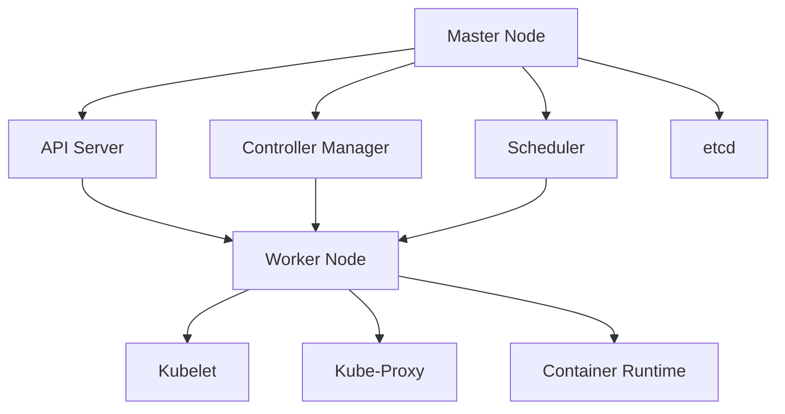

## 10.12 Deployment Patterns

In the realm of microservices architecture, deployment patterns play a critical role in ensuring that applications are scalable, resilient, and maintainable. This section delves into two key technologies that have revolutionized the way we deploy applications: Docker and Kubernetes. We'll explore containerization with Docker and orchestration with Kubernetes and Helm, providing insights and best practices for deploying Kotlin applications in a microservices environment.

### Introduction to Deployment Patterns

Deployment patterns refer to the strategies and methodologies used to deploy software applications. In a microservices architecture, these patterns are crucial for managing the complexity of deploying multiple independent services. Let's start by understanding the basics of containerization and orchestration.

### Containerization with Docker

#### What is Docker?

Docker is a platform that enables developers to automate the deployment of applications inside lightweight, portable containers. Containers are isolated environments that bundle an application and its dependencies, ensuring consistency across different environments.

#### Benefits of Using Docker

- **Portability**: Docker containers can run on any machine that supports Docker, making it easy to move applications between environments.
- **Isolation**: Each container runs in its own isolated environment, preventing conflicts between applications.
- **Scalability**: Docker makes it easy to scale applications horizontally by running multiple instances of a container.
- **Efficiency**: Containers share the host OS kernel, making them more lightweight compared to virtual machines.

#### Docker Architecture

Docker's architecture is based on a client-server model. The Docker client communicates with the Docker daemon, which builds, runs, and manages Docker containers. The key components of Docker architecture include:

- **Docker Client**: The primary interface for interacting with Docker. It communicates with the Docker daemon using the Docker API.
- **Docker Daemon**: The background service responsible for managing Docker containers.
- **Docker Images**: Read-only templates used to create containers. Images are built from Dockerfiles.
- **Docker Containers**: Instances of Docker images that run applications.
- **Docker Registry**: A repository for storing and distributing Docker images.

#### Creating a Docker Image for a Kotlin Application

Let's walk through the process of creating a Docker image for a simple Kotlin application.

**Step 1: Write a Kotlin Application**

```kotlin
// src/main/kotlin/com/example/HelloWorld.kt
package com.example

fun main() {
    println("Hello, Docker!")
}
```

**Step 2: Create a Dockerfile**

A Dockerfile is a script that contains instructions for building a Docker image.

```dockerfile
FROM kotlin:latest

WORKDIR /app

COPY . /app

RUN kotlinc src/main/kotlin/com/example/HelloWorld.kt -include-runtime -d HelloWorld.jar

CMD ["java", "-jar", "HelloWorld.jar"]
```

**Step 3: Build the Docker Image**

Run the following command to build the Docker image:

```bash
docker build -t kotlin-hello-world .
```

**Step 4: Run the Docker Container**

Run the Docker container using the following command:

```bash
docker run kotlin-hello-world
```

You should see the output "Hello, Docker!" printed to the console.

### Orchestration with Kubernetes and Helm

#### What is Kubernetes?

Kubernetes, often abbreviated as K8s, is an open-source platform designed to automate the deployment, scaling, and operation of application containers. It provides a robust framework for running distributed systems resiliently.

#### Key Features of Kubernetes

- **Automated Scheduling**: Kubernetes automatically schedules containers based on resource requirements and constraints.
- **Self-Healing**: Kubernetes restarts failed containers, replaces containers, and kills containers that don't respond to user-defined health checks.
- **Horizontal Scaling**: Kubernetes can scale applications up and down automatically based on CPU utilization or other metrics.
- **Service Discovery and Load Balancing**: Kubernetes provides built-in service discovery and load balancing for containers.

#### Kubernetes Architecture

Kubernetes architecture consists of several key components:

- **Master Node**: The control plane of Kubernetes, responsible for managing the cluster.
  - **API Server**: The front-end for the Kubernetes control plane.
  - **Controller Manager**: Manages controllers that regulate the state of the cluster.
  - **Scheduler**: Assigns workloads to nodes based on resource availability.
  - **etcd**: A distributed key-value store used for storing cluster data.

- **Worker Nodes**: Nodes that run application containers.
  - **Kubelet**: An agent that runs on each node, ensuring containers are running.
  - **Kube-Proxy**: Manages network rules on nodes.
  - **Container Runtime**: The software responsible for running containers (e.g., Docker).

#### Deploying a Kotlin Application on Kubernetes

To deploy a Kotlin application on Kubernetes, you need to define a Kubernetes manifest file that describes the desired state of your application.

**Step 1: Create a Deployment Manifest**

```yaml
apiVersion: apps/v1
kind: Deployment
metadata:
  name: kotlin-hello-world
spec:
  replicas: 3
  selector:
    matchLabels:
      app: kotlin-hello-world
  template:
    metadata:
      labels:
        app: kotlin-hello-world
    spec:
      containers:
      - name: kotlin-hello-world
        image: kotlin-hello-world:latest
        ports:
        - containerPort: 8080
```

**Step 2: Apply the Deployment**

Use the `kubectl` command-line tool to apply the deployment:

```bash
kubectl apply -f deployment.yaml
```

**Step 3: Expose the Deployment**

Create a service to expose the deployment:

```yaml
apiVersion: v1
kind: Service
metadata:
  name: kotlin-hello-world-service
spec:
  type: LoadBalancer
  selector:
    app: kotlin-hello-world
  ports:
  - protocol: TCP
    port: 80
    targetPort: 8080
```

Apply the service:

```bash
kubectl apply -f service.yaml
```

#### Helm: The Kubernetes Package Manager

Helm is a package manager for Kubernetes that simplifies the deployment and management of applications. It uses charts, which are packages of pre-configured Kubernetes resources.

#### Creating a Helm Chart

**Step 1: Create a Helm Chart**

Use the Helm CLI to create a new chart:

```bash
helm create kotlin-hello-world
```

This command creates a directory structure for your chart.

**Step 2: Customize the Chart**

Edit the `values.yaml` file to specify your application's configuration:

```yaml
replicaCount: 3

image:
  repository: kotlin-hello-world
  tag: latest
  pullPolicy: IfNotPresent

service:
  type: LoadBalancer
  port: 80
```

**Step 3: Install the Chart**

Use the Helm CLI to install the chart:

```bash
helm install kotlin-hello-world ./kotlin-hello-world
```

Helm will deploy your application to the Kubernetes cluster using the specified configuration.

### Best Practices for Deployment Patterns

#### Use CI/CD Pipelines

Implement continuous integration and continuous deployment (CI/CD) pipelines to automate the build, test, and deployment processes. Tools like Jenkins, GitHub Actions, and GitLab CI/CD can help streamline these workflows.

#### Monitor and Log Applications

Use monitoring and logging tools to gain insights into your application's performance and health. Tools like Prometheus, Grafana, and ELK Stack (Elasticsearch, Logstash, Kibana) are popular choices for monitoring and logging in Kubernetes environments.

#### Implement Security Best Practices

Ensure your containers and Kubernetes clusters are secure by following best practices such as:

- Running containers with the least privilege.
- Regularly scanning images for vulnerabilities.
- Using network policies to restrict traffic between pods.

#### Optimize Resource Usage

Configure resource requests and limits for your containers to optimize resource usage and prevent resource contention. Use tools like Kubernetes' Horizontal Pod Autoscaler to automatically adjust the number of replicas based on resource utilization.

#### Use Namespaces for Isolation

Organize your Kubernetes resources into namespaces to provide isolation and manage resources more effectively. Namespaces allow you to separate environments (e.g., development, staging, production) within a single cluster.

### Visualizing Deployment Patterns

To better understand the deployment patterns discussed, let's visualize the architecture of a Kubernetes deployment using a Mermaid.js diagram.



**Diagram Description**: This diagram illustrates the architecture of a Kubernetes deployment. The master node components (API Server, Controller Manager, Scheduler, etcd) manage the cluster, while the worker nodes run application containers.

### Try It Yourself

Now that we've covered the basics of deployment patterns, it's time to experiment with the concepts. Try modifying the Dockerfile or Kubernetes manifest files to customize the deployment of your Kotlin application. Consider the following challenges:

- **Challenge 1**: Add environment variables to your Dockerfile and Kubernetes manifest to configure your application.
- **Challenge 2**: Implement a CI/CD pipeline using GitHub Actions to automate the build and deployment of your Docker image.
- **Challenge 3**: Use Helm to deploy a more complex application with multiple services and dependencies.

### Conclusion

Deployment patterns are essential for managing the complexity of microservices architectures. By leveraging Docker for containerization and Kubernetes for orchestration, you can build scalable, resilient, and maintainable applications. Helm further simplifies the deployment process by providing a package manager for Kubernetes. As you continue your journey in mastering deployment patterns, remember to embrace best practices and continuously experiment with new tools and techniques.

## Quiz Time!



### What is the primary benefit of using Docker for application deployment?

- [x] Portability across different environments
- [ ] Increased application performance
- [ ] Simplified code development
- [ ] Enhanced security features

> **Explanation:** Docker's primary benefit is its portability, allowing applications to run consistently across different environments.

### Which component of Kubernetes is responsible for scheduling workloads to nodes?

- [ ] API Server
- [ ] Controller Manager
- [x] Scheduler
- [ ] Kubelet

> **Explanation:** The Scheduler is responsible for assigning workloads to nodes based on resource availability.

### What is the purpose of a Dockerfile?

- [ ] To manage Kubernetes clusters
- [x] To define instructions for building a Docker image
- [ ] To configure network settings
- [ ] To monitor application performance

> **Explanation:** A Dockerfile contains instructions for building a Docker image, specifying the application's environment and dependencies.

### How does Kubernetes ensure self-healing of applications?

- [x] By restarting failed containers
- [ ] By increasing resource allocation
- [ ] By deploying additional nodes
- [ ] By modifying application code

> **Explanation:** Kubernetes ensures self-healing by restarting failed containers and replacing them as needed.

### Which tool is used as a package manager for Kubernetes?

- [ ] Docker
- [ ] Jenkins
- [x] Helm
- [ ] Prometheus

> **Explanation:** Helm is the package manager for Kubernetes, simplifying the deployment and management of applications.

### What is the role of the `kubectl` command-line tool?

- [x] To manage Kubernetes resources
- [ ] To build Docker images
- [ ] To monitor application logs
- [ ] To configure network policies

> **Explanation:** `kubectl` is used to manage Kubernetes resources, including deployments, services, and pods.

### Which of the following is a best practice for securing Kubernetes clusters?

- [x] Running containers with the least privilege
- [ ] Using default network policies
- [ ] Disabling monitoring tools
- [ ] Allowing unrestricted access to the API server

> **Explanation:** Running containers with the least privilege is a security best practice to minimize potential vulnerabilities.

### What is the function of Kubernetes' Horizontal Pod Autoscaler?

- [ ] To monitor application logs
- [x] To automatically adjust the number of replicas based on resource utilization
- [ ] To configure network settings
- [ ] To manage Docker images

> **Explanation:** The Horizontal Pod Autoscaler automatically adjusts the number of replicas based on resource utilization, ensuring optimal performance.

### Which command is used to build a Docker image from a Dockerfile?

- [ ] docker run
- [x] docker build
- [ ] docker push
- [ ] docker pull

> **Explanation:** The `docker build` command is used to create a Docker image from a Dockerfile.

### True or False: Helm charts are used to define Kubernetes resources.

- [x] True
- [ ] False

> **Explanation:** Helm charts are packages of pre-configured Kubernetes resources, used to define and manage applications.


