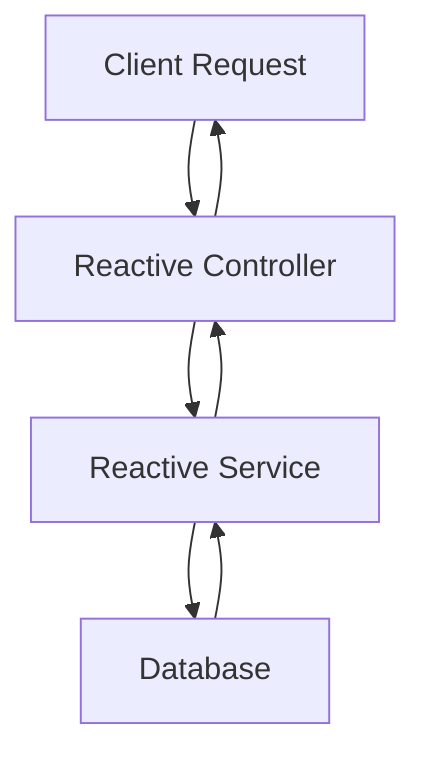

## 10.13 Reactive Microservices

In the ever-evolving landscape of software architecture, microservices have emerged as a dominant paradigm, offering scalability, resilience, and flexibility. As applications grow in complexity, the need for efficient, responsive, and scalable systems becomes paramount. This is where reactive microservices come into play, leveraging the power of reactive programming to create non-blocking, event-driven systems. In this section, we will delve into the world of reactive microservices using Kotlin, exploring the benefits, key concepts, and practical implementation strategies.

### Understanding Reactive Microservices

Reactive microservices are a natural evolution of the microservices architecture, designed to handle high loads and provide responsive user experiences. They are built on the principles of reactive programming, which emphasizes asynchronous data streams and the propagation of change. Reactive microservices are inherently non-blocking, allowing them to handle numerous requests concurrently without being bogged down by thread management.

#### Key Concepts

- **Asynchronous Processing**: Reactive microservices process requests asynchronously, freeing up resources to handle other tasks while waiting for operations to complete.
- **Event-Driven Architecture**: Events are the primary means of communication between services, promoting loose coupling and scalability.
- **Backpressure Handling**: Reactive systems manage data flow and prevent overwhelming consumers by applying backpressure strategies.
- **Resilience and Fault Tolerance**: Reactive microservices are designed to gracefully handle failures, ensuring system stability and reliability.

### Benefits of Reactive Microservices

Reactive microservices offer several advantages over traditional synchronous systems, making them an attractive choice for modern applications.

- **Scalability**: By leveraging non-blocking I/O, reactive microservices can handle a large number of concurrent connections, making them highly scalable.
- **Responsiveness**: Reactive systems provide low-latency responses, enhancing user experience and application performance.
- **Resource Efficiency**: Non-blocking architectures optimize resource utilization, reducing the need for excessive hardware and infrastructure.
- **Resilience**: Built-in fault tolerance mechanisms ensure that reactive microservices can recover from failures and maintain service continuity.

### Implementing Reactive Microservices with Kotlin

Kotlin, with its concise syntax and interoperability with Java, is an excellent choice for building reactive microservices. Let's explore how to implement reactive microservices using Kotlin and popular frameworks like Spring WebFlux and Ktor.

#### Setting Up a Reactive Microservice with Spring WebFlux

Spring WebFlux is a reactive web framework that supports non-blocking operations and is well-suited for building reactive microservices. Here's how you can set up a basic reactive microservice using Spring WebFlux and Kotlin.

##### Step 1: Configure Your Project

First, create a new Kotlin project and add the necessary dependencies for Spring WebFlux. In your `build.gradle.kts` file, include the following:

```kotlin
plugins {
    id("org.springframework.boot") version "3.0.0"
    id("io.spring.dependency-management") version "1.0.11.RELEASE"
    kotlin("jvm") version "1.8.0"
    kotlin("plugin.spring") version "1.8.0"
}

dependencies {
    implementation("org.springframework.boot:spring-boot-starter-webflux")
    implementation("org.jetbrains.kotlin:kotlin-reflect")
    implementation("org.jetbrains.kotlin:kotlin-stdlib-jdk8")
    testImplementation("org.springframework.boot:spring-boot-starter-test")
    testImplementation("io.projectreactor:reactor-test")
}
```

##### Step 2: Create a Reactive Controller

Next, create a reactive controller to handle HTTP requests. Use the `@RestController` annotation to define a RESTful web service.

```kotlin
import org.springframework.web.bind.annotation.GetMapping
import org.springframework.web.bind.annotation.RestController
import reactor.core.publisher.Flux
import java.time.Duration

@RestController
class ReactiveController {

    @GetMapping("/numbers")
    fun getNumbers(): Flux<Int> {
        return Flux.range(1, 10)
            .delayElements(Duration.ofSeconds(1))
    }
}
```

In this example, the `getNumbers` endpoint returns a stream of numbers from 1 to 10, with a delay of one second between each element. The `Flux` type represents a reactive stream that can emit multiple elements over time.

##### Step 3: Run Your Application

To run your reactive microservice, use the `SpringApplication.run` method in your `main` function.

```kotlin
import org.springframework.boot.autoconfigure.SpringBootApplication
import org.springframework.boot.runApplication

@SpringBootApplication
class ReactiveMicroserviceApplication

fun main(args: Array<String>) {
    runApplication<ReactiveMicroserviceApplication>(*args)
}
```

With these steps, you have a basic reactive microservice up and running with Spring WebFlux. The non-blocking nature of the framework allows your service to handle multiple requests efficiently.

#### Visualizing Reactive Microservice Architecture

To better understand the architecture of a reactive microservice, let's visualize the flow of data and events using a Mermaid.js diagram.



**Diagram Description**: This diagram illustrates the flow of a client request through a reactive microservice. The request is handled by a reactive controller, which interacts with a reactive service. The service communicates with a database, and the response is propagated back to the client.

### Advanced Concepts in Reactive Microservices

As you delve deeper into reactive microservices, you'll encounter advanced concepts that enhance the capabilities and resilience of your applications.

#### Backpressure Management

Backpressure is a critical aspect of reactive systems, ensuring that producers do not overwhelm consumers with data. In Kotlin, you can manage backpressure using operators like `onBackpressureBuffer`, `onBackpressureDrop`, and `onBackpressureLatest`.

```kotlin
import reactor.core.publisher.Flux

fun main() {
    val flux = Flux.range(1, 100)
        .onBackpressureBuffer(10) // Buffer up to 10 elements
        .doOnNext { println("Processing $it") }
        .subscribe()
}
```

In this example, the `onBackpressureBuffer` operator buffers up to 10 elements, preventing the consumer from being overwhelmed.

#### Circuit Breakers and Resilience

Circuit breakers are essential for building resilient microservices, allowing systems to gracefully handle failures and prevent cascading issues. Libraries like Resilience4j provide circuit breaker implementations that integrate seamlessly with reactive microservices.

```kotlin
import io.github.resilience4j.circuitbreaker.CircuitBreaker
import io.github.resilience4j.circuitbreaker.CircuitBreakerConfig
import reactor.core.publisher.Mono

fun main() {
    val circuitBreakerConfig = CircuitBreakerConfig.custom()
        .failureRateThreshold(50.0)
        .waitDurationInOpenState(Duration.ofSeconds(5))
        .build()

    val circuitBreaker = CircuitBreaker.of("myCircuitBreaker", circuitBreakerConfig)

    val mono = Mono.fromCallable { "Hello, World!" }
        .transformDeferred(CircuitBreakerOperator.of(circuitBreaker))
        .doOnError { println("Error: ${it.message}") }
        .subscribe { println(it) }
}
```

This code snippet demonstrates how to use Resilience4j to apply a circuit breaker to a reactive stream, enhancing the resilience of your microservice.

### Reactive Microservices with Ktor

Ktor is a lightweight framework for building asynchronous servers and clients in Kotlin. It supports reactive programming paradigms and is well-suited for building reactive microservices.

#### Setting Up a Ktor Project

To create a reactive microservice with Ktor, start by setting up your project with the necessary dependencies. In your `build.gradle.kts` file, include:

```kotlin
plugins {
    kotlin("jvm") version "1.8.0"
    id("io.ktor.plugin") version "2.0.0"
}

dependencies {
    implementation("io.ktor:ktor-server-core:2.0.0")
    implementation("io.ktor:ktor-server-netty:2.0.0")
    implementation("ch.qos.logback:logback-classic:1.2.3")
    testImplementation("io.ktor:ktor-server-tests:2.0.0")
}
```

#### Creating a Reactive Endpoint

Define a reactive endpoint using Ktor's routing DSL. Use the `get` function to handle HTTP GET requests.

```kotlin
import io.ktor.application.*
import io.ktor.http.*
import io.ktor.response.*
import io.ktor.routing.*
import io.ktor.server.engine.*
import io.ktor.server.netty.*

fun main() {
    embeddedServer(Netty, port = 8080) {
        routing {
            get("/hello") {
                call.respondText("Hello, Reactive World!", ContentType.Text.Plain)
            }
        }
    }.start(wait = true)
}
```

This example sets up a simple Ktor server with a reactive endpoint that responds with "Hello, Reactive World!" when accessed.

### Comparing Spring WebFlux and Ktor

Both Spring WebFlux and Ktor offer robust solutions for building reactive microservices, but they have distinct characteristics that may influence your choice.

- **Spring WebFlux**: A comprehensive framework with extensive support for reactive programming, ideal for complex applications requiring integration with other Spring components.
- **Ktor**: A lightweight and flexible framework, perfect for building simple, high-performance microservices with minimal overhead.

### Design Considerations for Reactive Microservices

When designing reactive microservices, consider the following best practices to ensure optimal performance and maintainability.

- **Service Granularity**: Define services with clear boundaries and responsibilities to promote loose coupling and scalability.
- **Data Consistency**: Implement eventual consistency models to handle distributed data across microservices.
- **Monitoring and Logging**: Use tools like Prometheus and Grafana to monitor system performance and identify bottlenecks.
- **Security**: Implement robust authentication and authorization mechanisms to protect sensitive data and prevent unauthorized access.

### Differences and Similarities with Other Patterns

Reactive microservices share similarities with other architectural patterns, such as event-driven architecture and service-oriented architecture (SOA). However, they differ in their emphasis on non-blocking operations and asynchronous communication.

- **Event-Driven Architecture**: Both patterns rely on events for communication, but reactive microservices focus on non-blocking processing and backpressure management.
- **SOA**: While SOA promotes service reuse and integration, reactive microservices prioritize responsiveness and scalability through asynchronous operations.

### Try It Yourself: Building a Reactive Microservice

To solidify your understanding of reactive microservices, try building a simple application that streams real-time data to clients. Experiment with different backpressure strategies and resilience patterns to see how they affect system performance.

### Conclusion

Reactive microservices represent a powerful approach to building scalable, responsive, and resilient systems. By leveraging the capabilities of Kotlin and frameworks like Spring WebFlux and Ktor, you can create non-blocking services that handle high loads efficiently. As you continue your journey in software architecture, embrace the principles of reactive programming to unlock new possibilities and deliver exceptional user experiences.

## Quiz Time!



### What is a key benefit of reactive microservices?

- [x] Scalability
- [ ] Increased latency
- [ ] Synchronous processing
- [ ] Complex thread management

> **Explanation:** Reactive microservices are highly scalable due to their non-blocking nature, allowing them to handle numerous concurrent connections efficiently.

### Which Kotlin framework is lightweight and suitable for building simple reactive microservices?

- [ ] Spring Boot
- [x] Ktor
- [ ] Hibernate
- [ ] JUnit

> **Explanation:** Ktor is a lightweight framework designed for building asynchronous servers and clients, making it ideal for simple reactive microservices.

### What is the purpose of backpressure in reactive systems?

- [ ] To increase data flow
- [x] To prevent overwhelming consumers
- [ ] To block producers
- [ ] To synchronize threads

> **Explanation:** Backpressure is used to manage data flow and prevent producers from overwhelming consumers with too much data.

### Which operator can be used to manage backpressure in a reactive stream?

- [x] onBackpressureBuffer
- [ ] delayElements
- [ ] map
- [ ] filter

> **Explanation:** The `onBackpressureBuffer` operator is used to buffer elements and manage backpressure in a reactive stream.

### What is a key feature of reactive microservices?

- [ ] Blocking I/O
- [x] Asynchronous processing
- [ ] Synchronous communication
- [ ] Tight coupling

> **Explanation:** Reactive microservices utilize asynchronous processing to handle requests efficiently without blocking resources.

### Which library provides circuit breaker implementations for reactive microservices?

- [ ] Spring Data
- [ ] Hibernate
- [x] Resilience4j
- [ ] JUnit

> **Explanation:** Resilience4j offers circuit breaker implementations that integrate seamlessly with reactive microservices to enhance resilience.

### How does Spring WebFlux differ from Ktor?

- [x] Spring WebFlux is more comprehensive and integrates with other Spring components, while Ktor is lightweight and flexible.
- [ ] Spring WebFlux is less comprehensive than Ktor.
- [ ] Ktor is more comprehensive and integrates with other Spring components.
- [ ] Both are identical in features.

> **Explanation:** Spring WebFlux is a comprehensive framework with extensive support for reactive programming, while Ktor is lightweight and flexible, suitable for simple applications.

### What is a common characteristic of both reactive microservices and event-driven architecture?

- [x] Reliance on events for communication
- [ ] Synchronous processing
- [ ] Blocking I/O
- [ ] Tight coupling

> **Explanation:** Both reactive microservices and event-driven architecture rely on events for communication, promoting loose coupling and scalability.

### Which tool can be used for monitoring reactive microservices?

- [ ] Hibernate
- [ ] JUnit
- [x] Prometheus
- [ ] Mockito

> **Explanation:** Prometheus is a monitoring tool that can be used to track the performance and health of reactive microservices.

### True or False: Reactive microservices prioritize synchronous operations for better performance.

- [ ] True
- [x] False

> **Explanation:** Reactive microservices prioritize asynchronous operations to enhance performance and scalability, not synchronous operations.


