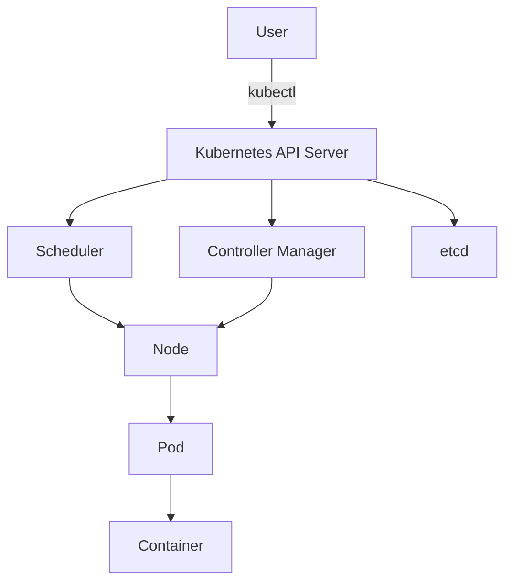

## 10.14 Kubernetes and Cloud Deployment

In the modern software landscape, deploying applications efficiently and reliably is crucial. Kubernetes has emerged as a leading platform for managing containerized applications across clusters of machines. When combined with Kotlin, a language known for its conciseness and safety, developers can build robust microservices that scale seamlessly in the cloud. This section will guide you through deploying Kotlin services to Kubernetes clusters, focusing on infrastructure as code, containerization, and best practices for scalability and resilience.

### Introduction to Kubernetes

Kubernetes, often abbreviated as K8s, is an open-source platform designed to automate deploying, scaling, and operating application containers. It provides a container-centric management environment and is known for its ability to orchestrate complex applications with ease.

#### Key Concepts

- **Cluster**: A set of nodes (physical or virtual machines) that run containerized applications.
- **Node**: A single machine in a Kubernetes cluster.
- **Pod**: The smallest deployable unit in Kubernetes, which can contain one or more containers.
- **Service**: An abstraction that defines a logical set of Pods and a policy to access them.
- **Deployment**: A controller that provides declarative updates to applications.
- **Namespace**: A way to divide cluster resources between multiple users.

### Setting Up a Kubernetes Cluster

Before deploying your Kotlin microservices, you need a Kubernetes cluster. You can set up a local cluster using Minikube or use a cloud provider like Google Kubernetes Engine (GKE), Amazon Elastic Kubernetes Service (EKS), or Azure Kubernetes Service (AKS).

#### Local Setup with Minikube

Minikube is a tool that lets you run Kubernetes locally. It creates a single-node Kubernetes cluster on your machine.

```bash
brew install minikube

minikube start

kubectl get nodes
```

#### Cloud Setup

For production environments, cloud providers offer managed Kubernetes services that simplify cluster management.

- **GKE**: Google Cloud's Kubernetes service.
- **EKS**: Amazon's Kubernetes service.
- **AKS**: Azure's Kubernetes service.

Each provider offers a web console and CLI tools to manage clusters, making it easier to scale and maintain your applications.

### Containerizing Kotlin Applications

To deploy Kotlin applications on Kubernetes, you need to containerize them using Docker. Docker is a platform that enables developers to package applications into containers—standardized units of software that include everything the software needs to run.

#### Creating a Dockerfile

A Dockerfile is a text document that contains all the commands to assemble an image.

```dockerfile
FROM openjdk:11-jre-slim

WORKDIR /app

COPY build/libs/my-kotlin-app.jar .

CMD ["java", "-jar", "my-kotlin-app.jar"]
```

#### Building and Running the Docker Image

```bash
docker build -t my-kotlin-app .

docker run -p 8080:8080 my-kotlin-app
```

### Deploying to Kubernetes

With your Kotlin application containerized, you can deploy it to a Kubernetes cluster.

#### Creating a Deployment

A Deployment provides declarative updates for Pods and ReplicaSets.

```yaml
apiVersion: apps/v1
kind: Deployment
metadata:
  name: my-kotlin-app
spec:
  replicas: 3
  selector:
    matchLabels:
      app: my-kotlin-app
  template:
    metadata:
      labels:
        app: my-kotlin-app
    spec:
      containers:
      - name: my-kotlin-app
        image: my-kotlin-app:latest
        ports:
        - containerPort: 8080
```

#### Exposing the Service

To make your application accessible, you need to create a Service.

```yaml
apiVersion: v1
kind: Service
metadata:
  name: my-kotlin-app-service
spec:
  type: LoadBalancer
  ports:
  - port: 80
    targetPort: 8080
  selector:
    app: my-kotlin-app
```

### Infrastructure as Code

Managing infrastructure as code (IaC) is a practice that allows you to define and manage your infrastructure using configuration files. Tools like Terraform and Helm are popular choices for Kubernetes.

#### Using Helm

Helm is a package manager for Kubernetes that helps you manage Kubernetes applications.

```bash
brew install helm

helm create my-kotlin-app

helm install my-kotlin-app ./my-kotlin-app
```

#### Using Terraform

Terraform is an open-source tool for building, changing, and versioning infrastructure safely and efficiently.

```hcl
provider "kubernetes" {
  config_path = "~/.kube/config"
}

resource "kubernetes_deployment" "my_kotlin_app" {
  metadata {
    name = "my-kotlin-app"
  }
  spec {
    replicas = 3
    selector {
      match_labels = {
        app = "my-kotlin-app"
      }
    }
    template {
      metadata {
        labels = {
          app = "my-kotlin-app"
        }
      }
      spec {
        container {
          image = "my-kotlin-app:latest"
          name  = "my-kotlin-app"
          port {
            container_port = 8080
          }
        }
      }
    }
  }
}
```

### Best Practices for Kubernetes Deployment

1. **Use Namespaces**: Organize your resources using namespaces to avoid conflicts and manage resources efficiently.
2. **Monitor Resource Usage**: Use Kubernetes tools like Prometheus and Grafana to monitor resource usage and application performance.
3. **Implement Autoscaling**: Configure Horizontal Pod Autoscaler to automatically adjust the number of Pods in a deployment.
4. **Secure Your Cluster**: Implement network policies and use RBAC (Role-Based Access Control) to secure your cluster.
5. **Use ConfigMaps and Secrets**: Manage configuration and sensitive data using ConfigMaps and Secrets.

### Visualizing Kubernetes Architecture

Below is a diagram that illustrates the basic architecture of a Kubernetes cluster.



**Caption**: This diagram shows the interaction between the user, Kubernetes API server, and various components like the scheduler, controller manager, and nodes.

### Try It Yourself

Experiment with the provided Kubernetes setup by modifying the number of replicas in the Deployment or changing the container image. Observe how Kubernetes manages these changes and maintains the desired state.

### Knowledge Check

- What is a Pod in Kubernetes?
- How does a Service differ from a Deployment?
- Why is containerization important for Kubernetes?
- What are the benefits of using infrastructure as code?
- How can you secure a Kubernetes cluster?

### Embrace the Journey

Deploying applications on Kubernetes can seem daunting at first, but with practice, it becomes a powerful tool in your development arsenal. Remember, this is just the beginning. As you progress, you'll build more complex and resilient systems. Keep experimenting, stay curious, and enjoy the journey!

## Quiz Time!



### What is a Pod in Kubernetes?

- [x] The smallest deployable unit that can contain one or more containers
- [ ] A single machine in a Kubernetes cluster
- [ ] A set of nodes that run containerized applications
- [ ] An abstraction that defines a logical set of Pods

> **Explanation:** A Pod is the smallest deployable unit in Kubernetes and can contain one or more containers.

### How does a Service differ from a Deployment in Kubernetes?

- [x] A Service provides a stable endpoint for accessing Pods, while a Deployment manages the lifecycle of Pods
- [ ] A Service manages the lifecycle of Pods, while a Deployment provides a stable endpoint
- [ ] Both are used to expose applications to the outside world
- [ ] A Service is used for scaling applications, while a Deployment is not

> **Explanation:** A Service provides a stable endpoint for accessing Pods, whereas a Deployment manages the lifecycle of Pods.

### Why is containerization important for Kubernetes?

- [x] It allows applications to be packaged with all dependencies, ensuring consistency across environments
- [ ] It reduces the need for physical servers
- [ ] It simplifies the code deployment process
- [ ] It eliminates the need for a cloud provider

> **Explanation:** Containerization packages applications with all their dependencies, ensuring consistency across different environments.

### What are the benefits of using infrastructure as code?

- [x] Version control, automation, and consistency
- [ ] Reduced need for cloud resources
- [ ] Increased manual intervention
- [ ] Decreased deployment speed

> **Explanation:** Infrastructure as code allows for version control, automation, and consistency in managing infrastructure.

### How can you secure a Kubernetes cluster?

- [x] Implement network policies and use RBAC
- [ ] Use only public images
- [ ] Disable all security features
- [ ] Allow unrestricted access to the API server

> **Explanation:** Implementing network policies and using RBAC are key strategies for securing a Kubernetes cluster.

### What tool is used to package Kubernetes applications?

- [x] Helm
- [ ] Docker
- [ ] Terraform
- [ ] Minikube

> **Explanation:** Helm is a package manager for Kubernetes that helps manage Kubernetes applications.

### What is the purpose of a ConfigMap in Kubernetes?

- [x] To manage configuration data separately from the application code
- [ ] To store sensitive data securely
- [ ] To scale applications automatically
- [ ] To monitor resource usage

> **Explanation:** ConfigMaps are used to manage configuration data separately from application code.

### What does the Horizontal Pod Autoscaler do?

- [x] Automatically adjusts the number of Pods in a deployment
- [ ] Monitors application performance
- [ ] Provides a stable endpoint for accessing Pods
- [ ] Manages the lifecycle of Pods

> **Explanation:** The Horizontal Pod Autoscaler automatically adjusts the number of Pods in a deployment based on resource usage.

### Which cloud provider offers Google Kubernetes Engine?

- [x] Google Cloud
- [ ] Amazon Web Services
- [ ] Microsoft Azure
- [ ] IBM Cloud

> **Explanation:** Google Kubernetes Engine (GKE) is offered by Google Cloud.

### True or False: Kubernetes can only be used with Docker containers.

- [ ] True
- [x] False

> **Explanation:** Kubernetes can work with various container runtimes, not just Docker.


