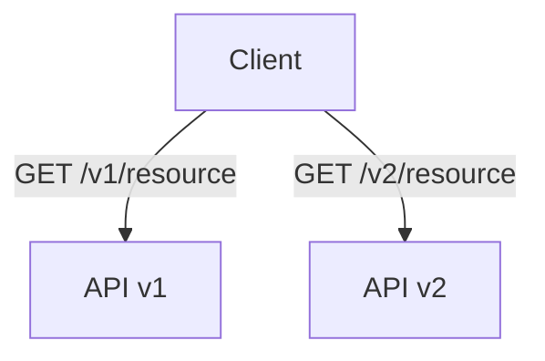
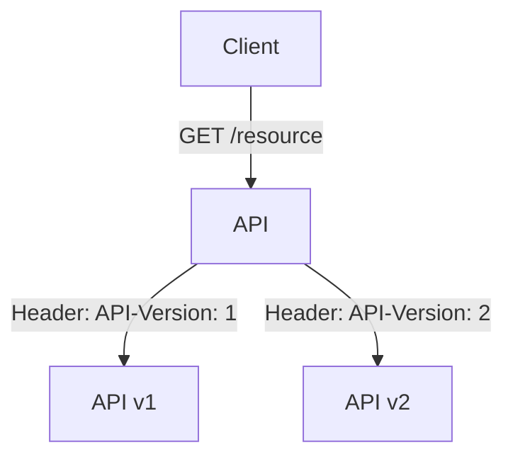

## 10.15 API Versioning and Backward Compatibility

In the dynamic world of software development, APIs (Application Programming Interfaces) play a crucial role in enabling communication between different software components. As systems evolve, maintaining backward compatibility while introducing new features becomes a significant challenge. This section delves into strategies for API versioning and backward compatibility, focusing on Kotlin microservices. We'll explore how to design APIs for extensibility, ensuring they can evolve gracefully without disrupting existing clients.

### Understanding API Versioning

API versioning is the practice of managing changes to an API in a way that allows clients to continue using the existing API while new features or changes are introduced. This is essential for maintaining backward compatibility and ensuring that existing clients are not broken by changes to the API.

#### Why Version APIs?

- **Stability**: Clients rely on APIs for consistent behavior. Versioning ensures that changes do not disrupt existing functionality.
- **Flexibility**: Allows developers to introduce new features or improvements without affecting current users.
- **Deprecation**: Provides a structured way to phase out old features while guiding clients towards newer versions.

#### Types of API Versioning

1. **URL Versioning**: Embedding the version number in the URL path.
   - Example: `https://api.example.com/v1/resource`
2. **Header Versioning**: Using HTTP headers to specify the version.
   - Example: `Accept: application/vnd.example.v1+json`
3. **Query Parameter Versioning**: Including the version as a query parameter.
   - Example: `https://api.example.com/resource?version=1`
4. **Content Negotiation**: Using the `Accept` header to specify the version.
   - Example: `Accept: application/vnd.example.resource+json; version=1`

Each method has its pros and cons, and the choice depends on the specific requirements and constraints of the API and its clients.

### Designing for Extensibility

Designing APIs for extensibility involves anticipating future changes and ensuring that the API can accommodate them without breaking existing clients. Here are some key principles:

#### Use of Semantic Versioning

Semantic Versioning (SemVer) is a versioning scheme that uses three numbers: MAJOR.MINOR.PATCH. It provides a clear and predictable way to manage API changes:

- **MAJOR**: Incremented for incompatible changes.
- **MINOR**: Incremented for backward-compatible functionality.
- **PATCH**: Incremented for backward-compatible bug fixes.

#### Embrace Evolutionary Design

- **Design for Change**: Assume that requirements will change over time. Use interfaces and abstract classes to allow for future extensions.
- **Deprecation Policy**: Clearly communicate deprecated features and provide timelines for their removal.

#### Use Feature Toggles

Feature toggles allow you to enable or disable features at runtime without deploying new code. This can be useful for testing new features with a subset of users before a full rollout.

### Implementing API Versioning in Kotlin

Let's explore how to implement API versioning in a Kotlin-based microservice using the Ktor framework.

#### Setting Up a Ktor Project

First, set up a basic Ktor project. You can use the Ktor project generator or set it up manually.

```kotlin
import io.ktor.application.*
import io.ktor.features.ContentNegotiation
import io.ktor.features.DefaultHeaders
import io.ktor.features.StatusPages
import io.ktor.gson.gson
import io.ktor.response.*
import io.ktor.routing.*
import io.ktor.server.engine.embeddedServer
import io.ktor.server.netty.Netty

fun main() {
    embeddedServer(Netty, port = 8080) {
        install(DefaultHeaders)
        install(ContentNegotiation) {
            gson {
                setPrettyPrinting()
            }
        }
        install(StatusPages)
        routing {
            route("/v1") {
                get("/resource") {
                    call.respond(mapOf("message" to "Hello from API v1"))
                }
            }
            route("/v2") {
                get("/resource") {
                    call.respond(mapOf("message" to "Hello from API v2"))
                }
            }
        }
    }.start(wait = true)
}
```

In this example, we have two versions of the API, `/v1/resource` and `/v2/resource`, each returning a different message.

#### Versioning with Headers

To implement header-based versioning, you can use a custom header to determine the API version.

```kotlin
routing {
    get("/resource") {
        val version = call.request.headers["API-Version"] ?: "1"
        when (version) {
            "1" -> call.respond(mapOf("message" to "Hello from API v1"))
            "2" -> call.respond(mapOf("message" to "Hello from API v2"))
            else -> call.respond(mapOf("error" to "Unsupported API version"))
        }
    }
}
```

This approach allows clients to specify the version they want to use via the `API-Version` header.

### Ensuring Backward Compatibility

Backward compatibility ensures that existing clients continue to function as expected when new versions of an API are released. Here are some strategies to achieve this:

#### Avoid Breaking Changes

- **Additive Changes**: Add new fields or endpoints rather than modifying existing ones.
- **Deprecate Gradually**: Mark features as deprecated before removing them, giving clients time to adapt.

#### Use Default Values

When adding new fields to a response, provide default values to ensure that clients expecting the old response format continue to work.

#### Maintain Consistent Behavior

Ensure that changes do not alter the expected behavior of existing features. This includes maintaining response formats, error codes, and HTTP status codes.

### Handling Deprecation

Deprecation is a critical aspect of API evolution. It involves phasing out old features while guiding clients towards newer versions.

#### Communicate Clearly

- **Documentation**: Clearly document deprecated features and provide alternatives.
- **Deprecation Headers**: Use HTTP headers to inform clients about deprecated features.

#### Provide Migration Paths

Offer clear migration paths for clients to transition from deprecated features to newer ones. This may involve providing tools or scripts to assist in the migration process.

### Testing Versioned APIs

Testing is crucial to ensure that API changes do not introduce regressions or break existing functionality.

#### Automated Tests

- **Unit Tests**: Test individual components and functions.
- **Integration Tests**: Test interactions between components.
- **Regression Tests**: Ensure that new changes do not break existing functionality.

#### Contract Testing

Contract testing ensures that the API meets the expectations of its clients. Tools like Pact can be used to define and verify API contracts.

### Visualizing API Versioning Strategies

To better understand the different API versioning strategies, let's visualize them using Mermaid.js diagrams.

#### URL Versioning



This diagram shows how clients can access different versions of the API using URL versioning.

#### Header Versioning



In this diagram, the client specifies the API version using a custom header.

### Best Practices for API Versioning

- **Consistent Versioning Strategy**: Choose a versioning strategy and apply it consistently across all endpoints.
- **Comprehensive Documentation**: Maintain up-to-date documentation for all API versions.
- **Client Communication**: Regularly communicate with clients about upcoming changes and deprecations.

### Conclusion

API versioning and backward compatibility are essential for evolving APIs without disrupting existing clients. By adopting a structured approach to versioning, designing for extensibility, and ensuring backward compatibility, you can create APIs that are robust, flexible, and future-proof.

Remember, this is just the beginning. As you progress, you'll build more complex and interactive APIs. Keep experimenting, stay curious, and enjoy the journey!

## Quiz Time!



### What is the primary purpose of API versioning?

- [x] To manage changes to an API without disrupting existing clients
- [ ] To increase the complexity of the API
- [ ] To reduce the number of API endpoints
- [ ] To make the API more difficult to use

> **Explanation:** API versioning is primarily used to manage changes to an API in a way that allows existing clients to continue using the API without disruption.

### Which versioning strategy involves embedding the version number in the URL path?

- [x] URL Versioning
- [ ] Header Versioning
- [ ] Query Parameter Versioning
- [ ] Content Negotiation

> **Explanation:** URL Versioning involves embedding the version number directly in the URL path, such as `https://api.example.com/v1/resource`.

### What is Semantic Versioning?

- [x] A versioning scheme using MAJOR.MINOR.PATCH numbers
- [ ] A method of embedding version numbers in URLs
- [ ] A way to specify API versions in HTTP headers
- [ ] A technique for negotiating content types

> **Explanation:** Semantic Versioning (SemVer) is a versioning scheme that uses three numbers (MAJOR.MINOR.PATCH) to indicate different levels of changes.

### What is a key strategy for ensuring backward compatibility?

- [x] Avoiding breaking changes
- [ ] Removing old features immediately
- [ ] Changing response formats frequently
- [ ] Ignoring client feedback

> **Explanation:** Avoiding breaking changes is crucial for ensuring backward compatibility, allowing existing clients to continue functioning as expected.

### How can you inform clients about deprecated features?

- [x] Use HTTP headers and documentation
- [ ] Remove the features without notice
- [ ] Change the API version without documentation
- [ ] Use query parameters

> **Explanation:** Using HTTP headers and documentation to inform clients about deprecated features is a best practice for managing API evolution.

### What is the purpose of contract testing in API development?

- [x] To ensure the API meets client expectations
- [ ] To increase the complexity of the API
- [ ] To reduce the number of API endpoints
- [ ] To make the API more difficult to use

> **Explanation:** Contract testing ensures that the API meets the expectations of its clients, verifying that it behaves as expected.

### Which tool can be used for contract testing in API development?

- [x] Pact
- [ ] JUnit
- [ ] Mockito
- [ ] Gradle

> **Explanation:** Pact is a tool that can be used for contract testing, helping to define and verify API contracts.

### What is a feature toggle?

- [x] A mechanism to enable or disable features at runtime
- [ ] A way to version APIs using query parameters
- [ ] A method for embedding version numbers in URLs
- [ ] A technique for negotiating content types

> **Explanation:** A feature toggle is a mechanism that allows features to be enabled or disabled at runtime, facilitating testing and gradual rollouts.

### Which of the following is NOT a type of API versioning?

- [ ] URL Versioning
- [ ] Header Versioning
- [x] Semantic Versioning
- [ ] Query Parameter Versioning

> **Explanation:** Semantic Versioning is a versioning scheme for software releases, not a type of API versioning.

### True or False: Backward compatibility means that existing clients can continue to function as expected after API changes.

- [x] True
- [ ] False

> **Explanation:** Backward compatibility ensures that existing clients can continue to function as expected even after changes are made to the API.


