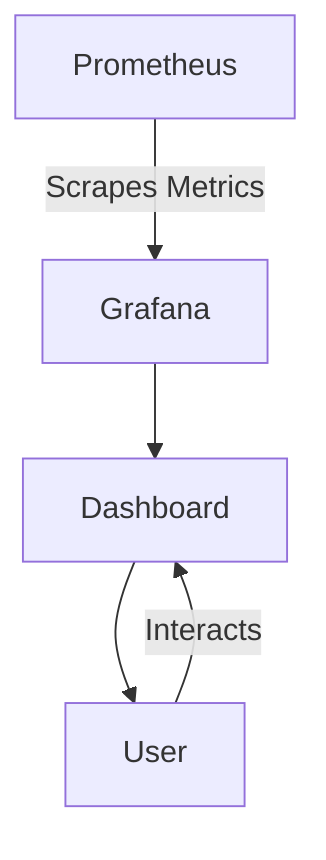

## 10.16 Monitoring and Alerting in Microservices

In the dynamic world of microservices architecture, monitoring and alerting are crucial components that ensure the reliability and performance of distributed systems. As we delve into the intricacies of these practices, we will explore how to implement effective monitoring and alerting strategies using Kotlin, focusing on health checks, setting up alerts, and creating dashboards for comprehensive system observability.

### Introduction to Monitoring and Alerting

Monitoring and alerting in microservices are essential to maintain the health and performance of applications. With the complexity of distributed systems, traditional monitoring approaches often fall short. Therefore, a robust monitoring strategy is necessary to gain insights into system behavior, detect anomalies, and respond to issues promptly.

#### Key Concepts

- **Monitoring**: The process of collecting, analyzing, and visualizing data from various components of a system to understand its performance and health.
- **Alerting**: The mechanism of notifying stakeholders about issues or anomalies detected in the system, enabling timely intervention.

### Implementing Health Checks

Health checks are a fundamental aspect of monitoring in microservices. They provide a way to assess the status of individual services and ensure they are functioning correctly.

#### Types of Health Checks

1. **Liveness Checks**: Determine if the application is running and not stuck in a deadlock.
2. **Readiness Checks**: Verify if the application is ready to handle requests, ensuring it has completed initialization processes.
3. **Startup Checks**: Ensure the application has started correctly before it begins serving traffic.

#### Implementing Health Checks in Kotlin

Let's implement a simple health check in a Kotlin-based microservice using Ktor, a lightweight framework for building asynchronous servers and clients.

```kotlin
import io.ktor.application.*
import io.ktor.response.*
import io.ktor.routing.*
import io.ktor.server.engine.*
import io.ktor.server.netty.*

fun main() {
    embeddedServer(Netty, port = 8080) {
        routing {
            get("/health") {
                call.respondText("OK")
            }
        }
    }.start(wait = true)
}
```

In this example, we define a `/health` endpoint that returns an "OK" response, indicating the service is healthy. This endpoint can be extended to include more complex checks, such as database connectivity or external service availability.

#### Best Practices for Health Checks

- **Keep it Simple**: Health checks should be lightweight and fast, avoiding complex logic.
- **Use Standard Endpoints**: Adopt common endpoint paths like `/health` or `/status` for consistency.
- **Automate Checks**: Integrate health checks into your CI/CD pipeline to catch issues early.

### Setting Up Alerts

Alerts are critical for notifying teams about potential issues in real-time. They help in proactive problem-solving and minimizing downtime.

#### Designing Effective Alerts

1. **Define Clear Criteria**: Alerts should be based on well-defined thresholds and conditions.
2. **Prioritize Alerts**: Categorize alerts by severity to focus on critical issues first.
3. **Reduce Noise**: Avoid alert fatigue by tuning alerts to minimize false positives.

#### Implementing Alerts with Prometheus and Alertmanager

Prometheus is a popular open-source monitoring solution that, when combined with Alertmanager, provides a powerful alerting system.

##### Setting Up Prometheus

1. **Install Prometheus**: Follow the [official installation guide](https://prometheus.io/docs/prometheus/latest/installation/) to set up Prometheus.
2. **Configure Scrape Targets**: Define the endpoints Prometheus should monitor in the `prometheus.yml` configuration file.

```yaml
scrape_configs:
  - job_name: 'kotlin_microservice'
    static_configs:
      - targets: ['localhost:8080']
```

##### Configuring Alertmanager

1. **Install Alertmanager**: Follow the [installation guide](https://prometheus.io/docs/alerting/latest/alertmanager/) to set up Alertmanager.
2. **Define Alert Rules**: Create alert rules in Prometheus to trigger alerts based on specific conditions.

```yaml
groups:
  - name: example
    rules:
      - alert: HighErrorRate
        expr: job:request_errors:rate5m{job="kotlin_microservice"} > 0.05
        for: 5m
        labels:
          severity: critical
        annotations:
          summary: "High error rate detected"
```

3. **Configure Alertmanager**: Set up Alertmanager to handle alerts and send notifications.

```yaml
route:
  receiver: 'team-email'

receivers:
  - name: 'team-email'
    email_configs:
      - to: 'team@example.com'
```

#### Best Practices for Alerting

- **Test Alerts**: Regularly test alert configurations to ensure they trigger as expected.
- **Document Alerts**: Maintain documentation for each alert, including its purpose and resolution steps.
- **Review and Refine**: Continuously review alert effectiveness and adjust thresholds as needed.

### Creating Dashboards

Dashboards provide a visual representation of system metrics, enabling teams to monitor performance and identify trends.

#### Designing Effective Dashboards

1. **Focus on Key Metrics**: Display metrics that provide meaningful insights into system health and performance.
2. **Use Visual Hierarchy**: Organize information logically, with critical metrics prominently displayed.
3. **Enable Interactivity**: Allow users to filter and drill down into data for detailed analysis.

#### Implementing Dashboards with Grafana

Grafana is a powerful open-source tool for visualizing time-series data, often used with Prometheus.

##### Setting Up Grafana

1. **Install Grafana**: Follow the [installation guide](https://grafana.com/docs/grafana/latest/installation/) to set up Grafana.
2. **Add Data Source**: Configure Grafana to use Prometheus as a data source.

##### Creating a Dashboard

1. **Create Panels**: Add panels to display metrics such as CPU usage, memory consumption, and request rates.
2. **Customize Visualizations**: Use different chart types and colors to enhance readability.



*Diagram: Integration of Prometheus and Grafana for Monitoring*

#### Best Practices for Dashboards

- **Keep It Simple**: Avoid clutter by focusing on essential metrics.
- **Use Alerts**: Integrate alerts into dashboards to highlight critical issues.
- **Iterate and Improve**: Regularly update dashboards based on feedback and changing requirements.

### Integrating Monitoring and Alerting in Microservices

Integrating monitoring and alerting into your microservices architecture involves several steps to ensure seamless operation and effective observability.

#### Step-by-Step Integration

1. **Identify Key Metrics**: Determine which metrics are critical for your application's performance and reliability.
2. **Implement Health Checks**: Add health check endpoints to each microservice.
3. **Set Up Monitoring Tools**: Deploy Prometheus and configure it to scrape metrics from your services.
4. **Configure Alerts**: Define alert rules in Prometheus and set up Alertmanager for notifications.
5. **Create Dashboards**: Use Grafana to visualize metrics and monitor system health.
6. **Test and Iterate**: Continuously test the monitoring setup and refine configurations based on insights and feedback.

#### Challenges and Considerations

- **Scalability**: Ensure your monitoring solution can scale with your microservices architecture.
- **Data Retention**: Manage data storage and retention policies to balance cost and accessibility.
- **Security**: Protect monitoring endpoints and data from unauthorized access.

### Conclusion

Monitoring and alerting are vital components of a robust microservices architecture. By implementing effective health checks, setting up alerts, and creating insightful dashboards, you can ensure the reliability and performance of your applications. Remember, this is just the beginning. As you progress, you'll build more complex monitoring solutions that provide deeper insights into your systems. Keep experimenting, stay curious, and enjoy the journey!

## Quiz Time!



### What is the primary purpose of health checks in microservices?

- [x] To assess the status of individual services and ensure they are functioning correctly.
- [ ] To provide a user interface for service management.
- [ ] To replace manual testing processes.
- [ ] To automate deployment processes.

> **Explanation:** Health checks are used to determine the status of services and ensure they are operational.

### Which of the following is a best practice for designing alerts?

- [x] Define clear criteria and prioritize alerts by severity.
- [ ] Use generic criteria for all alerts.
- [ ] Ignore alert noise and focus on quantity.
- [ ] Set alerts for every possible metric.

> **Explanation:** Alerts should be based on clear criteria and prioritized to focus on critical issues.

### What tool is commonly used with Prometheus for visualizing metrics?

- [x] Grafana
- [ ] Kibana
- [ ] Splunk
- [ ] Tableau

> **Explanation:** Grafana is a popular tool for visualizing time-series data from Prometheus.

### What is the role of Alertmanager in a monitoring setup?

- [x] To handle alerts and send notifications.
- [ ] To collect and store metrics.
- [ ] To provide a user interface for dashboards.
- [ ] To manage data retention policies.

> **Explanation:** Alertmanager is responsible for handling alerts and sending notifications.

### Which of the following is a type of health check?

- [x] Liveness Check
- [ ] Performance Check
- [ ] Security Check
- [ ] Compliance Check

> **Explanation:** Liveness checks determine if the application is running and not stuck in a deadlock.

### What is a key benefit of using dashboards in monitoring?

- [x] They provide a visual representation of system metrics.
- [ ] They automate code deployment.
- [ ] They replace the need for alerts.
- [ ] They eliminate the need for manual testing.

> **Explanation:** Dashboards offer a visual way to monitor system metrics and identify trends.

### How can you reduce alert noise?

- [x] Tune alerts to minimize false positives.
- [ ] Increase the number of alerts.
- [ ] Use generic alert criteria.
- [ ] Ignore alert configurations.

> **Explanation:** Reducing false positives helps minimize alert noise and prevents alert fatigue.

### What is a common challenge when integrating monitoring in microservices?

- [x] Ensuring scalability of the monitoring solution.
- [ ] Automating deployment processes.
- [ ] Designing user interfaces for monitoring tools.
- [ ] Managing code repositories.

> **Explanation:** Scalability is a challenge as the monitoring solution must handle the growth of microservices.

### Which tool is used to scrape metrics from microservices?

- [x] Prometheus
- [ ] Grafana
- [ ] Alertmanager
- [ ] Elasticsearch

> **Explanation:** Prometheus is used to scrape metrics from various endpoints in microservices.

### True or False: Health checks should be complex and include detailed logic.

- [ ] True
- [x] False

> **Explanation:** Health checks should be simple and fast, avoiding complex logic to ensure quick assessments.


