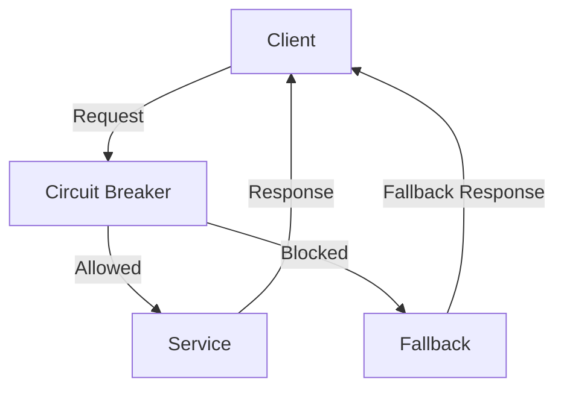

## 10.17 Circuit Breaker and Fault Tolerance

In the world of microservices, ensuring the resilience and reliability of your applications is paramount. The Circuit Breaker pattern is a critical design pattern that helps achieve fault tolerance in distributed systems. In this section, we'll delve into the Circuit Breaker pattern, its importance in microservices architecture, and how to implement it in Kotlin using popular libraries like Hystrix and Resilience4j.

### Design Pattern Name: Circuit Breaker

#### Category
- Microservices Design Patterns
- Fault Tolerance Patterns

#### Intent
The Circuit Breaker pattern is designed to prevent an application from repeatedly trying to execute an operation that is likely to fail. It acts as a proxy between the application and the service, monitoring for failures and temporarily blocking requests to a failing service to allow it time to recover.

#### Key Participants
- **Client**: The component that makes requests to the service.
- **Circuit Breaker**: Monitors the requests and responses, and decides whether to allow or block requests.
- **Service**: The target service that the client is trying to access.

#### Applicability
Use the Circuit Breaker pattern when:
- You have a distributed system with multiple microservices.
- You need to handle transient failures gracefully.
- You want to improve the resilience of your application by preventing cascading failures.

### Understanding the Circuit Breaker Pattern

The Circuit Breaker pattern is inspired by electrical circuit breakers that prevent electrical overloads. Similarly, in software, a Circuit Breaker prevents an application from making requests to a service that is likely to fail. It has three main states:

1. **Closed**: Requests are allowed to pass through. The Circuit Breaker monitors the success and failure rates.
2. **Open**: Requests are blocked for a specified period. This state is triggered when the failure rate exceeds a threshold.
3. **Half-Open**: A limited number of requests are allowed to pass through to test if the service has recovered.

#### Diagram: Circuit Breaker State Transitions

```mermaid
stateDiagram-v2
    [*] --> Closed
    Closed --> Open: Failure Threshold Exceeded
    Open --> Half-Open: Timeout Expired
    Half-Open --> Closed: Successful Requests
    Half-Open --> Open: Failure Threshold Exceeded
```

**Description**: This diagram illustrates the state transitions of a Circuit Breaker. It starts in the Closed state, transitions to Open when failures exceed a threshold, and moves to Half-Open after a timeout to test recovery.

### Implementing Circuit Breaker in Kotlin

#### Using Resilience4j

Resilience4j is a lightweight, easy-to-use fault tolerance library designed for Java and Kotlin applications. It provides several resilience patterns, including Circuit Breaker, Rate Limiter, Retry, and Bulkhead.

##### Setting Up Resilience4j

To use Resilience4j in a Kotlin project, add the following dependency to your `build.gradle.kts` file:

```kotlin
dependencies {
    implementation("io.github.resilience4j:resilience4j-circuitbreaker:1.7.1")
}
```

##### Configuring a Circuit Breaker

Here's how you can configure a Circuit Breaker using Resilience4j:

```kotlin
import io.github.resilience4j.circuitbreaker.CircuitBreaker
import io.github.resilience4j.circuitbreaker.CircuitBreakerConfig
import io.github.resilience4j.circuitbreaker.CircuitBreakerRegistry
import java.time.Duration

fun createCircuitBreaker(): CircuitBreaker {
    val circuitBreakerConfig = CircuitBreakerConfig.custom()
        .failureRateThreshold(50.0f)
        .waitDurationInOpenState(Duration.ofSeconds(30))
        .permittedNumberOfCallsInHalfOpenState(3)
        .slidingWindowSize(10)
        .build()

    val circuitBreakerRegistry = CircuitBreakerRegistry.of(circuitBreakerConfig)
    return circuitBreakerRegistry.circuitBreaker("myCircuitBreaker")
}
```

**Explanation**: This code snippet demonstrates how to create a Circuit Breaker with a custom configuration. It sets a failure rate threshold of 50%, a wait duration of 30 seconds in the Open state, and allows 3 calls in the Half-Open state.

##### Using the Circuit Breaker

To use the Circuit Breaker, wrap your service call in a `Supplier` and execute it through the Circuit Breaker:

```kotlin
import io.github.resilience4j.circuitbreaker.CircuitBreaker
import io.github.resilience4j.circuitbreaker.CircuitBreakerRegistry
import java.util.function.Supplier

fun main() {
    val circuitBreaker = createCircuitBreaker()

    val supplier = Supplier {
        // Simulate a service call
        println("Calling service...")
        if (Math.random() > 0.5) {
            throw RuntimeException("Service failure")
        }
        "Service response"
    }

    val decoratedSupplier = CircuitBreaker.decorateSupplier(circuitBreaker, supplier)

    try {
        val result = decoratedSupplier.get()
        println("Service call successful: $result")
    } catch (e: Exception) {
        println("Service call failed: ${e.message}")
    }
}
```

**Explanation**: This example shows how to use a Circuit Breaker to protect a service call. The `decorateSupplier` method wraps the service call, allowing the Circuit Breaker to monitor its success and failure.

#### Using Hystrix

Hystrix is a fault tolerance library developed by Netflix. Although it's now in maintenance mode, it's still widely used in many legacy systems. Hystrix provides a Circuit Breaker pattern along with other resilience features.

##### Setting Up Hystrix

To use Hystrix in a Kotlin project, add the following dependency to your `build.gradle.kts` file:

```kotlin
dependencies {
    implementation("com.netflix.hystrix:hystrix-core:1.5.18")
}
```

##### Implementing a Circuit Breaker with Hystrix

Here's how you can implement a Circuit Breaker using Hystrix:

```kotlin
import com.netflix.hystrix.HystrixCommand
import com.netflix.hystrix.HystrixCommandGroupKey

class MyServiceCommand : HystrixCommand<String>(
    HystrixCommandGroupKey.Factory.asKey("MyServiceGroup")
) {
    override fun run(): String {
        // Simulate a service call
        println("Calling service...")
        if (Math.random() > 0.5) {
            throw RuntimeException("Service failure")
        }
        return "Service response"
    }

    override fun getFallback(): String {
        return "Fallback response"
    }
}

fun main() {
    val command = MyServiceCommand()
    val result = command.execute()
    println("Service call result: $result")
}
```

**Explanation**: This example demonstrates how to use Hystrix to implement a Circuit Breaker. The `MyServiceCommand` class extends `HystrixCommand`, and the `run` method contains the logic for the service call. The `getFallback` method provides a fallback response in case of failure.

### Design Considerations

#### When to Use Circuit Breaker

- **Transient Failures**: Use Circuit Breaker to handle transient failures that are likely to resolve themselves.
- **Cascading Failures**: Prevent cascading failures by stopping requests to a failing service.
- **Service Recovery**: Allow services time to recover by temporarily blocking requests.

#### Important Considerations

- **Timeouts**: Configure appropriate timeouts for your Circuit Breaker to avoid blocking requests for too long.
- **Fallback Strategies**: Implement fallback strategies to provide default responses or alternative actions when a service fails.
- **Monitoring and Metrics**: Use monitoring tools to track the state of your Circuit Breakers and analyze failure patterns.

### Differences and Similarities

#### Resilience4j vs. Hystrix

- **Resilience4j**: Lightweight, modular, and designed for Java 8 and above. It supports functional programming and is easy to integrate with Kotlin.
- **Hystrix**: Older, with a broader feature set but now in maintenance mode. It has a more complex configuration and is less suited for modern Kotlin applications.

### Visualizing Circuit Breaker in Microservices

To better understand how Circuit Breakers fit into a microservices architecture, consider the following diagram:



**Description**: This diagram illustrates the flow of requests and responses in a microservices architecture with a Circuit Breaker. The Circuit Breaker decides whether to allow or block requests to the service, and provides a fallback response if necessary.

### Try It Yourself

Experiment with the provided code examples by modifying the failure rate threshold, wait duration, and other configuration parameters. Observe how these changes affect the behavior of the Circuit Breaker.

### Knowledge Check

- What are the three states of a Circuit Breaker?
- How does the Circuit Breaker pattern help prevent cascading failures?
- What are the key differences between Resilience4j and Hystrix?

### Embrace the Journey

Remember, implementing Circuit Breakers is just one step towards building resilient microservices. As you progress, you'll explore other patterns and techniques to enhance the reliability of your applications. Keep experimenting, stay curious, and enjoy the journey!

## Quiz Time!



### What is the primary purpose of the Circuit Breaker pattern?

- [x] To prevent an application from repeatedly trying to execute an operation that is likely to fail.
- [ ] To ensure that all requests are processed, regardless of service availability.
- [ ] To improve the speed of service calls.
- [ ] To reduce the cost of service operations.

> **Explanation:** The Circuit Breaker pattern is designed to prevent an application from making requests to a service that is likely to fail, thereby improving fault tolerance.

### Which library is lightweight and designed for Java 8 and above, making it suitable for Kotlin applications?

- [x] Resilience4j
- [ ] Hystrix
- [ ] Netflix OSS
- [ ] Spring Cloud

> **Explanation:** Resilience4j is a lightweight library designed for Java 8 and above, making it suitable for modern Kotlin applications.

### In which state does a Circuit Breaker allow a limited number of requests to test if a service has recovered?

- [ ] Closed
- [ ] Open
- [x] Half-Open
- [ ] Fallback

> **Explanation:** In the Half-Open state, a Circuit Breaker allows a limited number of requests to test if the service has recovered.

### What is the fallback strategy in the context of Circuit Breakers?

- [x] Providing default responses or alternative actions when a service fails.
- [ ] Blocking all requests to a service indefinitely.
- [ ] Increasing the number of requests to a failing service.
- [ ] Reducing the failure threshold.

> **Explanation:** A fallback strategy involves providing default responses or alternative actions when a service fails, ensuring continued service availability.

### Which of the following is NOT a state of a Circuit Breaker?

- [ ] Closed
- [ ] Open
- [ ] Half-Open
- [x] Fallback

> **Explanation:** Fallback is not a state of a Circuit Breaker. The states are Closed, Open, and Half-Open.

### What is the main advantage of using Circuit Breakers in microservices?

- [x] Preventing cascading failures and improving system resilience.
- [ ] Increasing the speed of service calls.
- [ ] Reducing the number of microservices.
- [ ] Simplifying service architecture.

> **Explanation:** Circuit Breakers help prevent cascading failures and improve the resilience of a microservices architecture.

### How does Resilience4j differ from Hystrix?

- [x] Resilience4j is lightweight and modular, while Hystrix is older and in maintenance mode.
- [ ] Resilience4j is more complex to configure than Hystrix.
- [ ] Hystrix supports functional programming, while Resilience4j does not.
- [ ] Hystrix is designed for Java 8 and above, while Resilience4j is not.

> **Explanation:** Resilience4j is lightweight and modular, designed for Java 8 and above, while Hystrix is older and in maintenance mode.

### What should be monitored to track the state of Circuit Breakers?

- [x] Failure patterns and metrics
- [ ] The number of microservices
- [ ] The speed of service calls
- [ ] The cost of operations

> **Explanation:** Monitoring failure patterns and metrics helps track the state of Circuit Breakers and analyze their effectiveness.

### True or False: Hystrix is still actively developed and maintained.

- [ ] True
- [x] False

> **Explanation:** Hystrix is in maintenance mode and is no longer actively developed.

### Which state of a Circuit Breaker blocks requests to a failing service?

- [ ] Closed
- [x] Open
- [ ] Half-Open
- [ ] Fallback

> **Explanation:** In the Open state, a Circuit Breaker blocks requests to a failing service to allow it time to recover.


