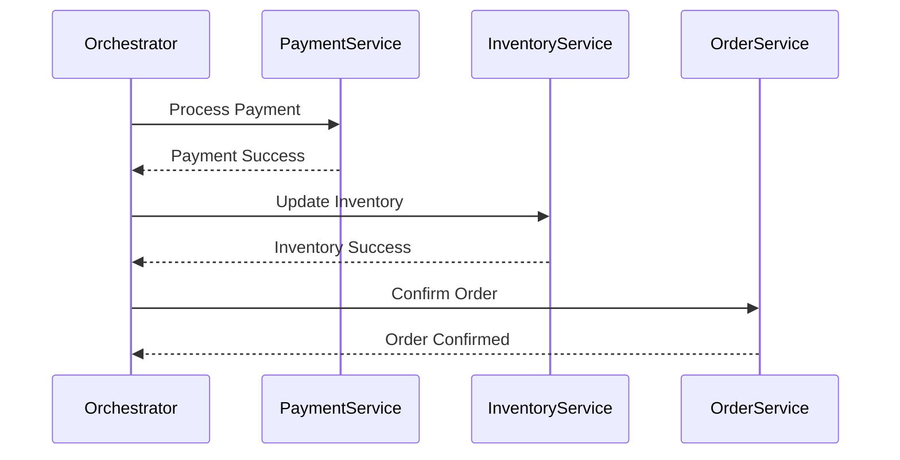
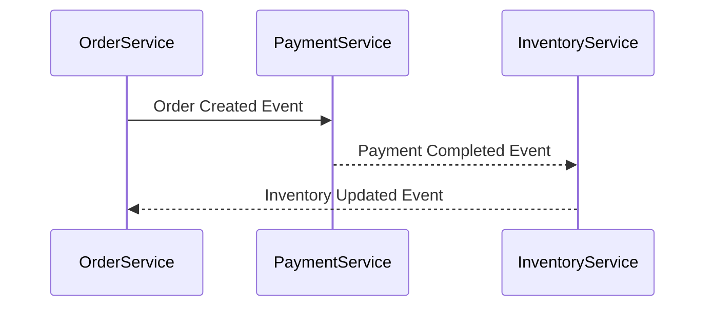

## 10.18 Saga Pattern

In the world of microservices, managing distributed transactions is a critical challenge. The Saga Pattern offers a robust solution for ensuring data consistency across multiple services without the need for traditional ACID transactions. In this section, we will explore the Saga Pattern, focusing on its implementation in Kotlin microservices through orchestration and choreography.

### Introduction to the Saga Pattern

The Saga Pattern is a design pattern used to manage distributed transactions in microservices architectures. Unlike traditional monolithic systems where a single transaction can span multiple operations, microservices require a different approach due to their decentralized nature. The Saga Pattern breaks down a large transaction into a series of smaller, manageable transactions, each handled by a different microservice.

#### Key Concepts

- **Saga**: A sequence of transactions that together fulfill a business requirement. Each transaction updates the data within a single service and publishes an event or message.
- **Compensation**: If a transaction fails, the Saga Pattern uses compensating transactions to undo the changes made by previous transactions.
- **Orchestration**: A centralized approach where a coordinator service manages the sequence and execution of transactions.
- **Choreography**: A decentralized approach where each service involved in the saga listens for events and decides whether to proceed or compensate based on the event.

### Why Use the Saga Pattern?

The Saga Pattern is particularly useful in microservices for several reasons:

- **Scalability**: By breaking down transactions into smaller parts, each service can scale independently.
- **Resilience**: Compensating transactions allow the system to recover from failures gracefully.
- **Decoupling**: Services remain independent, reducing the risk of cascading failures.

### Implementing the Saga Pattern in Kotlin

Kotlin, with its expressive syntax and powerful features, is an excellent choice for implementing the Saga Pattern. Let's explore how to implement both orchestration and choreography sagas in Kotlin.

#### Orchestration-Based Saga

In an orchestration-based saga, a central orchestrator service coordinates the execution of transactions across multiple services.

##### Steps to Implement

1. **Define the Saga**: Identify the sequence of transactions and their compensating actions.
2. **Create the Orchestrator**: Implement a service that manages the saga's lifecycle, including starting transactions, handling failures, and invoking compensations.
3. **Implement Services**: Each service should expose endpoints for executing transactions and compensations.
4. **Handle Events**: Use event-driven communication to notify the orchestrator of transaction outcomes.

##### Sample Code

Let's consider a simple example of a saga for processing an order:

```kotlin
// Orchestrator Service
class OrderSagaOrchestrator {

    fun processOrder(orderId: String) {
        try {
            val paymentSuccess = processPayment(orderId)
            if (!paymentSuccess) throw Exception("Payment failed")

            val inventorySuccess = updateInventory(orderId)
            if (!inventorySuccess) throw Exception("Inventory update failed")

            confirmOrder(orderId)
        } catch (e: Exception) {
            compensateOrder(orderId)
        }
    }

    private fun processPayment(orderId: String): Boolean {
        // Call payment service
        return true // Assume success
    }

    private fun updateInventory(orderId: String): Boolean {
        // Call inventory service
        return true // Assume success
    }

    private fun confirmOrder(orderId: String) {
        // Confirm the order
    }

    private fun compensateOrder(orderId: String) {
        // Compensate previous transactions
    }
}
```

##### Design Considerations

- **Centralized Control**: The orchestrator has full control over the saga, simplifying error handling.
- **Single Point of Failure**: The orchestrator can become a bottleneck or single point of failure.

#### Choreography-Based Saga

In a choreography-based saga, there is no central orchestrator. Instead, each service listens for events and decides its actions based on those events.

##### Steps to Implement

1. **Define Events**: Identify the events that trigger transactions and compensations.
2. **Implement Event Listeners**: Each service listens for relevant events and performs actions accordingly.
3. **Publish Events**: After completing a transaction, services publish events for others to consume.

##### Sample Code

Here's an example of a choreography-based saga for the same order processing scenario:

```kotlin
// Payment Service
class PaymentService {

    fun handleOrderCreated(orderId: String) {
        // Process payment
        val paymentSuccess = true // Assume success
        if (paymentSuccess) {
            publishEvent("PaymentCompleted", orderId)
        } else {
            publishEvent("PaymentFailed", orderId)
        }
    }

    private fun publishEvent(eventType: String, orderId: String) {
        // Publish event to message broker
    }
}

// Inventory Service
class InventoryService {

    fun handlePaymentCompleted(orderId: String) {
        // Update inventory
        val inventorySuccess = true // Assume success
        if (inventorySuccess) {
            publishEvent("InventoryUpdated", orderId)
        } else {
            publishEvent("InventoryUpdateFailed", orderId)
        }
    }

    private fun publishEvent(eventType: String, orderId: String) {
        // Publish event to message broker
    }
}
```

##### Design Considerations

- **Decentralized Control**: Each service is responsible for its part of the saga, increasing resilience.
- **Complexity**: Managing dependencies and compensations can become complex.

### Visualizing the Saga Pattern

To better understand the flow of a saga, let's visualize the orchestration and choreography approaches using Mermaid.js diagrams.

#### Orchestration Saga Flow



#### Choreography Saga Flow



### Differences and Similarities

- **Orchestration vs. Choreography**: Orchestration uses a central controller, while choreography relies on decentralized event handling.
- **Compensation**: Both approaches require compensating transactions for failure recovery.
- **Scalability**: Choreography can scale better due to its decentralized nature.

### When to Use the Saga Pattern

- **Distributed Systems**: Use the Saga Pattern when dealing with distributed systems where traditional transactions are not feasible.
- **Microservices**: Ideal for microservices architectures where services are loosely coupled.
- **Complex Business Processes**: Suitable for complex processes that require coordination across multiple services.

### Try It Yourself

To deepen your understanding of the Saga Pattern, try modifying the sample code:

- **Add a New Service**: Introduce a new service, such as a notification service, and integrate it into the saga.
- **Implement Compensation**: Write compensating transactions for each service to handle failures.
- **Experiment with Events**: Change the events and see how it affects the flow in a choreography-based saga.

### References and Further Reading

- [Microservices Patterns: With examples in Java](https://www.amazon.com/Microservices-Patterns-examples-Chris-Richardson/dp/1617294543)
- [Saga Pattern](https://microservices.io/patterns/data/saga.html) on microservices.io
- [Kotlin Coroutines](https://kotlinlang.org/docs/coroutines-overview.html)

### Knowledge Check

Before we conclude, let's reinforce what we've learned with a few questions:

- What are the main differences between orchestration and choreography in the Saga Pattern?
- How does the Saga Pattern handle failures in distributed transactions?
- Why is the Saga Pattern suitable for microservices architectures?

### Conclusion

The Saga Pattern is a powerful tool for managing distributed transactions in microservices. By understanding and implementing both orchestration and choreography approaches, we can build resilient, scalable systems in Kotlin. Remember, this is just the beginning. As you continue to explore and experiment, you'll discover new ways to leverage the Saga Pattern in your applications. Keep learning, stay curious, and enjoy the journey!

## Quiz Time!



### What is the primary purpose of the Saga Pattern in microservices?

- [x] Managing distributed transactions
- [ ] Improving user interface design
- [ ] Enhancing database performance
- [ ] Simplifying authentication processes

> **Explanation:** The Saga Pattern is primarily used to manage distributed transactions in microservices architectures.

### In an orchestration-based saga, who coordinates the transactions?

- [x] A central orchestrator service
- [ ] Each individual service
- [ ] A database manager
- [ ] The client application

> **Explanation:** In an orchestration-based saga, a central orchestrator service coordinates the transactions.

### What is a compensating transaction?

- [x] An action that undoes the effects of a previous transaction
- [ ] A transaction that increases system performance
- [ ] A transaction that simplifies data storage
- [ ] An action that enhances security protocols

> **Explanation:** A compensating transaction is used to undo the effects of a previous transaction in case of failure.

### Which approach in the Saga Pattern is more decentralized?

- [ ] Orchestration
- [x] Choreography
- [ ] Centralization
- [ ] Synchronization

> **Explanation:** Choreography is a decentralized approach where each service listens for events and acts accordingly.

### How does the Saga Pattern improve scalability?

- [x] By breaking down transactions into smaller parts
- [ ] By centralizing all operations
- [ ] By increasing hardware resources
- [ ] By reducing code complexity

> **Explanation:** The Saga Pattern improves scalability by breaking down transactions into smaller parts, allowing services to scale independently.

### What is a key advantage of using choreography over orchestration?

- [x] Increased resilience due to decentralized control
- [ ] Simplified error handling
- [ ] Centralized management
- [ ] Reduced number of services

> **Explanation:** Choreography offers increased resilience due to its decentralized control, allowing services to manage their own transactions.

### Which Kotlin feature is particularly useful for implementing the Saga Pattern?

- [x] Coroutines
- [ ] Data classes
- [ ] Extension functions
- [ ] Sealed classes

> **Explanation:** Kotlin coroutines are useful for managing asynchronous operations, which are common in the Saga Pattern.

### What is a potential drawback of the orchestration approach?

- [x] Single point of failure
- [ ] Lack of control
- [ ] Increased complexity
- [ ] Decentralized management

> **Explanation:** The orchestrator can become a single point of failure, as it centrally manages the saga.

### In a choreography-based saga, how do services communicate?

- [x] Through events
- [ ] Directly via API calls
- [ ] Using shared databases
- [ ] Through a central orchestrator

> **Explanation:** In a choreography-based saga, services communicate through events, allowing for decentralized control.

### True or False: The Saga Pattern is only applicable to microservices architectures.

- [x] True
- [ ] False

> **Explanation:** The Saga Pattern is specifically designed for managing distributed transactions in microservices architectures.


