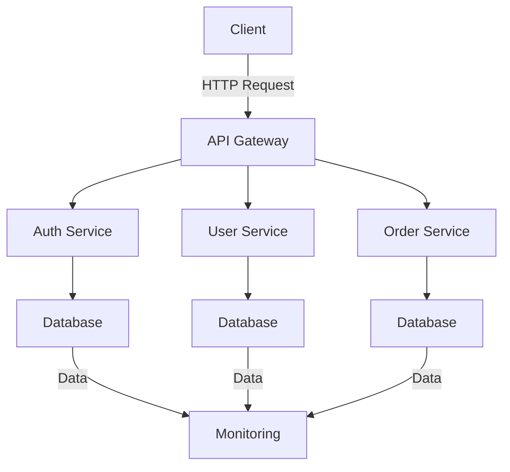

## 10.2 Kotlin in Microservices

In the realm of modern software architecture, microservices have emerged as a pivotal design pattern, enabling scalable, flexible, and maintainable systems. Kotlin, a statically typed programming language developed by JetBrains, has gained significant traction in the microservices landscape, offering a plethora of advantages that make it an ideal choice for building microservices. In this section, we will delve into the advantages of using Kotlin for microservices, explore its unique features, and provide practical examples to illustrate its application in microservices architecture.

### Advantages of Using Kotlin for Microservices

Kotlin's rise in popularity is not without reason. Its seamless interoperability with Java, concise syntax, and support for modern programming paradigms make it a compelling choice for microservices development. Let's explore these advantages in detail:

#### 1. Interoperability with Java

One of Kotlin's standout features is its 100% interoperability with Java. This means that Kotlin can leverage the vast ecosystem of Java libraries and frameworks, making it easier to integrate with existing Java-based microservices. Kotlin can call Java code and vice versa without any compatibility issues, allowing developers to gradually migrate or integrate Kotlin into their existing Java projects.

#### 2. Concise and Expressive Syntax

Kotlin's concise syntax reduces boilerplate code, making the codebase more readable and maintainable. This is particularly beneficial in microservices, where the focus is on building small, independent services. Kotlin's expressive syntax allows developers to write less code while achieving the same functionality, leading to increased productivity and reduced chances of errors.

#### 3. Null Safety

Null pointer exceptions are a common source of runtime errors in Java applications. Kotlin addresses this issue with its built-in null safety features, which help prevent null pointer exceptions at compile time. This feature is crucial in microservices, where reliability and robustness are paramount.

#### 4. Coroutines for Asynchronous Programming

Kotlin's coroutines provide a powerful and efficient way to handle asynchronous programming, which is essential in microservices architecture. Coroutines allow developers to write asynchronous code in a sequential manner, making it easier to read and maintain. This leads to improved performance and responsiveness in microservices, especially when dealing with I/O-bound operations.

#### 5. Support for Functional Programming

Kotlin supports functional programming paradigms, allowing developers to leverage higher-order functions, lambda expressions, and immutability. These features enable developers to write clean, modular, and testable code, which is crucial for building scalable and maintainable microservices.

#### 6. Strong Community and Ecosystem

Kotlin has a vibrant community and a growing ecosystem of libraries and frameworks. This includes support for popular microservices frameworks like Spring Boot and Ktor, as well as tools for testing, dependency injection, and more. The active community ensures that developers have access to a wealth of resources and support when building microservices with Kotlin.

### Building Microservices with Kotlin

Now that we've explored the advantages of using Kotlin for microservices, let's dive into how Kotlin can be used to build microservices. We'll cover key aspects such as setting up a Kotlin microservice, using popular frameworks, and implementing best practices.

#### Setting Up a Kotlin Microservice

To get started with building a microservice in Kotlin, you'll need to set up a development environment. This typically involves installing the Kotlin compiler, setting up a build tool like Gradle or Maven, and choosing a microservices framework. Let's walk through the steps to set up a simple Kotlin microservice using Spring Boot, a popular framework for building microservices.

##### Step 1: Set Up the Development Environment

1. **Install Kotlin**: Ensure that you have the Kotlin compiler installed on your system. You can download it from the [official Kotlin website](https://kotlinlang.org/).

2. **Set Up a Build Tool**: Gradle is a popular choice for Kotlin projects due to its Kotlin DSL support. Install Gradle and configure it for your project.

3. **Choose a Framework**: Spring Boot is a widely used framework for building microservices in Kotlin. It provides features like dependency injection, configuration management, and more.

##### Step 2: Create a New Kotlin Project

Create a new Kotlin project using Gradle. Here's a basic `build.gradle.kts` file to get you started:

```kotlin
plugins {
    kotlin("jvm") version "1.8.0"
    id("org.springframework.boot") version "3.0.0"
    id("io.spring.dependency-management") version "1.0.11.RELEASE"
}

group = "com.example"
version = "0.0.1-SNAPSHOT"
java.sourceCompatibility = JavaVersion.VERSION_17

repositories {
    mavenCentral()
}

dependencies {
    implementation("org.springframework.boot:spring-boot-starter-web")
    implementation("org.jetbrains.kotlin:kotlin-reflect")
    implementation("org.jetbrains.kotlin:kotlin-stdlib-jdk8")
    testImplementation("org.springframework.boot:spring-boot-starter-test")
}

tasks.withType<Test> {
    useJUnitPlatform()
}
```

This configuration sets up a basic Kotlin project with Spring Boot, including dependencies for web development and testing.

##### Step 3: Implement a Simple Microservice

With the project set up, let's implement a simple microservice that exposes a REST API. Create a new Kotlin file, `HelloController.kt`, and add the following code:

```kotlin
package com.example.demo

import org.springframework.web.bind.annotation.GetMapping
import org.springframework.web.bind.annotation.RequestMapping
import org.springframework.web.bind.annotation.RestController

@RestController
@RequestMapping("/api")
class HelloController {

    @GetMapping("/hello")
    fun sayHello(): String {
        return "Hello, Kotlin Microservices!"
    }
}
```

This code defines a REST controller with a single endpoint, `/api/hello`, that returns a greeting message. The use of annotations like `@RestController` and `@GetMapping` is similar to Java, thanks to Kotlin's interoperability.

##### Step 4: Run the Microservice

To run the microservice, use the Gradle `bootRun` task:

```bash
./gradlew bootRun
```

Once the application starts, you can access the endpoint at `http://localhost:8080/api/hello` to see the greeting message.

### Using Kotlin with Popular Microservices Frameworks

Kotlin's versatility allows it to be used with various microservices frameworks. Let's explore how Kotlin integrates with some popular frameworks, including Spring Boot and Ktor.

#### Spring Boot

Spring Boot is a widely used framework for building microservices, and Kotlin's interoperability with Java makes it a natural fit. Spring Boot provides features like dependency injection, configuration management, and more, making it easy to build robust microservices.

**Key Features of Spring Boot with Kotlin:**

- **Dependency Injection**: Spring Boot's dependency injection capabilities allow you to manage dependencies efficiently. Kotlin's concise syntax makes it easier to define beans and components.

- **Configuration Management**: Spring Boot's configuration management features enable you to externalize configuration properties, making your microservices more flexible and easier to manage.

- **Testing Support**: Spring Boot provides comprehensive testing support, allowing you to write unit and integration tests for your microservices.

**Example:**

Here's an example of a simple Spring Boot application in Kotlin that uses dependency injection:

```kotlin
package com.example.demo

import org.springframework.boot.autoconfigure.SpringBootApplication
import org.springframework.boot.runApplication
import org.springframework.context.annotation.Bean
import org.springframework.web.bind.annotation.GetMapping
import org.springframework.web.bind.annotation.RestController

@SpringBootApplication
class DemoApplication {

    @Bean
    fun greetingService(): GreetingService {
        return GreetingService()
    }
}

fun main(args: Array<String>) {
    runApplication<DemoApplication>(*args)
}

@RestController
class GreetingController(val greetingService: GreetingService) {

    @GetMapping("/greet")
    fun greet(): String {
        return greetingService.greet()
    }
}

class GreetingService {
    fun greet(): String {
        return "Hello from Kotlin and Spring Boot!"
    }
}
```

In this example, `GreetingService` is a simple service bean that is injected into the `GreetingController`. The `@SpringBootApplication` annotation marks the entry point of the application.

#### Ktor

Ktor is a lightweight framework for building asynchronous servers and clients in Kotlin. It is designed to be flexible and easy to use, making it a great choice for microservices.

**Key Features of Ktor:**

- **Asynchronous Programming**: Ktor leverages Kotlin's coroutines to provide efficient asynchronous programming capabilities, making it ideal for I/O-bound operations.

- **Modular Architecture**: Ktor's modular architecture allows you to include only the features you need, resulting in lightweight and efficient microservices.

- **Easy Configuration**: Ktor provides a simple and intuitive configuration model, allowing you to set up routes, middleware, and other components with ease.

**Example:**

Here's an example of a simple Ktor application:

```kotlin
import io.ktor.application.*
import io.ktor.http.*
import io.ktor.response.*
import io.ktor.routing.*
import io.ktor.server.engine.*
import io.ktor.server.netty.*

fun main() {
    embeddedServer(Netty, port = 8080) {
        routing {
            get("/hello") {
                call.respondText("Hello, Ktor Microservices!", ContentType.Text.Plain)
            }
        }
    }.start(wait = true)
}
```

In this example, we set up a Ktor server with a single route `/hello` that responds with a greeting message. The use of coroutines makes the server efficient and responsive.

### Best Practices for Building Microservices with Kotlin

Building microservices with Kotlin involves more than just writing code. It requires adhering to best practices to ensure scalability, maintainability, and performance. Let's explore some best practices for building microservices with Kotlin.

#### 1. Embrace Kotlin's Features

Leverage Kotlin's features such as null safety, data classes, and extension functions to write clean and maintainable code. These features help reduce boilerplate code and improve code readability.

#### 2. Use Coroutines for Asynchronous Operations

Kotlin's coroutines provide a powerful way to handle asynchronous operations. Use coroutines to manage I/O-bound tasks, such as database access or network calls, to improve the performance and responsiveness of your microservices.

#### 3. Implement Dependency Injection

Dependency injection is a crucial aspect of microservices architecture. Use frameworks like Spring Boot or Koin to manage dependencies efficiently. This promotes loose coupling and makes your code more modular and testable.

#### 4. Externalize Configuration

Externalize configuration properties using tools like Spring Cloud Config or environment variables. This makes your microservices more flexible and easier to manage, especially in cloud environments.

#### 5. Monitor and Log Effectively

Implement effective logging and monitoring to gain insights into the performance and health of your microservices. Use tools like Prometheus, Grafana, and ELK Stack to collect and visualize metrics and logs.

#### 6. Secure Your Microservices

Security is paramount in microservices architecture. Implement authentication and authorization mechanisms using OAuth2 or JWT. Ensure that sensitive data is encrypted and that your microservices are protected against common security threats.

#### 7. Test Thoroughly

Write comprehensive tests for your microservices, including unit tests, integration tests, and end-to-end tests. Use testing frameworks like JUnit, Kotest, and MockK to ensure the reliability and correctness of your microservices.

### Visualizing Kotlin Microservices Architecture

To better understand the architecture of Kotlin microservices, let's visualize a typical microservices setup using a Mermaid.js diagram.



**Diagram Description:**

- **Client**: Represents the client making HTTP requests to the microservices.
- **API Gateway**: Acts as a single entry point for the client, routing requests to the appropriate microservices.
- **Auth Service**: Handles authentication and authorization, interacting with a database for user credentials.
- **User Service**: Manages user-related operations, interacting with a database for user data.
- **Order Service**: Manages order-related operations, interacting with a database for order data.
- **Monitoring**: Collects and visualizes metrics and logs from the microservices.

This diagram illustrates a basic microservices architecture with an API gateway, multiple services, and a monitoring system. Each service interacts with its own database, promoting loose coupling and scalability.

### Try It Yourself

Now that we've covered the fundamentals of using Kotlin for microservices, it's time to put your knowledge into practice. Try modifying the code examples provided in this section to add new features or experiment with different frameworks. Here are a few ideas to get you started:

- **Add a New Endpoint**: Extend the Spring Boot or Ktor example to add a new endpoint that performs a different operation, such as fetching data from a database.

- **Implement Authentication**: Add authentication to your microservice using OAuth2 or JWT. This will help you understand how to secure your microservices.

- **Integrate with a Database**: Modify the examples to connect to a database and perform CRUD operations. This will give you hands-on experience with database integration in microservices.

- **Experiment with Coroutines**: Use Kotlin's coroutines to handle asynchronous operations in your microservice. Try implementing a long-running task or an I/O-bound operation using coroutines.

### Knowledge Check

Before we wrap up, let's reinforce your understanding of Kotlin in microservices with a few knowledge check questions:

1. What are the key advantages of using Kotlin for microservices?
2. How does Kotlin's interoperability with Java benefit microservices development?
3. Why is null safety important in microservices architecture?
4. How do Kotlin's coroutines improve the performance of microservices?
5. What are some best practices for building microservices with Kotlin?

### Conclusion

Kotlin's unique features and advantages make it an excellent choice for building microservices. Its interoperability with Java, concise syntax, and support for modern programming paradigms enable developers to build scalable, maintainable, and efficient microservices. By leveraging Kotlin's features and adhering to best practices, you can create robust microservices that meet the demands of modern software architecture.

Remember, this is just the beginning. As you continue your journey with Kotlin and microservices, keep experimenting, stay curious, and embrace the power of Kotlin to build innovative and scalable solutions.

## Quiz Time!



### What is one of the main advantages of Kotlin's interoperability with Java in microservices?

- [x] It allows seamless integration with existing Java libraries and frameworks.
- [ ] It requires rewriting all Java code in Kotlin.
- [ ] It limits the use of Java features.
- [ ] It makes Kotlin code incompatible with Java.

> **Explanation:** Kotlin's interoperability with Java allows developers to use existing Java libraries and frameworks without compatibility issues, facilitating integration and migration.

### How does Kotlin's null safety feature benefit microservices development?

- [x] It prevents null pointer exceptions at compile time.
- [ ] It allows null values to be used freely.
- [ ] It requires manual null checks in the code.
- [ ] It disables null handling in microservices.

> **Explanation:** Kotlin's null safety feature helps prevent null pointer exceptions by enforcing null checks at compile time, improving the reliability of microservices.

### Which Kotlin feature is particularly useful for handling asynchronous operations in microservices?

- [x] Coroutines
- [ ] Data classes
- [ ] Extension functions
- [ ] Sealed classes

> **Explanation:** Kotlin's coroutines provide an efficient way to handle asynchronous operations, making them ideal for improving the performance of microservices.

### What is a key benefit of using Spring Boot with Kotlin for microservices?

- [x] Comprehensive support for dependency injection and configuration management.
- [ ] Limited testing capabilities.
- [ ] Incompatibility with Java libraries.
- [ ] Lack of community support.

> **Explanation:** Spring Boot provides robust support for dependency injection and configuration management, making it a popular choice for building microservices with Kotlin.

### What is a best practice for managing configuration in Kotlin microservices?

- [x] Externalize configuration properties using environment variables or configuration management tools.
- [ ] Hardcode configuration values in the code.
- [ ] Use global variables for configuration.
- [ ] Avoid configuration management altogether.

> **Explanation:** Externalizing configuration properties allows for more flexible and manageable microservices, especially in cloud environments.

### Which tool is commonly used for monitoring and visualizing metrics in Kotlin microservices?

- [x] Prometheus
- [ ] Gradle
- [ ] Ktor
- [ ] Kotlin Compiler

> **Explanation:** Prometheus is a widely used tool for monitoring and visualizing metrics in microservices, providing insights into performance and health.

### How can Kotlin's coroutines improve the responsiveness of microservices?

- [x] By allowing asynchronous code to be written in a sequential manner.
- [ ] By blocking threads during I/O operations.
- [ ] By increasing the complexity of the code.
- [ ] By requiring additional libraries for asynchronous programming.

> **Explanation:** Kotlin's coroutines enable asynchronous code to be written in a sequential manner, improving readability and responsiveness without blocking threads.

### What is a common security measure for protecting Kotlin microservices?

- [x] Implementing authentication and authorization using OAuth2 or JWT.
- [ ] Disabling security features.
- [ ] Storing passwords in plain text.
- [ ] Ignoring security threats.

> **Explanation:** Implementing authentication and authorization mechanisms such as OAuth2 or JWT is essential for securing microservices.

### What is the role of an API Gateway in a microservices architecture?

- [x] It acts as a single entry point for client requests, routing them to the appropriate microservices.
- [ ] It stores all data for the microservices.
- [ ] It replaces the need for individual microservices.
- [ ] It handles database operations for microservices.

> **Explanation:** An API Gateway serves as a single entry point for client requests, routing them to the appropriate microservices and providing a layer of abstraction.

### True or False: Kotlin's support for functional programming paradigms is beneficial for writing clean and modular microservices code.

- [x] True
- [ ] False

> **Explanation:** Kotlin's support for functional programming paradigms, such as higher-order functions and immutability, helps developers write clean, modular, and testable code, which is beneficial for microservices.


