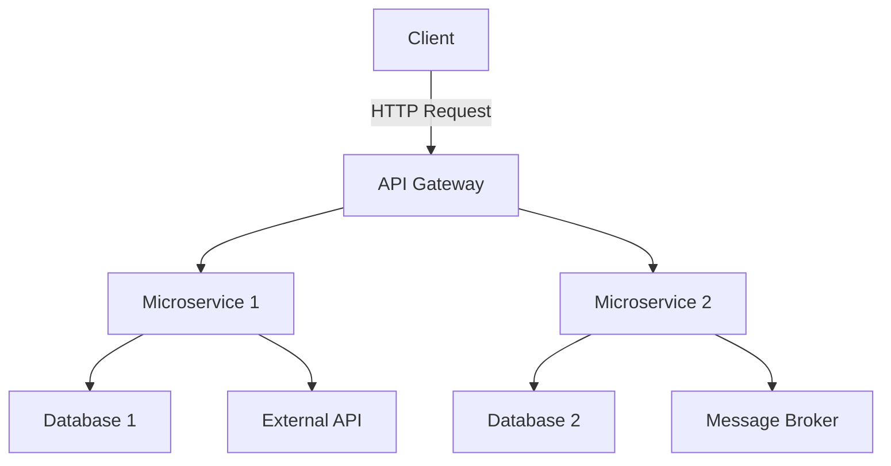

## 10.4 Building Microservices with Spring Boot

In today's rapidly evolving software landscape, microservices have emerged as a powerful architectural style, enabling developers to build scalable and maintainable applications. Spring Boot, a robust framework for building Java-based applications, combined with Kotlin, offers an elegant and efficient way to develop microservices. In this section, we will delve into the process of building microservices with Spring Boot using Kotlin, focusing on dependency injection, configuration, and best practices.

### Understanding Microservices Architecture

Before diving into the specifics of Spring Boot and Kotlin, it's essential to understand the microservices architecture. Microservices are a collection of small, autonomous services that work together. Each service is designed to perform a specific business function and can be developed, deployed, and scaled independently.

#### Key Characteristics of Microservices

- **Decentralization**: Each microservice is a separate entity with its own database and can be developed using different technologies.
- **Scalability**: Services can be scaled independently based on demand, improving resource utilization.
- **Resilience**: The failure of one service does not affect the entire system, enhancing fault tolerance.
- **Continuous Delivery**: Microservices facilitate frequent updates and deployments, supporting agile development practices.

### Leveraging Spring Boot with Kotlin

Spring Boot simplifies the process of building production-ready applications by providing a set of conventions and tools that reduce boilerplate code. When combined with Kotlin, a modern, concise, and expressive language, developers can create microservices that are not only efficient but also easy to maintain.

#### Why Kotlin for Spring Boot?

Kotlin offers several advantages when used with Spring Boot:

- **Conciseness**: Kotlin's syntax is more concise than Java, reducing boilerplate code and improving readability.
- **Null Safety**: Kotlin's type system helps eliminate null pointer exceptions, a common source of runtime errors.
- **Interoperability**: Kotlin is fully interoperable with Java, allowing developers to leverage existing Java libraries and frameworks.
- **Coroutines**: Kotlin's coroutines provide a simple and efficient way to handle asynchronous programming, which is crucial for building responsive microservices.

### Setting Up a Spring Boot Project with Kotlin

Let's start by setting up a Spring Boot project using Kotlin. We'll use Spring Initializr, a web-based tool that simplifies the process of creating a new Spring Boot application.

#### Step-by-Step Guide

1. **Visit Spring Initializr**: Go to [start.spring.io](https://start.spring.io/) to create a new project.
2. **Select Project Settings**:
   - **Project**: Gradle Project
   - **Language**: Kotlin
   - **Spring Boot Version**: Choose the latest stable version.
   - **Group**: com.example
   - **Artifact**: demo
   - **Name**: demo
   - **Package Name**: com.example.demo
   - **Packaging**: Jar
   - **Java Version**: 11 or later

3. **Add Dependencies**:
   - **Spring Web**: For building web applications.
   - **Spring Boot DevTools**: For development-time features.
   - **Spring Data JPA**: For data persistence.
   - **H2 Database**: For an in-memory database.
   - **Spring Security**: For securing the application.

4. **Generate the Project**: Click on the "Generate" button to download the project as a ZIP file.

5. **Import the Project**: Extract the ZIP file and import the project into your favorite IDE (e.g., IntelliJ IDEA).

#### Project Structure

Once the project is set up, you'll see the following structure:

```
demo
├── src
│   ├── main
│   │   ├── kotlin
│   │   │   └── com
│   │   │       └── example
│   │   │           └── demo
│   │   │               └── DemoApplication.kt
│   │   ├── resources
│   │   │   ├── application.properties
│   │   │   └── static
│   │   └── webapp
│   └── test
│       └── kotlin
│           └── com
│               └── example
│                   └── demo
│                       └── DemoApplicationTests.kt
```

### Dependency Injection and Configuration

Dependency injection (DI) is a fundamental concept in Spring Boot, allowing for the decoupling of components and promoting testability. Spring Boot provides a powerful DI mechanism through its `@Autowired` annotation and constructor injection.

#### Constructor Injection in Kotlin

Kotlin's primary constructor syntax makes constructor injection straightforward and concise. Here's an example:

```kotlin
import org.springframework.stereotype.Service

@Service
class GreetingService(private val greetingRepository: GreetingRepository) {

    fun getGreeting(): String {
        return greetingRepository.findGreeting()
    }
}
```

In this example, `GreetingService` depends on `GreetingRepository`. The `GreetingRepository` is injected into the `GreetingService` through the primary constructor.

#### Configuration with Spring Boot

Spring Boot uses a convention-over-configuration approach, allowing developers to focus on writing business logic rather than boilerplate configuration. However, when customization is needed, Spring Boot provides several ways to configure applications.

##### Using `application.properties`

The `application.properties` file is the default configuration file in a Spring Boot application. It allows you to specify various settings, such as server port, database connection details, and more.

```properties
server.port=8081
spring.datasource.url=jdbc:h2:mem:testdb
spring.datasource.driver-class-name=org.h2.Driver
spring.datasource.username=sa
spring.datasource.password=password
```

##### Using `@ConfigurationProperties`

For more complex configurations, you can use the `@ConfigurationProperties` annotation to bind properties to a POJO (Plain Old Java Object).

```kotlin
import org.springframework.boot.context.properties.ConfigurationProperties
import org.springframework.stereotype.Component

@Component
@ConfigurationProperties(prefix = "app")
data class AppConfig(
    var name: String = "",
    var version: String = ""
)
```

In this example, properties prefixed with `app` in the `application.properties` file will be mapped to the `AppConfig` class.

### Building RESTful APIs

RESTful APIs are a common use case for microservices. Spring Boot provides a robust framework for building RESTful services with minimal configuration.

#### Creating a REST Controller

Let's create a simple REST controller that returns a greeting message.

```kotlin
import org.springframework.web.bind.annotation.GetMapping
import org.springframework.web.bind.annotation.RestController

@RestController
class GreetingController(private val greetingService: GreetingService) {

    @GetMapping("/greeting")
    fun getGreeting(): String {
        return greetingService.getGreeting()
    }
}
```

In this example, the `GreetingController` exposes a `/greeting` endpoint that returns a greeting message by calling the `GreetingService`.

#### Handling HTTP Requests

Spring Boot provides annotations to handle different HTTP request methods, such as `@GetMapping`, `@PostMapping`, `@PutMapping`, and `@DeleteMapping`.

```kotlin
import org.springframework.web.bind.annotation.*

@RestController
@RequestMapping("/api")
class UserController(private val userService: UserService) {

    @GetMapping("/users")
    fun getAllUsers(): List<User> {
        return userService.findAllUsers()
    }

    @PostMapping("/users")
    fun createUser(@RequestBody user: User): User {
        return userService.saveUser(user)
    }

    @PutMapping("/users/{id}")
    fun updateUser(@PathVariable id: Long, @RequestBody user: User): User {
        return userService.updateUser(id, user)
    }

    @DeleteMapping("/users/{id}")
    fun deleteUser(@PathVariable id: Long) {
        userService.deleteUser(id)
    }
}
```

### Data Persistence with Spring Data JPA

Spring Data JPA simplifies data access by providing a repository abstraction over JPA (Java Persistence API). It allows you to perform CRUD (Create, Read, Update, Delete) operations with minimal boilerplate code.

#### Creating an Entity

Let's define a simple `User` entity.

```kotlin
import javax.persistence.Entity
import javax.persistence.GeneratedValue
import javax.persistence.GenerationType
import javax.persistence.Id

@Entity
data class User(
    @Id @GeneratedValue(strategy = GenerationType.IDENTITY)
    val id: Long = 0,
    val name: String,
    val email: String
)
```

#### Creating a Repository

Spring Data JPA provides the `JpaRepository` interface, which offers CRUD operations out of the box.

```kotlin
import org.springframework.data.jpa.repository.JpaRepository

interface UserRepository : JpaRepository<User, Long>
```

By extending `JpaRepository`, `UserRepository` inherits methods for saving, deleting, and finding `User` entities.

### Securing Microservices with Spring Security

Security is a critical aspect of microservices. Spring Security provides a comprehensive security framework that can be easily integrated into Spring Boot applications.

#### Basic Authentication

Let's implement basic authentication for our RESTful API.

1. **Add Spring Security Dependency**: Ensure that the Spring Security dependency is included in your `build.gradle.kts` file.

   ```kotlin
   dependencies {
       implementation("org.springframework.boot:spring-boot-starter-security")
   }
   ```

2. **Configure Security**: Create a security configuration class to define security settings.

   ```kotlin
   import org.springframework.context.annotation.Bean
   import org.springframework.security.config.annotation.web.builders.HttpSecurity
   import org.springframework.security.config.annotation.web.configuration.EnableWebSecurity
   import org.springframework.security.config.annotation.web.configuration.WebSecurityConfigurerAdapter
   import org.springframework.security.crypto.bcrypt.BCryptPasswordEncoder
   import org.springframework.security.crypto.password.PasswordEncoder

   @EnableWebSecurity
   class SecurityConfig : WebSecurityConfigurerAdapter() {

       override fun configure(http: HttpSecurity) {
           http
               .authorizeRequests()
               .antMatchers("/api/**").authenticated()
               .and()
               .httpBasic()
       }

       @Bean
       fun passwordEncoder(): PasswordEncoder {
           return BCryptPasswordEncoder()
       }
   }
   ```

In this example, we configure Spring Security to require authentication for all endpoints under `/api/**` and use HTTP Basic authentication.

### Testing Microservices

Testing is an integral part of microservices development. Spring Boot provides several tools and libraries to facilitate testing.

#### Unit Testing with JUnit

JUnit is a popular testing framework for Java and Kotlin. Spring Boot integrates seamlessly with JUnit, allowing you to write unit tests for your application.

```kotlin
import org.junit.jupiter.api.Assertions.assertEquals
import org.junit.jupiter.api.Test
import org.springframework.boot.test.context.SpringBootTest

@SpringBootTest
class GreetingServiceTests(private val greetingService: GreetingService) {

    @Test
    fun testGetGreeting() {
        val greeting = greetingService.getGreeting()
        assertEquals("Hello, World!", greeting)
    }
}
```

#### Integration Testing with Spring Boot

Spring Boot provides support for integration testing, allowing you to test the interaction between different components of your application.

```kotlin
import org.junit.jupiter.api.Test
import org.springframework.boot.test.context.SpringBootTest
import org.springframework.boot.test.web.client.TestRestTemplate
import org.springframework.beans.factory.annotation.Autowired
import org.springframework.boot.web.server.LocalServerPort

@SpringBootTest(webEnvironment = SpringBootTest.WebEnvironment.RANDOM_PORT)
class GreetingControllerTests {

    @LocalServerPort
    private var port: Int = 0

    @Autowired
    private lateinit var restTemplate: TestRestTemplate

    @Test
    fun testGetGreeting() {
        val response = restTemplate.getForObject("http://localhost:$port/greeting", String::class.java)
        assertEquals("Hello, World!", response)
    }
}
```

### Deployment and Scaling

Once your microservices are developed and tested, the next step is deployment. Spring Boot applications can be easily deployed to various environments, including cloud platforms like AWS, Azure, and Google Cloud.

#### Containerization with Docker

Docker is a popular tool for containerizing applications, making them portable and easy to deploy.

1. **Create a Dockerfile**: Define the steps to build a Docker image for your Spring Boot application.

   ```dockerfile
   FROM openjdk:11-jre-slim
   COPY build/libs/demo-0.0.1-SNAPSHOT.jar demo.jar
   ENTRYPOINT ["java", "-jar", "/demo.jar"]
   ```

2. **Build and Run the Docker Image**: Use Docker commands to build and run your application.

   ```bash
   docker build -t demo .
   docker run -p 8080:8080 demo
   ```

#### Orchestration with Kubernetes

Kubernetes is a powerful orchestration tool for managing containerized applications. It provides features like load balancing, scaling, and self-healing.

1. **Create a Kubernetes Deployment**: Define a deployment configuration for your application.

   ```yaml
   apiVersion: apps/v1
   kind: Deployment
   metadata:
     name: demo
   spec:
     replicas: 3
     selector:
       matchLabels:
         app: demo
     template:
       metadata:
         labels:
           app: demo
       spec:
         containers:
         - name: demo
           image: demo:latest
           ports:
           - containerPort: 8080
   ```

2. **Deploy to Kubernetes**: Use `kubectl` commands to deploy your application to a Kubernetes cluster.

   ```bash
   kubectl apply -f deployment.yaml
   ```

### Best Practices for Building Microservices

Building microservices requires careful consideration of various factors to ensure scalability, maintainability, and performance.

#### Design Considerations

- **Loose Coupling**: Ensure that services are loosely coupled and communicate through well-defined APIs.
- **Data Management**: Each microservice should have its own database to avoid tight coupling.
- **Service Discovery**: Use tools like Eureka or Consul for service discovery and load balancing.
- **Resilience**: Implement resilience patterns like circuit breakers and retries to handle failures gracefully.

#### Monitoring and Logging

- **Centralized Logging**: Use tools like ELK Stack (Elasticsearch, Logstash, Kibana) for centralized logging and monitoring.
- **Metrics and Alerts**: Implement metrics collection and alerting using tools like Prometheus and Grafana.

### Try It Yourself

Now that we've covered the essentials of building microservices with Spring Boot and Kotlin, it's time to experiment. Try modifying the code examples to add new features or integrate additional Spring Boot modules. For instance, you can:

- Add a new endpoint to the `GreetingController` that returns a personalized greeting.
- Implement a new service that interacts with an external API.
- Integrate a message broker like RabbitMQ for asynchronous communication between microservices.

### Visualizing Microservices Architecture

To better understand the architecture of microservices, let's visualize the components and their interactions using Mermaid.js.



**Diagram Description**: This diagram illustrates a typical microservices architecture where a client sends an HTTP request to an API Gateway. The API Gateway routes the request to the appropriate microservice. Each microservice interacts with its own database and may communicate with external APIs or message brokers.

### Conclusion

Building microservices with Spring Boot and Kotlin offers a powerful combination of simplicity, efficiency, and scalability. By leveraging Spring Boot's conventions and Kotlin's expressive syntax, developers can create robust microservices that are easy to maintain and extend. Remember, this is just the beginning. As you progress, you'll explore more advanced topics like reactive programming, distributed tracing, and service mesh. Keep experimenting, stay curious, and enjoy the journey!

## Quiz Time!



### What is a key characteristic of microservices architecture?

- [x] Decentralization
- [ ] Monolithic design
- [ ] Tight coupling
- [ ] Single database for all services

> **Explanation:** Microservices architecture is characterized by decentralization, where each service is a separate entity with its own database and can be developed using different technologies.

### Why is Kotlin preferred for Spring Boot microservices?

- [x] Conciseness and null safety
- [ ] Lack of interoperability with Java
- [ ] Requires more boilerplate code
- [ ] Complex syntax

> **Explanation:** Kotlin is preferred for its concise syntax and null safety features, which reduce boilerplate code and improve code quality.

### What is the purpose of the `@ConfigurationProperties` annotation?

- [x] To bind properties to a POJO
- [ ] To define a REST controller
- [ ] To handle HTTP requests
- [ ] To secure the application

> **Explanation:** The `@ConfigurationProperties` annotation is used to bind properties from the `application.properties` file to a POJO for easy configuration management.

### Which annotation is used to create a REST controller in Spring Boot?

- [x] @RestController
- [ ] @Service
- [ ] @Repository
- [ ] @Component

> **Explanation:** The `@RestController` annotation is used to create a REST controller in Spring Boot, allowing the handling of HTTP requests.

### What is the primary advantage of using Docker for Spring Boot applications?

- [x] Portability and ease of deployment
- [ ] Increased application size
- [ ] Reduced performance
- [ ] Complex configuration

> **Explanation:** Docker provides portability and ease of deployment by containerizing applications, making them independent of the underlying infrastructure.

### How does Kubernetes help in managing microservices?

- [x] Load balancing, scaling, and self-healing
- [ ] Reducing application size
- [ ] Increasing complexity
- [ ] Limiting scalability

> **Explanation:** Kubernetes helps in managing microservices by providing features like load balancing, scaling, and self-healing, which enhance the reliability and scalability of applications.

### Which tool is commonly used for centralized logging in microservices?

- [x] ELK Stack
- [ ] Docker
- [ ] Kubernetes
- [ ] Gradle

> **Explanation:** The ELK Stack (Elasticsearch, Logstash, Kibana) is commonly used for centralized logging in microservices, providing powerful search and visualization capabilities.

### What is the role of an API Gateway in microservices architecture?

- [x] Routing requests to appropriate microservices
- [ ] Storing data for all services
- [ ] Handling all business logic
- [ ] Providing a user interface

> **Explanation:** An API Gateway routes requests from clients to the appropriate microservices, acting as a single entry point for the system.

### Which Spring Boot feature simplifies dependency injection?

- [x] @Autowired annotation
- [ ] @RestController annotation
- [ ] @Entity annotation
- [ ] @GetMapping annotation

> **Explanation:** The `@Autowired` annotation simplifies dependency injection by automatically injecting dependencies into Spring-managed beans.

### True or False: Spring Boot applications can only be deployed on cloud platforms.

- [ ] True
- [x] False

> **Explanation:** Spring Boot applications can be deployed on various environments, including on-premises servers, cloud platforms, and container orchestration platforms like Kubernetes.


