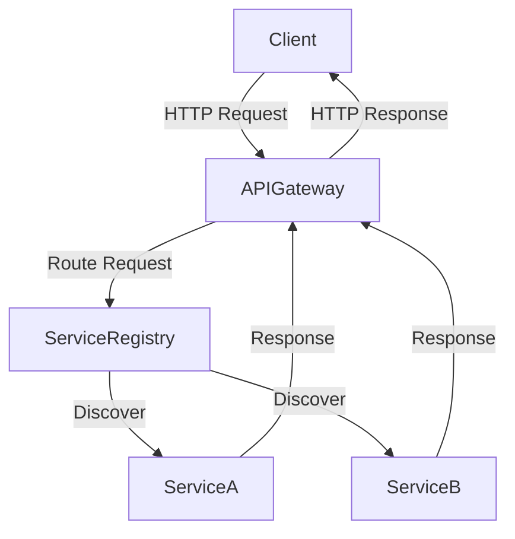

## 10.5 Service Discovery and API Gateways

In the realm of microservices architecture, Service Discovery and API Gateways play pivotal roles in ensuring seamless communication and management of services. In this section, we'll delve into these concepts, exploring how tools like Consul, Eureka, and Zuul facilitate service discovery, and how Spring Cloud Gateway can be leveraged to implement robust API gateways in Kotlin-based microservices.

### Understanding Service Discovery

Service Discovery is a key component in microservices architecture, enabling services to find each other dynamically. It eliminates the need for hard-coded service locations, allowing services to scale, move, or change without disrupting the overall system.

#### Key Concepts of Service Discovery

- **Service Registry**: A central database where service instances register themselves, providing metadata such as IP addresses and ports.
- **Service Registration**: The process by which a service instance registers itself with the service registry.
- **Service Deregistration**: The removal of a service instance from the registry, often triggered when a service shuts down or becomes unavailable.
- **Service Lookup**: The mechanism through which services discover other services by querying the service registry.

### Tools for Service Discovery

Several tools are available for implementing service discovery in microservices. Let's explore some popular options:

#### Consul

Consul is a widely-used service discovery tool that provides a distributed, highly available service registry. It supports health checking, key/value storage, and multi-datacenter deployments.

- **Features**:
  - DNS and HTTP interfaces for service discovery.
  - Built-in health checking to ensure service availability.
  - Key/value store for configuration management.
  - Multi-datacenter support for global deployments.

- **Example**:

```kotlin
// Registering a service with Consul using the Consul API
val consulClient = Consul.builder().build()
val serviceId = "my-service-1"
val serviceName = "my-service"
val servicePort = 8080

val service = ImmutableRegistration.builder()
    .id(serviceId)
    .name(serviceName)
    .port(servicePort)
    .check(Registration.RegCheck.ttl(30L))
    .build()

consulClient.agentClient().register(service)
```

#### Eureka

Eureka, developed by Netflix, is another popular service discovery tool. It is part of the Netflix OSS stack and is designed for cloud-native applications.

- **Features**:
  - Highly available service registry.
  - Client-side load balancing.
  - Self-preservation mode to handle network partitions.

- **Example**:

```kotlin
// Registering a service with Eureka using Spring Cloud
@SpringBootApplication
@EnableEurekaClient
class EurekaClientApplication

fun main(args: Array<String>) {
    runApplication<EurekaClientApplication>(*args)
}
```

#### Zuul

Zuul is a gateway service that provides dynamic routing, monitoring, resiliency, and security. It can also be used for service discovery when combined with Eureka.

- **Features**:
  - Dynamic routing and load balancing.
  - Request filtering for security and monitoring.
  - Integration with Eureka for service discovery.

- **Example**:

```kotlin
// Configuring Zuul with Eureka for service discovery
@SpringBootApplication
@EnableZuulProxy
@EnableEurekaClient
class ZuulGatewayApplication

fun main(args: Array<String>) {
    runApplication<ZuulGatewayApplication>(*args)
}
```

### API Gateways in Microservices

An API Gateway acts as a single entry point for all client requests, routing them to the appropriate microservices. It provides functionalities such as request routing, composition, and protocol translation.

#### Benefits of Using an API Gateway

- **Centralized Authentication**: Handle authentication and authorization in a single place.
- **Load Balancing**: Distribute incoming requests across multiple service instances.
- **Protocol Translation**: Convert between different protocols (e.g., HTTP to WebSocket).
- **Request Aggregation**: Combine responses from multiple services into a single response.

### Implementing API Gateways with Spring Cloud Gateway

Spring Cloud Gateway is a powerful tool for building API gateways on top of the Spring ecosystem. It provides a simple, yet flexible way to route requests and apply filters.

#### Key Features of Spring Cloud Gateway

- **Route Configuration**: Define routes using Java or YAML configuration.
- **Filter Chains**: Apply pre and post-processing filters to requests.
- **Load Balancing**: Integrate with service discovery tools like Eureka for load balancing.

#### Example: Configuring a Simple API Gateway

```yaml
spring:
  cloud:
    gateway:
      routes:
      - id: my-service
        uri: lb://MY-SERVICE
        predicates:
        - Path=/api/my-service/**
        filters:
        - AddRequestHeader=X-Request-Source, Gateway
```

In this example, we configure a route for `MY-SERVICE`, using a load-balanced URI (`lb://`) to route requests based on the path predicate. We also add a custom request header using a filter.

#### Advanced Features

- **Rate Limiting**: Control the rate of requests to prevent abuse.
- **Circuit Breaker**: Implement resilience patterns to handle service failures gracefully.
- **Security**: Integrate with OAuth2 for securing APIs.

### Visualizing Service Discovery and API Gateway Architecture

Let's visualize how service discovery and API gateways fit into a microservices architecture:



**Diagram Description**: This diagram illustrates the flow of a client request through an API Gateway, which routes the request to the appropriate service using a Service Registry for discovery.

### Design Considerations

When implementing service discovery and API gateways, consider the following:

- **Scalability**: Ensure your service registry and API gateway can handle increased load as your system grows.
- **Resilience**: Implement fallback mechanisms to handle service failures gracefully.
- **Security**: Protect your API gateway and service registry from unauthorized access.
- **Performance**: Optimize the routing and filtering logic to minimize latency.

### Differences and Similarities

While Consul, Eureka, and Zuul all provide service discovery capabilities, they differ in their implementation and additional features. Consul offers a more comprehensive solution with key/value storage and multi-datacenter support, while Eureka focuses on cloud-native applications. Zuul, on the other hand, is more of a gateway service with basic service discovery capabilities.

Spring Cloud Gateway and Zuul both serve as API gateways, but Spring Cloud Gateway offers a more modern, reactive approach with better integration into the Spring ecosystem.

### Try It Yourself

Experiment with the code examples provided by modifying the service names, ports, and routes. Try integrating different service discovery tools and observe how they handle service registration and lookup. Implement custom filters in Spring Cloud Gateway to add headers or modify request paths.

### References and Links

- [Consul Documentation](https://www.consul.io/docs)
- [Eureka Documentation](https://cloud.spring.io/spring-cloud-netflix/multi/multi_spring-cloud-eureka-server.html)
- [Zuul Documentation](https://cloud.spring.io/spring-cloud-netflix/multi/multi_spring-cloud-zuul.html)
- [Spring Cloud Gateway Documentation](https://spring.io/projects/spring-cloud-gateway)

### Knowledge Check

- What is the role of a service registry in service discovery?
- How does an API Gateway enhance security in a microservices architecture?
- What are the differences between Consul and Eureka?
- How can Spring Cloud Gateway be used to implement rate limiting?

### Embrace the Journey

Remember, mastering service discovery and API gateways is a journey. As you progress, you'll build more resilient and scalable microservices architectures. Keep experimenting, stay curious, and enjoy the journey!

## Quiz Time!



### What is the primary function of a service registry in microservices?

- [x] To maintain a list of available service instances
- [ ] To handle client authentication
- [ ] To provide data storage for services
- [ ] To manage service configurations

> **Explanation:** A service registry maintains a list of available service instances, allowing services to discover each other dynamically.

### Which tool is known for its integration with the Netflix OSS stack for service discovery?

- [ ] Consul
- [x] Eureka
- [ ] Zuul
- [ ] Spring Cloud Gateway

> **Explanation:** Eureka is part of the Netflix OSS stack and is widely used for service discovery in cloud-native applications.

### What is a key feature of Spring Cloud Gateway?

- [ ] Built-in key/value storage
- [ ] DNS-based service discovery
- [x] Route configuration and filtering
- [ ] Multi-datacenter support

> **Explanation:** Spring Cloud Gateway provides route configuration and filtering capabilities, allowing for flexible request routing and processing.

### How does an API Gateway improve security in a microservices architecture?

- [x] By centralizing authentication and authorization
- [ ] By storing sensitive data
- [ ] By providing direct access to services
- [ ] By managing service configurations

> **Explanation:** An API Gateway centralizes authentication and authorization, ensuring secure access to services.

### What is the purpose of a circuit breaker pattern in an API Gateway?

- [x] To handle service failures gracefully
- [ ] To improve request routing speed
- [ ] To store service configurations
- [ ] To manage service registrations

> **Explanation:** A circuit breaker pattern helps handle service failures gracefully by providing fallback mechanisms.

### Which tool provides a reactive approach to building API gateways?

- [ ] Zuul
- [x] Spring Cloud Gateway
- [ ] Consul
- [ ] Eureka

> **Explanation:** Spring Cloud Gateway offers a reactive approach to building API gateways, integrating well with the Spring ecosystem.

### What is a common use case for using Consul in microservices?

- [x] Service discovery and configuration management
- [ ] Direct client-to-service communication
- [ ] Storing large datasets
- [ ] Managing user authentication

> **Explanation:** Consul is commonly used for service discovery and configuration management in microservices architectures.

### How does Zuul enhance request handling in microservices?

- [x] By providing dynamic routing and filtering
- [ ] By storing service data
- [ ] By managing service lifecycles
- [ ] By handling database transactions

> **Explanation:** Zuul enhances request handling by providing dynamic routing and filtering capabilities.

### What is a benefit of using service discovery in microservices?

- [x] Dynamic service location without hardcoding
- [ ] Increased data storage capacity
- [ ] Direct client-to-service communication
- [ ] Reduced need for authentication

> **Explanation:** Service discovery allows for dynamic service location, eliminating the need for hardcoded service addresses.

### True or False: An API Gateway can perform protocol translation between HTTP and WebSocket.

- [x] True
- [ ] False

> **Explanation:** An API Gateway can perform protocol translation, such as converting between HTTP and WebSocket, to facilitate communication between clients and services.


