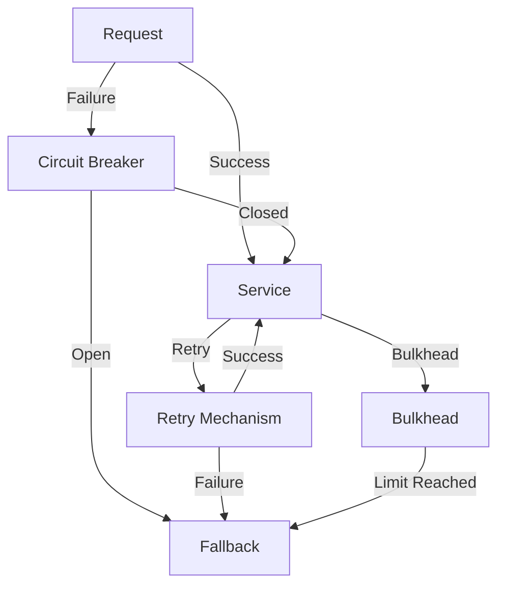

## 10.6 Resilience Patterns

In the world of microservices, resilience is not just a desirable trait; it's a necessity. As systems become more distributed, the likelihood of failures increases. Resilience patterns help us build systems that can withstand and recover from failures gracefully. In this section, we'll explore key resilience patterns such as Circuit Breaker, Retry, Bulkhead, and Fallback strategies, with a focus on implementing them using Kotlin and Resilience4j.

### Understanding Resilience in Microservices

Before diving into specific patterns, let's clarify what resilience means in the context of microservices. Resilience refers to a system's ability to handle failures and continue operating. This involves anticipating potential failures, isolating them, and recovering quickly. Resilience patterns are design strategies that help achieve this robustness.

### Circuit Breaker Pattern

#### Intent

The Circuit Breaker pattern is designed to prevent a system from repeatedly trying to execute an operation that's likely to fail. It acts as a switch that opens when a failure threshold is reached, preventing further attempts and allowing the system to recover.

#### Key Participants

- **Circuit Breaker**: Monitors the operation and opens or closes based on failure rates.
- **Service**: The operation or service being protected by the Circuit Breaker.
- **Fallback**: An alternative action taken when the Circuit Breaker is open.

#### Applicability

Use the Circuit Breaker pattern when:
- You have operations that might fail due to network issues or service unavailability.
- You want to prevent cascading failures in a distributed system.
- You need to provide a fallback mechanism for failed operations.

#### Implementing Circuit Breaker with Resilience4j

Resilience4j is a lightweight fault tolerance library designed for Java and Kotlin. It provides a Circuit Breaker module that can be easily integrated into your Kotlin applications.

```kotlin
import io.github.resilience4j.circuitbreaker.CircuitBreaker
import io.github.resilience4j.circuitbreaker.CircuitBreakerConfig
import io.github.resilience4j.circuitbreaker.CircuitBreakerRegistry
import java.time.Duration

fun main() {
    // Create a custom configuration for the Circuit Breaker
    val circuitBreakerConfig = CircuitBreakerConfig.custom()
        .failureRateThreshold(50.0) // Open the circuit if 50% of calls fail
        .waitDurationInOpenState(Duration.ofSeconds(30)) // Wait 30 seconds before retrying
        .build()

    // Create a Circuit Breaker registry with the custom configuration
    val circuitBreakerRegistry = CircuitBreakerRegistry.of(circuitBreakerConfig)

    // Get or create a Circuit Breaker from the registry
    val circuitBreaker = circuitBreakerRegistry.circuitBreaker("myCircuitBreaker")

    // Decorate the function call with the Circuit Breaker
    val decoratedFunction = CircuitBreaker.decorateFunction(circuitBreaker) { riskyOperation() }

    try {
        // Execute the decorated function
        val result = decoratedFunction.apply()
        println("Operation succeeded with result: $result")
    } catch (ex: Exception) {
        println("Operation failed: ${ex.message}")
    }
}

fun riskyOperation(): String {
    // Simulate a risky operation that might fail
    if (Math.random() > 0.5) {
        throw RuntimeException("Simulated failure")
    }
    return "Success"
}
```

In this example, we configure a Circuit Breaker with a 50% failure rate threshold and a 30-second wait duration in the open state. The `riskyOperation` function is decorated with the Circuit Breaker, which monitors its execution and opens the circuit if failures exceed the threshold.

#### Design Considerations

- **Thresholds**: Set appropriate failure rate and wait duration thresholds based on your system's needs.
- **Monitoring**: Use monitoring tools to track Circuit Breaker states and adjust configurations as needed.
- **Fallbacks**: Implement meaningful fallback strategies to handle failures gracefully.

### Retry Pattern

#### Intent

The Retry pattern involves retrying a failed operation a certain number of times before giving up. This is useful for transient failures that might succeed on subsequent attempts.

#### Key Participants

- **Retry Mechanism**: Handles the logic for retrying operations.
- **Service**: The operation being retried.
- **Backoff Strategy**: Determines the delay between retries.

#### Applicability

Use the Retry pattern when:
- Failures are likely to be transient, such as network timeouts.
- You want to increase the chances of success for operations that might fail intermittently.

#### Implementing Retry with Resilience4j

Resilience4j also provides a Retry module that can be used to implement this pattern in Kotlin.

```kotlin
import io.github.resilience4j.retry.Retry
import io.github.resilience4j.retry.RetryConfig
import io.github.resilience4j.retry.RetryRegistry
import java.time.Duration

fun main() {
    // Create a custom configuration for the Retry
    val retryConfig = RetryConfig.custom<String>()
        .maxAttempts(3) // Retry up to 3 times
        .waitDuration(Duration.ofSeconds(2)) // Wait 2 seconds between retries
        .build()

    // Create a Retry registry with the custom configuration
    val retryRegistry = RetryRegistry.of(retryConfig)

    // Get or create a Retry from the registry
    val retry = retryRegistry.retry("myRetry")

    // Decorate the function call with the Retry
    val decoratedFunction = Retry.decorateFunction(retry) { riskyOperation() }

    try {
        // Execute the decorated function
        val result = decoratedFunction.apply()
        println("Operation succeeded with result: $result")
    } catch (ex: Exception) {
        println("Operation failed after retries: ${ex.message}")
    }
}
```

In this example, we configure a Retry with a maximum of 3 attempts and a 2-second wait duration between retries. The `riskyOperation` function is decorated with the Retry, which handles the retry logic.

#### Design Considerations

- **Backoff Strategy**: Consider using exponential backoff to avoid overwhelming the system with retries.
- **Max Attempts**: Set a reasonable limit on the number of retry attempts to prevent excessive resource consumption.
- **Error Handling**: Ensure proper error handling for operations that fail after all retries.

### Bulkhead Pattern

#### Intent

The Bulkhead pattern isolates different parts of a system to prevent failures in one part from affecting others. It limits the number of concurrent requests to a particular service or component.

#### Key Participants

- **Bulkhead**: Manages the isolation and limits concurrent access.
- **Service**: The operation or component being protected by the Bulkhead.

#### Applicability

Use the Bulkhead pattern when:
- You want to prevent resource exhaustion in one part of the system from affecting others.
- You need to ensure that critical services remain available even under high load.

#### Implementing Bulkhead with Resilience4j

Resilience4j provides a Bulkhead module that can be used to implement this pattern in Kotlin.

```kotlin
import io.github.resilience4j.bulkhead.Bulkhead
import io.github.resilience4j.bulkhead.BulkheadConfig
import io.github.resilience4j.bulkhead.BulkheadRegistry

fun main() {
    // Create a custom configuration for the Bulkhead
    val bulkheadConfig = BulkheadConfig.custom()
        .maxConcurrentCalls(5) // Allow up to 5 concurrent calls
        .maxWaitDuration(Duration.ofMillis(500)) // Wait up to 500ms for a slot
        .build()

    // Create a Bulkhead registry with the custom configuration
    val bulkheadRegistry = BulkheadRegistry.of(bulkheadConfig)

    // Get or create a Bulkhead from the registry
    val bulkhead = bulkheadRegistry.bulkhead("myBulkhead")

    // Decorate the function call with the Bulkhead
    val decoratedFunction = Bulkhead.decorateFunction(bulkhead) { riskyOperation() }

    try {
        // Execute the decorated function
        val result = decoratedFunction.apply()
        println("Operation succeeded with result: $result")
    } catch (ex: Exception) {
        println("Operation failed due to bulkhead limits: ${ex.message}")
    }
}
```

In this example, we configure a Bulkhead with a maximum of 5 concurrent calls and a 500ms wait duration for a slot. The `riskyOperation` function is decorated with the Bulkhead, which manages concurrent access.

#### Design Considerations

- **Concurrency Limits**: Set appropriate limits based on your system's capacity and criticality of services.
- **Resource Allocation**: Ensure that critical services have sufficient resources allocated.
- **Monitoring**: Use monitoring tools to track Bulkhead usage and adjust configurations as needed.

### Fallback Pattern

#### Intent

The Fallback pattern provides an alternative action when an operation fails. This ensures that the system can continue to function, even if in a degraded mode.

#### Key Participants

- **Fallback**: The alternative action or response when the primary operation fails.
- **Service**: The operation being protected by the Fallback.

#### Applicability

Use the Fallback pattern when:
- You want to provide a default response or action for failed operations.
- You need to maintain system functionality even when certain services are unavailable.

#### Implementing Fallback with Resilience4j

Resilience4j allows you to implement Fallback strategies by combining it with other patterns like Circuit Breaker or Retry.

```kotlin
import io.github.resilience4j.circuitbreaker.CircuitBreaker
import io.github.resilience4j.circuitbreaker.CircuitBreakerConfig
import io.github.resilience4j.circuitbreaker.CircuitBreakerRegistry
import java.time.Duration

fun main() {
    // Create a custom configuration for the Circuit Breaker
    val circuitBreakerConfig = CircuitBreakerConfig.custom()
        .failureRateThreshold(50.0)
        .waitDurationInOpenState(Duration.ofSeconds(30))
        .build()

    // Create a Circuit Breaker registry with the custom configuration
    val circuitBreakerRegistry = CircuitBreakerRegistry.of(circuitBreakerConfig)

    // Get or create a Circuit Breaker from the registry
    val circuitBreaker = circuitBreakerRegistry.circuitBreaker("myCircuitBreaker")

    // Decorate the function call with the Circuit Breaker and Fallback
    val decoratedFunction = CircuitBreaker.decorateFunction(circuitBreaker) {
        riskyOperation()
    }.recover { throwable ->
        println("Fallback executed due to: ${throwable.message}")
        "Fallback Result"
    }

    try {
        // Execute the decorated function
        val result = decoratedFunction.apply()
        println("Operation result: $result")
    } catch (ex: Exception) {
        println("Operation failed: ${ex.message}")
    }
}
```

In this example, we configure a Circuit Breaker with a Fallback strategy. If the `riskyOperation` fails, the Fallback provides a default result.

#### Design Considerations

- **Fallback Logic**: Ensure that Fallback logic is meaningful and provides value to the user.
- **Performance**: Consider the performance impact of Fallback logic, especially if it involves complex computations.
- **User Experience**: Communicate clearly to users when a Fallback is in place to manage expectations.

### Visualizing Resilience Patterns

To better understand how these patterns interact, let's visualize them using a Mermaid.js diagram.



**Diagram Description**: This diagram illustrates how a request flows through different resilience patterns. If a service fails, the Circuit Breaker checks its state. If open, it triggers a Fallback. If closed, it retries the operation. The Bulkhead limits concurrent access, and if limits are reached, it also triggers a Fallback.

### Try It Yourself

Experiment with the provided code examples by modifying configurations such as failure thresholds, retry attempts, and concurrency limits. Observe how these changes affect the behavior of your applications under different failure scenarios.

### References and Links

- [Resilience4j GitHub Repository](https://github.com/resilience4j/resilience4j)
- [Official Resilience4j Documentation](https://resilience4j.readme.io/)
- [Kotlin Coroutines Guide](https://kotlinlang.org/docs/coroutines-guide.html)

### Knowledge Check

1. What is the primary purpose of the Circuit Breaker pattern?
2. How does the Retry pattern handle transient failures?
3. What is the role of a Bulkhead in a microservices architecture?
4. When should you use a Fallback strategy?
5. How can you visualize the interaction of resilience patterns in a system?

### Embrace the Journey

Remember, resilience is a journey, not a destination. As you implement these patterns, you'll gain a deeper understanding of how to build robust and fault-tolerant systems. Keep experimenting, stay curious, and enjoy the process of making your applications more resilient.

## Quiz Time!



### What is the primary purpose of the Circuit Breaker pattern?

- [x] To prevent repeated execution of a failing operation
- [ ] To retry operations indefinitely
- [ ] To isolate system components
- [ ] To provide a default response

> **Explanation:** The Circuit Breaker pattern prevents repeated execution of an operation that is likely to fail, allowing the system to recover.

### How does the Retry pattern handle transient failures?

- [x] By retrying the operation a specified number of times
- [ ] By opening a circuit
- [ ] By isolating the operation
- [ ] By providing a fallback response

> **Explanation:** The Retry pattern attempts to execute the operation multiple times, increasing the chances of success for transient failures.

### What is the role of a Bulkhead in a microservices architecture?

- [x] To limit the number of concurrent requests to a service
- [ ] To retry failed operations
- [ ] To provide a fallback response
- [ ] To open a circuit on failure

> **Explanation:** The Bulkhead pattern isolates different parts of a system to prevent failures in one part from affecting others by limiting concurrent access.

### When should you use a Fallback strategy?

- [x] When you need to provide a default response for failed operations
- [ ] When you want to retry operations
- [ ] When you need to isolate system components
- [ ] When you want to open a circuit

> **Explanation:** The Fallback strategy provides an alternative action or response when the primary operation fails, ensuring continued functionality.

### Which pattern is best suited for handling transient network failures?

- [x] Retry
- [ ] Circuit Breaker
- [ ] Bulkhead
- [ ] Fallback

> **Explanation:** The Retry pattern is ideal for handling transient failures, such as network timeouts, by retrying the operation.

### What does the Circuit Breaker pattern do when the failure threshold is reached?

- [x] Opens the circuit to prevent further attempts
- [ ] Retries the operation
- [ ] Provides a fallback response
- [ ] Isolates the operation

> **Explanation:** When the failure threshold is reached, the Circuit Breaker opens the circuit, preventing further attempts and allowing the system to recover.

### How can you implement a Fallback strategy in Resilience4j?

- [x] By combining it with Circuit Breaker or Retry
- [ ] By setting a maximum number of retries
- [ ] By limiting concurrent access
- [ ] By opening a circuit

> **Explanation:** In Resilience4j, a Fallback strategy can be implemented by combining it with other patterns like Circuit Breaker or Retry.

### What is the purpose of using a Bulkhead pattern?

- [x] To prevent resource exhaustion in one part of the system
- [ ] To retry failed operations
- [ ] To provide a default response
- [ ] To open a circuit on failure

> **Explanation:** The Bulkhead pattern prevents resource exhaustion in one part of the system from affecting others by limiting concurrent access.

### Which pattern provides an alternative action when an operation fails?

- [x] Fallback
- [ ] Retry
- [ ] Circuit Breaker
- [ ] Bulkhead

> **Explanation:** The Fallback pattern provides an alternative action or response when the primary operation fails, ensuring continued functionality.

### True or False: The Circuit Breaker pattern is used to isolate different parts of a system.

- [ ] True
- [x] False

> **Explanation:** The Circuit Breaker pattern is not used for isolation; it is used to prevent repeated execution of a failing operation.


