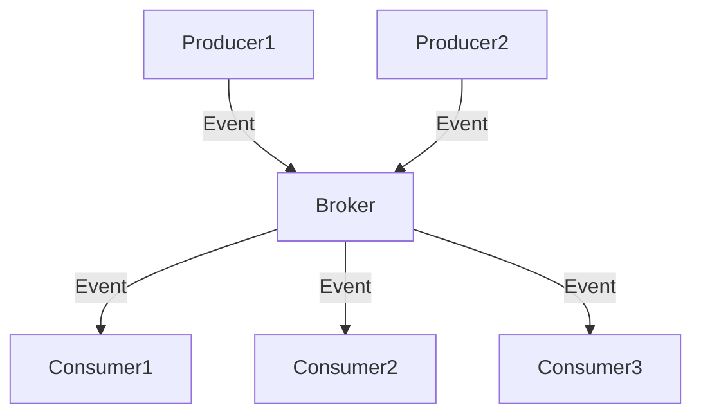

## 10.7 Message Brokers and Event-Driven Microservices

In the realm of microservices, the ability to handle asynchronous communication and decouple services is crucial for building scalable and resilient systems. Message brokers play a pivotal role in achieving this by facilitating event-driven architectures. In this section, we will delve into the integration of popular message brokers such as Kafka, RabbitMQ, and ActiveMQ in Kotlin, and explore how they can be leveraged to design robust event-driven microservices architectures.

### Understanding Message Brokers

**Message brokers** are software modules that enable applications, systems, and services to communicate with each other and exchange information. They act as intermediaries that translate messages from the messaging protocol of the sender to the messaging protocol of the receiver. This decouples the sender and receiver, allowing them to operate independently and asynchronously.

#### Key Features of Message Brokers

- **Decoupling**: By acting as an intermediary, message brokers decouple the sender and receiver, allowing them to evolve independently.
- **Asynchronous Communication**: They enable asynchronous communication, which is essential for non-blocking operations in distributed systems.
- **Scalability**: Message brokers can handle a large volume of messages, making them suitable for high-throughput systems.
- **Reliability**: They provide mechanisms for message persistence, ensuring that messages are not lost even if the system crashes.
- **Load Balancing**: Message brokers can distribute messages across multiple consumers, balancing the load efficiently.

### Event-Driven Architecture

**Event-driven architecture (EDA)** is a design paradigm in which the flow of the program is determined by events such as user actions, sensor outputs, or messages from other programs. In an event-driven system, components communicate by emitting and responding to events.

#### Benefits of Event-Driven Architecture

- **Responsiveness**: Systems can react to events in real-time, improving responsiveness.
- **Scalability**: EDA allows for horizontal scaling as new consumers can be added to handle increased load.
- **Flexibility**: Components can be added, removed, or modified without affecting the entire system.
- **Resilience**: By decoupling components, EDA enhances system resilience against failures.

### Integrating Message Brokers with Kotlin

Kotlin, with its modern language features and seamless interoperability with Java, is well-suited for building microservices that leverage message brokers. Let's explore how to integrate Kafka, RabbitMQ, and ActiveMQ with Kotlin.

#### Apache Kafka

**Apache Kafka** is a distributed event streaming platform capable of handling trillions of events a day. It is designed for high-throughput, fault-tolerant, and scalable messaging.

##### Setting Up Kafka in Kotlin

To use Kafka in a Kotlin application, you need to add the Kafka client library to your project's dependencies. Here's a basic setup using Gradle:

```kotlin
dependencies {
    implementation("org.apache.kafka:kafka-clients:3.0.0")
}
```

##### Producing Messages to Kafka

Here's a simple example of producing messages to a Kafka topic in Kotlin:

```kotlin
import org.apache.kafka.clients.producer.KafkaProducer
import org.apache.kafka.clients.producer.ProducerConfig
import org.apache.kafka.clients.producer.ProducerRecord
import org.apache.kafka.common.serialization.StringSerializer
import java.util.Properties

fun main() {
    val props = Properties().apply {
        put(ProducerConfig.BOOTSTRAP_SERVERS_CONFIG, "localhost:9092")
        put(ProducerConfig.KEY_SERIALIZER_CLASS_CONFIG, StringSerializer::class.java.name)
        put(ProducerConfig.VALUE_SERIALIZER_CLASS_CONFIG, StringSerializer::class.java.name)
    }

    val producer = KafkaProducer<String, String>(props)
    val topic = "my-topic"

    try {
        for (i in 0..10) {
            val record = ProducerRecord(topic, "key-$i", "value-$i")
            producer.send(record) { metadata, exception ->
                if (exception == null) {
                    println("Sent message to ${metadata.topic()} partition ${metadata.partition()} with offset ${metadata.offset()}")
                } else {
                    exception.printStackTrace()
                }
            }
        }
    } finally {
        producer.close()
    }
}
```

##### Consuming Messages from Kafka

To consume messages from a Kafka topic, you can use the following Kotlin code:

```kotlin
import org.apache.kafka.clients.consumer.ConsumerConfig
import org.apache.kafka.clients.consumer.KafkaConsumer
import org.apache.kafka.common.serialization.StringDeserializer
import java.time.Duration
import java.util.Properties

fun main() {
    val props = Properties().apply {
        put(ConsumerConfig.BOOTSTRAP_SERVERS_CONFIG, "localhost:9092")
        put(ConsumerConfig.GROUP_ID_CONFIG, "my-group")
        put(ConsumerConfig.KEY_DESERIALIZER_CLASS_CONFIG, StringDeserializer::class.java.name)
        put(ConsumerConfig.VALUE_DESERIALIZER_CLASS_CONFIG, StringDeserializer::class.java.name)
    }

    val consumer = KafkaConsumer<String, String>(props)
    consumer.subscribe(listOf("my-topic"))

    while (true) {
        val records = consumer.poll(Duration.ofMillis(100))
        for (record in records) {
            println("Received message: ${record.value()} from partition ${record.partition()}")
        }
    }
}
```

#### RabbitMQ

**RabbitMQ** is a message broker that implements the Advanced Message Queuing Protocol (AMQP). It is known for its reliability and ease of use.

##### Setting Up RabbitMQ in Kotlin

To integrate RabbitMQ with Kotlin, you need to include the RabbitMQ client library in your project:

```kotlin
dependencies {
    implementation("com.rabbitmq:amqp-client:5.12.0")
}
```

##### Producing Messages to RabbitMQ

Here's how you can produce messages to a RabbitMQ queue in Kotlin:

```kotlin
import com.rabbitmq.client.ConnectionFactory

fun main() {
    val factory = ConnectionFactory().apply {
        host = "localhost"
    }
    val connection = factory.newConnection()
    val channel = connection.createChannel()

    val queueName = "my-queue"
    channel.queueDeclare(queueName, false, false, false, null)

    val message = "Hello, RabbitMQ!"
    channel.basicPublish("", queueName, null, message.toByteArray())
    println("Sent: $message")

    channel.close()
    connection.close()
}
```

##### Consuming Messages from RabbitMQ

To consume messages from a RabbitMQ queue, use the following Kotlin code:

```kotlin
import com.rabbitmq.client.ConnectionFactory
import com.rabbitmq.client.DeliverCallback

fun main() {
    val factory = ConnectionFactory().apply {
        host = "localhost"
    }
    val connection = factory.newConnection()
    val channel = connection.createChannel()

    val queueName = "my-queue"
    channel.queueDeclare(queueName, false, false, false, null)

    val deliverCallback = DeliverCallback { _, delivery ->
        val message = String(delivery.body)
        println("Received: $message")
    }
    channel.basicConsume(queueName, true, deliverCallback, { _ -> })
}
```

#### ActiveMQ

**ActiveMQ** is an open-source message broker written in Java. It supports a variety of cross-language clients and protocols.

##### Setting Up ActiveMQ in Kotlin

To use ActiveMQ in a Kotlin application, add the ActiveMQ client library to your project:

```kotlin
dependencies {
    implementation("org.apache.activemq:activemq-client:5.16.0")
}
```

##### Producing Messages to ActiveMQ

Here's an example of producing messages to an ActiveMQ queue in Kotlin:

```kotlin
import org.apache.activemq.ActiveMQConnectionFactory
import javax.jms.Session

fun main() {
    val connectionFactory = ActiveMQConnectionFactory("tcp://localhost:61616")
    val connection = connectionFactory.createConnection()
    connection.start()

    val session = connection.createSession(false, Session.AUTO_ACKNOWLEDGE)
    val queue = session.createQueue("my-queue")

    val producer = session.createProducer(queue)
    val message = session.createTextMessage("Hello, ActiveMQ!")
    producer.send(message)
    println("Sent: ${message.text}")

    session.close()
    connection.close()
}
```

##### Consuming Messages from ActiveMQ

To consume messages from an ActiveMQ queue, use the following Kotlin code:

```kotlin
import org.apache.activemq.ActiveMQConnectionFactory
import javax.jms.Message
import javax.jms.MessageListener
import javax.jms.Session

fun main() {
    val connectionFactory = ActiveMQConnectionFactory("tcp://localhost:61616")
    val connection = connectionFactory.createConnection()
    connection.start()

    val session = connection.createSession(false, Session.AUTO_ACKNOWLEDGE)
    val queue = session.createQueue("my-queue")

    val consumer = session.createConsumer(queue)
    consumer.messageListener = MessageListener { message ->
        if (message is Message) {
            println("Received: ${message.body(String::class.java)}")
        }
    }
}
```

### Designing Event-Driven Architectures

Designing an event-driven architecture involves several key considerations to ensure that the system is scalable, resilient, and maintainable.

#### Key Participants

1. **Producers**: Components that generate events and send them to the message broker.
2. **Consumers**: Components that receive and process events from the message broker.
3. **Message Broker**: The intermediary that routes messages from producers to consumers.
4. **Event Store**: A persistent storage for events, enabling replay and auditing.

#### Applicability

- Use event-driven architecture when you need to decouple components and enable asynchronous communication.
- It is suitable for systems that require real-time processing and responsiveness.
- Ideal for applications that need to scale horizontally by adding more consumers.

#### Design Considerations

- **Event Schema**: Define a clear schema for events to ensure consistency and compatibility.
- **Idempotency**: Ensure that event processing is idempotent to handle duplicate messages gracefully.
- **Error Handling**: Implement robust error handling and retry mechanisms to manage failures.
- **Monitoring and Logging**: Set up monitoring and logging to track event flow and detect anomalies.

### Differences and Similarities

While Kafka, RabbitMQ, and ActiveMQ serve similar purposes, they have distinct characteristics:

- **Kafka**: Best suited for high-throughput and real-time data streaming. It is designed for distributed systems and offers strong durability guarantees.
- **RabbitMQ**: Known for its ease of use and flexibility. It supports complex routing and is ideal for traditional message queuing.
- **ActiveMQ**: Offers a wide range of features and supports multiple protocols. It is a good choice for systems requiring cross-language support.

### Visualizing Event-Driven Architecture

Below is a Mermaid.js diagram illustrating a simple event-driven architecture with a message broker:



**Figure 1: Event-Driven Architecture with a Message Broker**

### Try It Yourself

To deepen your understanding, try modifying the code examples provided:

- **Experiment with Different Message Brokers**: Swap out Kafka for RabbitMQ or ActiveMQ and observe the differences in setup and behavior.
- **Implement Custom Serialization**: Use a custom serializer for your messages and handle complex data types.
- **Add Error Handling**: Enhance the consumer code to handle errors and implement retry logic.

### Knowledge Check

- **What are the key benefits of using a message broker in microservices?**
- **How does event-driven architecture enhance system resilience?**
- **What are the main differences between Kafka, RabbitMQ, and ActiveMQ?**

### Embrace the Journey

Remember, integrating message brokers and designing event-driven architectures is just the beginning. As you progress, you'll build more complex and resilient systems. Keep experimenting, stay curious, and enjoy the journey!

## Quiz Time!



### What is a primary benefit of using message brokers in microservices?

- [x] Decoupling services
- [ ] Increasing latency
- [ ] Reducing scalability
- [ ] Eliminating the need for databases

> **Explanation:** Message brokers decouple services, allowing them to operate independently and asynchronously, which is crucial for scalable microservices architectures.

### Which message broker is known for high-throughput and real-time data streaming?

- [x] Kafka
- [ ] RabbitMQ
- [ ] ActiveMQ
- [ ] Redis

> **Explanation:** Kafka is designed for high-throughput and real-time data streaming, making it ideal for distributed systems.

### What protocol does RabbitMQ primarily implement?

- [x] AMQP
- [ ] HTTP
- [ ] MQTT
- [ ] SMTP

> **Explanation:** RabbitMQ primarily implements the Advanced Message Queuing Protocol (AMQP).

### In an event-driven architecture, what role does the message broker play?

- [x] Intermediary for routing messages
- [ ] Storing application state
- [ ] Executing business logic
- [ ] Rendering user interfaces

> **Explanation:** The message broker acts as an intermediary that routes messages from producers to consumers, facilitating communication in an event-driven architecture.

### What is a key consideration when designing event-driven systems?

- [x] Idempotency
- [ ] Synchronous processing
- [ ] Tight coupling
- [ ] Monolithic design

> **Explanation:** Ensuring idempotency is crucial in event-driven systems to handle duplicate messages gracefully.

### Which message broker is known for its ease of use and flexibility?

- [ ] Kafka
- [x] RabbitMQ
- [ ] ActiveMQ
- [ ] ZeroMQ

> **Explanation:** RabbitMQ is known for its ease of use and flexibility, supporting complex routing and traditional message queuing.

### What is a common feature among Kafka, RabbitMQ, and ActiveMQ?

- [x] Asynchronous communication
- [ ] Synchronous processing
- [ ] Built-in user interfaces
- [ ] Real-time rendering

> **Explanation:** All three message brokers support asynchronous communication, which is essential for decoupling services in microservices architectures.

### What is the purpose of an event store in an event-driven architecture?

- [x] Persistent storage for events
- [ ] Executing business logic
- [ ] Rendering user interfaces
- [ ] Managing user sessions

> **Explanation:** An event store provides persistent storage for events, enabling replay and auditing in event-driven architectures.

### What is a benefit of using Kotlin for integrating with message brokers?

- [x] Seamless interoperability with Java
- [ ] Lack of support for asynchronous operations
- [ ] Limited library availability
- [ ] Incompatibility with JVM

> **Explanation:** Kotlin's seamless interoperability with Java makes it well-suited for integrating with message brokers, leveraging existing Java libraries.

### True or False: Event-driven architectures are ideal for systems requiring real-time processing.

- [x] True
- [ ] False

> **Explanation:** Event-driven architectures are indeed ideal for systems requiring real-time processing due to their responsiveness and scalability.


