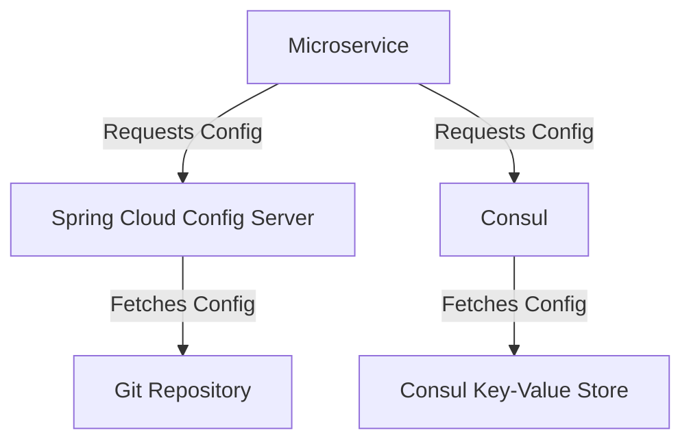

## 10.8 Configuration Management

In the realm of microservices architecture, effective configuration management is crucial for maintaining scalability, flexibility, and security. As we delve into configuration management in Kotlin microservices, we will explore two powerful tools: **Spring Cloud Config** and **Consul**. These tools help manage configurations across distributed systems, ensuring that services can adapt to changes without downtime.

### Understanding Configuration Management

Configuration management involves maintaining consistency in the performance and functionality of a system by managing configuration files and settings. In microservices, each service may have its own configuration, which can include database connections, API keys, feature flags, and more. Managing these configurations centrally is essential for:

- **Scalability**: Easily scaling services without manual configuration changes.
- **Consistency**: Ensuring uniform configuration across environments.
- **Security**: Safeguarding sensitive information like credentials.
- **Flexibility**: Allowing dynamic configuration updates without redeployment.

### Spring Cloud Config: Centralized Configuration Management

**Spring Cloud Config** provides server and client-side support for externalized configuration in a distributed system. It allows you to manage configurations centrally and serve them to multiple applications.

#### Key Features of Spring Cloud Config

- **Centralized Management**: Store configurations in a central repository, typically a Git repository.
- **Environment-Specific Configurations**: Manage different configurations for various environments (e.g., development, testing, production).
- **Dynamic Refresh**: Update configurations without restarting applications.
- **Security**: Encrypt sensitive data in configuration files.

#### Setting Up Spring Cloud Config Server

To set up a Spring Cloud Config server, follow these steps:

1. **Create a Spring Boot Application**: Start by creating a new Spring Boot application with the necessary dependencies.

2. **Add Dependencies**: Include the `spring-cloud-config-server` dependency in your `build.gradle` file:

   ```kotlin
   dependencies {
       implementation("org.springframework.cloud:spring-cloud-config-server")
   }
   ```

3. **Enable Config Server**: Annotate your main application class with `@EnableConfigServer`:

   ```kotlin
   import org.springframework.boot.SpringApplication
   import org.springframework.boot.autoconfigure.SpringBootApplication
   import org.springframework.cloud.config.server.EnableConfigServer

   @SpringBootApplication
   @EnableConfigServer
   class ConfigServerApplication

   fun main(args: Array<String>) {
       SpringApplication.run(ConfigServerApplication::class.java, *args)
   }
   ```

4. **Configure Application Properties**: Define the configuration repository in `application.yml`:

   ```yaml
   server:
     port: 8888

   spring:
     cloud:
       config:
         server:
           git:
             uri: https://github.com/your-repo/config-repo
   ```

#### Setting Up Spring Cloud Config Client

To connect a microservice to the Config Server, follow these steps:

1. **Add Dependencies**: Include the `spring-cloud-starter-config` dependency in your `build.gradle` file:

   ```kotlin
   dependencies {
       implementation("org.springframework.cloud:spring-cloud-starter-config")
   }
   ```

2. **Configure Application Properties**: Specify the Config Server URL in `bootstrap.yml`:

   ```yaml
   spring:
     application:
       name: your-service-name
     cloud:
       config:
         uri: http://localhost:8888
   ```

3. **Accessing Configuration Properties**: Use `@Value` or `@ConfigurationProperties` to access configuration properties in your service:

   ```kotlin
   import org.springframework.beans.factory.annotation.Value
   import org.springframework.web.bind.annotation.GetMapping
   import org.springframework.web.bind.annotation.RestController

   @RestController
   class ConfigController {

       @Value("\${config.property}")
       lateinit var configProperty: String

       @GetMapping("/config")
       fun getConfig(): String {
           return configProperty
       }
   }
   ```

### Consul: Service Discovery and Configuration Management

**Consul** is a tool for service discovery, configuration management, and health checking. It provides a distributed key-value store that can be used for configuration management.

#### Key Features of Consul

- **Service Discovery**: Automatically discover services in a network.
- **Key-Value Store**: Store configuration data in a distributed key-value store.
- **Health Checking**: Monitor the health of services.
- **Multi-Datacenter Support**: Manage configurations across multiple datacenters.

#### Setting Up Consul

To set up Consul for configuration management, follow these steps:

1. **Install Consul**: Download and install Consul from the [official website](https://www.consul.io/downloads).

2. **Start Consul Agent**: Start a Consul agent in development mode:

   ```bash
   consul agent -dev
   ```

3. **Access Consul UI**: Open the Consul UI at `http://localhost:8500` to manage configurations.

#### Using Consul for Configuration Management

1. **Store Configuration in Consul**: Use the Consul UI or CLI to store configuration data:

   ```bash
   consul kv put config/your-service-name/config.property value
   ```

2. **Access Configuration in Kotlin**: Use the Consul client library to access configuration data in your Kotlin application:

   ```kotlin
   import com.orbitz.consul.Consul
   import com.orbitz.consul.KeyValueClient

   fun main() {
       val consul = Consul.builder().build()
       val kvClient: KeyValueClient = consul.keyValueClient()

       val value = kvClient.getValueAsString("config/your-service-name/config.property").orElse("default")
       println("Config Property: $value")
   }
   ```

### Visualizing Configuration Management Workflow

Below is a diagram illustrating the workflow of configuration management using Spring Cloud Config and Consul:



**Figure 1**: Configuration management workflow using Spring Cloud Config and Consul.

### Best Practices for Configuration Management

1. **Centralize Configuration**: Use a centralized repository for all configurations to ensure consistency.

2. **Secure Sensitive Data**: Encrypt sensitive data such as passwords and API keys.

3. **Version Control**: Use version control for configuration files to track changes and roll back if necessary.

4. **Environment-Specific Configurations**: Separate configurations for different environments (e.g., development, staging, production).

5. **Dynamic Configuration Updates**: Enable dynamic updates to configurations without restarting services.

6. **Monitor Configuration Changes**: Implement monitoring and alerts for configuration changes to detect unauthorized modifications.

### Differences and Similarities

Both Spring Cloud Config and Consul provide centralized configuration management, but they differ in their approach and additional features:

- **Spring Cloud Config**: Focuses on externalized configuration stored in a Git repository, with support for dynamic refresh and encryption.

- **Consul**: Offers a distributed key-value store for configuration management, along with service discovery and health checking.

### Try It Yourself

Experiment with the code examples provided by:

- Modifying the configuration properties in the Git repository or Consul and observing the changes in your application.
- Implementing additional security measures, such as encrypting configuration data.
- Exploring the Consul UI to manage configurations and services.

### Knowledge Check

1. What are the key benefits of centralized configuration management in microservices?
2. How does Spring Cloud Config enable dynamic configuration updates?
3. What is the role of Consul's key-value store in configuration management?
4. How can you secure sensitive data in configuration files?
5. What are the differences between Spring Cloud Config and Consul?

### Embrace the Journey

Remember, mastering configuration management is a journey. As you progress, you'll build more robust and scalable microservices. Keep experimenting, stay curious, and enjoy the journey!

## Quiz Time!



### What is the primary purpose of configuration management in microservices?

- [x] To maintain consistency and scalability across services
- [ ] To increase the complexity of the system
- [ ] To eliminate the need for version control
- [ ] To ensure services are always online

> **Explanation:** Configuration management ensures consistency and scalability by centralizing and managing configurations across services.

### Which tool provides server and client-side support for externalized configuration in a distributed system?

- [x] Spring Cloud Config
- [ ] Docker
- [ ] Kubernetes
- [ ] Jenkins

> **Explanation:** Spring Cloud Config provides server and client-side support for externalized configuration in distributed systems.

### How can you enable dynamic configuration updates in Spring Cloud Config?

- [x] By using the `@RefreshScope` annotation
- [ ] By restarting the application
- [ ] By manually editing configuration files
- [ ] By using a database

> **Explanation:** The `@RefreshScope` annotation in Spring Cloud Config allows dynamic updates to configuration properties.

### What is a key feature of Consul in configuration management?

- [x] Distributed key-value store
- [ ] Centralized database
- [ ] Manual configuration updates
- [ ] Static configuration files

> **Explanation:** Consul provides a distributed key-value store for managing configurations.

### How can you secure sensitive data in configuration files?

- [x] By encrypting the data
- [ ] By storing it in plain text
- [ ] By using hardcoded values
- [ ] By ignoring it

> **Explanation:** Encrypting sensitive data in configuration files ensures security and prevents unauthorized access.

### Which tool offers service discovery and health checking along with configuration management?

- [x] Consul
- [ ] Spring Cloud Config
- [ ] Jenkins
- [ ] Docker

> **Explanation:** Consul offers service discovery, health checking, and configuration management.

### What is the role of the Consul UI?

- [x] To manage configurations and services
- [ ] To write code
- [ ] To compile applications
- [ ] To deploy applications

> **Explanation:** The Consul UI allows users to manage configurations and services visually.

### Which of the following is a best practice for configuration management?

- [x] Centralizing configuration
- [ ] Hardcoding values
- [ ] Ignoring version control
- [ ] Using different configurations for each instance

> **Explanation:** Centralizing configuration ensures consistency and ease of management across services.

### What is the benefit of using version control for configuration files?

- [x] To track changes and roll back if necessary
- [ ] To increase the size of the repository
- [ ] To make configurations harder to manage
- [ ] To prevent collaboration

> **Explanation:** Version control allows tracking changes and rolling back configurations if needed.

### True or False: Spring Cloud Config and Consul can be used together in a microservices architecture.

- [x] True
- [ ] False

> **Explanation:** Spring Cloud Config and Consul can complement each other in a microservices architecture, providing centralized configuration management and service discovery.




