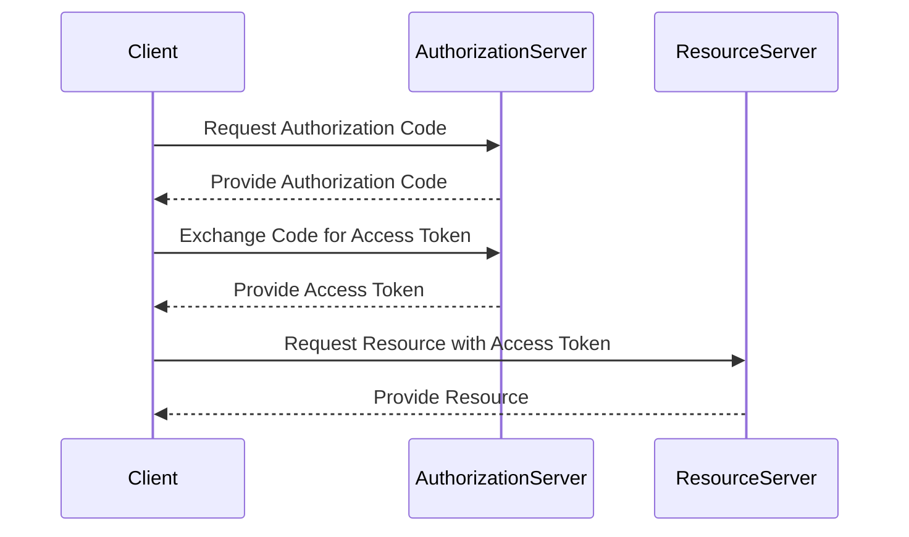

## 10.9 Security in Microservices

In the world of microservices, security is paramount. As we decompose monolithic applications into distributed services, the attack surface increases, making it crucial to implement robust security measures. This section delves into securing microservices using OAuth2, Spring Security, and JWT authentication, particularly in Kotlin-based applications.

### Understanding Microservices Security

Microservices architecture involves multiple services communicating over a network, often exposing APIs to external clients. This architecture demands a comprehensive security strategy to protect data, ensure privacy, and maintain system integrity. Key security concerns include:

- **Authentication**: Verifying the identity of users and services.
- **Authorization**: Determining access rights and permissions.
- **Confidentiality**: Ensuring data is not exposed to unauthorized entities.
- **Integrity**: Protecting data from being altered by unauthorized parties.
- **Availability**: Ensuring services remain accessible and operational.

### OAuth2: The Foundation of Secure Microservices

OAuth2 is a widely adopted authorization framework that provides secure delegated access. It allows third-party applications to access user data without exposing credentials. OAuth2 is particularly suited for microservices due to its ability to handle complex authorization scenarios.

#### Key Concepts of OAuth2

- **Resource Owner**: The user who authorizes access to their data.
- **Client**: The application requesting access on behalf of the resource owner.
- **Authorization Server**: The server issuing access tokens to the client.
- **Resource Server**: The server hosting the protected resources.

#### OAuth2 Grant Types

OAuth2 defines several grant types for different use cases:

- **Authorization Code**: Used for server-side applications.
- **Implicit**: Suitable for client-side applications.
- **Resource Owner Password Credentials**: Used when the resource owner trusts the client.
- **Client Credentials**: Used for service-to-service communication.

### Implementing OAuth2 in Kotlin with Spring Security

Spring Security is a powerful framework for securing Java and Kotlin applications. It provides comprehensive support for OAuth2, making it an ideal choice for securing microservices.

#### Setting Up Spring Security with OAuth2

To implement OAuth2 in a Kotlin microservices application using Spring Security, follow these steps:

1. **Add Dependencies**: Include the necessary Spring Security and OAuth2 dependencies in your `build.gradle.kts` file.

   ```kotlin
   dependencies {
       implementation("org.springframework.boot:spring-boot-starter-security")
       implementation("org.springframework.security:spring-security-oauth2-client")
       implementation("org.springframework.security:spring-security-oauth2-resource-server")
   }
   ```

2. **Configure Security**: Create a security configuration class to set up OAuth2.

   ```kotlin
   @Configuration
   @EnableWebSecurity
   class SecurityConfig : WebSecurityConfigurerAdapter() {
       override fun configure(http: HttpSecurity) {
           http
               .authorizeRequests()
               .antMatchers("/public/**").permitAll()
               .anyRequest().authenticated()
               .and()
               .oauth2Login()
               .and()
               .oauth2ResourceServer().jwt()
       }
   }
   ```

3. **Define Client Registration**: Configure client registration details in `application.yml`.

   ```yaml
   spring:
     security:
       oauth2:
         client:
           registration:
             my-client:
               client-id: your-client-id
               client-secret: your-client-secret
               scope: read,write
               authorization-grant-type: authorization_code
               redirect-uri: "{baseUrl}/login/oauth2/code/{registrationId}"
   ```

4. **Secure Endpoints**: Use annotations to secure specific endpoints.

   ```kotlin
   @RestController
   class SecureController {

       @GetMapping("/secure")
       fun secureEndpoint(): String {
           return "This is a secure endpoint"
       }
   }
   ```

### JWT Authentication: A Token-Based Approach

JSON Web Tokens (JWT) are a compact, URL-safe means of representing claims between two parties. JWTs are commonly used for authentication in microservices due to their stateless nature and ease of use.

#### Structure of a JWT

A JWT consists of three parts:

1. **Header**: Contains metadata about the token, such as the algorithm used for signing.
2. **Payload**: Contains claims, which are statements about an entity (typically, the user) and additional data.
3. **Signature**: Ensures the token's integrity and authenticity.

#### Implementing JWT Authentication

To implement JWT authentication in a Kotlin microservices application, follow these steps:

1. **Generate JWT Tokens**: Create a utility class to generate JWT tokens.

   ```kotlin
   object JwtUtil {
       private const val SECRET_KEY = "your-secret-key"

       fun generateToken(username: String): String {
           return Jwts.builder()
               .setSubject(username)
               .setIssuedAt(Date())
               .setExpiration(Date(System.currentTimeMillis() + 1000 * 60 * 60 * 10))
               .signWith(SignatureAlgorithm.HS256, SECRET_KEY)
               .compact()
       }
   }
   ```

2. **Validate JWT Tokens**: Create a filter to validate incoming JWT tokens.

   ```kotlin
   class JwtRequestFilter : OncePerRequestFilter() {
       override fun doFilterInternal(
           request: HttpServletRequest,
           response: HttpServletResponse,
           filterChain: FilterChain
       ) {
           val authorizationHeader = request.getHeader("Authorization")

           if (authorizationHeader != null && authorizationHeader.startsWith("Bearer ")) {
               val jwt = authorizationHeader.substring(7)
               val username = JwtUtil.extractUsername(jwt)

               if (username != null && SecurityContextHolder.getContext().authentication == null) {
                   val userDetails = userDetailsService.loadUserByUsername(username)
                   if (JwtUtil.validateToken(jwt, userDetails)) {
                       val authToken = UsernamePasswordAuthenticationToken(
                           userDetails, null, userDetails.authorities
                       )
                       SecurityContextHolder.getContext().authentication = authToken
                   }
               }
           }
           filterChain.doFilter(request, response)
       }
   }
   ```

3. **Configure JWT Filter**: Add the JWT filter to the security configuration.

   ```kotlin
   @Configuration
   @EnableWebSecurity
   class SecurityConfig : WebSecurityConfigurerAdapter() {

       @Autowired
       private lateinit var jwtRequestFilter: JwtRequestFilter

       override fun configure(http: HttpSecurity) {
           http
               .csrf().disable()
               .authorizeRequests()
               .antMatchers("/authenticate").permitAll()
               .anyRequest().authenticated()
               .and()
               .sessionManagement()
               .sessionCreationPolicy(SessionCreationPolicy.STATELESS)

           http.addFilterBefore(jwtRequestFilter, UsernamePasswordAuthenticationFilter::class.java)
       }
   }
   ```

### Securing Microservices with OAuth2 and JWT

Combining OAuth2 and JWT provides a robust security model for microservices. OAuth2 handles authorization, while JWT provides a stateless authentication mechanism. This combination ensures secure communication between services and clients.

#### Benefits of Using OAuth2 and JWT

- **Scalability**: Stateless JWTs reduce server load, making it easier to scale services.
- **Interoperability**: OAuth2 is widely supported, facilitating integration with third-party services.
- **Security**: JWTs provide a secure way to transmit information between parties.

#### Challenges and Considerations

- **Token Expiry**: Implement token refresh mechanisms to handle expired tokens.
- **Token Revocation**: Consider strategies for revoking JWTs, such as maintaining a blacklist.
- **Key Management**: Securely manage keys used for signing and verifying JWTs.

### Visualizing Security in Microservices

To better understand the flow of security in microservices, let's visualize the interaction between different components using a sequence diagram.



**Diagram Description**: This sequence diagram illustrates the OAuth2 authorization code flow. The client requests an authorization code from the authorization server, exchanges it for an access token, and uses the token to access resources on the resource server.

### Best Practices for Securing Microservices

1. **Use HTTPS**: Always use HTTPS to encrypt data in transit.
2. **Implement Rate Limiting**: Protect services from abuse by limiting the number of requests.
3. **Monitor and Audit**: Continuously monitor and audit access logs for suspicious activity.
4. **Regularly Update Dependencies**: Keep libraries and frameworks up to date to mitigate vulnerabilities.
5. **Implement Least Privilege**: Grant only the necessary permissions to users and services.

### Try It Yourself

Experiment with the provided code examples by:

- Modifying the JWT expiration time and observing the impact on authentication.
- Implementing a token refresh mechanism to handle expired tokens.
- Securing additional endpoints and testing access control.

### Knowledge Check

Before we conclude, let's reinforce our understanding with a few questions:

- What are the key components of OAuth2?
- How does JWT authentication enhance security in microservices?
- What are some best practices for securing microservices?

### Conclusion

Securing microservices is a complex but essential task. By leveraging OAuth2, Spring Security, and JWT authentication, we can build secure, scalable, and maintainable microservices. Remember, security is an ongoing process that requires continuous monitoring and improvement. Keep experimenting, stay vigilant, and enjoy the journey of building secure microservices!

## Quiz Time!



### What is the primary role of OAuth2 in microservices security?

- [x] Authorization
- [ ] Authentication
- [ ] Encryption
- [ ] Data Integrity

> **Explanation:** OAuth2 is primarily an authorization framework, allowing third-party applications to access user data without exposing credentials.

### Which component issues access tokens in the OAuth2 framework?

- [ ] Resource Server
- [x] Authorization Server
- [ ] Client
- [ ] Resource Owner

> **Explanation:** The Authorization Server is responsible for issuing access tokens to clients.

### What is a key advantage of using JWTs in microservices?

- [x] Stateless authentication
- [ ] Increased server load
- [ ] Complex token management
- [ ] Limited scalability

> **Explanation:** JWTs provide stateless authentication, reducing server load and enhancing scalability.

### What is a common challenge when using JWTs?

- [ ] Easy token generation
- [x] Token revocation
- [ ] Simple key management
- [ ] Limited interoperability

> **Explanation:** Token revocation is a challenge because JWTs are stateless and do not have a built-in mechanism for revocation.

### Which grant type is suitable for service-to-service communication in OAuth2?

- [ ] Authorization Code
- [ ] Implicit
- [x] Client Credentials
- [ ] Resource Owner Password Credentials

> **Explanation:** The Client Credentials grant type is used for service-to-service communication.

### What is a best practice for securing microservices?

- [x] Use HTTPS
- [ ] Allow all traffic
- [ ] Disable logging
- [ ] Avoid monitoring

> **Explanation:** Using HTTPS encrypts data in transit, enhancing security.

### How can expired JWT tokens be managed?

- [x] Implement a token refresh mechanism
- [ ] Ignore expiration
- [ ] Extend token lifetime indefinitely
- [ ] Use the same token forever

> **Explanation:** Implementing a token refresh mechanism allows clients to obtain new tokens when the current ones expire.

### What is the role of the Resource Server in OAuth2?

- [ ] Issue access tokens
- [x] Host protected resources
- [ ] Authenticate users
- [ ] Manage client registrations

> **Explanation:** The Resource Server hosts protected resources and verifies access tokens.

### What does the JWT signature ensure?

- [ ] Token readability
- [x] Token integrity and authenticity
- [ ] Token expiration
- [ ] Token encryption

> **Explanation:** The JWT signature ensures the token's integrity and authenticity, verifying that it has not been tampered with.

### True or False: JWTs are inherently secure and do not require additional security measures.

- [ ] True
- [x] False

> **Explanation:** False. While JWTs provide a secure way to transmit information, additional security measures such as encryption and secure key management are necessary.


