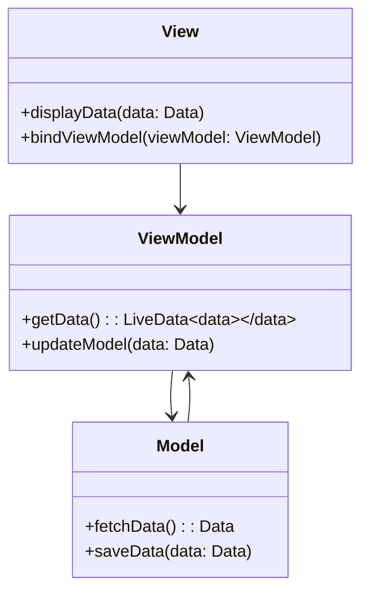

## 11.1 Model-View-ViewModel (MVVM) Pattern

The Model-View-ViewModel (MVVM) pattern is a powerful architectural pattern that is particularly well-suited for building Android applications using Kotlin. It provides a clean separation of concerns, making your code more maintainable, testable, and scalable. In this section, we will delve deep into the MVVM pattern, exploring its components, implementation strategies, and best practices for using Kotlin's features to enhance your Android applications.

### Introduction to MVVM

#### Intent

The primary intent of the MVVM pattern is to separate the development of the user interface (UI) from the business logic, allowing developers to work on these components independently. This separation enhances code maintainability and testability.

#### Key Participants

- **Model**: Represents the data and business logic of the application. It is responsible for handling data operations, such as fetching data from a database or a remote server.
- **View**: The UI layer that displays data to the user and sends user interactions to the ViewModel.
- **ViewModel**: Acts as a bridge between the Model and the View. It retrieves data from the Model and prepares it for display in the View. It also handles user interactions and updates the Model accordingly.

### Visualizing MVVM

To better understand the interactions between these components, let's visualize the MVVM architecture using a Mermaid.js diagram:



**Diagram Description**: This diagram illustrates the flow of data and interactions between the View, ViewModel, and Model in the MVVM pattern. The View binds to the ViewModel, which in turn interacts with the Model to fetch and update data.

### Implementing MVVM with Architecture Components

Kotlin, combined with Android's Architecture Components, provides a robust framework for implementing the MVVM pattern. Let's explore how to leverage these components effectively.

#### ViewModel

The `ViewModel` class is a part of Android's Architecture Components and is designed to store and manage UI-related data in a lifecycle-conscious way. This means that the data survives configuration changes such as screen rotations.

**Key Features of ViewModel**:
- **Lifecycle Awareness**: ViewModel is lifecycle-aware, meaning it is designed to survive configuration changes.
- **Data Retention**: It retains data during configuration changes, preventing unnecessary data reloads.
- **Separation of Concerns**: It separates UI data from UI controllers like Activities and Fragments.

**Example**:

```kotlin
class MyViewModel : ViewModel() {
    private val _data = MutableLiveData<String>()
    val data: LiveData<String> get() = _data

    fun fetchData() {
        // Simulate data fetching
        _data.value = "Hello, MVVM!"
    }
}
```

**Explanation**: In this example, `MyViewModel` holds a `LiveData` object, which is observed by the View. The `fetchData` function simulates data fetching and updates the `LiveData`.

#### LiveData

`LiveData` is an observable data holder class that is lifecycle-aware. It ensures that UI components only observe data when they are in an active lifecycle state, preventing memory leaks and crashes.

**Key Features of LiveData**:
- **Lifecycle Awareness**: Automatically manages the lifecycle of data updates.
- **Data Observability**: Allows the UI to observe changes in data.
- **No Memory Leaks**: Observers are automatically removed when the lifecycle is destroyed.

**Example**:

```kotlin
class MyFragment : Fragment() {
    private lateinit var viewModel: MyViewModel

    override fun onCreateView(
        inflater: LayoutInflater, container: ViewGroup?,
        savedInstanceState: Bundle?
    ): View? {
        val view = inflater.inflate(R.layout.fragment_my, container, false)
        viewModel = ViewModelProvider(this).get(MyViewModel::class.java)

        viewModel.data.observe(viewLifecycleOwner, Observer { data ->
            // Update the UI with the new data
            view.findViewById<TextView>(R.id.textView).text = data
        })

        return view
    }
}
```

**Explanation**: In this example, the `MyFragment` observes the `LiveData` from `MyViewModel`. When the data changes, the UI is automatically updated.

### Structuring Android Applications with MVVM

Implementing the MVVM pattern in Android applications involves structuring your code into distinct layers, each responsible for a specific aspect of the application.

#### Model Layer

The Model layer is responsible for handling data operations. It can interact with local databases, remote servers, or any other data source.

**Example**:

```kotlin
class DataRepository {
    fun getData(): String {
        // Simulate fetching data from a data source
        return "Data from repository"
    }
}
```

**Explanation**: The `DataRepository` class simulates a data source that provides data to the ViewModel.

#### View Layer

The View layer consists of UI components such as Activities and Fragments. It observes the ViewModel and updates the UI based on the data changes.

**Example**:

```kotlin
class MainActivity : AppCompatActivity() {
    private lateinit var viewModel: MyViewModel

    override fun onCreate(savedInstanceState: Bundle?) {
        super.onCreate(savedInstanceState)
        setContentView(R.layout.activity_main)

        viewModel = ViewModelProvider(this).get(MyViewModel::class.java)

        viewModel.data.observe(this, Observer { data ->
            // Update UI
            findViewById<TextView>(R.id.textView).text = data
        })

        // Fetch data
        viewModel.fetchData()
    }
}
```

**Explanation**: The `MainActivity` observes the `LiveData` from `MyViewModel` and updates the UI when the data changes.

#### ViewModel Layer

The ViewModel layer acts as a bridge between the Model and View layers. It retrieves data from the Model and prepares it for display in the View.

**Example**:

```kotlin
class MyViewModel(private val repository: DataRepository) : ViewModel() {
    private val _data = MutableLiveData<String>()
    val data: LiveData<String> get() = _data

    fun fetchData() {
        _data.value = repository.getData()
    }
}
```

**Explanation**: The `MyViewModel` interacts with the `DataRepository` to fetch data and updates the `LiveData` object.

### Design Considerations

When implementing the MVVM pattern, it's important to consider the following design aspects:

- **Separation of Concerns**: Ensure that each layer is responsible for a specific aspect of the application. The View should not contain business logic, and the ViewModel should not contain UI code.
- **Testability**: MVVM enhances testability by allowing you to test the ViewModel independently of the View.
- **Lifecycle Management**: Use lifecycle-aware components like ViewModel and LiveData to manage data updates and UI interactions.

### Differences and Similarities with Other Patterns

MVVM is often compared to other architectural patterns like MVC (Model-View-Controller) and MVP (Model-View-Presenter). Here's a brief comparison:

- **MVC**: The Controller handles user interactions and updates the Model and View. In Android, Activities and Fragments often act as both the View and Controller, leading to tightly coupled code.
- **MVP**: The Presenter handles user interactions and updates the View. It is similar to MVVM, but the ViewModel in MVVM does not hold a reference to the View, making it more decoupled.
- **MVVM**: The ViewModel acts as a bridge between the Model and View, with no direct reference to the View. This decoupling enhances testability and maintainability.

### Try It Yourself

To get hands-on experience with the MVVM pattern, try modifying the code examples provided. Here are a few suggestions:

- **Add a New Feature**: Extend the `MyViewModel` to fetch data from a remote server using Retrofit.
- **Implement Data Caching**: Modify the `DataRepository` to cache data locally using Room.
- **Enhance UI**: Add more UI components to the `MainActivity` and bind them to additional `LiveData` objects in the `MyViewModel`.

### Knowledge Check

Before moving on, let's reinforce what we've learned:

- **What is the primary intent of the MVVM pattern?**
- **How does LiveData help in managing UI updates?**
- **What are the key differences between MVVM and MVP?**

### Conclusion

The MVVM pattern is a powerful architectural pattern for building Android applications with Kotlin. By separating the UI from the business logic, MVVM enhances code maintainability, testability, and scalability. With the help of Android's Architecture Components like ViewModel and LiveData, implementing MVVM becomes more intuitive and efficient.

Remember, this is just the beginning. As you progress, you'll build more complex and interactive applications. Keep experimenting, stay curious, and enjoy the journey!

## Quiz Time!



### What is the primary purpose of the ViewModel in MVVM?

- [x] To act as a bridge between the Model and the View
- [ ] To handle UI rendering
- [ ] To manage database operations
- [ ] To perform network requests

> **Explanation:** The ViewModel acts as a bridge between the Model and the View, managing UI-related data in a lifecycle-conscious way.

### Which component in MVVM is responsible for observing data changes?

- [ ] Model
- [x] LiveData
- [ ] ViewModel
- [ ] View

> **Explanation:** LiveData is responsible for observing data changes and notifying the View when the data changes.

### How does MVVM enhance testability?

- [x] By decoupling the View from the ViewModel
- [ ] By integrating UI and business logic
- [ ] By using a single class for all operations
- [ ] By reducing the number of classes

> **Explanation:** MVVM enhances testability by decoupling the View from the ViewModel, allowing independent testing of the ViewModel.

### What is a key difference between MVVM and MVP?

- [x] MVVM does not hold a reference to the View
- [ ] MVP uses LiveData for data binding
- [ ] MVVM uses a Presenter for UI logic
- [ ] MVP is more decoupled than MVVM

> **Explanation:** In MVVM, the ViewModel does not hold a reference to the View, unlike MVP where the Presenter interacts directly with the View.

### Which Android Architecture Component is lifecycle-aware?

- [x] ViewModel
- [ ] Activity
- [ ] Fragment
- [ ] Service

> **Explanation:** ViewModel is lifecycle-aware, designed to survive configuration changes and manage UI-related data.

### What is the role of the Model in MVVM?

- [x] To handle data operations
- [ ] To render the UI
- [ ] To observe data changes
- [ ] To manage lifecycle events

> **Explanation:** The Model is responsible for handling data operations, such as fetching data from a database or a remote server.

### How does LiveData prevent memory leaks?

- [x] By automatically managing the lifecycle of data updates
- [ ] By holding strong references to the View
- [ ] By using static methods
- [ ] By caching data locally

> **Explanation:** LiveData prevents memory leaks by automatically managing the lifecycle of data updates and removing observers when the lifecycle is destroyed.

### Which of the following is a benefit of using MVVM?

- [x] Enhanced code maintainability
- [ ] Reduced number of classes
- [ ] Single responsibility for all components
- [ ] Direct View-Model interaction

> **Explanation:** MVVM enhances code maintainability by separating the UI from the business logic and organizing code into distinct layers.

### What is a common use case for LiveData in MVVM?

- [x] Observing data changes and updating the UI
- [ ] Performing network requests
- [ ] Managing database transactions
- [ ] Rendering complex UI elements

> **Explanation:** LiveData is commonly used for observing data changes and updating the UI in response to those changes.

### True or False: In MVVM, the ViewModel holds a reference to the View.

- [ ] True
- [x] False

> **Explanation:** False. In MVVM, the ViewModel does not hold a reference to the View, promoting a more decoupled architecture.


