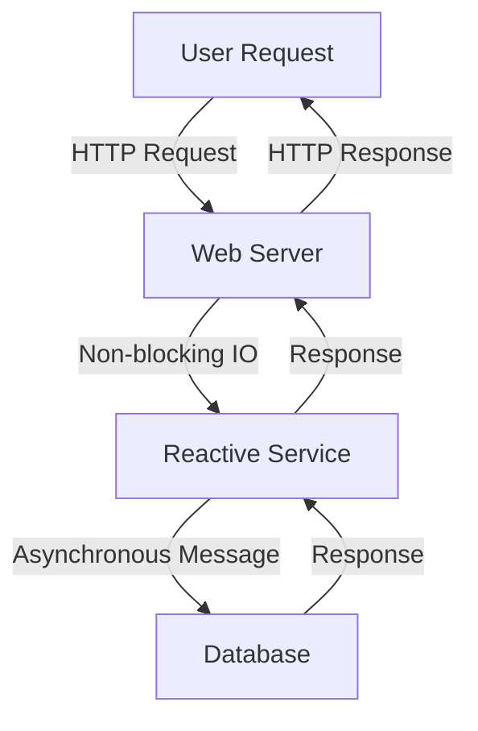

## 11.11 Reactive Architecture

In today's fast-paced digital world, applications need to be responsive, resilient, and scalable. Reactive Architecture is a paradigm that addresses these needs by focusing on asynchronous data streams and the propagation of change. In this section, we will delve into the principles of Reactive Architecture, its implementation in Kotlin, and how it helps in building scalable systems.

### Understanding Reactive Architecture

Reactive Architecture is a design paradigm that emphasizes responsiveness, resilience, elasticity, and message-driven interactions. It is built on the principles of reactive programming, which allows systems to react to changes in state or data flow asynchronously.

#### Key Principles

1. **Responsiveness**: Systems should respond in a timely manner. This is crucial for providing a good user experience and maintaining system reliability.

2. **Resilience**: Systems should remain responsive in the face of failure. This is achieved through replication, containment, isolation, and delegation.

3. **Elasticity**: Systems should remain responsive under varying workload. They should scale up or down as needed to accommodate changes in load.

4. **Message-Driven**: Systems should rely on asynchronous message-passing to establish a boundary between components that ensures loose coupling, isolation, and location transparency.

### Reactive Systems in Kotlin

Kotlin, with its modern language features and seamless integration with Java, is well-suited for building reactive systems. It provides powerful tools like coroutines and flows that simplify asynchronous programming and enable the construction of reactive architectures.

#### Coroutines and Flows

- **Coroutines**: Kotlin's coroutines provide a way to write asynchronous code that is both simple and efficient. They allow you to write code that is sequential in nature but non-blocking, making it easier to reason about.

- **Flows**: Kotlin Flows are a type of asynchronous data stream that can emit multiple values sequentially. They are cold streams, meaning they don't produce values until someone is collecting them.

#### Implementing Reactive Systems

To implement a reactive system in Kotlin, you need to leverage its concurrency model, which is based on coroutines and flows. Here's a simple example of how you can use these tools to create a reactive system:

```kotlin
import kotlinx.coroutines.*
import kotlinx.coroutines.flow.*

fun main() = runBlocking {
    // A simple flow that emits numbers from 1 to 5
    val numberFlow = (1..5).asFlow()

    // Collecting the flow
    numberFlow.collect { number ->
        println("Received number: $number")
    }
}
```

In this example, we create a flow that emits numbers from 1 to 5. The `collect` function is used to receive these numbers. This code is non-blocking and can be easily scaled to handle more complex data streams.

### Event Loops and Non-blocking IO

Reactive systems rely heavily on event loops and non-blocking IO to handle asynchronous events efficiently. Let's explore these concepts in more detail.

#### Event Loops

An event loop is a programming construct that waits for and dispatches events or messages in a program. It is a core component of reactive systems, allowing them to handle multiple tasks concurrently without blocking.

In Kotlin, the event loop is managed by the coroutine dispatcher. The dispatcher determines which thread or threads the coroutine will run on. For example, the `Dispatchers.IO` dispatcher is optimized for IO-bound operations, while `Dispatchers.Default` is optimized for CPU-bound operations.

#### Non-blocking IO

Non-blocking IO allows a program to continue executing other tasks while waiting for IO operations to complete. This is crucial for building responsive systems that can handle multiple requests simultaneously.

Kotlin's coroutines provide a simple way to perform non-blocking IO. Here's an example of how you can use coroutines to perform a non-blocking IO operation:

```kotlin
import kotlinx.coroutines.*
import java.net.URL

fun main() = runBlocking {
    val url = "https://example.com"
    val data = async(Dispatchers.IO) {
        URL(url).readText()
    }

    println("Data from URL: ${data.await()}")
}
```

In this example, we use the `async` function to perform a non-blocking IO operation. The `readText` function is called on a separate thread, allowing the main thread to continue executing other tasks.

### Building Scalable Systems

Reactive Architecture is particularly well-suited for building scalable systems. By leveraging asynchronous programming and non-blocking IO, you can create systems that can handle a large number of concurrent requests without being overwhelmed.

#### Key Strategies for Scalability

1. **Asynchronous Communication**: Use asynchronous message-passing to decouple components and improve scalability.

2. **Load Balancing**: Distribute incoming requests across multiple instances to ensure that no single instance is overwhelmed.

3. **Elastic Scaling**: Automatically scale the number of instances up or down based on the current load.

4. **Resilient Design**: Implement fault-tolerant mechanisms to ensure that the system remains responsive even in the face of failures.

### Visualizing Reactive Architecture

To better understand the flow of data and control in a reactive system, let's visualize a simple reactive architecture using Mermaid.js:



**Diagram Description**: This diagram illustrates a simple reactive architecture where a user request is handled by a web server. The web server uses non-blocking IO to communicate with a reactive service, which in turn communicates asynchronously with a database. The responses are then propagated back to the user.

### Design Considerations

When designing a reactive system, there are several important considerations to keep in mind:

- **Latency**: Ensure that the system is optimized for low latency, as responsiveness is a key requirement of reactive systems.

- **Backpressure**: Implement mechanisms to handle backpressure, which occurs when the system is overwhelmed with more data than it can process.

- **State Management**: Carefully manage state to ensure consistency and reliability in the face of concurrent operations.

- **Error Handling**: Implement robust error handling to ensure that the system can recover gracefully from failures.

### Differences and Similarities

Reactive Architecture shares similarities with other architectural patterns, such as Event-Driven Architecture and Microservices Architecture. However, it is distinct in its emphasis on asynchronous data streams and non-blocking operations.

- **Event-Driven Architecture**: Both architectures rely on events to trigger actions, but Reactive Architecture focuses more on the flow of data and the propagation of change.

- **Microservices Architecture**: Both architectures promote loose coupling and scalability, but Reactive Architecture emphasizes non-blocking operations and asynchronous communication.

### Try It Yourself

To get a better understanding of Reactive Architecture, try modifying the code examples provided in this section. Experiment with different coroutine dispatchers, flows, and non-blocking IO operations to see how they affect the performance and scalability of your system.

### References and Links

- [Reactive Manifesto](https://www.reactivemanifesto.org/)
- [Kotlin Coroutines Guide](https://kotlinlang.org/docs/coroutines-guide.html)
- [Kotlin Flows](https://kotlinlang.org/docs/flow.html)

### Knowledge Check

- What are the key principles of Reactive Architecture?
- How do coroutines and flows help in building reactive systems?
- What is the role of event loops in reactive systems?
- How does non-blocking IO contribute to system responsiveness?

### Embrace the Journey

Remember, building reactive systems is a journey. As you explore the principles and practices of Reactive Architecture, you'll gain a deeper understanding of how to create systems that are responsive, resilient, and scalable. Keep experimenting, stay curious, and enjoy the journey!

## Quiz Time!



### What is a key principle of Reactive Architecture?

- [x] Responsiveness
- [ ] Synchronous Communication
- [ ] Monolithic Design
- [ ] Blocking IO

> **Explanation:** Responsiveness is a key principle of Reactive Architecture, ensuring systems respond in a timely manner.

### Which Kotlin feature is essential for building reactive systems?

- [x] Coroutines
- [ ] Data Classes
- [ ] Inline Functions
- [ ] Operator Overloading

> **Explanation:** Coroutines are essential for building reactive systems as they allow for asynchronous programming.

### What is the role of an event loop in a reactive system?

- [x] To handle multiple tasks concurrently without blocking
- [ ] To execute tasks sequentially
- [ ] To manage synchronous IO operations
- [ ] To increase system latency

> **Explanation:** An event loop handles multiple tasks concurrently without blocking, which is crucial in reactive systems.

### How does non-blocking IO contribute to system performance?

- [x] It allows other tasks to execute while waiting for IO operations
- [ ] It blocks the main thread until IO operations complete
- [ ] It increases system latency
- [ ] It reduces system responsiveness

> **Explanation:** Non-blocking IO allows other tasks to execute while waiting for IO operations, enhancing system performance.

### Which diagramming tool is used to visualize reactive architecture?

- [x] Mermaid.js
- [ ] UML
- [ ] Flowchart.js
- [ ] Graphviz

> **Explanation:** Mermaid.js is used in this guide to visualize reactive architecture.

### What is backpressure in reactive systems?

- [x] A mechanism to handle overwhelming data
- [ ] A method to increase system latency
- [ ] A way to block IO operations
- [ ] A technique to reduce system responsiveness

> **Explanation:** Backpressure is a mechanism to handle overwhelming data in reactive systems.

### Which dispatcher is optimized for IO-bound operations in Kotlin?

- [x] Dispatchers.IO
- [ ] Dispatchers.Default
- [ ] Dispatchers.Main
- [ ] Dispatchers.Unconfined

> **Explanation:** Dispatchers.IO is optimized for IO-bound operations in Kotlin.

### What is a commonality between Reactive Architecture and Microservices Architecture?

- [x] Both promote loose coupling and scalability
- [ ] Both rely on synchronous communication
- [ ] Both are monolithic designs
- [ ] Both emphasize blocking operations

> **Explanation:** Both architectures promote loose coupling and scalability.

### Which Kotlin feature allows for asynchronous data streams?

- [x] Flows
- [ ] Data Classes
- [ ] Sealed Classes
- [ ] Inline Functions

> **Explanation:** Flows allow for asynchronous data streams in Kotlin.

### True or False: Reactive Architecture emphasizes blocking operations.

- [ ] True
- [x] False

> **Explanation:** Reactive Architecture emphasizes non-blocking operations to enhance responsiveness and scalability.


