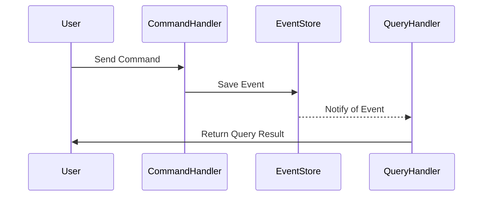

## 11.12 CQRS and Event Sourcing

In the world of software architecture, Command Query Responsibility Segregation (CQRS) and Event Sourcing are two powerful patterns that can significantly enhance the scalability, maintainability, and performance of your applications. In this section, we will explore these patterns in depth, focusing on their implementation in Kotlin, the benefits they offer, and the challenges they present. We will also examine the tools and frameworks that facilitate their use.

### Understanding CQRS

**Command Query Responsibility Segregation (CQRS)** is an architectural pattern that separates the responsibility of handling commands (operations that change the state of the system) from queries (operations that retrieve data). This separation allows for more scalable and maintainable systems by optimizing read and write operations independently.

#### Key Concepts of CQRS

- **Commands**: These are operations that change the state of the system. In CQRS, commands are typically handled by a separate component or service that is optimized for write operations.
- **Queries**: These are operations that retrieve data from the system. Queries are handled by a different component or service that is optimized for read operations.
- **Separation of Concerns**: By separating commands and queries, CQRS allows for more focused and efficient handling of each type of operation.

#### Benefits of CQRS

- **Scalability**: By separating read and write operations, CQRS allows for independent scaling of each component, which can lead to more efficient resource utilization.
- **Performance**: Optimizing read and write operations separately can lead to improved performance, especially in systems with high read or write loads.
- **Flexibility**: CQRS allows for different data models for read and write operations, which can simplify complex business logic and improve maintainability.

#### Implementing CQRS in Kotlin

Let's explore how to implement CQRS in Kotlin with a simple example. We'll create a basic system for managing a library, where users can borrow and return books.

```kotlin
// Command for borrowing a book
data class BorrowBookCommand(val userId: String, val bookId: String)

// Command for returning a book
data class ReturnBookCommand(val userId: String, val bookId: String)

// Query for checking borrowed books
data class BorrowedBooksQuery(val userId: String)

// Command Handler
class CommandHandler {
    fun handle(command: BorrowBookCommand) {
        // Logic to borrow a book
    }

    fun handle(command: ReturnBookCommand) {
        // Logic to return a book
    }
}

// Query Handler
class QueryHandler {
    fun handle(query: BorrowedBooksQuery): List<Book> {
        // Logic to retrieve borrowed books
        return listOf()
    }
}
```

In this example, we have separate classes for handling commands and queries. This separation allows us to optimize each component independently.

### Understanding Event Sourcing

**Event Sourcing** is an architectural pattern where state changes are stored as a sequence of events. Instead of storing the current state of an entity, event sourcing records all changes to the state as a series of events. This allows for a complete audit trail and the ability to reconstruct the state of the system at any point in time.

#### Key Concepts of Event Sourcing

- **Events**: These are records of state changes. Each event represents a change to the state of the system.
- **Event Store**: This is a database or storage system that stores events. The event store is the source of truth for the system's state.
- **Event Replay**: This is the process of replaying events to reconstruct the state of the system.

#### Benefits of Event Sourcing

- **Auditability**: Event sourcing provides a complete audit trail of all changes to the system, which can be useful for compliance and debugging.
- **Flexibility**: By storing events instead of state, event sourcing allows for easy reconstruction of the system's state at any point in time.
- **Scalability**: Event sourcing can improve scalability by decoupling the write and read models.

#### Implementing Event Sourcing in Kotlin

Let's extend our library example to include event sourcing. We'll create events for borrowing and returning books and store them in an event store.

```kotlin
// Event for borrowing a book
data class BookBorrowedEvent(val userId: String, val bookId: String, val timestamp: Long)

// Event for returning a book
data class BookReturnedEvent(val userId: String, val bookId: String, val timestamp: Long)

// Event Store
class EventStore {
    private val events = mutableListOf<Any>()

    fun save(event: Any) {
        events.add(event)
    }

    fun getEvents(): List<Any> = events
}

// Event Handler
class EventHandler(private val eventStore: EventStore) {
    fun handle(event: BookBorrowedEvent) {
        eventStore.save(event)
        // Additional logic for handling the event
    }

    fun handle(event: BookReturnedEvent) {
        eventStore.save(event)
        // Additional logic for handling the event
    }
}
```

In this example, we have an `EventStore` class that stores events and an `EventHandler` class that handles events. This setup allows us to record all changes to the system as events.

### Combining CQRS and Event Sourcing

CQRS and Event Sourcing are often used together to create systems that are both scalable and auditable. By combining these patterns, we can separate the responsibility of handling commands and queries while also maintaining a complete audit trail of all changes to the system.

#### Implementing CQRS and Event Sourcing in Kotlin

Let's combine CQRS and Event Sourcing in our library example. We'll use CQRS to separate command and query handling and Event Sourcing to record all changes as events.

```kotlin
// Command Handler with Event Sourcing
class CommandHandlerWithEventSourcing(private val eventHandler: EventHandler) {
    fun handle(command: BorrowBookCommand) {
        // Logic to borrow a book
        val event = BookBorrowedEvent(command.userId, command.bookId, System.currentTimeMillis())
        eventHandler.handle(event)
    }

    fun handle(command: ReturnBookCommand) {
        // Logic to return a book
        val event = BookReturnedEvent(command.userId, command.bookId, System.currentTimeMillis())
        eventHandler.handle(event)
    }
}

// Query Handler with Event Replay
class QueryHandlerWithEventReplay(private val eventStore: EventStore) {
    fun handle(query: BorrowedBooksQuery): List<Book> {
        // Logic to retrieve borrowed books by replaying events
        val events = eventStore.getEvents()
        // Process events to reconstruct state
        return listOf()
    }
}
```

In this example, the `CommandHandlerWithEventSourcing` class uses event sourcing to record changes, and the `QueryHandlerWithEventReplay` class uses event replay to reconstruct the state of the system.

### Tools and Frameworks for CQRS and Event Sourcing

Several tools and frameworks can help you implement CQRS and Event Sourcing in Kotlin. Here are a few popular options:

- **Axon Framework**: Axon is a popular framework for implementing CQRS and Event Sourcing in Java and Kotlin. It provides a comprehensive set of tools for building scalable and maintainable applications.
- **Eventuate**: Eventuate is a platform for building event-driven microservices with CQRS and Event Sourcing. It supports Kotlin and provides tools for managing events and commands.
- **Kotlin Coroutines**: Kotlin's coroutines can be used to handle asynchronous operations in CQRS and Event Sourcing systems, improving performance and scalability.

### Design Considerations

When implementing CQRS and Event Sourcing, there are several important considerations to keep in mind:

- **Consistency**: CQRS and Event Sourcing can introduce eventual consistency, where the read and write models may not be immediately consistent. It's important to design your system to handle this.
- **Complexity**: These patterns can add complexity to your system, especially if you're not familiar with them. Make sure to weigh the benefits against the added complexity.
- **Tooling**: Choose the right tools and frameworks for your needs. Consider factors such as performance, scalability, and ease of use.

### Differences and Similarities

CQRS and Event Sourcing are often used together, but they are distinct patterns with different purposes:

- **CQRS** is focused on separating read and write operations, while **Event Sourcing** is focused on storing state changes as events.
- Both patterns can improve scalability and maintainability, but they do so in different ways.
- CQRS can be used without Event Sourcing, and vice versa, but they complement each other well.

### Visualizing CQRS and Event Sourcing

To better understand how CQRS and Event Sourcing work together, let's visualize the architecture using a sequence diagram.



In this diagram, the user sends a command to the `CommandHandler`, which saves an event to the `EventStore`. The `QueryHandler` is notified of the event and returns the query result to the user.

### Try It Yourself

Now that we've covered the basics of CQRS and Event Sourcing, try implementing these patterns in your own projects. Experiment with different command and query handlers, and explore how event sourcing can improve the auditability and scalability of your system.

### Knowledge Check

Before we wrap up, let's review some key concepts:

- What are the main benefits of using CQRS?
- How does event sourcing improve auditability?
- What are some challenges of implementing CQRS and Event Sourcing?

### Embrace the Journey

Remember, mastering CQRS and Event Sourcing is a journey. As you gain experience with these patterns, you'll discover new ways to optimize your systems and improve their scalability and maintainability. Keep experimenting, stay curious, and enjoy the journey!

## Quiz Time!



### What is the primary purpose of CQRS?

- [x] To separate read and write operations
- [ ] To store state changes as events
- [ ] To improve database performance
- [ ] To simplify data models

> **Explanation:** CQRS separates read and write operations to optimize them independently.

### What is a key benefit of Event Sourcing?

- [x] Provides a complete audit trail
- [ ] Simplifies data models
- [ ] Reduces database size
- [ ] Increases write performance

> **Explanation:** Event Sourcing records all state changes as events, providing a complete audit trail.

### Which tool is commonly used for implementing CQRS and Event Sourcing in Kotlin?

- [x] Axon Framework
- [ ] Spring Boot
- [ ] Hibernate
- [ ] Retrofit

> **Explanation:** Axon Framework is a popular choice for implementing CQRS and Event Sourcing.

### How does Event Sourcing handle state changes?

- [x] By storing them as events
- [ ] By updating a central database
- [ ] By using in-memory storage
- [ ] By caching them temporarily

> **Explanation:** Event Sourcing stores state changes as events in an event store.

### What is a potential challenge of using CQRS and Event Sourcing?

- [x] Increased complexity
- [ ] Reduced scalability
- [ ] Lack of auditability
- [ ] Poor performance

> **Explanation:** CQRS and Event Sourcing can add complexity to the system.

### Can CQRS be used without Event Sourcing?

- [x] Yes
- [ ] No

> **Explanation:** CQRS can be implemented independently of Event Sourcing.

### What is a common use case for Event Sourcing?

- [x] Systems requiring a complete audit trail
- [ ] Real-time data processing
- [ ] High-frequency trading
- [ ] Image processing

> **Explanation:** Event Sourcing is ideal for systems that need a complete audit trail.

### What does the Event Store do in Event Sourcing?

- [x] Stores events as the source of truth
- [ ] Processes commands
- [ ] Handles queries
- [ ] Manages user sessions

> **Explanation:** The Event Store is responsible for storing events as the source of truth.

### What is eventual consistency in CQRS?

- [x] Read and write models may not be immediately consistent
- [ ] Data is always consistent
- [ ] Only write operations are consistent
- [ ] Only read operations are consistent

> **Explanation:** In CQRS, read and write models may not be immediately consistent, leading to eventual consistency.

### True or False: Event Sourcing can improve scalability by decoupling the write and read models.

- [x] True
- [ ] False

> **Explanation:** Event Sourcing decouples the write and read models, which can improve scalability.


