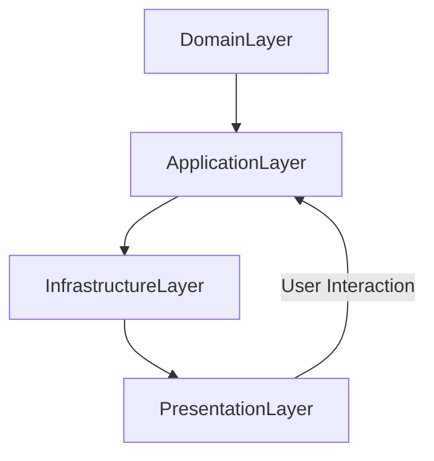

## 11.13 Onion Architecture

The Onion Architecture is a software architectural pattern that emphasizes a core-centric design, promoting a separation of concerns and enhancing maintainability, testability, and scalability. This architecture is particularly beneficial for complex applications where business logic is central and needs to be protected from external influences. In this section, we will delve into the principles of Onion Architecture, its implementation in Kotlin, and how it compares to other architectural patterns.

### Intent

The primary intent of the Onion Architecture is to create a system where the core business logic is isolated from external dependencies, such as databases, UI, and third-party services. This isolation ensures that changes in external systems do not affect the core logic, making the system more robust and adaptable to change.

### Key Concepts

1. **Core-Centric Design**: At the heart of the Onion Architecture is the core layer, which contains the business logic and domain entities. This core is surrounded by layers that handle different aspects of the application, such as data access and user interface.

2. **Layered Approach**: The architecture is structured in concentric layers, with the innermost layer being the core and the outer layers handling infrastructure and external interactions.

3. **Dependency Inversion**: The architecture promotes the Dependency Inversion Principle, where higher-level modules are not dependent on lower-level modules. Instead, both depend on abstractions.

4. **Separation of Concerns**: Each layer has a specific responsibility, reducing the coupling between different parts of the system and making it easier to manage and extend.

### Layers of Onion Architecture

The Onion Architecture is typically composed of the following layers:

1. **Domain Layer**: This is the innermost layer, containing the core business logic and domain entities. It is independent of any external systems or frameworks.

2. **Application Layer**: This layer contains application-specific logic, such as use cases and application services. It coordinates the flow of data between the user interface and the domain layer.

3. **Infrastructure Layer**: This layer handles interactions with external systems, such as databases, file systems, and third-party services. It contains implementations of interfaces defined in the application layer.

4. **Presentation Layer**: This is the outermost layer, responsible for handling user interactions. It includes the user interface and any presentation logic.

### Visualizing Onion Architecture

To better understand the structure of the Onion Architecture, let's visualize it using a Mermaid.js diagram:



**Description**: The diagram illustrates the layered structure of the Onion Architecture, with the Domain Layer at the core, surrounded by the Application, Infrastructure, and Presentation Layers.

### Implementing Onion Architecture in Kotlin

Let's explore how to implement the Onion Architecture in a Kotlin application. We'll create a simple application that manages a list of tasks, demonstrating how each layer interacts with the others.

#### Domain Layer

The Domain Layer contains the core business logic and domain entities. In our example, we'll define a `Task` entity and a `TaskRepository` interface.

```kotlin
// Domain entity
data class Task(val id: Int, val name: String, val completed: Boolean)

// Domain repository interface
interface TaskRepository {
    fun getAllTasks(): List<Task>
    fun getTaskById(id: Int): Task?
    fun saveTask(task: Task)
    fun deleteTask(id: Int)
}
```

**Explanation**: The `Task` class represents a task entity with an ID, name, and completion status. The `TaskRepository` interface defines the operations that can be performed on tasks, without specifying how they are implemented.

#### Application Layer

The Application Layer contains use cases and application services. Here, we'll define a `TaskService` class that uses the `TaskRepository` to manage tasks.

```kotlin
class TaskService(private val taskRepository: TaskRepository) {

    fun getAllTasks(): List<Task> = taskRepository.getAllTasks()

    fun getTaskById(id: Int): Task? = taskRepository.getTaskById(id)

    fun createTask(name: String): Task {
        val task = Task(id = generateTaskId(), name = name, completed = false)
        taskRepository.saveTask(task)
        return task
    }

    fun completeTask(id: Int) {
        val task = taskRepository.getTaskById(id) ?: throw IllegalArgumentException("Task not found")
        val completedTask = task.copy(completed = true)
        taskRepository.saveTask(completedTask)
    }

    private fun generateTaskId(): Int {
        // Logic to generate a unique task ID
        return (taskRepository.getAllTasks().maxOfOrNull { it.id } ?: 0) + 1
    }
}
```

**Explanation**: The `TaskService` class provides methods to manage tasks, such as retrieving all tasks, creating a new task, and marking a task as completed. It uses the `TaskRepository` interface to interact with the data layer.

#### Infrastructure Layer

The Infrastructure Layer provides implementations for the interfaces defined in the Domain and Application Layers. Here, we'll implement the `TaskRepository` interface using an in-memory data store.

```kotlin
class InMemoryTaskRepository : TaskRepository {
    private val tasks = mutableListOf<Task>()

    override fun getAllTasks(): List<Task> = tasks

    override fun getTaskById(id: Int): Task? = tasks.find { it.id == id }

    override fun saveTask(task: Task) {
        tasks.removeIf { it.id == task.id }
        tasks.add(task)
    }

    override fun deleteTask(id: Int) {
        tasks.removeIf { it.id == id }
    }
}
```

**Explanation**: The `InMemoryTaskRepository` class provides an in-memory implementation of the `TaskRepository` interface, storing tasks in a mutable list.

#### Presentation Layer

The Presentation Layer handles user interactions. In this example, we'll create a simple command-line interface to interact with the task management application.

```kotlin
fun main() {
    val taskRepository = InMemoryTaskRepository()
    val taskService = TaskService(taskRepository)

    while (true) {
        println("1. View Tasks")
        println("2. Add Task")
        println("3. Complete Task")
        println("4. Exit")
        print("Choose an option: ")

        when (readLine()?.toIntOrNull()) {
            1 -> {
                val tasks = taskService.getAllTasks()
                tasks.forEach { println("${it.id}: ${it.name} [${if (it.completed) "Completed" else "Pending"}]") }
            }
            2 -> {
                print("Enter task name: ")
                val name = readLine() ?: ""
                val task = taskService.createTask(name)
                println("Task '${task.name}' created with ID ${task.id}")
            }
            3 -> {
                print("Enter task ID to complete: ")
                val id = readLine()?.toIntOrNull()
                if (id != null) {
                    try {
                        taskService.completeTask(id)
                        println("Task $id marked as completed.")
                    } catch (e: IllegalArgumentException) {
                        println(e.message)
                    }
                } else {
                    println("Invalid ID")
                }
            }
            4 -> return
            else -> println("Invalid option")
        }
    }
}
```

**Explanation**: The `main` function provides a simple command-line interface for interacting with the task management application. Users can view tasks, add new tasks, and mark tasks as completed.

### Design Considerations

When implementing the Onion Architecture, consider the following:

- **Decoupling**: Ensure that each layer is decoupled from the others, with dependencies flowing inward towards the core.
- **Testability**: The architecture should facilitate testing, allowing each layer to be tested independently.
- **Flexibility**: The architecture should be flexible enough to accommodate changes in external systems without affecting the core logic.
- **Kotlin Features**: Leverage Kotlin's features, such as data classes and extension functions, to create clean and expressive code.

### Differences and Similarities with Other Patterns

The Onion Architecture shares similarities with other layered architectures, such as the Hexagonal Architecture and Clean Architecture. However, it emphasizes a core-centric design, where the core business logic is at the center of the architecture. This focus on the core distinguishes it from other patterns that may not prioritize the core logic as strongly.

### Try It Yourself

To experiment with the Onion Architecture, try modifying the code examples provided:

- **Add New Features**: Extend the application by adding new features, such as task categories or due dates.
- **Implement Persistence**: Replace the in-memory data store with a persistent database, such as SQLite or PostgreSQL.
- **Enhance the UI**: Create a graphical user interface using a Kotlin framework, such as TornadoFX or Compose for Desktop.

### Knowledge Check

To reinforce your understanding of the Onion Architecture, consider the following questions:

- How does the Onion Architecture promote separation of concerns?
- What are the benefits of isolating the core business logic in the Onion Architecture?
- How can Kotlin's features be leveraged to implement the Onion Architecture effectively?

### Embrace the Journey

Remember, mastering the Onion Architecture is just the beginning. As you continue to build complex applications, you'll discover new ways to apply this architecture to enhance maintainability, testability, and scalability. Keep experimenting, stay curious, and enjoy the journey!

## Quiz Time!



### What is the primary intent of the Onion Architecture?

- [x] To isolate core business logic from external dependencies
- [ ] To maximize performance at the expense of maintainability
- [ ] To simplify user interface design
- [ ] To reduce the number of layers in an application

> **Explanation:** The Onion Architecture aims to isolate core business logic from external dependencies to enhance maintainability and adaptability.

### Which layer of the Onion Architecture contains the core business logic?

- [x] Domain Layer
- [ ] Application Layer
- [ ] Infrastructure Layer
- [ ] Presentation Layer

> **Explanation:** The Domain Layer is the innermost layer that contains the core business logic and domain entities.

### How does the Onion Architecture promote the Dependency Inversion Principle?

- [x] By ensuring higher-level modules depend on abstractions, not lower-level modules
- [ ] By using inheritance to share functionality
- [ ] By minimizing the number of classes in the application
- [ ] By focusing on user interface design

> **Explanation:** The Onion Architecture promotes the Dependency Inversion Principle by ensuring that both higher-level and lower-level modules depend on abstractions.

### What is a key benefit of using the Onion Architecture?

- [x] Enhanced testability and maintainability
- [ ] Simplified user interface design
- [ ] Increased application performance
- [ ] Reduced code complexity

> **Explanation:** The Onion Architecture enhances testability and maintainability by isolating core logic and promoting separation of concerns.

### In the Onion Architecture, which layer is responsible for handling user interactions?

- [ ] Domain Layer
- [ ] Application Layer
- [ ] Infrastructure Layer
- [x] Presentation Layer

> **Explanation:** The Presentation Layer is responsible for handling user interactions and includes the user interface and presentation logic.

### What is the role of the Infrastructure Layer in the Onion Architecture?

- [x] To handle interactions with external systems such as databases and third-party services
- [ ] To define the core business logic
- [ ] To manage user interface components
- [ ] To implement application-specific logic

> **Explanation:** The Infrastructure Layer handles interactions with external systems, providing implementations for interfaces defined in the Domain and Application Layers.

### How can Kotlin's features be leveraged in the Onion Architecture?

- [x] By using data classes and extension functions for clean and expressive code
- [ ] By minimizing the use of interfaces
- [ ] By focusing on inheritance for code reuse
- [ ] By avoiding the use of Kotlin-specific features

> **Explanation:** Kotlin's features like data classes and extension functions can be leveraged to create clean and expressive code in the Onion Architecture.

### What is a common similarity between Onion Architecture and Hexagonal Architecture?

- [x] Both emphasize separation of concerns and decoupling
- [ ] Both focus on minimizing the number of layers
- [ ] Both prioritize user interface design
- [ ] Both are primarily used for small applications

> **Explanation:** Both Onion Architecture and Hexagonal Architecture emphasize separation of concerns and decoupling, though they have different focuses.

### True or False: The Onion Architecture is particularly beneficial for applications where the user interface is the most critical component.

- [ ] True
- [x] False

> **Explanation:** The Onion Architecture is beneficial for applications where the core business logic is critical, not necessarily the user interface.

### Which of the following is a potential modification you can try in the provided code example?

- [x] Implementing persistence with a database
- [ ] Reducing the number of layers
- [ ] Removing the Domain Layer
- [ ] Focusing solely on user interface enhancements

> **Explanation:** Implementing persistence with a database is a potential modification to enhance the example application.


