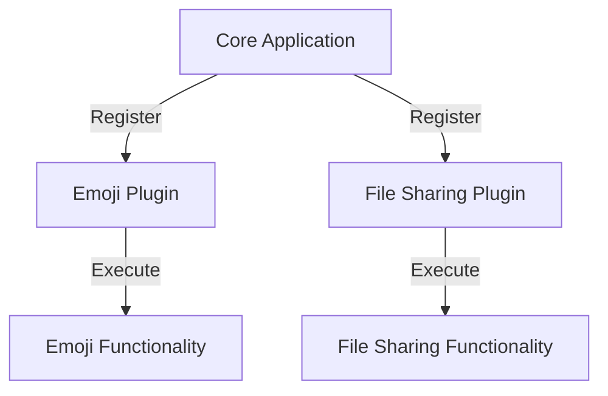

## 11.14 Plugin Architecture

In the realm of software engineering, the ability to extend and modify applications without altering the core codebase is a powerful capability. This is where the Plugin Architecture comes into play. In this section, we will delve into the intricacies of designing systems with extensibility using plugin frameworks in Kotlin. We will explore the concepts, implementation strategies, and best practices for creating scalable and maintainable applications through plugins.

### Introduction to Plugin Architecture

**Plugin Architecture** is a design pattern that allows developers to extend the functionality of an application by adding plugins. These plugins are separate modules that can be independently developed, tested, and deployed, providing additional features or enhancements to the core application.

#### Key Concepts

- **Extensibility**: The primary goal of plugin architecture is to enable extensibility. This allows developers to add new features without modifying the existing codebase.
- **Modularity**: Plugins are modular components that can be added or removed as needed, promoting a clean separation of concerns.
- **Decoupling**: By decoupling the core application from its extensions, plugin architecture enhances maintainability and scalability.

### Why Use Plugin Architecture?

Plugin architecture is particularly beneficial in scenarios where applications need to be highly customizable or when rapid feature development is required. Here are some reasons to consider using plugin architecture:

- **Flexibility**: Easily add, update, or remove features without affecting the core application.
- **Scalability**: Support a wide range of functionalities through plugins, allowing the application to grow with user needs.
- **Community Involvement**: Encourage community contributions by allowing third-party developers to create plugins.
- **Reduced Complexity**: Simplify the core application by offloading specific functionalities to plugins.

### Plugin Frameworks in Kotlin

Kotlin, with its expressive syntax and powerful features, is well-suited for implementing plugin architectures. Several frameworks and libraries facilitate plugin development in Kotlin:

- **Kotlin Plugin System**: A lightweight system for managing plugins within Kotlin applications.
- **Gradle Plugins**: Gradle, the build automation tool, supports plugin development in Kotlin, allowing for custom build logic.
- **OSGi (Open Service Gateway Initiative)**: A framework for modular development, supporting dynamic component loading and unloading.

### Designing a Plugin System

Designing a plugin system involves several key steps, from defining the core application to implementing the plugin interface and managing plugin lifecycle events.

#### Defining the Core Application

The core application should be designed to be minimal and focused on essential functionalities. It should provide a well-defined API for plugins to interact with the core system.

```kotlin
// Core application interface
interface Plugin {
    fun initialize()
    fun execute()
    fun shutdown()
}

// Core application class
class CoreApplication {
    private val plugins = mutableListOf<Plugin>()

    fun registerPlugin(plugin: Plugin) {
        plugins.add(plugin)
        plugin.initialize()
    }

    fun run() {
        plugins.forEach { it.execute() }
    }

    fun shutdown() {
        plugins.forEach { it.shutdown() }
    }
}
```

#### Implementing the Plugin Interface

Plugins should implement a common interface to ensure consistency and interoperability with the core application.

```kotlin
// Sample plugin implementation
class SamplePlugin : Plugin {
    override fun initialize() {
        println("SamplePlugin initialized")
    }

    override fun execute() {
        println("SamplePlugin executed")
    }

    override fun shutdown() {
        println("SamplePlugin shutdown")
    }
}
```

#### Managing Plugin Lifecycle

Managing the lifecycle of plugins is crucial for maintaining system stability and performance. This involves handling initialization, execution, and shutdown processes.

### Loading and Managing Plugins

Plugins can be loaded dynamically at runtime, allowing for flexible and adaptive systems. This can be achieved through reflection or service loaders.

#### Using Reflection

Reflection can be used to discover and load plugins at runtime. This approach requires careful handling of class loading and type safety.

```kotlin
// Loading plugins using reflection
fun loadPlugins(pluginDirectory: String): List<Plugin> {
    val plugins = mutableListOf<Plugin>()
    val pluginFiles = File(pluginDirectory).listFiles { file -> file.extension == "jar" }
    
    pluginFiles?.forEach { file ->
        val classLoader = URLClassLoader(arrayOf(file.toURI().toURL()))
        val pluginClass = classLoader.loadClass("com.example.plugins.SamplePlugin")
        val pluginInstance = pluginClass.getDeclaredConstructor().newInstance() as Plugin
        plugins.add(pluginInstance)
    }
    return plugins
}
```

#### Using Service Loaders

The ServiceLoader mechanism in Java can be leveraged in Kotlin to load plugins. This approach is more type-safe and easier to manage.

```kotlin
// Loading plugins using ServiceLoader
fun loadPlugins(): List<Plugin> {
    return ServiceLoader.load(Plugin::class.java).toList()
}
```

### Security Considerations

When implementing a plugin architecture, security is a paramount concern. Plugins, especially third-party ones, can introduce vulnerabilities or malicious code. Here are some strategies to mitigate security risks:

- **Sandboxing**: Run plugins in a restricted environment to limit their access to system resources.
- **Code Signing**: Require plugins to be signed with a trusted certificate to ensure their integrity and authenticity.
- **Permission Management**: Implement a permission system to control what actions plugins can perform.

### Performance Optimization

Performance can be a concern when dealing with multiple plugins. Here are some strategies to optimize performance:

- **Lazy Loading**: Load plugins only when they are needed to reduce startup time and resource consumption.
- **Caching**: Cache plugin results to avoid redundant computations.
- **Asynchronous Execution**: Execute plugin tasks asynchronously to prevent blocking the main application thread.

### Best Practices for Plugin Development

To ensure a robust and maintainable plugin system, consider the following best practices:

- **Clear Documentation**: Provide comprehensive documentation for plugin developers, including API references and usage examples.
- **Versioning**: Implement a versioning system for plugins to manage compatibility with the core application.
- **Testing**: Thoroughly test plugins in isolation and in conjunction with the core application to ensure stability.

### Case Study: Building a Plugin System for a Chat Application

Let's consider a practical example of building a plugin system for a chat application. The core application provides basic messaging functionalities, while plugins can add features like emoji support, file sharing, or language translation.

#### Core Application

```kotlin
// Chat application core
class ChatApplication {
    private val plugins = mutableListOf<Plugin>()

    fun registerPlugin(plugin: Plugin) {
        plugins.add(plugin)
        plugin.initialize()
    }

    fun sendMessage(message: String) {
        plugins.forEach { it.execute() }
        println("Message sent: $message")
    }

    fun shutdown() {
        plugins.forEach { it.shutdown() }
    }
}
```

#### Emoji Plugin

```kotlin
// Emoji plugin implementation
class EmojiPlugin : Plugin {
    override fun initialize() {
        println("EmojiPlugin initialized")
    }

    override fun execute() {
        println("EmojiPlugin executed: 😊")
    }

    override fun shutdown() {
        println("EmojiPlugin shutdown")
    }
}
```

#### File Sharing Plugin

```kotlin
// File sharing plugin implementation
class FileSharingPlugin : Plugin {
    override fun initialize() {
        println("FileSharingPlugin initialized")
    }

    override fun execute() {
        println("FileSharingPlugin executed: File shared")
    }

    override fun shutdown() {
        println("FileSharingPlugin shutdown")
    }
}
```

### Visualizing Plugin Architecture

To better understand the plugin architecture, let's visualize the interaction between the core application and plugins.



**Diagram Description**: This diagram illustrates the core application registering and interacting with the Emoji and File Sharing plugins. Each plugin provides specific functionalities that extend the core application.

### Try It Yourself

To get hands-on experience with plugin architecture, try modifying the code examples provided. Here are some suggestions:

- **Add a New Plugin**: Create a new plugin that adds a different feature, such as language translation or message encryption.
- **Implement Lazy Loading**: Modify the core application to load plugins only when they are needed.
- **Enhance Security**: Implement a basic permission system to control what actions plugins can perform.

### Knowledge Check

- **What is the primary goal of plugin architecture?**
- **How can plugins be loaded dynamically in Kotlin?**
- **What are some security considerations when implementing a plugin system?**

### Conclusion

Plugin architecture is a powerful design pattern that enhances the flexibility, scalability, and maintainability of applications. By leveraging Kotlin's features and frameworks, developers can create robust plugin systems that support a wide range of functionalities. As you continue to explore plugin architecture, remember to prioritize security, performance, and best practices to build effective and reliable systems.

## Quiz Time!



### What is the primary benefit of using plugin architecture?

- [x] Extensibility
- [ ] Complexity
- [ ] Redundancy
- [ ] Inflexibility

> **Explanation:** The primary benefit of plugin architecture is extensibility, allowing new features to be added without modifying the core application.

### Which Kotlin feature is particularly useful for implementing plugin architecture?

- [x] Reflection
- [ ] Data Classes
- [ ] Inline Functions
- [ ] Sealed Classes

> **Explanation:** Reflection is useful for dynamically loading and managing plugins at runtime.

### What is a key security measure when using third-party plugins?

- [x] Code Signing
- [ ] Ignoring Permissions
- [ ] Disabling Sandboxing
- [ ] Allowing All Access

> **Explanation:** Code signing ensures the integrity and authenticity of plugins, mitigating security risks.

### How can plugins be loaded in a type-safe manner in Kotlin?

- [x] ServiceLoader
- [ ] Reflection
- [ ] GlobalScope
- [ ] lateinit

> **Explanation:** ServiceLoader provides a type-safe mechanism for loading plugins in Kotlin.

### Which of the following is a performance optimization strategy for plugins?

- [x] Lazy Loading
- [ ] Eager Execution
- [ ] Redundant Computations
- [ ] Blocking Main Thread

> **Explanation:** Lazy loading improves performance by loading plugins only when needed.

### What is a common use case for plugin architecture?

- [x] Adding features to a chat application
- [ ] Reducing application size
- [ ] Increasing code complexity
- [ ] Limiting application functionality

> **Explanation:** Plugin architecture is commonly used to add features to applications, such as chat applications.

### What is the role of the core application in a plugin system?

- [x] Providing a well-defined API for plugins
- [ ] Executing all plugin code
- [ ] Managing plugin dependencies
- [ ] Disabling plugin functionalities

> **Explanation:** The core application provides a well-defined API for plugins to interact with the system.

### Which diagramming tool was used to visualize the plugin architecture?

- [x] Mermaid.js
- [ ] UML
- [ ] PlantUML
- [ ] Lucidchart

> **Explanation:** Mermaid.js was used to create the diagram illustrating the plugin architecture.

### What is a benefit of using Kotlin for plugin development?

- [x] Expressive syntax and powerful features
- [ ] Limited library support
- [ ] Lack of community involvement
- [ ] Inflexible language constructs

> **Explanation:** Kotlin's expressive syntax and powerful features make it well-suited for plugin development.

### True or False: Plugin architecture reduces the need for community involvement.

- [ ] True
- [x] False

> **Explanation:** Plugin architecture encourages community involvement by allowing third-party developers to create plugins.


