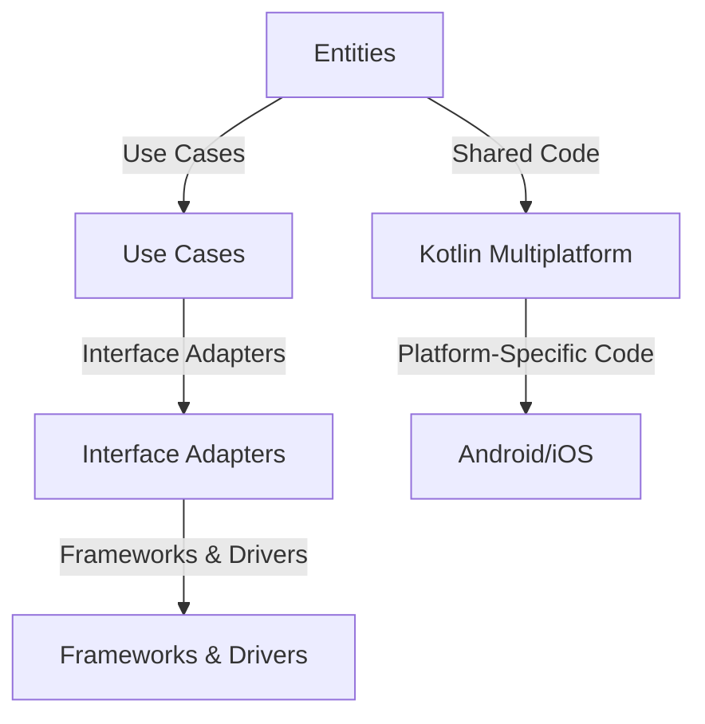

## 11.15 Clean Architecture with Kotlin Multiplatform

In the rapidly evolving world of software development, the need for efficient and maintainable code that can be shared across multiple platforms is more crucial than ever. Kotlin Multiplatform (KMM) offers a powerful solution to this challenge by allowing developers to write shared code that can run on various platforms, including Android, iOS, and beyond. When combined with Clean Architecture, KMM enables the creation of robust, scalable, and maintainable applications. In this section, we will explore how to effectively integrate Clean Architecture with Kotlin Multiplatform, focusing on sharing business logic across platforms and structuring KMM projects.

### Understanding Clean Architecture

Clean Architecture is a software design philosophy introduced by Robert C. Martin (Uncle Bob) that emphasizes separation of concerns, testability, and maintainability. It structures applications in such a way that the core business logic is independent of external frameworks, UI, and databases. This separation is achieved through the use of layers, each with distinct responsibilities.

#### Key Principles of Clean Architecture

1. **Independence**: The core business logic should be independent of frameworks, UI, and databases.
2. **Testability**: Business rules can be tested without the UI, database, or any external elements.
3. **Flexibility**: The architecture should allow for easy changes and adaptations.
4. **Separation of Concerns**: Each layer should have a clear responsibility, reducing the risk of code duplication and complexity.

#### Layers in Clean Architecture

- **Entities**: Represent the core business logic and rules. They are independent of any external systems.
- **Use Cases (Interactors)**: Contain the application-specific business rules. They orchestrate the flow of data to and from the entities.
- **Interface Adapters**: Convert data from the format most convenient for the use cases and entities to the format most convenient for external agencies such as databases and the web.
- **Frameworks and Drivers**: The outermost layer, which includes frameworks and tools such as databases, UI, and external APIs.

### Integrating Clean Architecture with Kotlin Multiplatform

Kotlin Multiplatform allows developers to write shared code that can be used across different platforms, reducing duplication and improving consistency. By integrating Clean Architecture with KMM, we can achieve a highly modular and maintainable codebase.

#### Structuring a KMM Project with Clean Architecture

To effectively structure a KMM project using Clean Architecture, we need to consider how to organize the code into modules that align with the architectural layers. Here's a recommended approach:

1. **Core Module**: Contains the entities and use cases. This module is platform-independent and can be shared across all platforms.
2. **Platform-Specific Modules**: Implement the interface adapters and frameworks/drivers for each platform (e.g., Android, iOS).
3. **Shared Module**: Contains the shared code that is common across platforms, including the core module.

#### Example Project Structure

```
my-kmm-project/
├── core/
│   ├── src/commonMain/kotlin/
│   │   ├── entities/
│   │   └── usecases/
├── androidApp/
│   ├── src/main/java/
│   │   ├── adapters/
│   │   └── frameworks/
├── iosApp/
│   ├── src/main/swift/
│   │   ├── adapters/
│   │   └── frameworks/
└── shared/
    ├── src/commonMain/kotlin/
    ├── src/androidMain/kotlin/
    └── src/iosMain/kotlin/
```

### Implementing Clean Architecture in a KMM Project

Let's dive into a practical example to illustrate how Clean Architecture can be implemented in a KMM project. We'll create a simple application that manages a list of tasks.

#### Defining the Core Module

The core module contains the entities and use cases. In our example, we'll define a `Task` entity and a `TaskUseCase` for managing tasks.

```kotlin
// core/src/commonMain/kotlin/entities/Task.kt
data class Task(val id: String, val title: String, val isCompleted: Boolean)

// core/src/commonMain/kotlin/usecases/TaskUseCase.kt
class TaskUseCase(private val taskRepository: TaskRepository) {
    fun getTasks(): List<Task> = taskRepository.getAllTasks()
    fun addTask(task: Task) = taskRepository.addTask(task)
    fun completeTask(taskId: String) = taskRepository.completeTask(taskId)
}
```

#### Creating the Shared Module

The shared module will include the implementation of the `TaskRepository` interface, which will be platform-specific.

```kotlin
// shared/src/commonMain/kotlin/repositories/TaskRepository.kt
interface TaskRepository {
    fun getAllTasks(): List<Task>
    fun addTask(task: Task)
    fun completeTask(taskId: String)
}
```

#### Implementing Platform-Specific Modules

For each platform, we need to implement the `TaskRepository` interface and any necessary adapters or frameworks.

**Android Implementation:**

```kotlin
// androidApp/src/main/java/repositories/TaskRepositoryImpl.kt
class TaskRepositoryImpl : TaskRepository {
    private val tasks = mutableListOf<Task>()

    override fun getAllTasks(): List<Task> = tasks

    override fun addTask(task: Task) {
        tasks.add(task)
    }

    override fun completeTask(taskId: String) {
        tasks.find { it.id == taskId }?.let { it.isCompleted = true }
    }
}
```

**iOS Implementation:**

```swift
// iosApp/src/main/swift/repositories/TaskRepositoryImpl.swift
class TaskRepositoryImpl: TaskRepository {
    private var tasks: [Task] = []

    func getAllTasks() -> [Task] {
        return tasks
    }

    func addTask(task: Task) {
        tasks.append(task)
    }

    func completeTask(taskId: String) {
        if let index = tasks.firstIndex(where: { $0.id == taskId }) {
            tasks[index].isCompleted = true
        }
    }
}
```

### Visualizing Clean Architecture with KMM

To better understand the flow and structure of Clean Architecture in a KMM project, let's visualize the architecture using a diagram.



**Diagram Description:** This diagram represents the flow of data and responsibilities in a KMM project using Clean Architecture. The core business logic (Entities and Use Cases) is shared across platforms, while the Interface Adapters and Frameworks & Drivers are implemented specifically for each platform.

### Benefits of Using Clean Architecture with KMM

1. **Code Reusability**: By sharing the core business logic across platforms, we reduce code duplication and ensure consistency.
2. **Maintainability**: The separation of concerns makes the codebase easier to understand and modify.
3. **Testability**: The core business logic can be tested independently of the UI and platform-specific code.
4. **Scalability**: The modular structure allows for easy addition of new features and platforms.

### Challenges and Considerations

While Clean Architecture with KMM offers numerous benefits, there are also challenges to consider:

- **Complexity**: The initial setup and understanding of Clean Architecture can be complex, especially for larger projects.
- **Platform-Specific Code**: Some features may require platform-specific implementations, which can complicate the architecture.
- **Tooling and Support**: KMM is still evolving, and tooling support may not be as mature as other platforms.

### Best Practices for Clean Architecture with KMM

1. **Modularize Your Code**: Keep your codebase organized by separating concerns into distinct modules.
2. **Leverage Interfaces**: Use interfaces to define contracts between layers, allowing for flexibility and testability.
3. **Write Tests**: Ensure your core business logic is thoroughly tested by writing unit tests for your use cases.
4. **Document Your Architecture**: Maintain clear documentation of your architecture to facilitate understanding and collaboration.

### Try It Yourself

Now that we've covered the basics of integrating Clean Architecture with Kotlin Multiplatform, it's time to put your knowledge into practice. Try modifying the code examples provided to add new features, such as editing or deleting tasks. Experiment with different architectural patterns and see how they can be combined with Clean Architecture to enhance your project.

### Conclusion

Integrating Clean Architecture with Kotlin Multiplatform provides a powerful approach to building scalable, maintainable, and cross-platform applications. By sharing business logic across platforms, developers can reduce duplication, improve consistency, and focus on delivering high-quality software. As you continue your journey in software development, remember to embrace the principles of Clean Architecture and explore the possibilities offered by Kotlin Multiplatform.

## Quiz Time!



### What is the primary goal of Clean Architecture?

- [x] To separate concerns and make the core business logic independent of external systems.
- [ ] To create a monolithic application structure.
- [ ] To focus solely on UI design.
- [ ] To prioritize database design over business logic.

> **Explanation:** Clean Architecture aims to separate concerns, making the core business logic independent of external systems like UI and databases.

### Which layer in Clean Architecture contains the core business logic?

- [x] Entities
- [ ] Interface Adapters
- [ ] Frameworks and Drivers
- [ ] Use Cases

> **Explanation:** The Entities layer contains the core business logic and rules, independent of external systems.

### In a KMM project, where should platform-specific code be implemented?

- [ ] Core Module
- [x] Platform-Specific Modules
- [ ] Shared Module
- [ ] Entities Layer

> **Explanation:** Platform-specific code should be implemented in Platform-Specific Modules to handle platform-specific functionalities.

### What is a key benefit of using Kotlin Multiplatform with Clean Architecture?

- [x] Code reusability across platforms
- [ ] Increased code duplication
- [ ] Reduced testability
- [ ] Dependency on a single platform

> **Explanation:** Kotlin Multiplatform with Clean Architecture allows for code reusability across platforms, reducing duplication and ensuring consistency.

### Which of the following is a challenge when using Clean Architecture with KMM?

- [x] Complexity of initial setup
- [ ] Lack of code reusability
- [ ] Inability to test core business logic
- [ ] Limited scalability

> **Explanation:** The complexity of the initial setup and understanding of Clean Architecture can be a challenge, especially for larger projects.

### What is the role of the Use Cases layer in Clean Architecture?

- [x] To contain application-specific business rules and orchestrate data flow
- [ ] To implement platform-specific code
- [ ] To manage UI components
- [ ] To store data in databases

> **Explanation:** The Use Cases layer contains application-specific business rules and orchestrates the flow of data to and from the entities.

### How can you ensure the testability of your core business logic in a KMM project?

- [x] By writing unit tests for your use cases
- [ ] By focusing only on UI testing
- [ ] By avoiding interfaces
- [ ] By implementing all logic in platform-specific modules

> **Explanation:** Writing unit tests for your use cases ensures the testability of your core business logic, independent of UI and platform-specific code.

### What is a recommended practice for maintaining a KMM project?

- [x] Modularizing your code
- [ ] Combining all code into a single module
- [ ] Avoiding documentation
- [ ] Focusing only on one platform

> **Explanation:** Modularizing your code helps keep the codebase organized and maintainable by separating concerns into distinct modules.

### Which of the following is NOT a principle of Clean Architecture?

- [ ] Independence
- [ ] Testability
- [ ] Flexibility
- [x] Monolithic design

> **Explanation:** Monolithic design is not a principle of Clean Architecture, which emphasizes separation of concerns and modularity.

### True or False: Clean Architecture with KMM can only be used for mobile applications.

- [ ] True
- [x] False

> **Explanation:** Clean Architecture with KMM can be used for various types of applications, not just mobile, as it allows for sharing business logic across multiple platforms.


