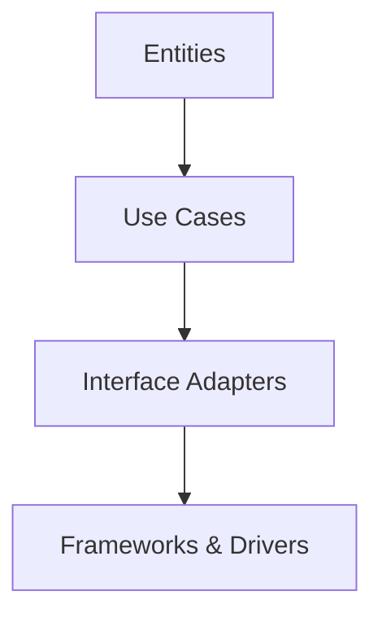
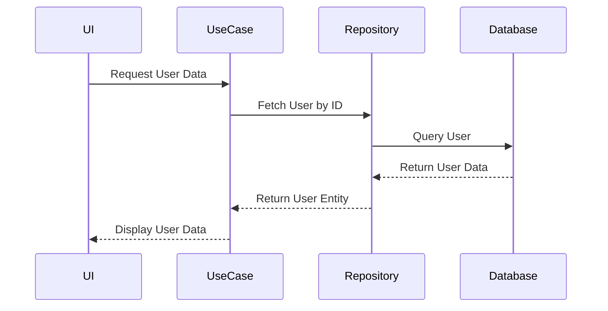

## 11.2 Clean Architecture

In the ever-evolving landscape of software development, creating maintainable and scalable applications is paramount. Clean Architecture, introduced by Robert C. Martin (Uncle Bob), provides a robust framework for achieving this goal. This architectural style emphasizes the separation of concerns, dependency management, and a clear delineation of responsibilities across different layers of an application.

### Understanding Clean Architecture

Clean Architecture is a software design philosophy that aims to create systems that are easy to understand, change, and maintain. It achieves this by organizing code into layers, each with distinct responsibilities and dependencies. The core idea is to keep the business logic independent of external factors like databases, frameworks, and user interfaces.

#### Key Principles

1. **Separation of Concerns**: Each layer of the architecture has a specific responsibility, reducing the complexity of the system and making it easier to understand and modify.
2. **Dependency Inversion**: High-level modules should not depend on low-level modules. Both should depend on abstractions. This principle is crucial for maintaining flexibility and testability.
3. **Independence**: The core business logic is independent of the user interface, database, and other external systems, allowing for easier changes and testing.

### Layers of Clean Architecture

Clean Architecture typically consists of several concentric layers, each with its own set of responsibilities. The most common layers are:

1. **Entities**: The innermost layer, representing the core business logic and rules. Entities are independent of any external systems.
2. **Use Cases**: This layer contains application-specific business rules. It orchestrates the flow of data to and from the entities and directs the work that needs to be done.
3. **Interface Adapters**: This layer converts data from the format most convenient for the use cases and entities to the format most convenient for external agencies such as databases and the web.
4. **Frameworks and Drivers**: The outermost layer, consisting of frameworks and tools such as databases, UI frameworks, and web servers. This layer is where the details reside.

#### Visualizing Clean Architecture



*Diagram: The concentric layers of Clean Architecture, showing the flow of dependencies.*

### Implementing Clean Architecture in Kotlin

Kotlin, with its expressive syntax and modern features, is well-suited for implementing Clean Architecture. Let's explore how we can structure a Kotlin application using this architectural style.

#### Entities

Entities are the core business objects of your application. They encapsulate the most general and high-level rules. In Kotlin, entities can be represented using data classes, which provide a concise way to define immutable objects.

```kotlin
data class User(val id: String, val name: String, val email: String)
```

*Code Example: A simple `User` entity defined as a data class.*

#### Use Cases

Use cases contain the application-specific business rules. They are responsible for executing a specific action or task within the application. In Kotlin, use cases can be implemented as classes or functions.

```kotlin
class GetUserUseCase(private val userRepository: UserRepository) {
    fun execute(userId: String): User? {
        return userRepository.findById(userId)
    }
}
```

*Code Example: A use case for retrieving a user by ID.*

#### Interface Adapters

Interface adapters are responsible for converting data between the use cases and external systems. In Kotlin, this can be achieved using interfaces and classes that implement these interfaces.

```kotlin
interface UserRepository {
    fun findById(userId: String): User?
}

class UserRepositoryImpl(private val database: Database) : UserRepository {
    override fun findById(userId: String): User? {
        // Convert database result to User entity
        return database.queryUser(userId)?.let {
            User(it.id, it.name, it.email)
        }
    }
}
```

*Code Example: An interface and its implementation for accessing user data.*

#### Frameworks and Drivers

This layer includes the actual implementation details, such as database connections and web frameworks. In Kotlin, you can use libraries like Ktor or Spring Boot for web applications.

```kotlin
fun main() {
    val database = Database()
    val userRepository = UserRepositoryImpl(database)
    val getUserUseCase = GetUserUseCase(userRepository)

    // Example usage
    val user = getUserUseCase.execute("123")
    println(user)
}
```

*Code Example: A simple main function demonstrating the use of the architecture.*

### Dependency Rule and Data Flow

One of the core tenets of Clean Architecture is the Dependency Rule, which states that source code dependencies can only point inward. This means that the inner layers should not know anything about the outer layers. This rule is crucial for maintaining the independence of the business logic.

#### Managing Dependencies in Kotlin

Kotlin provides several features that facilitate dependency management, such as interfaces, dependency injection, and extension functions. By using these features, you can ensure that your application adheres to the Dependency Rule.

##### Dependency Injection

Dependency injection is a technique for achieving Inversion of Control (IoC) between classes and their dependencies. In Kotlin, you can use libraries like Koin or Dagger to manage dependencies.

```kotlin
val appModule = module {
    single { Database() }
    single<UserRepository> { UserRepositoryImpl(get()) }
    factory { GetUserUseCase(get()) }
}

fun main() {
    startKoin {
        modules(appModule)
    }
    val getUserUseCase: GetUserUseCase = getKoin().get()
    val user = getUserUseCase.execute("123")
    println(user)
}
```

*Code Example: Using Koin for dependency injection in a Kotlin application.*

### Design Considerations

When implementing Clean Architecture in Kotlin, consider the following:

1. **Testability**: By separating concerns and managing dependencies, Clean Architecture makes it easier to write unit tests for your application.
2. **Flexibility**: The architecture allows you to change the implementation details (e.g., database, UI framework) without affecting the core business logic.
3. **Complexity**: While Clean Architecture provides many benefits, it can also introduce complexity. It's important to balance the architectural rigor with the needs of your project.

#### Differences and Similarities with Other Patterns

Clean Architecture shares similarities with other architectural patterns like Hexagonal Architecture and Onion Architecture. All these patterns emphasize the separation of concerns and dependency management. However, Clean Architecture is more prescriptive in its layering and dependency rules.

### Try It Yourself

To deepen your understanding of Clean Architecture, try modifying the code examples provided. For instance, implement a new use case or add a new data source. Experiment with different dependency injection frameworks and observe how they affect the architecture.

### Visualizing Data Flow

To better understand how data flows through the layers of Clean Architecture, consider the following sequence diagram:



*Diagram: Sequence diagram showing the flow of data through the layers of Clean Architecture.*

### Knowledge Check

1. **What is the primary goal of Clean Architecture?**
   - To create systems that are easy to understand, change, and maintain.

2. **What is the Dependency Rule in Clean Architecture?**
   - Source code dependencies can only point inward.

3. **How does Clean Architecture improve testability?**
   - By separating concerns and managing dependencies, making it easier to write unit tests.

4. **What are the core layers of Clean Architecture?**
   - Entities, Use Cases, Interface Adapters, Frameworks and Drivers.

5. **How can dependency injection be implemented in Kotlin?**
   - Using libraries like Koin or Dagger.

### Embrace the Journey

Remember, mastering Clean Architecture is a journey. As you implement these principles in your projects, you'll gain a deeper understanding of how to create maintainable and scalable systems. Keep experimenting, stay curious, and enjoy the process!

## Quiz Time!



### What is the primary goal of Clean Architecture?

- [x] To create systems that are easy to understand, change, and maintain.
- [ ] To maximize performance at the cost of maintainability.
- [ ] To reduce the number of lines of code.
- [ ] To use as many design patterns as possible.

> **Explanation:** Clean Architecture aims to create systems that are easy to understand, change, and maintain by organizing code into layers with specific responsibilities.

### Which principle is crucial for maintaining flexibility and testability in Clean Architecture?

- [x] Dependency Inversion
- [ ] Single Responsibility
- [ ] Open/Closed Principle
- [ ] Liskov Substitution

> **Explanation:** Dependency Inversion is crucial for maintaining flexibility and testability, as it ensures that high-level modules do not depend on low-level modules.

### What is the Dependency Rule in Clean Architecture?

- [x] Source code dependencies can only point inward.
- [ ] All dependencies must be external.
- [ ] Dependencies should point outward.
- [ ] There should be no dependencies.

> **Explanation:** The Dependency Rule states that source code dependencies can only point inward, ensuring that inner layers are independent of outer layers.

### How does Clean Architecture improve testability?

- [x] By separating concerns and managing dependencies.
- [ ] By reducing the number of classes.
- [ ] By using more complex algorithms.
- [ ] By minimizing code comments.

> **Explanation:** Clean Architecture improves testability by separating concerns and managing dependencies, making it easier to write unit tests.

### What are the core layers of Clean Architecture?

- [x] Entities, Use Cases, Interface Adapters, Frameworks and Drivers
- [ ] Models, Views, Controllers
- [ ] Data, Logic, Presentation
- [ ] Input, Process, Output

> **Explanation:** The core layers of Clean Architecture are Entities, Use Cases, Interface Adapters, and Frameworks and Drivers.

### How can dependency injection be implemented in Kotlin?

- [x] Using libraries like Koin or Dagger
- [ ] By writing all dependencies manually
- [ ] By using global variables
- [ ] By avoiding interfaces

> **Explanation:** Dependency injection in Kotlin can be implemented using libraries like Koin or Dagger, which manage dependencies efficiently.

### What is the role of the Interface Adapters layer in Clean Architecture?

- [x] To convert data between use cases and external systems.
- [ ] To store business logic.
- [ ] To handle user interface rendering.
- [ ] To manage network requests.

> **Explanation:** The Interface Adapters layer is responsible for converting data between use cases and external systems.

### Which Kotlin feature is particularly useful for defining entities in Clean Architecture?

- [x] Data classes
- [ ] Extension functions
- [ ] Sealed classes
- [ ] Coroutines

> **Explanation:** Data classes in Kotlin provide a concise way to define immutable objects, making them ideal for defining entities.

### What is a key benefit of using Clean Architecture?

- [x] It allows for changes in implementation details without affecting core business logic.
- [ ] It simplifies code by reducing the number of classes.
- [ ] It eliminates the need for testing.
- [ ] It ensures maximum performance.

> **Explanation:** A key benefit of Clean Architecture is that it allows for changes in implementation details without affecting core business logic, providing flexibility.

### True or False: Clean Architecture is more prescriptive in its layering and dependency rules compared to other architectural patterns.

- [x] True
- [ ] False

> **Explanation:** Clean Architecture is more prescriptive in its layering and dependency rules compared to other architectural patterns, providing clear guidelines for organizing code.


