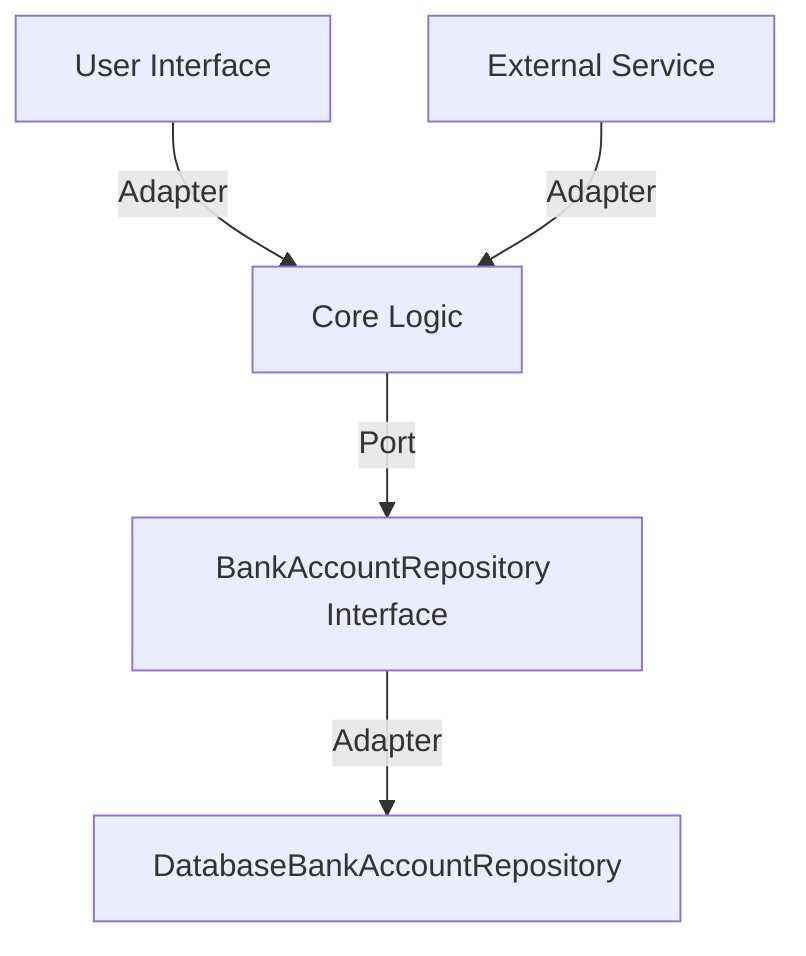

## 11.3 Hexagonal Architecture

Hexagonal Architecture, also known as Ports and Adapters, is a software architectural pattern that aims to decouple the core logic of an application from its external dependencies. This separation facilitates easier testing, maintenance, and adaptability to change. In this section, we will delve into the principles of Hexagonal Architecture, explore its implementation in Kotlin, and provide practical examples and exercises to solidify your understanding.

### Introduction to Hexagonal Architecture

Hexagonal Architecture was introduced by Alistair Cockburn in the early 2000s. The primary goal of this architecture is to create a system that is independent of its external interfaces, such as user interfaces, databases, and other services. By isolating the core logic, developers can ensure that the application remains flexible and adaptable to changes in technology or business requirements.

#### Key Concepts

- **Core Logic**: The central part of the application that contains the business rules and logic.
- **Ports**: Interfaces that define how the core logic interacts with the outside world.
- **Adapters**: Implementations of the ports that connect the core logic to external systems.

### Benefits of Hexagonal Architecture

1. **Decoupling**: By separating the core logic from external dependencies, Hexagonal Architecture reduces coupling and increases modularity.
2. **Testability**: The core logic can be tested in isolation without the need for external systems, leading to faster and more reliable tests.
3. **Flexibility**: Changes to external systems do not affect the core logic, allowing for easier integration of new technologies or services.
4. **Maintainability**: With a clear separation of concerns, the codebase becomes easier to understand and maintain.

### Implementing Hexagonal Architecture in Kotlin

To implement Hexagonal Architecture in Kotlin, we will follow these steps:

1. Define the core logic and business rules.
2. Create ports as interfaces for the core logic.
3. Implement adapters to connect the core logic to external systems.

#### Step 1: Define Core Logic

The core logic is the heart of the application, containing all the business rules and logic. It should be independent of any external systems.

```kotlin
// Core logic for a simple banking application
class BankAccount(private val accountId: String, private var balance: Double) {

    fun deposit(amount: Double) {
        if (amount <= 0) throw IllegalArgumentException("Deposit amount must be positive")
        balance += amount
    }

    fun withdraw(amount: Double) {
        if (amount <= 0) throw IllegalArgumentException("Withdrawal amount must be positive")
        if (amount > balance) throw IllegalArgumentException("Insufficient funds")
        balance -= amount
    }

    fun getBalance(): Double = balance
}
```

#### Step 2: Create Ports

Ports are interfaces that define how the core logic interacts with the outside world. They allow the core logic to remain independent of external systems.

```kotlin
// Port for a repository that handles bank account data
interface BankAccountRepository {
    fun findAccountById(accountId: String): BankAccount?
    fun saveAccount(account: BankAccount)
}
```

#### Step 3: Implement Adapters

Adapters are implementations of the ports that connect the core logic to external systems. They handle the communication between the core logic and the outside world.

```kotlin
// Adapter for a database repository
class DatabaseBankAccountRepository : BankAccountRepository {

    private val database = mutableMapOf<String, BankAccount>()

    override fun findAccountById(accountId: String): BankAccount? {
        return database[accountId]
    }

    override fun saveAccount(account: BankAccount) {
        database[account.accountId] = account
    }
}
```

### Visualizing Hexagonal Architecture

To better understand Hexagonal Architecture, let's visualize the structure using a Mermaid.js diagram.



**Diagram Description**: This diagram illustrates the Hexagonal Architecture with the core logic at the center, surrounded by ports and adapters. The core logic interacts with external systems through defined ports and adapters, ensuring decoupling and flexibility.

### Testing in Isolation

One of the significant advantages of Hexagonal Architecture is the ability to test the core logic in isolation. By using mock implementations of the ports, we can test the business rules without relying on external systems.

#### Example: Testing the BankAccount Class

```kotlin
import io.mockk.every
import io.mockk.mockk
import org.junit.jupiter.api.Assertions.*
import org.junit.jupiter.api.Test

class BankAccountTest {

    private val mockRepository = mockk<BankAccountRepository>()

    @Test
    fun `should deposit amount successfully`() {
        val account = BankAccount("12345", 100.0)
        account.deposit(50.0)
        assertEquals(150.0, account.getBalance())
    }

    @Test
    fun `should throw exception for negative deposit`() {
        val account = BankAccount("12345", 100.0)
        assertThrows<IllegalArgumentException> {
            account.deposit(-10.0)
        }
    }

    @Test
    fun `should withdraw amount successfully`() {
        val account = BankAccount("12345", 100.0)
        account.withdraw(50.0)
        assertEquals(50.0, account.getBalance())
    }

    @Test
    fun `should throw exception for insufficient funds`() {
        val account = BankAccount("12345", 100.0)
        assertThrows<IllegalArgumentException> {
            account.withdraw(150.0)
        }
    }
}
```

### Design Considerations

When implementing Hexagonal Architecture, consider the following:

- **Interface Design**: Ensure that ports are designed with clear and concise interfaces to facilitate communication between the core logic and external systems.
- **Adapter Complexity**: Keep adapters simple and focused on translating between the core logic and external systems.
- **Dependency Management**: Use dependency injection to manage dependencies between the core logic, ports, and adapters.

### Differences and Similarities with Other Patterns

Hexagonal Architecture shares similarities with other architectural patterns, such as:

- **Layered Architecture**: Both patterns emphasize separation of concerns, but Hexagonal Architecture focuses more on decoupling the core logic from external systems.
- **Clean Architecture**: Similar to Hexagonal Architecture, Clean Architecture aims to keep the core logic independent of external systems. However, Clean Architecture provides more detailed guidelines on organizing code into layers.

### Try It Yourself

To deepen your understanding of Hexagonal Architecture, try modifying the code examples:

- **Add a new adapter**: Implement an adapter for a different external system, such as a REST API or a message queue.
- **Extend the core logic**: Add new business rules to the `BankAccount` class, such as interest calculation or transaction history.
- **Test with different scenarios**: Write additional test cases to cover edge cases and ensure the robustness of the core logic.

### Conclusion

Hexagonal Architecture offers a robust framework for building scalable and maintainable applications. By decoupling the core logic from external systems, you can create flexible and adaptable software that is easier to test and maintain. Remember, this is just the beginning. As you continue to explore and implement Hexagonal Architecture, you'll discover new ways to enhance your software design and development practices.

## Quiz Time!



### What is the primary goal of Hexagonal Architecture?

- [x] Decouple core logic from external dependencies
- [ ] Improve user interface design
- [ ] Increase database performance
- [ ] Simplify network communication

> **Explanation:** The primary goal of Hexagonal Architecture is to decouple the core logic of an application from its external dependencies, such as databases and user interfaces.

### What are Ports in Hexagonal Architecture?

- [x] Interfaces that define interactions with the outside world
- [ ] Implementations of core logic
- [ ] External systems like databases
- [ ] User interfaces

> **Explanation:** Ports are interfaces that define how the core logic interacts with the outside world, allowing for decoupling and flexibility.

### How do Adapters function in Hexagonal Architecture?

- [x] They implement ports to connect core logic to external systems
- [ ] They define business rules and logic
- [ ] They serve as user interfaces
- [ ] They store data in databases

> **Explanation:** Adapters are implementations of ports that connect the core logic to external systems, facilitating communication between them.

### Which of the following is a benefit of Hexagonal Architecture?

- [x] Improved testability
- [ ] Increased database storage
- [ ] Faster network speeds
- [ ] Enhanced graphics rendering

> **Explanation:** Hexagonal Architecture improves testability by allowing the core logic to be tested in isolation without relying on external systems.

### What is the role of the core logic in Hexagonal Architecture?

- [x] It contains the business rules and logic
- [ ] It manages user interfaces
- [ ] It handles database connections
- [ ] It processes network requests

> **Explanation:** The core logic is the central part of the application that contains all the business rules and logic, independent of external systems.

### How can you test the core logic in Hexagonal Architecture?

- [x] By using mock implementations of ports
- [ ] By directly accessing external systems
- [ ] By modifying user interfaces
- [ ] By changing database schemas

> **Explanation:** The core logic can be tested in isolation by using mock implementations of the ports, which simulate the behavior of external systems.

### What is a key design consideration in Hexagonal Architecture?

- [x] Ensuring clear and concise interface design for ports
- [ ] Maximizing database storage capacity
- [ ] Simplifying user interface design
- [ ] Increasing network bandwidth

> **Explanation:** A key design consideration is to ensure that ports are designed with clear and concise interfaces to facilitate communication between the core logic and external systems.

### How does Hexagonal Architecture differ from Layered Architecture?

- [x] Hexagonal Architecture focuses on decoupling core logic from external systems
- [ ] Hexagonal Architecture emphasizes user interface design
- [ ] Layered Architecture improves database performance
- [ ] Layered Architecture simplifies network communication

> **Explanation:** While both patterns emphasize separation of concerns, Hexagonal Architecture focuses more on decoupling the core logic from external systems.

### What is a common similarity between Hexagonal and Clean Architecture?

- [x] Both aim to keep core logic independent of external systems
- [ ] Both focus on improving graphics rendering
- [ ] Both increase database storage capacity
- [ ] Both simplify user interface design

> **Explanation:** Both Hexagonal and Clean Architecture aim to keep the core logic independent of external systems, promoting flexibility and maintainability.

### True or False: Hexagonal Architecture is also known as Ports and Adapters.

- [x] True
- [ ] False

> **Explanation:** Hexagonal Architecture is also known as Ports and Adapters, emphasizing the separation of core logic from external systems through defined interfaces and implementations.


