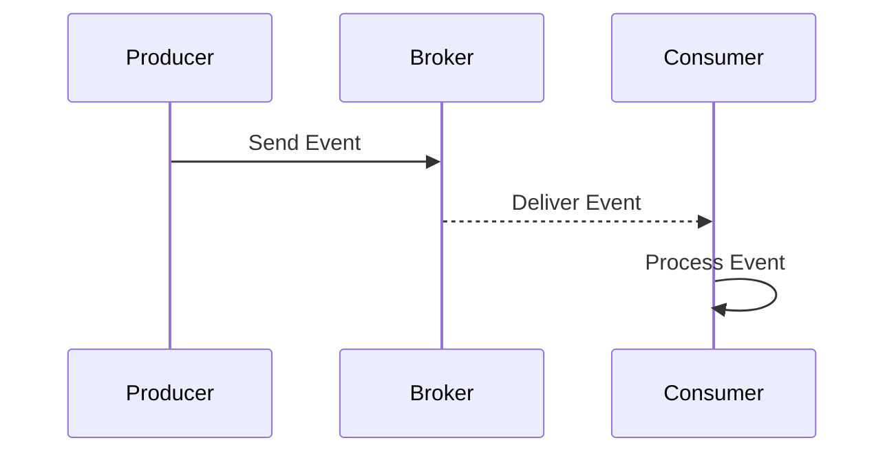

## 11.4 Event-Driven Architecture

Event-Driven Architecture (EDA) is a powerful paradigm for designing systems that are responsive, scalable, and maintainable. In this section, we will delve into the core concepts of EDA, its benefits, and how to implement it using Kotlin. We will explore the use of message brokers for communication and provide practical examples to illustrate these concepts.

### Understanding Event-Driven Architecture

**Event-Driven Architecture** is a software design pattern in which the flow of the program is determined by events. These events can be anything from user actions, sensor outputs, or messages from other programs. EDA is particularly useful in systems that require high scalability and responsiveness.

#### Key Concepts

1. **Events**: The fundamental unit of EDA. An event is a significant change in state. For example, a user clicking a button or a sensor detecting a change in temperature.

2. **Event Producers**: Components that generate events. They are responsible for detecting changes in state and notifying the system.

3. **Event Consumers**: Components that react to events. They perform actions in response to events, such as updating the user interface or processing data.

4. **Event Channels**: The pathways through which events are transmitted from producers to consumers. These can be in-memory channels, message queues, or streams.

5. **Event Processors**: Intermediate components that transform, filter, or route events before they reach their final destination.

6. **Message Brokers**: Middleware that facilitates communication between event producers and consumers. They ensure that events are delivered reliably and efficiently.

### Benefits of Event-Driven Architecture

- **Scalability**: EDA allows systems to scale horizontally by adding more event consumers or processors as needed.

- **Decoupling**: By separating event producers and consumers, EDA promotes loose coupling, making systems easier to maintain and extend.

- **Responsiveness**: Systems can react to events in real-time, providing a more responsive user experience.

- **Flexibility**: EDA supports a wide range of use cases, from simple event handling to complex event processing.

### Implementing Event-Driven Architecture in Kotlin

Kotlin, with its expressive syntax and powerful features, is well-suited for implementing EDA. Let's explore how to build an event-driven system using Kotlin.

#### Setting Up a Simple Event-Driven System

We'll start by setting up a simple event-driven system using Kotlin's coroutines and channels. This example will demonstrate the basic components of EDA: event producers, consumers, and channels.

```kotlin
import kotlinx.coroutines.*
import kotlinx.coroutines.channels.Channel

// Define an event
data class Event(val message: String)

// Event producer
fun CoroutineScope.produceEvents(channel: Channel<Event>) = launch {
    repeat(10) { i ->
        val event = Event("Event $i")
        println("Producing: ${event.message}")
        channel.send(event)
        delay(500) // Simulate work
    }
    channel.close() // Close the channel when done
}

// Event consumer
fun CoroutineScope.consumeEvents(channel: Channel<Event>) = launch {
    for (event in channel) {
        println("Consuming: ${event.message}")
        delay(300) // Simulate processing
    }
}

fun main() = runBlocking {
    val channel = Channel<Event>()
    produceEvents(channel)
    consumeEvents(channel)
}
```

In this example, we define a simple `Event` data class. We then create an event producer that sends events to a channel and an event consumer that receives and processes these events.

#### Using Message Brokers for Communication

For more complex systems, we can use message brokers like Apache Kafka, RabbitMQ, or AWS SNS/SQS to handle event communication. Message brokers provide reliable, scalable, and distributed messaging capabilities.

##### Integrating with Apache Kafka

Apache Kafka is a popular distributed event streaming platform. Let's see how we can integrate Kafka into our Kotlin application.

1. **Setting Up Kafka**: First, ensure that Kafka is installed and running on your system. You can follow the [official Kafka documentation](https://kafka.apache.org/documentation/) for installation instructions.

2. **Adding Dependencies**: Add the necessary Kafka dependencies to your `build.gradle.kts` file.

```kotlin
dependencies {
    implementation("org.apache.kafka:kafka-clients:2.8.0")
    implementation("org.jetbrains.kotlinx:kotlinx-coroutines-core:1.5.2")
}
```

3. **Producing Events to Kafka**: Create a Kafka producer to send events to a Kafka topic.

```kotlin
import org.apache.kafka.clients.producer.KafkaProducer
import org.apache.kafka.clients.producer.ProducerConfig
import org.apache.kafka.clients.producer.ProducerRecord
import org.apache.kafka.common.serialization.StringSerializer
import java.util.Properties

fun createKafkaProducer(): KafkaProducer<String, String> {
    val props = Properties().apply {
        put(ProducerConfig.BOOTSTRAP_SERVERS_CONFIG, "localhost:9092")
        put(ProducerConfig.KEY_SERIALIZER_CLASS_CONFIG, StringSerializer::class.java.name)
        put(ProducerConfig.VALUE_SERIALIZER_CLASS_CONFIG, StringSerializer::class.java.name)
    }
    return KafkaProducer(props)
}

fun produceKafkaEvents(producer: KafkaProducer<String, String>) {
    repeat(10) { i ->
        val record = ProducerRecord("events", "key-$i", "Event $i")
        producer.send(record)
        println("Produced: Event $i")
    }
    producer.close()
}

fun main() {
    val producer = createKafkaProducer()
    produceKafkaEvents(producer)
}
```

4. **Consuming Events from Kafka**: Create a Kafka consumer to receive events from a Kafka topic.

```kotlin
import org.apache.kafka.clients.consumer.ConsumerConfig
import org.apache.kafka.clients.consumer.KafkaConsumer
import org.apache.kafka.common.serialization.StringDeserializer
import java.time.Duration

fun createKafkaConsumer(): KafkaConsumer<String, String> {
    val props = Properties().apply {
        put(ConsumerConfig.BOOTSTRAP_SERVERS_CONFIG, "localhost:9092")
        put(ConsumerConfig.GROUP_ID_CONFIG, "event-consumers")
        put(ConsumerConfig.KEY_DESERIALIZER_CLASS_CONFIG, StringDeserializer::class.java.name)
        put(ConsumerConfig.VALUE_DESERIALIZER_CLASS_CONFIG, StringDeserializer::class.java.name)
    }
    return KafkaConsumer(props)
}

fun consumeKafkaEvents(consumer: KafkaConsumer<String, String>) {
    consumer.subscribe(listOf("events"))
    while (true) {
        val records = consumer.poll(Duration.ofMillis(100))
        for (record in records) {
            println("Consumed: ${record.value()}")
        }
    }
}

fun main() {
    val consumer = createKafkaConsumer()
    consumeKafkaEvents(consumer)
}
```

In this example, we set up a Kafka producer and consumer to send and receive events. The producer sends events to a Kafka topic, and the consumer listens for events on that topic.

### Visualizing Event-Driven Architecture

To better understand the flow of events in an event-driven system, let's visualize the architecture using a sequence diagram.



**Figure 1**: This sequence diagram illustrates the flow of events from the producer to the broker and then to the consumer.

### Design Considerations

When designing an event-driven system, consider the following:

- **Event Schema**: Define a clear schema for your events to ensure consistency and compatibility.

- **Error Handling**: Implement robust error handling to manage failures in event processing.

- **Event Ordering**: Consider whether the order of events is important for your application and choose a message broker that supports ordering if necessary.

- **Scalability**: Design your system to handle varying loads by scaling event consumers and processors.

- **Security**: Secure your event channels and message brokers to protect sensitive data.

### Differences and Similarities with Other Patterns

Event-Driven Architecture shares similarities with other architectural patterns, such as:

- **Observer Pattern**: Both involve reacting to events, but EDA is more suitable for distributed systems with complex event processing needs.

- **Publish-Subscribe Pattern**: EDA can be seen as a more generalized form of publish-subscribe, with additional capabilities for event processing and transformation.

### Try It Yourself

To gain a deeper understanding of EDA, try modifying the code examples provided:

- **Experiment with Different Message Brokers**: Try using RabbitMQ or AWS SNS/SQS instead of Kafka.

- **Implement Advanced Event Processing**: Add event filtering, transformation, or aggregation to the consumer logic.

- **Scale the System**: Add more producers and consumers to test the scalability of your event-driven system.

### Knowledge Check

- **What are the key components of Event-Driven Architecture?**

- **How can message brokers enhance the scalability of an event-driven system?**

- **What are the benefits of using Kotlin for implementing EDA?**

### Embrace the Journey

Remember, mastering Event-Driven Architecture is a journey. As you explore and experiment with different components and message brokers, you'll gain valuable insights into building reactive, scalable systems. Keep learning, stay curious, and enjoy the process!

## Quiz Time!



### What is the primary role of an event producer in an event-driven architecture?

- [x] To generate and send events to the system
- [ ] To process and consume events
- [ ] To store events for future use
- [ ] To manage event channels

> **Explanation:** An event producer is responsible for generating and sending events to the system, which are then processed by event consumers.

### Which of the following is a benefit of using event-driven architecture?

- [x] Scalability
- [x] Decoupling
- [ ] Increased complexity
- [ ] Tight coupling

> **Explanation:** Event-driven architecture promotes scalability and decoupling by allowing systems to handle events independently and scale horizontally.

### What is the purpose of a message broker in an event-driven system?

- [x] To facilitate communication between event producers and consumers
- [ ] To store events permanently
- [ ] To generate events
- [ ] To process events directly

> **Explanation:** A message broker acts as middleware to facilitate communication between event producers and consumers, ensuring reliable and efficient message delivery.

### In Kotlin, which library can be used for asynchronous programming in an event-driven system?

- [x] kotlinx.coroutines
- [ ] Apache Commons
- [ ] Spring Framework
- [ ] JavaFX

> **Explanation:** The `kotlinx.coroutines` library provides support for asynchronous programming in Kotlin, which is essential for building event-driven systems.

### What is a key consideration when designing an event-driven system?

- [x] Event schema consistency
- [ ] Using only one event consumer
- [ ] Avoiding message brokers
- [ ] Ignoring error handling

> **Explanation:** Ensuring event schema consistency is crucial for maintaining compatibility and reliability in an event-driven system.

### Which of the following is NOT a component of event-driven architecture?

- [ ] Event Producers
- [ ] Event Consumers
- [x] Database Indexes
- [ ] Message Brokers

> **Explanation:** Database indexes are not a component of event-driven architecture; they are related to database optimization.

### How can you scale an event-driven system?

- [x] By adding more event consumers
- [ ] By reducing the number of events
- [ ] By using a single-threaded model
- [ ] By avoiding message brokers

> **Explanation:** Scaling an event-driven system can be achieved by adding more event consumers to handle increased loads.

### What is the role of an event consumer in an event-driven architecture?

- [x] To process and react to events
- [ ] To generate and send events
- [ ] To manage event channels
- [ ] To store events for future use

> **Explanation:** An event consumer is responsible for processing and reacting to events generated by event producers.

### Which message broker is commonly used for distributed event streaming?

- [x] Apache Kafka
- [ ] MySQL
- [ ] Redis
- [ ] MongoDB

> **Explanation:** Apache Kafka is a popular distributed event streaming platform used in event-driven architectures.

### True or False: Event-driven architecture is suitable for systems that require high scalability and responsiveness.

- [x] True
- [ ] False

> **Explanation:** Event-driven architecture is indeed suitable for systems that require high scalability and responsiveness due to its decoupled and reactive nature.


