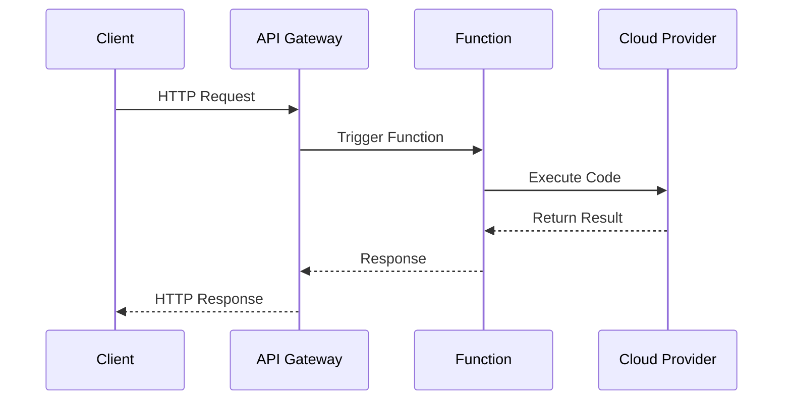

## 11.5 Serverless Architecture

Serverless architecture has revolutionized the way we build and deploy applications. By abstracting away the underlying infrastructure, it allows developers to focus solely on writing code. In this section, we will explore how Kotlin, a modern and expressive programming language, can be leveraged to build serverless applications. We will delve into popular serverless platforms such as AWS Lambda, Google Cloud Functions, and Azure Functions, and demonstrate how to create efficient and scalable serverless applications with Kotlin.

### Understanding Serverless Architecture

Serverless architecture is a cloud computing execution model where the cloud provider dynamically manages the allocation of machine resources. The term "serverless" is a bit of a misnomer; servers are still involved, but developers do not need to manage them. Instead, developers write functions, which are small units of code that are executed in response to events.

#### Key Characteristics of Serverless Architecture

1. **Event-Driven Execution**: Functions are triggered by events such as HTTP requests, database changes, or message queue updates.
2. **Automatic Scaling**: Functions automatically scale up or down based on the number of incoming requests.
3. **Pay-as-You-Go Pricing**: You only pay for the compute time you consume, making it cost-effective.
4. **No Server Management**: The cloud provider handles server provisioning, maintenance, and scaling.

### Why Use Kotlin for Serverless Applications?

Kotlin is a statically typed language that runs on the JVM, making it a great choice for serverless applications. Here are some reasons why Kotlin is well-suited for serverless development:

- **Conciseness**: Kotlin's concise syntax reduces boilerplate code, making it easier to write and maintain serverless functions.
- **Interoperability**: Kotlin is fully interoperable with Java, allowing you to leverage existing Java libraries and frameworks.
- **Null Safety**: Kotlin's null safety features help prevent common runtime errors, improving the reliability of your serverless functions.
- **Coroutines**: Kotlin's support for coroutines allows for efficient asynchronous programming, which is crucial for serverless applications that need to handle concurrent requests.

### Building Serverless Applications with AWS Lambda

AWS Lambda is a popular serverless computing service provided by Amazon Web Services. It allows you to run code in response to events without provisioning or managing servers. Let's explore how to build a serverless application using AWS Lambda and Kotlin.

#### Setting Up Your Environment

1. **Install AWS CLI**: The AWS Command Line Interface (CLI) is a unified tool to manage your AWS services. Install it from the [AWS CLI User Guide](https://docs.aws.amazon.com/cli/latest/userguide/install-cliv2.html).

2. **Configure AWS CLI**: Use the command `aws configure` to set up your AWS credentials and default region.

3. **Install Gradle**: Gradle is a build automation tool that we will use to manage dependencies and build our Kotlin project. Download it from the [Gradle website](https://gradle.org/install/).

4. **Set Up an AWS Account**: If you don't already have an AWS account, create one at [AWS](https://aws.amazon.com/).

#### Creating a Simple Lambda Function in Kotlin

Let's create a simple AWS Lambda function using Kotlin. This function will be triggered by an HTTP request and return a greeting message.

```kotlin
package com.example.lambda

import com.amazonaws.services.lambda.runtime.Context
import com.amazonaws.services.lambda.runtime.RequestHandler

class HelloWorldHandler : RequestHandler<Map<String, String>, String> {
    override fun handleRequest(input: Map<String, String>, context: Context): String {
        val name = input["name"] ?: "World"
        return "Hello, $name!"
    }
}
```

**Explanation:**

- We define a class `HelloWorldHandler` that implements `RequestHandler`, a functional interface provided by AWS Lambda.
- The `handleRequest` method takes an input map and a context object, and returns a string.
- We extract the `name` parameter from the input map and return a greeting message.

#### Deploying the Lambda Function

1. **Build the Project**: Use Gradle to build the project and create a JAR file.

```bash
gradle build
```

2. **Create an S3 Bucket**: Upload the JAR file to an S3 bucket. This bucket will be used to store the Lambda function code.

```bash
aws s3 mb s3://my-kotlin-lambda
aws s3 cp build/libs/my-kotlin-lambda.jar s3://my-kotlin-lambda/
```

3. **Create the Lambda Function**: Use the AWS CLI to create the Lambda function.

```bash
aws lambda create-function \
    --function-name HelloWorldFunction \
    --runtime java11 \
    --role arn:aws:iam::YOUR_ACCOUNT_ID:role/service-role/YOUR_ROLE_NAME \
    --handler com.example.lambda.HelloWorldHandler::handleRequest \
    --code S3Bucket=my-kotlin-lambda,S3Key=my-kotlin-lambda.jar
```

4. **Invoke the Lambda Function**: Test the function by invoking it with a sample event.

```bash
aws lambda invoke --function-name HelloWorldFunction --payload '{"name": "Kotlin"}' output.txt
cat output.txt
```

### Building Serverless Applications with Google Cloud Functions

Google Cloud Functions is a serverless execution environment that allows you to run code in response to events. Let's explore how to build a serverless application using Google Cloud Functions and Kotlin.

#### Setting Up Your Environment

1. **Install Google Cloud SDK**: The Google Cloud SDK is a set of tools for managing resources and applications hosted on Google Cloud. Install it from the [Google Cloud SDK documentation](https://cloud.google.com/sdk/docs/install).

2. **Initialize Google Cloud SDK**: Use the command `gcloud init` to configure your Google Cloud account and set up your project.

3. **Install Gradle**: If you haven't already, install Gradle from the [Gradle website](https://gradle.org/install/).

4. **Set Up a Google Cloud Account**: If you don't have a Google Cloud account, create one at [Google Cloud](https://cloud.google.com/).

#### Creating a Simple Cloud Function in Kotlin

Let's create a simple Google Cloud Function using Kotlin. This function will be triggered by an HTTP request and return a greeting message.

```kotlin
package com.example.cloudfunction

import com.google.cloud.functions.HttpFunction
import com.google.cloud.functions.HttpRequest
import com.google.cloud.functions.HttpResponse

class HelloWorldFunction : HttpFunction {
    override fun service(request: HttpRequest, response: HttpResponse) {
        val name = request.getFirstQueryParameter("name").orElse("World")
        response.writer.write("Hello, $name!")
    }
}
```

**Explanation:**

- We define a class `HelloWorldFunction` that implements `HttpFunction`, an interface provided by Google Cloud Functions.
- The `service` method takes an `HttpRequest` and an `HttpResponse`, and writes a greeting message to the response.

#### Deploying the Cloud Function

1. **Build the Project**: Use Gradle to build the project and create a JAR file.

```bash
gradle build
```

2. **Deploy the Cloud Function**: Use the Google Cloud SDK to deploy the function.

```bash
gcloud functions deploy HelloWorldFunction \
    --entry-point com.example.cloudfunction.HelloWorldFunction \
    --runtime java11 \
    --trigger-http \
    --allow-unauthenticated
```

3. **Test the Cloud Function**: Use `curl` to test the function by sending an HTTP request.

```bash
curl https://REGION-PROJECT_ID.cloudfunctions.net/HelloWorldFunction?name=Kotlin
```

### Building Serverless Applications with Azure Functions

Azure Functions is a serverless compute service that enables you to run code on-demand without having to explicitly provision or manage infrastructure. Let's explore how to build a serverless application using Azure Functions and Kotlin.

#### Setting Up Your Environment

1. **Install Azure CLI**: The Azure Command-Line Interface (CLI) is a set of commands used to create and manage Azure resources. Install it from the [Azure CLI documentation](https://docs.microsoft.com/en-us/cli/azure/install-azure-cli).

2. **Install Azure Functions Core Tools**: These tools allow you to run and test your functions locally. Install them from the [Azure Functions Core Tools documentation](https://docs.microsoft.com/en-us/azure/azure-functions/functions-run-local).

3. **Install Gradle**: If you haven't already, install Gradle from the [Gradle website](https://gradle.org/install/).

4. **Set Up an Azure Account**: If you don't have an Azure account, create one at [Azure](https://azure.microsoft.com/).

#### Creating a Simple Azure Function in Kotlin

Let's create a simple Azure Function using Kotlin. This function will be triggered by an HTTP request and return a greeting message.

```kotlin
package com.example.azurefunction

import com.microsoft.azure.functions.*
import com.microsoft.azure.functions.annotation.*

class HelloWorldFunction {
    @FunctionName("HelloWorldFunction")
    fun run(
        @HttpTrigger(name = "req", methods = [HttpMethod.GET], authLevel = AuthorizationLevel.ANONYMOUS)
        request: HttpRequestMessage<Optional<String>>,
        context: ExecutionContext
    ): HttpResponseMessage {
        val name = request.queryParameters["name"] ?: "World"
        return request.createResponseBuilder(HttpStatus.OK)
            .body("Hello, $name!")
            .build()
    }
}
```

**Explanation:**

- We define a class `HelloWorldFunction` with a method `run` annotated with `@FunctionName`.
- The `run` method takes an `HttpRequestMessage` and an `ExecutionContext`, and returns an `HttpResponseMessage`.
- We extract the `name` parameter from the query string and return a greeting message.

#### Deploying the Azure Function

1. **Build the Project**: Use Gradle to build the project and create a JAR file.

```bash
gradle build
```

2. **Create a Function App**: Use the Azure CLI to create a Function App.

```bash
az functionapp create --resource-group myResourceGroup --consumption-plan-location westus --runtime java --functions-version 3 --name myFunctionApp --storage-account mystorageaccount
```

3. **Deploy the Function**: Use the Azure CLI to deploy the function.

```bash
az functionapp deployment source config-zip --resource-group myResourceGroup --name myFunctionApp --src build/libs/my-azure-function.jar
```

4. **Test the Azure Function**: Use `curl` to test the function by sending an HTTP request.

```bash
curl https://myFunctionApp.azurewebsites.net/api/HelloWorldFunction?name=Kotlin
```

### Visualizing Serverless Architecture

To better understand how serverless architecture works, let's visualize the flow of a serverless function using a sequence diagram.



**Diagram Description:**

- The client sends an HTTP request to the API Gateway.
- The API Gateway triggers the serverless function.
- The function executes the code and interacts with the cloud provider as needed.
- The cloud provider returns the result to the function.
- The function sends the response back to the API Gateway.
- The API Gateway returns the HTTP response to the client.

### Design Considerations for Serverless Applications

When designing serverless applications, consider the following:

- **Cold Starts**: Serverless functions may experience a delay when they are invoked for the first time or after a period of inactivity. Use techniques such as keeping functions warm or optimizing initialization code to mitigate cold starts.
- **Statelessness**: Serverless functions are inherently stateless. Use external storage solutions like databases or object storage to maintain state across function invocations.
- **Concurrency Limits**: Be aware of the concurrency limits imposed by the cloud provider and design your application to handle throttling gracefully.
- **Security**: Implement security best practices such as input validation, authentication, and authorization to protect your serverless application.

### Differences and Similarities with Other Architectural Patterns

Serverless architecture shares some similarities with microservices architecture, as both involve breaking down applications into smaller, independent components. However, serverless functions are typically more granular and event-driven compared to microservices. Additionally, serverless architecture abstracts away infrastructure management, while microservices often require explicit server provisioning and scaling.

### Try It Yourself

Experiment with the provided code examples by modifying the greeting message or adding additional parameters to the functions. Deploy the modified functions to your preferred cloud provider and test them using different input values.

### Knowledge Check

- What are the key characteristics of serverless architecture?
- Why is Kotlin a suitable language for serverless applications?
- How do you deploy a Kotlin function to AWS Lambda?
- What are some design considerations for serverless applications?

### Embrace the Journey

Remember, building serverless applications is just the beginning. As you progress, you'll discover more advanced features and optimizations. Keep experimenting, stay curious, and enjoy the journey!

## Quiz Time!



### What is a key characteristic of serverless architecture?

- [x] Event-driven execution
- [ ] Manual server management
- [ ] Fixed pricing model
- [ ] Stateful functions

> **Explanation:** Serverless architecture is characterized by event-driven execution, where functions are triggered by events such as HTTP requests or database changes.

### Why is Kotlin a suitable language for serverless applications?

- [x] Conciseness and null safety
- [ ] Lack of interoperability with Java
- [ ] Requires more boilerplate code
- [ ] Limited support for asynchronous programming

> **Explanation:** Kotlin's conciseness, null safety, and support for asynchronous programming make it well-suited for serverless applications.

### How do you deploy a Kotlin function to AWS Lambda?

- [x] Use AWS CLI to create and upload the function
- [ ] Manually provision servers
- [ ] Use Google Cloud SDK
- [ ] Deploy using Azure Functions Core Tools

> **Explanation:** To deploy a Kotlin function to AWS Lambda, you use the AWS CLI to create the function and upload the code.

### What is a common design consideration for serverless applications?

- [x] Managing cold starts
- [ ] Maintaining state within the function
- [ ] Manual scaling of servers
- [ ] Fixed concurrency limits

> **Explanation:** Managing cold starts is a common design consideration for serverless applications, as functions may experience delays when invoked after inactivity.

### Which cloud provider is not mentioned in the article for serverless functions?

- [ ] AWS Lambda
- [ ] Google Cloud Functions
- [ ] Azure Functions
- [x] IBM Cloud Functions

> **Explanation:** The article discusses AWS Lambda, Google Cloud Functions, and Azure Functions, but not IBM Cloud Functions.

### What is the primary advantage of using serverless architecture?

- [x] No server management
- [ ] Fixed resource allocation
- [ ] High upfront costs
- [ ] Complex deployment process

> **Explanation:** The primary advantage of serverless architecture is that it abstracts away server management, allowing developers to focus on writing code.

### How can you mitigate cold starts in serverless functions?

- [x] Keep functions warm
- [ ] Increase server capacity
- [ ] Use stateful functions
- [ ] Disable event triggers

> **Explanation:** Keeping functions warm by periodically invoking them can help mitigate cold starts in serverless functions.

### What is a similarity between serverless and microservices architecture?

- [x] Both involve breaking down applications into smaller components
- [ ] Both require manual server provisioning
- [ ] Both are stateful architectures
- [ ] Both have fixed concurrency limits

> **Explanation:** Both serverless and microservices architecture involve breaking down applications into smaller, independent components.

### What tool is used to deploy a Kotlin function to Google Cloud Functions?

- [x] Google Cloud SDK
- [ ] AWS CLI
- [ ] Azure CLI
- [ ] Gradle

> **Explanation:** The Google Cloud SDK is used to deploy a Kotlin function to Google Cloud Functions.

### True or False: Serverless functions are inherently stateful.

- [ ] True
- [x] False

> **Explanation:** Serverless functions are inherently stateless, meaning they do not maintain state across invocations.


